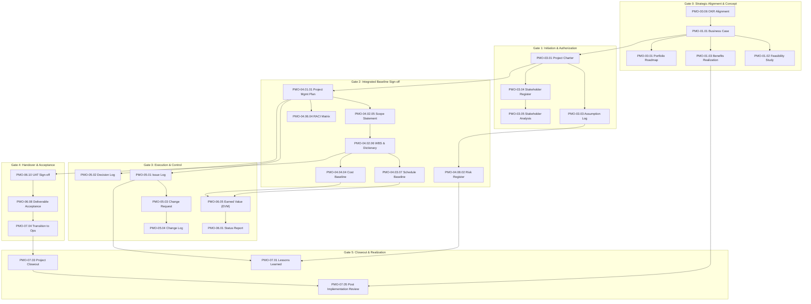

  

# 🔗 Tasleemat Document Dependencies & Lifecycle Architecture
**Document Reference:** `TASLEEMAT-DOC-DEPENDENCIES-v2.0`  
**Standard:** PMI PMBOK® 6th, 7th & 8th Edition Standard  

---

## 🎯 Executive Overview

In the **Tasleemat PMO Operating System**, no document exists in isolation. Every form and artifact functions as a node in a connected **Directed Acyclic Graph (DAG)** of project inputs, baselines, operational logs, monitoring reports, and closeout assets.

---

## 📋 Comprehensive Dependency Index (Across All 102 Forms)

| Ref ID | Form Name | Primary Stage / Gate | Direct Predecessors (Inputs) | Direct Successors (Outputs) |
| :--- | :--- | :--- | :--- | :--- |
| **`PMO-00.01`** | Portfolio Roadmap | Gate 0: Strategy & Portfolio Alignment | `PMO-00.06 OKR Alignment`, `PMO-01.01 Business Case` | `PMO-00.02 Program Charter`, `PMO-03.01 Project Charter`, `PMO-00.04 Capacity Matrix` |
| **`PMO-00.02`** | Program Charter | Gate 0: Strategy & Portfolio Alignment | `PMO-00.01 Portfolio Roadmap`, `PMO-01.01 Business Case` | `PMO-00.03 Interdependency Register`, `PMO-03.01 Project Charter` |
| **`PMO-00.03`** | Interdependency Register | Continuous Governance across Program Lifecycle | `PMO-00.02 Program Charter`, `PMO-04.03.08 Project Schedule` | `PMO-04.08.02 Risk Register`, `PMO-06.01 Project Status Report` |
| **`PMO-00.04`** | Resource Capacity Matrix | Gate 0 & Continuous Portfolio Planning | `PMO-00.01 Portfolio Roadmap`, `PMO-04.06.02 Resource Requirements` | `PMO-04.06.01 Resource Management Plan`, `PMO-04.03.08 Project Schedule` |
| **`PMO-00.05`** | PMO Maturity Assessment | Annual / Semi-Annual PMO Strategic Review | `Organizational Strategic Mandate` | `PMO-02.01 Tailoring Framework`, `PMO Policy Manual` |
| **`PMO-00.06`** | OKR Alignment Matrix | Gate 0: Strategic Alignment | `Enterprise Strategic Goals / Vision 2030` | `PMO-00.01 Portfolio Roadmap`, `PMO-01.01 Business Case` |
| **`PMO-01.01`** | Business Case | Gate 0: Justification & Funding | `PMO-00.06 OKR Alignment`, `PMO-01.04 Value Proposition` | `PMO-01.02 Feasibility Study`, `PMO-01.03 Benefits Realization`, `PMO-03.01 Project Charter` |
| **`PMO-01.02`** | Feasibility Study | Gate 0: Justification & Funding | `PMO-01.01 Business Case` | `PMO-03.01 Project Charter` |
| **`PMO-01.03`** | Benefits Realization Plan | Gate 0 through Gate 5 (Lifecycle Long) | `PMO-01.01 Business Case` | `PMO-07.05 Post Implementation Review` |
| **`PMO-01.04`** | Value Proposition Canvas | Gate 0: Product & Service Definition | `Market Research / User Need Analysis` | `PMO-01.01 Business Case`, `PMO-03.02 Product Vision` |
| **`PMO-02.01`** | Development Approach Assessment | Gate 1: Initiation | `PMO-01.01 Business Case`, `PMO-02.02 Complexity Model` | `PMO-03.01 Project Charter`, `PMO-04.01.01 Project Management Plan` |
| **`PMO-02.02`** | Complexity Assessment Model | Gate 1: Initiation & Tier Sizing | `PMO-01.01 Business Case` | `PMO-02.01 Development Approach`, `Project Sizing Tier Assignment` |
| **`PMO-02.03`** | AI Ethics and Governance Checklist | Gate 1 & Continuous AI Verification | `PMO-02.04 AI Use Case Canvas` | `PMO-04.08.02 Risk Register (AI Ethical Risks)` |
| **`PMO-02.04`** | AI Canvas and Use Case Card | Gate 0 / Gate 1: AI Scoping | `PMO-01.01 Business Case` | `PMO-02.03 AI Ethics Checklist`, `PMO-03.01 Project Charter` |
| **`PMO-02.05`** | Governance and Compliance Matrix | Gate 1 & Gate 2: Planning Baseline | `PMO-03.01 Project Charter` | `PMO-04.05.01 Quality Plan`, `PMO-06.07 Procurement/Compliance Audit` |
| **`PMO-03.01`** | Project Charter | Gate 1: Project Authorization | `PMO-01.01 Business Case`, `PMO-02.01 Development Approach` | `PMO-03.03 Assumption Log`, `PMO-03.04 Stakeholder Register`, `PMO-04.01.01 Project Management Plan` |
| **`PMO-03.02`** | Product Vision | Gate 1: Agile / Product Initiation | `PMO-01.04 Value Proposition Canvas` | `PMO-04.02.08 Product Backlog`, `PMO-04.02.09 Story Mapping` |
| **`PMO-03.03`** | Assumption Log | Gate 1 & Continuous Planning | `PMO-03.01 Project Charter`, `PMO-01.01 Business Case` | `PMO-04.08.02 Risk Register`, `PMO-04.02.05 Project Scope Statement` |
| **`PMO-03.04`** | Stakeholder Register | Gate 1 & Continuous Stakeholder Mgmt | `PMO-03.01 Project Charter` | `PMO-03.05 Stakeholder Analysis`, `PMO-04.10.01 Stakeholder Plan`, `PMO-04.07.01 Communications Plan` |
| **`PMO-03.05`** | Stakeholder Analysis | Gate 1 & Gate 2: Planning | `PMO-03.04 Stakeholder Register` | `PMO-04.10.01 Stakeholder Engagement Plan` |

---
*Note: For the remaining standard domain plans (Communications, Procurement, Quality, Risk, ESG), each plan depends directly on `PMO-04.01.01 Project Management Plan` and `PMO-03.01 Project Charter`, and produces operational logs in Phase 05/06.*
