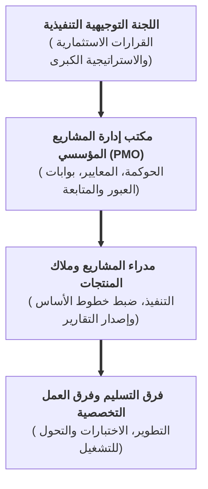
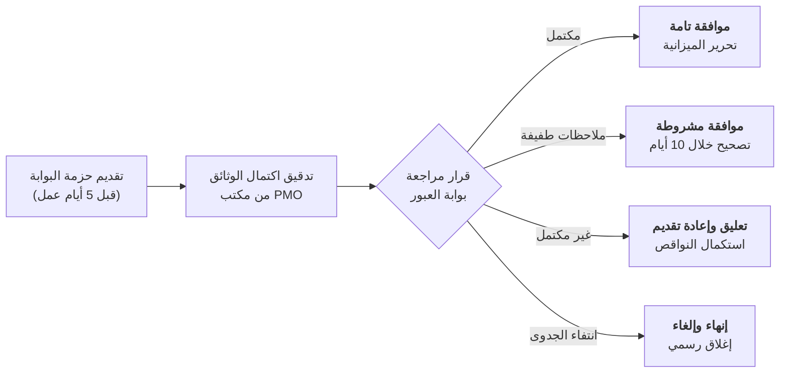
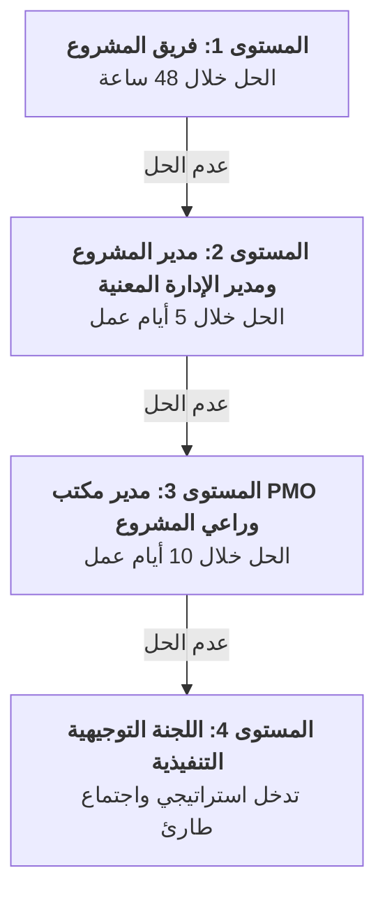

# 🏛️ دليل سياسات وإجراءات مكتب إدارة المشاريع المؤسسي (SOPs)
**مرجع الوثيقة:** `PMO-POL-MANUAL-AR-v2.0`  
**المعيار:** متوافق بالكامل مع معايير معهد إدارة المشاريع العالمي PMI PMBOK® الإصدارات السادس والسابع والجاهزية للإصدار الثامن  
**الفئات المستهدفة:** الإدارة العليا، مدراء مكاتب إدارة المشاريع (PMO Directors)، مدراء المشاريع، اللجان التوجيهية، وفرق التسليم  

---

## 1. 📜 الغرض، النطاق والتكليف المؤسسي للحوكمة

### 1.1 الغرض من الدليل
يحدد هذا الدليل إجراءات التشغيل القياسية (SOPs)، وحدود الصلاحيات، ومسارات التصعيد، وبوابات الجودة الحاكمة لكافة البرامج والمشاريع والمبادرات الاستراتيجية في المنظمة. ويربط هذا الدليل **نماذج واستمارات «تسليمات» الـ 102** في إطار حوكمي تشغيلي ملزم.

### 1.2 نطاق الحوكمة ونموذج صلاحيات PMO
يعمل مكتب إدارة المشاريع المؤسسي (PMO) بموجب **تكليف حوكمي توجيهي ورقابي (Directive & Controlling Mandate)** مسؤول عن:
1. **تحسين ومواءمة المحفظة:** مواءمة تخصيص الميزانيات مع الأهداف الاستراتيجية والنتائج الرئيسية (OKRs) للمنظمة (`PMO-00.06`).
2. **التوحيد القياسي وضمان الجودة:** تطبيق المنهجيات الموحدة، وخطوط الأساس للأداء، وبوابات الجودة عبر كافة القطاعات.
3. **الشفافية والتقارير التنفيذية:** توفير بيانات وتقارير دقيقة وموثوقة للإدارة العليا حول أداء الميزانيات، الجداول الزمنية، المخاطر، وتحقيق القيمة.
4. **حوكمة بوابات العبور المرحلية:** إدارة مراجعات بوابات العبور والتحقق من استيفاء المعايير قبل تحرير دفعات الميزانية.

---

## 2. 🚪 سياسة بوابات العبور المرحلية وإطلاق دفعات الميزانية

### 2.1 إجراءات مراجعة بوابات العبور (Stage-Gate Reviews)
* **الموعد النهائي للتقديم:** يجب تقديم حزمة نماذج بوابة العبور الإلزامية إلى مكتب PMO قبل **5 أيام عمل** من موعد اجتماع المراجعة المحدد.
* **التدقيق المبدئي للاكتمال:** يجري مكتب PMO مراجعة تدقيقية للاكتمال. وفي حال وجود نقص جوهري، تُعاد الوثائق للاستكمال دون عقد اجتماع اللجنة.
* **قرارات بوابات العبور:**
  1. **الموافقة غير المشروطة (Go):** استيفاء 100% من معايير البوابة؛ تحرير الميزانية والموارد للمرحلة التالية.
  2. **الموافقة المشروطة (Go with Conditions):** وجود ملاحظات طفيفة غير حرجة؛ يُسمح ببدء المرحلة مع خطة تصحيحية محددة زمنياً ($\le 10$ أيام عمل).
  3. **إعادة العمل والتعليق (Hold):** عدم استيفاء معايير جوهرية؛ يبقى المشروع في مرحلته الحالية حتى استكمال المتطلبات وإعادة التقديم.
  4. **إلغاء أو إنهاء المشروع (Kill):** انتفاء الجدوى الاقتصادية، تجاوز تكلفة عدم التنفيذ، أو عدم المواءمة الاستراتيجية؛ البدء في الإغلاق الرسمي فوراً (`PMO-07.03`).

---

## 3. 🔄 سياسة إدارة التغيير ومصفوفة تفويض الصلاحيات (DoA)

### 3.1 إدارة الانحرافات وعتبات الموافقة
يجب أن تخضع أي تعديلات على نطاق المشروع، أو خط الأساس للجدول الزمني (`PMO-04.03.07`)، أو خط الأساس للتكلفة (`PMO-04.04.04`) لـ **مصفوفة تفويض الصلاحيات (DoA)** المعتمدة:

| مستوى التغيير | انحراف الجدول الزمني (SV) | انحراف التكلفة (CV) | الأثر على النطاق | سلطة الاعتماد المطلوبة | النماذج الإلزامية |
| :--- | :---: | :---: | :--- | :--- | :--- |
| **المستوى 1 (تغيير طفيف)** | $< \pm 5\%$ (أو $\le 5$ أيام) | $< \pm 5\%$ (أو $\le 100\text{k}$ ريال) | لا يوجد تغيير في المخرجات التعاقدية | **مدير المشروع** | تحديث سجل التغييرات `PMO-05.04` |
| **المستوى 2 (تغيير متوسط)** | $\pm 5\% - 10\%$ (أو $\le 15$ يوماً) | $\pm 5\% - 10\%$ (أو $\le 500\text{k}$ ريال) | تعديل طفيف داخل حزمة العمل | **راعي المشروع ومدير PMO** | طلب تغيير `PMO-05.03` + تحديث خط الأساس |
| **المستوى 3 (تغيير جوهري)** | $> \pm 10\%$ (أو $> 15$ يوماً) | $> \pm 10\%$ (أو $> 500\text{k}$ ريال) | إضافة/حذف مخرجات رئيسية | **مجلس التحكم بالتغيير (CCB) / اللجنة التوجيهية** | اعتماد كامل من CCB + تحديث دراسة الجدوى `PMO-01.01` |

### 3.2 قواعد عمل مجلس التحكم بالتغيير (CCB)
* يجتمع مجلس CCB بصورة دورية كل أسبوعين، أو بصورة طارئة لتغييرات المستوى الثالث الحرجة.
* **النصاب القانوني:** مدير مكتب PMO (رئيساً)، راعي المشروع، المدير المالي، القائد التقني، ومسؤول العقود/القانونية (للتغييرات التعاقدية).
* يُحظر تماماً بدء العمل على أي تغيير في النطاق قبل صدور الموافقة الرسمية الموقعة من مجلس CCB.

---

## 4. 🚨 حوكمة المخاطر وإجراءات تصعيد المشكلات (SOP)

### 4.1 معايير إدارة المخاطر
* تلتزم كافة المشاريع بتحديث **سجل المخاطر (`PMO-04.08.02`)** كل أسبوعين على الأقل.
* تُصنف المخاطر التي تبلغ درجتها المركبة (الاحتمالية $\times$ الأثر) $\ge 15$ بوصفها **مخاطر مؤسسية حرجة** ويجب إدراجها فوراً في التقرير التنفيذي (`PMO-06.01`).

### 4.2 مصفوفة التصعيد الزمني للمشكلات التشغيلية
عند تحول أي عائق أو خطر إلى مشكلة تشغيلية واقعة (`PMO-05.01`)، يتم اتباع مسار التصعيد الزمني الصارم:

---

## 5. ✅ سياسة قبول المخرجات وضمان الجودة

### 5.1 معايير التحقق من الجودة
* لا يجوز تقديم أي مخرج لاعتماد العميل أو المستفيد النهائي قبل اجتياز تدقيق الجودة الداخلي (`PMO-05.05`) واستيفاء **تعريف الإنجاز النهائي DoD (`PMO-04.05.03`)**.

### 5.2 سياسة اختبارات قبول المستخدم (UAT)
* **معايير بدء UAT:** تنفيذ 100% من سيناريوهات الاختبارات الوظيفية والتكاملية، مع وجود صفر عيوب وملاحظات حرجة من الدرجة الأولى والثانية (Severity 1 & 2).
* **اعتماد UAT:** يتطلب توقيع **نموذج اعتماد UAT (`PMO-06.10`)** من منسق الاختبارات وممثل أعمال المستفيدين.
* **القبول النهائي للمخرج:** يُعتمد القبول التعاقدي النهائي بموجب **نموذج قبول المخرجات (`PMO-06.08`)** موقعاً من المفوض الرسمي.

---

## 6. 🤝 سياسة المشتريات وحوكمة أداء الموردين

### 6.1 بروتوكولات إدارة الموردين والعقود
* تخضع جميع المشتريات الخارجية لمراجعة وتدقيق **استراتيجية المشتريات (`PMO-04.09.02`)** ونطاق العمل التفصيلي **SOW (`PMO-04.09.04`)** من قِبل مكتب PMO والإدارة القانونية.
* **بطاقات تقييم أداء الموردين (`PMO-06.09`):** تقييم ربع سنوي إلزامي لجميع الموردين والاستشاريين المتعاقد معهم.
* **اعتماد المستحقات والدفعات:** لا يُصرف أي مستخلص مالي لمورد دون إرفاق **نموذج قبول المخرج المعتمد (`PMO-06.08`)**.

---

## 7. 🗄️ الأرشفة، إدارة المعرفة وحفظ السجلات المؤسسية

### 7.1 المتطلبات الإلزامية لإغلاق المشروع
لا يُعتبر المشروع مغلقاً بصورة رسمية وقانونية إلا بعد اعتماد وأرشفة الوثائق التالية:
1. **وثيقة إغلاق المشروع المعتمدة (`PMO-07.03`)**.
2. **ملخص الدروس المستفادة (`PMO-07.01`)** ومشاركته في قاعدة المعرفة المؤسسية لـ PMO.
3. **قائمة التحقق للتسليم التشغيلي (`PMO-07.04`)** واتفاقيات مستوى الدعم (SLAs).
4. **تقرير إغلاق العقود والمشتريات (`PMO-07.02`)** وتأكيد المخالصات المالية النهائية.

### 7.2 مدد حفظ وثائق وسجلات المشاريع

| فئة الوثائق | مدة الحفظ الإلزامية | معيار الحفظ والأرشفة |
| :--- | :---: | :--- |
| **العقود، كراسات الشروط والمستخلصات المالية** | 10 سنوات | أرشفة مؤسسية مشفرة (امتثال قانوني وتدقيقي) |
| **مواثيق المشاريع، خطوط الأساس وتقارير الإغلاق** | 7 سنوات | مستودع PMO المؤسسي الدائم |
| **سجلات المتابعة (المخاطر، المشكلات، القرارات، التغييرات)** | 5 سنوات | أرشيف مشاريع PMO التاريخي |
| **تقارير الحالة ومحاضر الاجتماعات الدورية** | 3 سنوات | أرشيف بيئة العمل المشتركة للمشروع |

---

## 8. 🛡️ التدقيق الحوكمي والامتثال

* يحق لمكتب إدارة المشاريع (PMO) إجراء **فحص صحة مفاجئ للمشروع (`PMO-06.11`)** و**تدقيق جودة (`PMO-05.05`)** على أي مشروع نشط في أي وقت.
* قد يؤدي عدم الامتثال لخطوط الأساس المعتمدة أو الامتناع عن تقديم التقارير الإلزامية إلى تجميد صلاحيات الصرف المالي للمشروع مؤقتاً.
