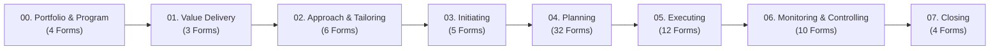

<div align="center">

# 🚀 Tasleemat PMO Toolkit | تسليمات
### *The Enterprise Bilingual (English & Arabic) Project Management Artifact & AI Automation Library*

[](LICENSE)
[](LEXICON.md)
[](forms/)
[](README_AR.md)
[](USAGE_GUIDE.md)

<br/>

**[🇸🇦 اقرأ الدليل الكامل باللغة العربية (Read in Arabic)](README_AR.md)** • **[📖 Master Lexicon & Catalog](LEXICON.md)** • **[🛠️ Usage Guide](USAGE_GUIDE.md)** • **[📂 English Forms](forms/en/)** • **[📂 Arabic Forms](forms/ar/)**

---

</div>

## 🌟 Executive Summary

**Tasleemat (تسليمات)** is a production-ready, open-source Project Management Office (PMO) toolkit designed for project managers, PMO directors, enterprise architects, and AI developers. It provides **94 standardized, bilingual (English & Arabic) project management artifacts** covering the complete chronological project lifecycle—from portfolio strategy and business value realization to predictive planning, Agile execution, and AI governance.

Every single artifact is designed as a **5-file synchronized bundle**, bridging the gap between human practitioner workflows, executive print-ready PDF reporting, and autonomous AI document generation.

---

## 💎 Core Highlights

- **📚 94 Full-Lifecycle Artifacts:** Complete coverage of Portfolio Management, Agile Delivery, Traditional Predictive Governance, and AI Lifecycle Engineering.
- **🌐 100% Bilingual Parity (EN & AR):** Strict 1-to-1 structural parity between English source files and native Arabic (RTL) files aligned with the **PMI Lexicon of Project Management Terms**.
- **🤖 AI-Native Architecture:** Every form includes dedicated machine-readable JSON schemas and prompt instructions ready for instant automated drafting via Claude, ChatGPT, Gemini, or local LLMs.
- **🖨️ Executive Print & Export Ready:** Clean GitHub-flavored Markdown and HTML tables formatted for seamless PDF conversion with governance sign-off blocks.
- **🔗 Upstream & Downstream Dependencies:** Explicit prerequisite baselines and downstream consumers mapped across all guides and prompts.
- **📖 Official Terminology Lexicon:** Standardized project management terms mapped and defined in [`LEXICON.md`](LEXICON.md) and [`LEXICON.json`](LEXICON.json).

---

## 📂 Repository Architecture

```text
Tasleemat/
├── forms/
│   ├── en/                                   # 🇬🇧 English Artifacts (Root)
│   │   ├── 00_Program_and_Portfolio_Management/  # 4 Roadmaps & Capacity Matrices
│   │   ├── 01_Business_and_Value_Delivery/       # 3 Business Cases & Value Registers
│   │   ├── 02_Project_Approach_and_Tailoring/    # 6 Tailoring & AI Governance Plans
│   │   ├── 03_Initiating/                        # 5 Charters, Assumption Logs & Registers
│   │   ├── 04_Planning/                          # 32 Detailed Baselines (Scope, Schedule, Cost, etc.)
│   │   ├── 05_Executing/                         # 12 Operational Logs & Meeting Records
│   │   ├── 06_Monitoring_and_Controlling/        # 10 Variance, EVA & Quality Audits
│   │   ├── 07_Closing/                           # 4 Closeout Reports & Handover Checklists
│   │   └── parameters.md                         # Global project variables for AI prompts
│   └── ar/                                   # 🇸🇦 Arabic Localized Artifacts (RTL)
│       ├── 00_إدارة_البرامج_والمحافظ/
│       ├── 01_الأعمال_وتسليم_القيمة/
│       ├── 02_منهجية_المشروع_وتخصيصه/
│       ├── 03_البدء/
│       ├── 04_التخطيط/
│       ├── 05_التنفيذ/
│       ├── 06_المراقبة_والتحكم/
│       ├── 07_الإغلاق/
│       └── parameters.md
├── LEXICON.md                                # 📖 Master Bilingual PMI Lexicon & Catalog
├── LEXICON.json                              # 🤖 Machine-readable Schema & Form Index
├── USAGE_GUIDE.md                            # 📘 Comprehensive English Practitioner Guide
├── USAGE_GUIDE_AR.md                         # 📙 Comprehensive Arabic Practitioner Guide
├── README.md                                 # 🇬🇧 Main Repository Documentation
└── README_AR.md                              # 🇸🇦 Arabic Repository Documentation
```

---

## 📦 The 5-File Artifact Bundle

Inside every form directory (e.g., [`forms/en/03_Initiating/01_Project_Charter/`](forms/en/03_Initiating/01_Project_Charter/)), you will find exactly 5 synchronized files:

| File Type | Pattern | Purpose & Practitioner Value |
| :--- | :--- | :--- |
| **Printable Template** | `*_Template.md` / `*_قالب.md` | Clean, printable document structure with document metadata headers, detailed sections, and governance approval tables. |
| **Practitioner Guide** | `*_Guide.md` / `*_دليل.md` | In-depth operational guide detailing purpose, writing principles, column guidelines, and upstream/downstream dependencies. |
| **LLM Generation Prompt** | `*.md` | System prompt engineered to instruct AI models on exact field constraints, business context, and output format. |
| **JSON Data Schema** | `*.json` | Machine-readable schema mapping section keys, field labels, practitioner guidance, and target values for API pipelines. |
| **Tabular Data Dictionary** | `*.csv` | 4-column structured dictionary (`Section,Field,Guidance,LLM_Generated_Value`) for Excel, PowerBI, and data pipelines. |

---

## 🗺️ Project Lifecycle Overview (94 Forms)



### 📑 Lifecycle Phase Summary

1. **[00. Program and Portfolio Management](forms/en/00_Program_and_Portfolio_Management/)** (`PMO-00.01` – `PMO-00.04`): Strategic alignment, cross-project dependencies, and resource capacity balancing.
2. **[01. Business and Value Delivery](forms/en/01_Business_and_Value_Delivery/)** (`PMO-01.01` – `PMO-01.03`): Business cases, benefits realization plans, and value tracking registers.
3. **[02. Project Approach and Tailoring](forms/en/02_Project_Approach_and_Tailoring/)** (`PMO-02.01` – `PMO-02.06`): Methodology tailoring, AI governance, model cards, and ethics assessments.
4. **[03. Initiating](forms/en/03_Initiating/)** (`PMO-03.01` – `PMO-03.05`): Project charter, product vision, assumption logs, and stakeholder registers.
5. **[04. Planning](forms/en/04_Planning/)** (`PMO-04.01.01` – `PMO-04.11.02`): 32 comprehensive planning baselines spanning Integration, Scope (WBS), Schedule, Cost, Quality, Resources, Communications, Risks, Procurement, Stakeholders, and OCM.
6. **[05. Executing](forms/en/05_Executing/)** (`PMO-05.01` – `PMO-05.12`): Issue logs, change requests, team performance evaluations, retrospectives, and prompt libraries.
7. **[06. Monitoring and Controlling](forms/en/06_Monitoring_and_Controlling/)** (`PMO-06.01` – `PMO-06.10`): Status reports, variance analysis, Earned Value Analysis (EVA), and UAT sign-offs.
8. **[07. Closing](forms/en/07_Closing/)** (`PMO-07.01` – `PMO-07.04`): Contract closeout reports, lessons learned summaries, and operational handover checklists.

*For the complete index of all 94 forms with English/Arabic names and direct links, see **[`LEXICON.md`](LEXICON.md)**.*

---

## ⚡ Quick Start: 3 Ways to Use Tasleemat

### 1. Manual Project Management Workflow
1. Navigate to the desired phase folder (e.g., [`forms/en/03_Initiating/01_Project_Charter/`](forms/en/03_Initiating/01_Project_Charter/)).
2. Open `03_01_Project_Charter_Guide.md` to review best practices and required inputs.
3. Copy `03_01_Project_Charter_Template.md` into your editor (VS Code, Obsidian, Notion, or Confluence) or export directly to PDF.

### 2. AI-Powered Generation Workflow (ChatGPT, Claude, Gemini)
Generate complete, compliant PMO documents in seconds:
1. Open [`forms/en/parameters.md`](forms/en/parameters.md) (or [`forms/ar/parameters.md`](forms/ar/parameters.md)) and enter your project parameters (Title, Sponsor, Budget, Scope boundaries).
2. Open the prompt file `*.md` of the desired artifact (e.g., `04_08_02_Risk_Register.md`).
3. Feed both files along with your rough meeting notes into your LLM:
   ```text
   You are an expert PMO Lead. Fill out this artifact based on the project parameters 
   and the following rough notes: [Insert notes here]. 
   Adhere strictly to the field guidance and output the result in Markdown matching the template structure.
   ```
4. Receive a perfectly structured, publication-ready project document!

### 3. Programmatic & Data Engineering Workflow
- Ingest [`LEXICON.json`](LEXICON.json) or individual `*.json` / `*.csv` files directly into Python (`pandas`), PowerBI, or internal web dashboards to track deliverable completion across enterprise portfolios.

---

## 📜 Standards & Compliance Alignment

Tasleemat is strictly aligned with international project management benchmarks:
- **PMI PMBOK® Guide (6th & 7th Editions)**
- **PMI Lexicon of Project Management Terms**
- **ISO 21500:2021 & ISO 21502:2020** (Project, Programme and Portfolio Management)
- **Agile Practice Guide** (Scrum, Kanban, User Story Mapping)
- **NIST AI Risk Management Framework & EU AI Act** (AI Governance Artifacts)

---

## 📄 License & Attribution

This project is open-source under the **[MIT License](LICENSE)**. You are free to use, adapt, and integrate these templates in commercial and non-commercial enterprise projects.

---

<div align="center">
  <sub>Built with precision for project leaders worldwide. Maintained by <a href="https://github.com/fakhruldeen">Fakhruldeen</a>.</sub>
</div>
