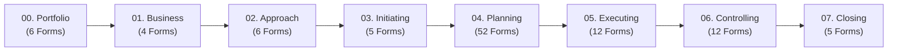

<!--
---
type: Overview
---
-->

<div align="center">

<p align="center">
  
</p>

# 🚀 Tasleemat PMO Toolkit | تسليمات
### *The Enterprise Bilingual (English & Arabic) Project Management Artifact & AI Library*
#### *Aligned with PMI PMBOK® Guide (6th, 7th & 8th Edition Ready) Standards*

[](https://fakhr.me/Tasleemat/)
[](https://pypi.org/project/tasleemat/)
[-059669?style=for-the-badge)](forms/)
[](README_AR.md)

<br/>

**[🌐 Web Documentation Portal](https://fakhr.me/Tasleemat/)** • **[🇸🇦 النسخة العربية](README_AR.md)** • **[👔 PM Quick Start](docs/en/01_getting_started.md)** • **[📋 Browse Templates](forms/en/)** • **[🚪 Stage-Gates Guide](docs/en/04_stage_gates_and_governance.md)** • **[📖 Terminology Lexicon](docs/LEXICON.md)** • **[💻 Technical & Developer Guide](TECHNICAL.md)**

---

</div>

## 🌟 Executive Overview

**Tasleemat (تسليمات)** is a complete open-source Project Management Office (PMO) toolkit designed for **Project Managers, PMO Directors, Business Leaders, and Project Officers**. 

It provides **102 standardized, bilingual (English & Arabic) project management deliverables** (204 synchronized form bundles) covering the full project lifecycle—from portfolio strategy and business case development to scope baselines, risk registers, stage-gate reviews, and project closeouts.

Whether you are launching a startup project, managing an enterprise digital transformation, or running an Agile sprint, Tasleemat gives you instant access to production-grade, print-ready, and AI-compatible templates.

---

## 🧭 Choose Your Journey

<div align="center">

| 👔 For Project Managers & PMO Leaders | 💻 For Developers & AI Engineers |
| :--- | :--- |
| • **[Browse 102 Templates by Phase](forms/en/)**<br/>• **[Explore 6 Stage-Gate Governance Checklists](docs/en/04_stage_gates_and_governance.md)**<br/>• **[Select Project Sizing Tiers (Small to Enterprise)](docs/en/05_tailoring_profiles.md)**<br/>• **[View Bilingual Lexicon & Terminology](docs/LEXICON.md)** | • **[Read TECHNICAL.md Developer Manual](TECHNICAL.md)**<br/>• **[Python SDK (`tasleemat.ai`) Usage](TECHNICAL.md#2-programmatic-python-sdk-tasleematai)**<br/>• **[CLI Scaffolder Setup (`pip install tasleemat`)](TECHNICAL.md#1-tasleemat-cli-scaffolder--search-tool)**<br/>• **[JSON Schemas & OKF Data Packages](TECHNICAL.md#3-data-architecture--synchronized-5-file-bundles)** |

</div>

---

## 🗺️ Project Lifecycle Navigation (102 Deliverables)

The toolkit is organized chronologically into **8 Lifecycle Phases**. Every phase contains standardized English and Arabic templates with field guidance:



### 📑 Lifecycle Phase Summary & Quick Links

| Phase | Phase Name | Key Deliverables Included | Quick Links |
| :---: | :--- | :--- | :---: |
| **00** | **[Program & Portfolio Strategy](forms/en/00_Program_and_Portfolio_Management/)** | Portfolio Roadmap, OKR Mapping, PMO Maturity Model | [English](forms/en/00_Program_and_Portfolio_Management/) • [العربية](forms/ar/00_إدارة_البرامج_والمحافظ/) |
| **01** | **[Business & Value Delivery](forms/en/01_Business_and_Value_Delivery/)** | Business Case, Benefits Realization Plan, Feasibility Study | [English](forms/en/01_Business_and_Value_Delivery/) • [العربية](forms/ar/01_الأعمال_وتسليم_القيمة/) |
| **02** | **[Project Approach & Tailoring](forms/en/02_Project_Approach_and_Tailoring/)** | Governance Tailoring Strategy, AI Readiness Assessment | [English](forms/en/02_Project_Approach_and_Tailoring/) • [العربية](forms/ar/02_منهجية_المشروع_وتخصيصه/) |
| **03** | **[Initiating](forms/en/03_Initiating/)** | Project Charter, Assumption Log, Stakeholder Register | [English](forms/en/03_Initiating/) • [العربية](forms/ar/03_البدء/) |
| **04** | **[Planning](forms/en/04_Planning/)** | Scope Baseline/WBS, Schedule, Cost, Risk, Procurement, ESG | [English](forms/en/04_Planning/) • [العربية](forms/ar/04_التخطيط/) |
| **05** | **[Executing](forms/en/05_Executing/)** | Issue Log, Change Request, Retrospective, Sprint Backlog | [English](forms/en/05_Executing/) • [العربية](forms/ar/05_التنفيذ/) |
| **06** | **[Monitoring & Controlling](forms/en/06_Monitoring_and_Controlling/)** | Status Report, Earned Value (EVA), Quality Acceptance, Flow Metrics | [English](forms/en/06_Monitoring_and_Controlling/) • [العربية](forms/ar/06_المراقبة_والتحكم/) |
| **07** | **[Closing](forms/en/07_Closing/)** | Lessons Learned, Operational Handover, Contract Closeout | [English](forms/en/07_Closing/) • [العربية](forms/ar/07_الإغلاق/) |

---

## 🎯 Tailoring: Pick the Right Pack for Your Project

Not every project requires all 102 templates. Tasleemat defines **4 Tailoring Tiers** to match your project size and risk level:

| Tier | Project Sizing | Recommended Template Count | Focus Area |
| :--- | :--- | :---: | :--- |
| **Tier 1: Micro / Small** | Short duration, low risk | **5 Core Artifacts** | Charter, Basic Schedule, Action Log, Status Report, Closeout |
| **Tier 2: Standard Core** | Medium complexity & budget | **18 Artifacts** | Full Baselines (Scope, Schedule, Cost, Risk, Communications) |
| **Tier 3: Enterprise** | High budget, multi-vendor | **45+ Artifacts** | Formal Governance, Stage-Gate Signoffs, Procurement, Audit |
| **Tier 4: Agile / AI** | Iterative software & AI projects | **25 Artifacts** | Sprint Backlog, Flow Metrics, Model Cards, Retrospectives |

*Detailed tailoring guidelines are available in **[`docs/en/05_tailoring_profiles.md`](docs/en/05_tailoring_profiles.md)**.*

---

## ⚡ 3 Simple Ways to Use Tasleemat

### 1. Interactive Web Portal *(Easiest)*
Visit **[fakhr.me/Tasleemat/](https://fakhr.me/Tasleemat/)** to search deliverables, filter by phase or project tier, and copy templates directly to your editor.

### 2. Manual Markdown / PDF Export
Navigate to any form directory (e.g. [`forms/en/03_Initiating/01_Project_Charter/`](forms/en/03_Initiating/01_Project_Charter/)), open `*_Template.md`, and export to PDF, Notion, Confluence, or Word.

### 3. CLI Project Scaffolder
Install the global CLI to scaffold complete project folders automatically:
```bash
pip install tasleemat

# Scaffold a project folder with Arabic templates for a Tier 2 Agile project
tasleemat init --tier 2 --pack agile --lang ar --name "منصة التحول الرقمي"
```

---

## 📜 Standards Compliance

Tasleemat is fully aligned with recognized international standards:
- **PMI PMBOK® Guide** (6th, 7th & 8th Edition Ready)
- **ISO 21500:2021 & ISO 21502:2020** (Project, Programme & Portfolio Governance)
- **Agile & Lean Practice Guides** (Scrum, Kanban, Value Streams)
- **NIST AI Risk Management Framework** (AI Governance Artifacts)
- **UN SDGs & Sustainability / ESG Reporting Frameworks**

---

## 📚 Citation & License

[](https://doi.org/10.5281/zenodo.23193523)

If you use Tasleemat in your PMO operations or research, please cite:
> Mohamed (Fouad) Fakhruldeen. (2026). fakhruldeen/Tasleemat: v2.0.2 [Computer software]. Zenodo. https://doi.org/10.5281/zenodo.23193523

This project is licensed under the **[MIT License](LICENSE)**.

---

<div align="center">
  <sub>Built with precision for project leaders worldwide. Maintained by <a href="https://github.com/fakhruldeen">Fakhruldeen</a>.</sub>
</div>
