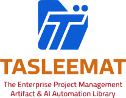
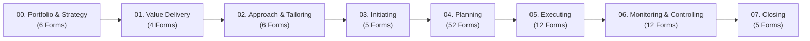

<div align="center">

<p align="center">
  
</p>

# 🚀 Tasleemat PMO Toolkit | تسليمات
### *The Enterprise Bilingual (English & Arabic) Project Management Artifact & AI Automation Library*
#### *Fully Aligned with PMI PMBOK® Guide 6th, 7th & 8th Edition Ready Standards*

[](LICENSE)
[](docs/LEXICON.md)
[-success?style=for-the-badge)](forms/)
[](README_AR.md)
[](docs/)

<br/>

**[🇸🇦 اقرأ بالعربية](README_AR.md)** • **[📚 Documentation Hub](docs/)** • **[📖 Master Lexicon](docs/LEXICON.md)** • **[🏆 Demos & Examples](examples/)** • **[🚀 Getting Started](docs/en/01_getting_started.md)** • **[📜 Policy Manual](docs/en/03_pmo_policy_manual.md)** • **[🚪 Stage-Gates](docs/en/04_stage_gates_and_governance.md)** • **[⚖️ Tailoring](docs/en/05_tailoring_profiles.md)** • **[🤖 AI Framework](docs/en/08_ai_governance_framework.md)** • **[⚡ Agile Guide](docs/en/09_agile_hybrid_integration.md)** • **[📂 English Forms](forms/en/)** • **[📂 Arabic Forms](forms/ar/)**

---

</div>

## 🌟 Executive Summary

**Tasleemat (تسليمات)** is a production-grade, open-source Project Management Office (PMO) toolkit designed for project managers, PMO directors, enterprise architects, and AI practitioners. It provides **102 standardized, bilingual (English & Arabic) project management artifacts** (204 synchronized form bundles total) covering the complete chronological project lifecycle—from portfolio strategy, OKR alignment, and business value delivery to predictive baselines, Agile execution, Lean flow metrics, Sustainability/ESG governance, and AI engineering.

Every single artifact is designed as a **5-file synchronized bundle**, bridging the gap between human practitioner workflows, executive print-ready PDF reporting, and autonomous AI document generation.

---

## 💎 Core Highlights & PMBOK® 8th Edition Readiness

- **📚 102 Full-Lifecycle Artifacts (204 Form Bundles):** Complete coverage across 8 lifecycle phases and 12 planning domains.
- **🌱 Sustainability & ESG Project Management (PMBOK 8th Ed):** Dedicated ESG baselines, Scope 1/2/3 carbon footprint reduction tracking, circular resource utilization, and ethical procurement (`PMO-04.12.01`).
- **⚡ Modern Flow Metrics & Value Streams (PMBOK 8th Ed):** Real-time Lean/Agile telemetry tracking Lead Time & Cycle Time percentiles, WIP limits, Flow Efficiency, and delivery throughput (`PMO-06.12`).
- **🧠 Human-Centric Leadership & Psychological Safety (PMBOK 8th Ed):** Quantitative measurement of vulnerability, constructive dissent, blameless culture, cognitive workload balance, and focus time (`PMO-04.06.06`).
- **🎯 Dynamic OKR & Strategic Portfolio Alignment (PMBOK 8th Ed):** Top-down Objective and Key Result (OKR) mapping to project milestones with quarterly confidence tracking and strategic pivoting (`PMO-00.06`).
- **🌐 100% Bilingual Parity (EN & AR):** Strict 1-to-1 structural parity between English source files and native Arabic (RTL) files aligned with the **PMI Lexicon of Project Management Terms**.
- **🤖 AI-Native & GenAI Architecture:** Every form includes dedicated machine-readable JSON schemas and prompt instructions ready for instant automated drafting via Claude, ChatGPT, Gemini, or local LLMs.
- **🖨️ Executive Print & Export Ready:** Clean GitHub-flavored Markdown and HTML tables formatted for seamless PDF conversion with governance sign-off blocks.
- **📖 Official Terminology Lexicon:** Standardized project management terms mapped and defined in [`docs/LEXICON.md`](docs/LEXICON.md) and [`docs/LEXICON.json`](docs/LEXICON.json).

---

## 📂 Repository Architecture

```text
Tasleemat/
├── docs/                                           # 📚 Central Documentation & Governance Portal
│   ├── README.md                                   # 🇬🇧 English Documentation Hub & Reading Paths
│   ├── README_AR.md                                # 🇸🇦 Arabic Documentation Hub & Reading Paths
│   ├── LEXICON.md                                  # 📖 Master Bilingual PMI Lexicon & Form Catalog
│   ├── LEXICON.json                                # 🤖 Machine-readable Schema & Form Registry
│   ├── en/                                         # 🇬🇧 11 Comprehensive English Guides
│   │   ├── 01_getting_started.md                   # Quick-Start & Onboarding Workflow (Day 1 to 30)
│   │   ├── 02_usage_guide.md                       # Practitioner Field Conventions & Syntax
│   │   ├── 03_pmo_policy_manual.md                 # PMO Policies, Thresholds & Audit Mandates
│   │   ├── 04_stage_gates_and_governance.md        # 6-Stage Gate Reviews & Signoff Criteria
│   │   ├── 05_tailoring_profiles.md                # 4 Project Tiers (Enterprise, Core, Agile, AI)
│   │   ├── 06_raci_authority_matrix.md             # 102-Form RACI Responsibility Framework
│   │   ├── 07_document_dependencies.md             # Directed Acyclic Graph (DAG) of Deliverables
│   │   ├── 08_ai_governance_framework.md           # AI Canvas, Model Cards, Ethics & SDAIA/NIST
│   │   ├── 09_agile_hybrid_integration.md          # Agile Ceremonies, Sprints, Flow Metrics & DoD
│   │   ├── 10_faq_and_troubleshooting.md           # 25+ Solutions to Practitioner Roadblocks
│   │   └── 11_tools_and_automation.md              # Python Validation Suite & DevOps CI/CD
│   └── ar/                                         # 🇸🇦 11 Comprehensive Arabic Guides
├── forms/                                          # 📋 102 Bilingual Forms (204 Bundles)
│   ├── en/                                         # 🇬🇧 English Deliverables (00 to 07)
│   └── ar/                                         # 🇸🇦 Arabic Deliverables (00 إلى 07)
├── examples/                                       # 🏆 204 Fully-Populated Real-World Examples
│   ├── en/                                         # 🇬🇧 102 English Reference Implementations
│   └── ar/                                         # 🇸🇦 102 Arabic Reference Implementations
├── tools/                                          # 🛠️ Verification, Parity & Audit Tooling
├── README.md                                       # 🇬🇧 Main Repository Portal
└── README_AR.md                                    # 🇸🇦 Arabic Repository Portal
```

---

## 📦 The 5-File Artifact Bundle

Inside every form directory (e.g., [`forms/en/03_Initiating/01_Project_Charter/`](forms/en/03_Initiating/01_Project_Charter/)), you will find exactly 5 synchronized files:

| File Type | Pattern | Purpose & Practitioner Value |
| :--- | :--- | :--- |
| **Printable Template** | `*_Template.md` / `*_قالب.md` | Clean, printable document structure with document metadata headers, detailed sections, and governance approval tables. |
| **Practitioner Guide** | `*_Guide.md` / `*_دليل.md` | In-depth operational guide detailing purpose, writing principles, column guidelines, and upstream/downstream dependencies. |
| **LLM Generation Prompt** | `*.md` | System prompt engineered to instruct AI models on exact field constraints, business context, and output format. |
| **JSON Data Schema** | `*.json` | Machine-readable schema mapping section keys, field labels, practitioner guidance, and target values for API pipelines. |
| **Tabular Data Dictionary** | `*.csv` | 4-column structured dictionary (`Section,Field,Guidance,LLM_Generated_Value`) for Excel, PowerBI, and data pipelines. |

---

## 🗺️ Project Lifecycle Overview (102 Forms)



### 📑 Lifecycle Phase Summary

1. **[00. Program and Portfolio Management](forms/en/00_Program_and_Portfolio_Management/)** (`PMO-00.01` – `PMO-00.06`): Portfolio roadmaps, program charters, interdependency tracking, capacity planning, PMO maturity assessment, and OKR alignment.
2. **[01. Business and Value Delivery](forms/en/01_Business_and_Value_Delivery/)** (`PMO-01.01` – `PMO-01.04`): Business cases, benefits management plans, value realization registers, and gap analysis reports.
3. **[02. Project Approach and Tailoring](forms/en/02_Project_Approach_and_Tailoring/)** (`PMO-02.01` – `PMO-02.06`): Methodology tailoring, AI governance, AI readiness assessments, model cards, and ethics baselines.
4. **[03. Initiating](forms/en/03_Initiating/)** (`PMO-03.01` – `PMO-03.05`): Project charter, product vision, assumption logs, stakeholder registers, and stakeholder analysis.
5. **[04. Planning](forms/en/04_Planning/)** (`PMO-04.01.01` – `PMO-04.12.01`): 52 detailed planning baselines across 12 domains (Integration, Scope/WBS, Schedule, Cost, Quality, Resources & Psychological Safety, Communications, Risk, Procurement, Stakeholders, OCM, and Sustainability/ESG).
6. **[05. Executing](forms/en/05_Executing/)** (`PMO-05.01` – `PMO-05.12`): Issue logs, change requests, team performance evaluations, retrospectives, and prompt libraries.
7. **[06. Monitoring and Controlling](forms/en/06_Monitoring_and_Controlling/)** (`PMO-06.01` – `PMO-06.12`): Status reports, variance analysis, Earned Value Analysis (EVA), UAT sign-offs, project health check matrices, and Lean flow metrics dashboards.
8. **[07. Closing](forms/en/07_Closing/)** (`PMO-07.01` – `PMO-07.05`): Lessons learned summaries, contract closeouts, project closeouts, operational handover checklists, and post-implementation reviews (PIR).

*For the complete index of all 102 forms with English/Arabic names and direct links, see **[`docs/LEXICON.md`](docs/LEXICON.md)**.*

---

## ⚡ Quick Start: 4 Ways to Use Tasleemat

### 1. Interactive CLI Project Scaffolder *(Fastest)*
Initialize a complete project workspace tailored to your project size in under 2 seconds:
```bash
# Scaffold a new project (interactive wizard or flags)
python3 tools/tasleemat_cli.py init --tier 2 --pack agile --lang ar --name "منصة التحول الرقمي" --code "PRJ-2026-01"

# Search forms by keyword in Arabic or English
python3 tools/tasleemat_cli.py search "Risk" --lang en
python3 tools/tasleemat_cli.py search "ميثاق" --lang ar
```

### 2. Manual Project Management Workflow
1. Navigate to the desired phase folder (e.g., [`forms/en/03_Initiating/01_Project_Charter/`](forms/en/03_Initiating/01_Project_Charter/)).
2. Open `03_01_Project_Charter_Guide.md` to review best practices and required inputs.
3. Copy `03_01_Project_Charter_Template.md` into your editor (VS Code, Obsidian, Notion, or Confluence) or export directly to PDF using `python3 tools/export_deliverables.py`.

### 3. AI-Powered Generation Workflow (ChatGPT, Claude, Gemini)
Generate complete, compliant PMO documents in seconds:
1. Open [`forms/en/parameters.md`](forms/en/parameters.md) (or [`forms/ar/parameters.md`](forms/ar/parameters.md)) and enter your project parameters (Title, Sponsor, Budget, Scope boundaries).
2. Open the prompt file `*.md` of the desired artifact (e.g., `04_08_02_Risk_Register.md`).
3. Feed both files along with your rough meeting notes into your LLM:
   ```text
   You are an expert PMO Lead. Fill out this artifact based on the project parameters 
   and the following rough notes: [Insert notes here]. 
   Adhere strictly to the field guidance and output the result in Markdown matching the template structure.
   ```
4. Receive a perfectly structured, publication-ready project document!

### 4. Programmatic & Data Engineering Workflow
- Ingest [`docs/LEXICON.json`](docs/LEXICON.json) or individual `*.json` / `*.csv` files directly into Python (`pandas`), PowerBI, or internal web dashboards to track deliverable completion across enterprise portfolios.

---

## 📜 Standards & Compliance Alignment

Tasleemat is strictly aligned with international project management benchmarks:
- **PMI PMBOK® Guide (6th, 7th & 8th Edition Ready)**
- **PMI Process Groups: A Practice Guide**
- **PMI Lexicon of Project Management Terms**
- **ISO 21500:2021 & ISO 21502:2020** (Project, Programme and Portfolio Management)
- **Agile & Lean Practice Guides** (Scrum, Kanban, Value Stream Management, Flow Metrics)
- **NIST AI Risk Management Framework & EU AI Act** (AI Governance Artifacts)
- **UN Sustainable Development Goals (SDGs) & ESG Reporting Frameworks**

---

## 🧪 Quality Assurance & Automated Test Suite

Tasleemat features an enterprise-grade automated testing suite (`tests/`) covering **100% of the repository's 102 forms, 204 reference examples, JSON schemas, OKF data package, and CLI tools**:

```bash
# Run the complete test suite (28 comprehensive unit & integration tests)
python3 -m unittest discover -s tests -v

# Or execute tests directly via the Tasleemat CLI
python3 tools/tasleemat_cli.py test -v
```

| Test Module | Coverage & Verification Scope |
| :--- | :--- |
| **`test_parity.py`** | 1:1 English/Arabic symmetry across all 8 phases, 102 form folders, and 5-file bundles |
| **`test_schemas.py`** | JSON schema parsing, required top-level keys, field definitions, and JSON-CSV alignment |
| **`test_okf_datapackage.py`** | Frictionless JSON Schema standard compliance for all 204 package resources |
| **`test_governance_templates.py`** | Executive Document Control tables, guide-to-example links, and relative link integrity |
| **`test_fictional_compliance.py`** | Realistic sample validation, non-empty content checks, and zero unresolved template placeholders |
| **`test_cli_and_exporters.py`** | Multi-tier project scaffolding, parameter substitution, catalog search, and HTML exporter |
| **`test_documentation.py`** | 24 operational manuals (12 EN / 12 AR), LEXICON integrity, and MkDocs navigation |

---

## 📚 Citation

[](https://doi.org/10.5281/zenodo.23193524)

If you use Tasleemat in your research or PMO operations, please cite it as follows:

> Mohamed (Fouad) Fakhruldeen. (2026). fakhruldeen/Tasleemat: v2.0.2 (Version v2.0.2) [Computer software]. Zenodo. https://doi.org/10.5281/zenodo.23193524

---

## 📄 License & Attribution

This project is open-source under the **[MIT License](LICENSE)**. You are free to use, adapt, and integrate these templates in commercial and non-commercial enterprise projects.

---

<div align="center">
  <sub>Built with precision for project leaders worldwide. Maintained by <a href="https://github.com/fakhruldeen">Fakhruldeen</a>.</sub>
</div>
