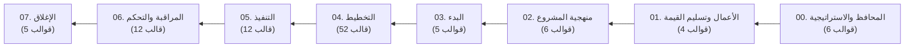

<div align="center">

<p align="center">
  
</p>

# 🚀 مكتبة تسليمات لإدارة المشاريع | Tasleemat PMO Toolkit
### *المكتبة المؤسسية المزدوجة (عربي - إنجليزي) لمخرجات إدارة المشاريع والذكاء الاصطناعي*
#### *متوافقة مع معايير الدليل المعرفي لإدارة المشاريع PMI PMBOK® الإصدار 6 و7 والجاهزية للإصدار 8*

[](https://fakhr.me/Tasleemat/)
[](https://pypi.org/project/tasleemat/)
[-059669?style=for-the-badge)](forms/ar/)
[](README.md)

<br/>

**[🌐 البوابة الإلكترونية الشاملة](https://fakhr.me/Tasleemat/)** • **[🇬🇧 English Readme](README.md)** • **[👔 دليل البدء للممارسين](docs/ar/01_getting_started.md)** • **[📋 استعراض القوالب](forms/ar/)** • **[🚪 دليل البوابات المرحلية](docs/ar/04_stage_gates_and_governance.md)** • **[📖 قاموس المصطلحات الموحد](docs/LEXICON.md)** • **[💻 دليل المطورين والمهندسين](TECHNICAL_AR.md)**

---

</div>

## 🌟 نبذة تنفيذية

**تسليمات (Tasleemat)** هي مكتبة شاملة ومفتوحة المصدر لإدارة المشاريع والمحافظ، تم تصميمها خصيصاً لـ **مديري المشاريع، مديري مكاتب إدارة المشاريع (PMO)، والقادة والمسؤولين**.

توفر المكتبة **102 مخرجاً إدارياً ثنائي اللغة (عربي - إنجليزي)** (204 حزمة مستندات) تغطي دورة حياة المشروع بالكامل—بدءاً من الاستراتيجية ودراسات الجدوى وحتى التخطيط، والمراقبة، والمراجعات المرحلية، والإغلاق النهائي.

سواء كنت تدير مشروعاً ناشئاً، أو برنامج تحول رقمي مؤسسي، أو مشروعاً مرناً (Agile)، توفر لك تسليمات قوالب جاهزة للطباعة والتوثيق والربط التقني.

---

## 🧭 اختر مسارك

<div align="center">

| 👔 لمديري المشاريع ومكاتب إدارة المشاريع | 💻 للمطورين ومهندسي الذكاء الاصطناعي |
| :--- | :--- |
| • **[استعراض 102 قالب حسب المراحل](forms/ar/)**<br/>• **[دليل بوابات الحوكمة 6 Stage-Gates](docs/ar/04_stage_gates_and_governance.md)**<br/>• **[تحديد حجم المشروع وتخصيص القوالب](docs/ar/05_tailoring_profiles.md)**<br/>• **[قاموس المصطلحات الموحد PMI Lexicon](docs/LEXICON.md)** | • **[قراءة دليل المطورين TECHNICAL_AR.md](TECHNICAL_AR.md)**<br/>• **[استخدام حزمة بايثون (`tasleemat.ai`)](TECHNICAL_AR.md#2-حزمة-تطوير-البرمجيات-tasleematai)**<br/>• **[التثبيت والسطر البرمجي CLI](TECHNICAL_AR.md#1-أداة-السطر-البرمجي-tasleemat-cli)**<br/>• **[مخططات JSON وحزم البيانات OKF](TECHNICAL_AR.md#3-حزم-البيانات-والخمسية-المتزامنة)** |

</div>

---

## 🗺️ التصفح حسب مراحل المشروع (102 مخرج)

تم تقسيم القوالب والمخرجات زمنياً عبر **8 مراحل أساسية**:



### 📑 ملخص المراحل والروابط السريعة

| المرحلة | اسم المرحلة | أهم المخرجات والقوالب | الروابط السريعة |
| :---: | :--- | :--- | :---: |
| **00** | **[إدارة البرامج والمحافظ](forms/ar/00_إدارة_البرامج_والمحافظ/)** | خارطة طريق المحفظة، المواءمة مع الأهداف الاستراتيجية OKR | [العربية](forms/ar/00_إدارة_البرامج_والمحافظ/) • [English](forms/en/00_Program_and_Portfolio_Management/) |
| **01** | **[الأعمال وتسليم القيمة](forms/ar/01_الأعمال_وتسليم_القيمة/)** | دراسة الجدوى، خطة إدارة المنافع، سجل تحقيق القيمة | [العربية](forms/ar/01_الأعمال_وتسليم_القيمة/) • [English](forms/en/01_Business_and_Value_Delivery/) |
| **02** | **[منهجية المشروع وتخصيصه](forms/ar/02_منهجية_المشروع_وتخصيصه/)** | استراتيجية تخصيص الحوكمة، تقييم جاهزية الذكاء الاصطناعي | [العربية](forms/ar/02_منهجية_المشروع_وتخصيصه/) • [English](forms/en/02_Project_Approach_and_Tailoring/) |
| **03** | **[البدء](forms/ar/03_البدء/)** | ميثاق المشروع، سجل الافتراضات الأولية، سجل المعنيين | [العربية](forms/ar/03_البدء/) • [English](forms/en/03_Initiating/) |
| **04** | **[التخطيط](forms/ar/04_التخطيط/)** | الخطوط المرجعية (النطاق، الجدول، التكلفة، المخاطر، ESG) | [العربية](forms/ar/04_التخطيط/) • [English](forms/en/04_Planning/) |
| **05** | **[التنفيذ](forms/ar/05_التنفيذ/)** | سجل القضايا، طلبات التغيير، سجل مراجعة الدروس | [العربية](forms/ar/05_التنفيذ/) • [English](forms/en/05_Executing/) |
| **06** | **[المراقبة والتحكم](forms/ar/06_المراقبة_والتحكم/)** | تقارير الأداء، تحليل القيمة المكتسبة EVA، مؤشرات التدفق | [العربية](forms/ar/06_المراقبة_والتحكم/) • [English](forms/en/06_Monitoring_and_Controlling/) |
| **07** | **[الإغلاق](forms/ar/07_الإغلاق/)** | تقرير الدروس المستفادة، قائمة التسليم التشغيلي | [العربية](forms/ar/07_الإغلاق/) • [English](forms/en/07_Closing/) |

---

## 🎯 تخصيص المستندات حسب حجم المشروع

ليس كل مشروع يتطلب القوالب الـ 102 بالكامل. تحدد تسليمات **4 مستويات لتخصيص الحوكمة**:

| المستوى | حجم ونوع المشروع | عدد القوالب المقترحة | التركيز الأساسي |
| :--- | :--- | :---: | :--- |
| **المستوى 1: مصغر / صغير** | مدة قصيرة ومخاطر منخفضة | **5 قوالب أساسية** | ميثاق مصغر، جدول زمني، سجل متابعة، تقرير، إغلاق |
| **المستوى 2: قياسي (Core)** | ميزانية وتعقيد متوسط | **18 قالباً** | الخطوط المرجعية للنطاق والجدول والتكلفة والمخاطر |
| **المستوى 3: مؤسسي (Enterprise)** | ميزانية ضخمة وموردين متعددين | **45+ قالباً** | الحوكمة الرسمية، البوابات المرحلية، المشتريات والتدقيق |
| **المستوى 4: مرن / ذكاء اصطناعي** | مشاريع التطوير البرمجي والذكاء الاصطناعي | **25 قالباً** | سجلات سبرنت، بطاقات النماذج، الاستعراض الدوري |

---

## ⚡ 3 طرق لاستخدام مكتبة تسليمات

### 1. البوابة الإلكترونية التفاعلية *(الأسهل)*
قم بزيارة **[fakhr.me/Tasleemat/](https://fakhr.me/Tasleemat/)** للبحث في القوالب وتصفيتها حسب المرحلة أو الحجم ونسخ المحتوى مباشرة.

### 2. التنزيل والتصدير المباشر
انتقل لأي مجلد (مثل [`forms/ar/03_البدء/01_ميثاق_المشروع/`](forms/ar/03_البدء/01_ميثاق_المشروع/)) وافتح القالب `*_قالب.md` لتصديره لـ PDF أو Word.

### 3. أداة السطر البرمجي CLI
قم بتثبيت أداة تسليمات وإنشاء هيكل مستندات المشروع تلقائياً:
```bash
pip install tasleemat

# إنشاء حزمة مستندات باللغة العربية لمشروع متوسط مرن
tasleemat init --tier 2 --pack agile --lang ar --name "منصة التحول الرقمي"
```

---

## 📜 المعايير والاعتمادات

تلتزم تسليمات بأعلى المعايير العالمية:
- **دليل إدارة المشاريع PMI PMBOK®** (الإصدارات 6 و7 والجاهزية لـ 8)
- **معايير أيزو ISO 21500:2021 & ISO 21502:2020** (حوكمة المشاريع والمحافظ)
- **أدلة الممارسات المرنة Agile & Lean** (Scrum, Kanban)
- **إطار إدارة مخاطر الذكاء الاصطناعي NIST AI RMF**
- **أهداف التنمية المستدامة وتقارير الاستدامة ESG**

---

<div align="center">
  <sub>تم التطوير والتحديث بواسطة <a href="https://github.com/fakhruldeen">Fakhruldeen</a> • ترخيص مفتوح المصدر MIT</sub>
</div>
