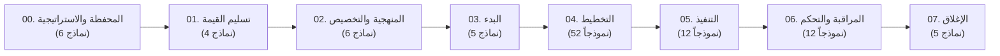

<div align="center">

# 🚀 حزمة أدوات تسليمات لإدارة المشاريع | Tasleemat PMO Toolkit
### *المكتبة المؤسسية الموحدة لنماذج إدارة المشاريع ثنائية اللغة (عربي / إنجليزي) والأتمتة بالذكاء الاصطناعي*
#### *متوافقة بالكامل مع معايير معهد إدارة المشاريع الدليل المعرفي PMBOK® (الإصدارات السادس والسابع والجاهزية للإصدار الثامن)*

[](LICENSE)
[](LEXICON.md)
[-success?style=for-the-badge)](forms/)
[](README.md)
[](USAGE_GUIDE_AR.md)

<br/>

**[🇬🇧 Read in English](README.md)** • **[📖 المعجم الموحد](LEXICON.md)** • **[🔗 شبكة الاعتماديات (DAG)](DOCUMENT_DEPENDENCIES_AR.md)** • **[👥 مصفوفة RACI للحوكمة](RACI_AUTHORITY_MATRIX_AR.md)** • **[🛠️ دليل الاستخدام](USAGE_GUIDE_AR.md)** • **[📂 النماذج العربية](forms/ar/)** • **[📂 النماذج الإنجليزية](forms/en/)**

---

</div>

## 🌟 لمحة عامة عن المشروع

**تسليمات (Tasleemat)** هي حزمة أدوات مؤسسية مفتوحة المصدر لمكاتب إدارة المشاريع (PMO)، موجهة لمدراء المشاريع، مدراء المحافظ والبرامج، مهندسي النظم، ومطوري حلول الذكاء الاصطناعي. توفر الحزمة **102 نموذجاً ووثيقة مشروع ثنائية اللغة (عربي / إنجليزي)** (بإجمالي 204 حزم نماذج متزامنة) تغطي دورة الحياة الكاملة للمشاريع—بدءاً من إدارة المحافظ ومواءمة الأهداف والنتائج الرئيسية (OKRs) وتحقيق القيمة، ومروراً بالتخطيط التنبؤي، وممارسات أجايل (Agile)، ومقاييس التدفق الرشيق، والاستدامة والمعايير البيئية والاجتماعية والحوكمة (ESG)، وحوكمة الذكاء الاصطناعي.

صُمم كل مخرج ومستند في الحزمة على شكل **حزمة متكاملة من 5 ملفات متزامنة** تجمع بين التطبيق العملي البشري، والتقارير التنفيذية القابلة للطباعة وتصدير PDF، والأتمتة التوليدية بواسطة الذكاء الاصطناعي.

---

## 💎 المزايا الجوهرية والجاهزية للإصدار الثامن (PMBOK® 8th Ready)

- **📚 102 مخرجاً متكاملاً (204 حزم نماذج):** تغطية شاملة عبر 8 مراحل لدورة حياة المشروع و12 مجالاً معرفياً للتخطيط.
- **🌱 إدارة الاستدامة والمعايير البيئية والاجتماعية والحوكمة (ESG):** خطط مخصصة لخفض البصمة الكربونية (النطاقات 1 و2 و3)، والاقتصاد الدائري، والمشتريات الأخلاقية (`PMO-04.12.01`).
- **⚡ مقاييس التدفق ومسارات القيمة الرشيقة (Flow Metrics):** لوحات تتبع ومقاييس التدفق المباشرة (الوقت المستغرق Lead Time، وقت الدورة Cycle Time، حدود WIP، كفاءة التدفق، ومعدل الإنتاجية) (`PMO-06.12`).
- **🧠 القيادة المتمحورة حول الإنسان والأمان النفسي:** قياس كمي وموضوعي للأمان النفسي، والعبء الذهني، والحوار البناء، وثقافة التعلم، وصحة الفريق الهجين (`PMO-04.06.06`).
- **🎯 مواءمة الأهداف والنتائج الرئيسية (OKRs) للمحفظة:** ربط مباشر للأهداف الاستراتيجية العليا بمخرجات ومعالم المشروع وتتبع الثقة الفصلية وتعديل المسار الديناميكي (`PMO-00.06`).
- **🌐 مطابقة ثنائية اللغة 100% (عربي / إنجليزي):** اتساق هيكلي ومضموني كامل بين الملفات الإنجليزية والملفات العربية المعتمدة المتوافقة مع **معجم مصطلحات إدارة المشاريع الصادر عن PMI**.
- **🤖 بنية مهيأة للذكاء الاصطناعي (AI-Native):** كل نموذج مزود بمخطط JSON دقيق وموجهات توليد نصية جاهزة للاستخدام الفوري مع ChatGPT، Claude، Gemini، أو النماذج المحلية.
- **🖨️ جاهزية للتصدير والطباعة التنفيذية:** جداول Markdown وHTML منسقة بعناية لطباعة وتصدير مستندات PDF رسمية مع جداول الاعتماد والتوقيعات الحوكمية.
- **📖 معجم رسمي للمصطلحات:** توثيق شامل للمصطلحات القياسية المعتمدة في [`LEXICON.md`](LEXICON.md) و[`LEXICON.json`](LEXICON.json).

---

## 📂 الهيكل العام للمستودع

```text
Tasleemat/
├── forms/
│   ├── ar/                                         # 🇸🇦 النماذج العربية المعتمدة (اتجاه RTL)
│   │   ├── 00_إدارة_البرامج_والمحافظ/               # 6 نماذج لخارطة الطريق، مواءمة OKRs، وتقييم النضج
│   │   ├── 01_الأعمال_وتسليم_القيمة/                # 4 نماذج لدراسات الجدوى، تحليل الفجوات، وسجل القيمة
│   │   ├── 02_منهجية_المشروع_وتخصيصه/               # 6 نماذج للتخصيص وحوكمة الذكاء الاصطناعي
│   │   ├── 03_البدء/                               # 5 نماذج للميثاق، سجل الافتراضات، وتحليل المعنيين
│   │   ├── 04_التخطيط/                             # 52 خطة تفصيلية عبر 12 مجالاً تخطيطياً
│   │   ├── 05_التنفيذ/                             # 12 سجلاً تشغيلياً وتقارير للاجتماعات والمراجعات
│   │   ├── 06_المراقبة_والتحكم/                     # 12 تقريراً للتباين، القيمة المكتسبة، ومقاييس التدفق
│   │   ├── 07_الإغلاق/                             # 5 تقارير لإغلاق العقود والمشاريع ومراجعة ما بعد التنفيذ
│   │   └── parameters.md                           # المتغيرات العامة للمشروع لموجهات الذكاء الاصطناعي
│   └── en/                                         # 🇬🇧 النماذج الإنجليزية المتطابقة
├── LEXICON.md                                      # 📖 المعجم الثنائي المعتمد لمصطلحات PMI
├── LEXICON.json                                    # 🤖 الفهرس الرقمي للنماذج والبيانات
├── USAGE_GUIDE.md                                  # 📘 دليل الاستخدام باللغة الإنجليزية
├── USAGE_GUIDE_AR.md                               # 📙 دليل الاستخدام باللغة العربية
├── README.md                                       # 🇬🇧 وثيقة التوثيق الإنجليزية
└── README_AR.md                                    # 🇸🇦 وثيقة التوثيق العربية
```

---

## 📦 حزمة الـ 5 ملفات لكل مخرج وثائقي

يحتوي كل مجلد نموذج (مثل [`forms/ar/03_البدء/01_ميثاق_المشروع/`](forms/ar/03_البدء/01_ميثاق_المشروع/)) على 5 ملفات متزامنة:

| نوع الملف | نمط التسمية | الغرض والفائدة التطبيقية |
| :--- | :--- | :--- |
| **قالب قابل للطباعة** | `*_قالب.md` / `*_Template.md` | مستند مهيكل وجاهز للتعبئة مع ترويسات رسمية وجداول لاعتماد أصحاب الصلاحية. |
| **دليل إرشادي شامل** | `*_دليل.md` / `*_Guide.md` | دليل عملي مفصل يوضح الغرض، أسلوب الصياغة، إرشادات الأعمدة، والاعتماديات السابقة واللاحقة. |
| **موجه الذكاء الاصطناعي** | `*.md` | أمر وموجه نظام مهندس لتوجيه نماذج الذكاء الاصطناعي لتعبئة الحقول وفق ضوابط المشروع. |
| **مخطط بيانات JSON** | `*.json` | بنية بيانات رقمية تربط الأقسام، الحقول، الإرشادات، والقيم المستهدفة لأتمتة الأنظمة وAPIs. |
| **قاموس بيانات CSV** | `*.csv` | جدول من 4 أعمدة (`Section,Field,Guidance,LLM_Generated_Value`) للتحليل المباشر في Excel وPowerBI. |

---

## 🗺️ المراحل الزمنية للمشروع (102 نموذجاً)



### 📑 ملخص مجموعات العمليات

1. **[00. إدارة البرامج والمحافظ](forms/ar/00_إدارة_البرامج_والمحافظ/)** (`PMO-00.01` إلى `PMO-00.06`): المواءمة الاستراتيجية، ميثاق البرنامج، سجل الاعتماديات، مصفوفة سعة الموارد، تقييم نضج مكتب إدارة المشاريع، ومصفوفة مواءمة الأهداف والنتائج الرئيسية (OKRs).
2. **[01. الأعمال وتسليم القيمة](forms/ar/01_الأعمال_وتسليم_القيمة/)** (`PMO-01.01` إلى `PMO-01.04`): دراسات الجدوى، خطة إدارة الفوائد، سجل تحقيق القيمة، وتقرير تحليل الفجوات.
3. **[02. منهجية المشروع وتخصيصه](forms/ar/02_منهجية_المشروع_وتخصيصه/)** (`PMO-02.01` إلى `PMO-02.06`): خطة التخصيص، حوكمة الذكاء الاصطناعي، تقييم الجاهزية، بطاقات النماذج، وتقييم الأخلاقيات والخصوصية.
4. **[03. البدء](forms/ar/03_البدء/)** (`PMO-03.01` إلى `PMO-03.05`): ميثاق المشروع، بيان رؤية المنتج، سجل الافتراضات، وسجل وتحليل المعنيين.
5. **[04. التخطيط](forms/ar/04_التخطيط/)** (`PMO-04.01.01` إلى `PMO-04.12.01`): 52 خطة تفصيلية تشمل التكامل، النطاق (WBS)، الجدول الزمني، التكلفة، الجودة، الموارد والأمان النفسي، الاتصالات، المخاطر، المشتريات، المعنيين، إدارة التغيير المؤسسي، والاستدامة والمعايير البيئية والاجتماعية والحوكمة (ESG).
6. **[05. التنفيذ](forms/ar/05_التنفيذ/)** (`PMO-05.01` إلى `PMO-05.12`): سجل المشكلات، طلبات وسجلات التغيير، تقييم أداء الفريق، مراجعات المرحلة (Retrospective)، ومكتبة الأوامر.
7. **[06. المراقبة والتحكم](forms/ar/06_المراقبة_والتحكم/)** (`PMO-06.01` إلى `PMO-06.12`): تقارير حالة المشروع، تحليل التباين، تحليل القيمة المكتسبة (EVA)، نماذج اعتماد اختبار قبول المستخدم (UAT)، مصفوفة الفحص الصحي للمشروع، ولوحة مقاييس التدفق وتدفق القيمة.
8. **[07. الإغلاق](forms/ar/07_الإغلاق/)** (`PMO-07.01` إلى `PMO-07.05`): تقرير إغلاق العقد، ملخص الدروس المستفادة، إغلاق المشروع أو المرحلة، قائمة التحقق للانتقال للعمليات، وتقرير مراجعة ما بعد التنفيذ (PIR).

*للاطلاع على الفهرس الكامل للنماذج والروابط المباشرة، راجع **[`LEXICON.md`](LEXICON.md)**.*

---

## ⚡ خطوات البدء السريع: 3 طرق للاستخدام

### 1. الاستخدام اليدوي المباشر
1. توجه إلى المجلد المناسب للمرحلة (مثال: [`forms/ar/03_البدء/01_ميثاق_المشروع/`](forms/ar/03_البدء/01_ميثاق_المشروع/)).
2. افتح ملف `03_01_ميثاق_المشروع_دليل.md` لمراجعة الإرشادات وأفضل الممارسات.
3. انسخ قالب `03_01_ميثاق_المشروع_قالب.md` إلى محرر النصوص لديك أو صدّره مباشرة إلى PDF.

### 2. التوليد التلقائي بالذكاء الاصطناعي (ChatGPT, Claude, Gemini)
1. افتح ملف [`forms/ar/parameters.md`](forms/ar/parameters.md) وأدخل المتغيرات الأساسية لمشروعك (اسم المشروع، الميزانية، الراعي، النطاق).
2. افتح ملف الموجه `*.md` للنموذج المطلوب (مثال: `04_08_02_سجل_المخاطر.md`).
3. أرسل الملفين مع ملاحظات الاجتماع إلى نموذج الذكاء الاصطناعي:
   ```text
   أنت مدير مكتب إدارة مشاريع خبير. يرجى تعبئة هذا النموذج بناءً على متغيرات المشروع 
   والملاحظات التالية: [أدخل الملاحظات هنا].
   التزم بدقة بالإرشادات الواردة في كل حقل واجعل المخرج بصيغة Markdown مطابقة لهيكل القالب.
   ```
4. ستحصل على وثيقة مشروع متكاملة ومهنية في ثوانٍ معدودة!

### 3. المعالجة البرمجية وتحليل البيانات
- يمكن استيراد ملف [`LEXICON.json`](LEXICON.json) أو ملفات `*.csv` مباشرة في بايثون (`pandas`) أو أدوات ذكاء الأعمال مثل PowerBI لمتابعة حالة تسليم الوثائق ونضج المحفظة.

---

## 📜 المعايير المرجعية المعتمدة

تم بناء حزمة تسليمات وفق أحدث المعايير الدولية لإدارة المشاريع:
- **دليل PMBOK® الصادر عن PMI (الإصدارات 6 و7 والجاهزية للإصدار 8)**
- **دليل مجموعات العمليات التطبيقي الصادر عن PMI**
- **معجم مصطلحات إدارة المشاريع القياسي من PMI**
- **المواصفات القياسية الدولية ISO 21500:2021 و ISO 21502:2020**
- **أدلة الممارسات الرشيقة (Agile & Lean Practice Guides)**
- **أطر حوكمة الذكاء الاصطناعي (NIST AI RMF و قانون الذكاء الاصطناعي الأوروبي EU AI Act)**
- **أهداف التنمية المستدامة للأمم المتحدة (SDGs) وأطر إفصاحات ESG**

---

## 📄 الترخيص وحقوق الاستخدام

هذا المشروع متاح كمصدر مفتوح تحت مظلة **[ترخيص MIT](LICENSE)**. يحق لك استخدامه وتخصيصه ودمجه بحرية في المشاريع التجارية وغير التجارية.

---

<div align="center">
  <sub>صُمم بإتقان لدعم قادة ومدراء المشاريع حول العالم. تطوير وإشراف <a href="https://github.com/fakhruldeen">فخر الدين</a>.</sub>
</div>
