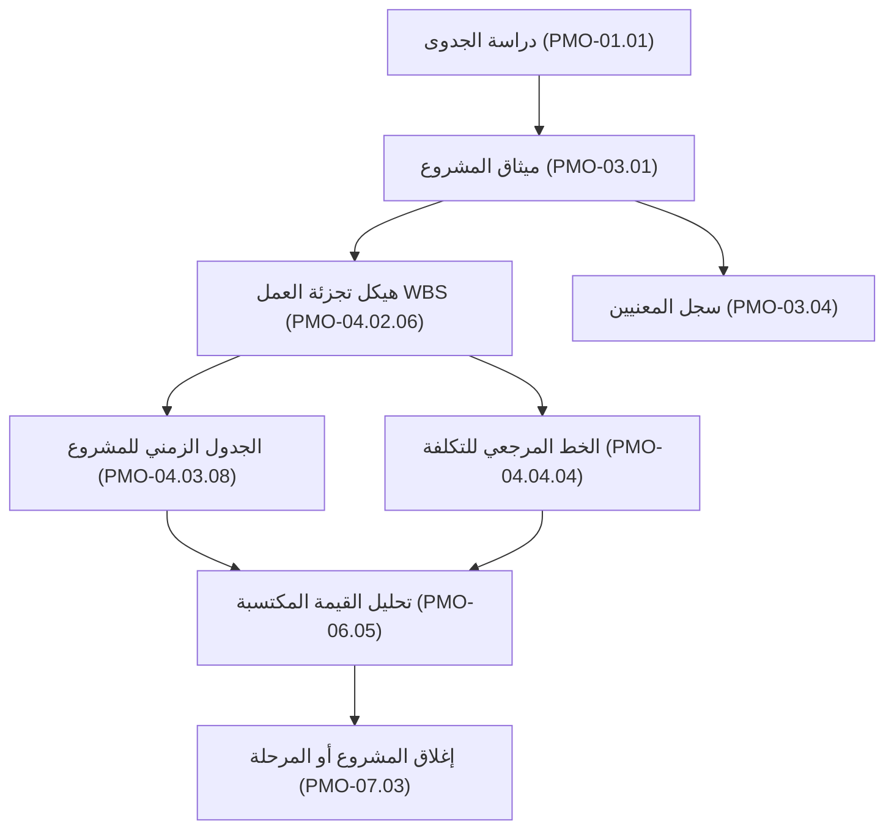

<div dir="rtl" style="font-family: 'Segoe UI', Tahoma, Geneva, Verdana, sans-serif; line-height: 1.8; text-align: right;">

<p align="center">
  
</p>

# 📙 دليل استخدام حزمة تسليمات (Tasleemat PMO Practitioner & Automation Guide)
### *الدليل العملي الشامل لإدارة المخرجات والتوليد الذكي والأتمتة المؤسسية*

مرحباً بك في الدليل الشامل لاستخدام وتطبيق **حزمة تسليمات لإدارة المشاريع**. سواء كنت مديراً لمشروع ترغب في توحيد وتوثيق التسليمات، أو مديراً لمكتب إدارة مشاريع (PMO) يسعى لتطبيق حوكمة مؤسسية رصينة، أو مهندس ذكاء اصطناعي يبني وكلاء أتمتة لإدارة المشاريع، فإن هذا الدليل يشرح كافة مسارات العمل خطوة بخطوة.

---

## 📑 فهرس المحتويات
1. [هيكل حزمة الـ 5 ملفات](#1-هيكل-حزمة-الـ-5-ملفات)
2. [تهيئة المتغيرات العامة للمشروع](#2-تهيئة-المتغيرات-العامة-للمشروع)
3. [مسارات التوليد بالذكاء الاصطناعي](#3-مسارات-التوليد-بالذكاء-الاصطناعي)
   - [المسار الأول: التوليد التفاعلي عبر المحادثة (ChatGPT / Claude / Gemini)](#المسار-الأول-التوليد-التفاعلي-عبر-المحادثة-chatgpt--claude--gemini)
   - [المسار الثاني: الأتمتة البرمجية عبر الـ API وهياكل JSON](#المسار-الثاني-الأتمتة-البرمجية-عبر-الـ-api-وهياكل-json)
   - [المسار الثالث: التشغيل المحلي الآمن (Ollama / Local LLMs)](#المسار-الثالث-التشغيل-المحلي-الآمن-ollama--local-llms)
4. [إدارة الاعتماديات وتدفق المخرجات](#4-إدارة-الاعتماديات-وتدفق-المخرجات)
5. [تصدير الوثائق كـ PDF والنشر المؤسسي](#5-تصدير-الوثائق-كـ-pdf-والنشر-المؤسسي)
6. [تحليل البيانات وإنشاء لوحات التحكم (Dashboards)](#6-تحليل-البيانات-وإنشاء-لوحات-التحكم-dashboards)
7. [مصفوفة الحوكمة وصلاحيات التوقيع والاعتماد](#7-مصفوفة-الحوكمة-وصلاحيات-التوقيع-والاعتماد)

---

## 1. هيكل حزمة الـ 5 ملفات

يحتوي كل مجلد من مجلدات النماذج الـ 102 في [`forms/ar/`](forms/ar/) على 5 ملفات متكاملة ومتزامنة تخدم مختلف مراحل دورة حياة الوثيقة:

```text
01_ميثاق_المشروع/
├── 03_01_ميثاق_المشروع_دليل.md    # 1. الدليل الإرشادي وقواعد الاعتماديات
├── 03_01_ميثاق_المشروع_قالب.md    # 2. القالب التنفيذي القابل للطباعة والتوقيع
├── 03_01_ميثاق_المشروع.md         # 3. موجه التوليد بالذكاء الاصطناعي (Prompt)
├── 03_01_ميثاق_المشروع.json       # 4. مخطط البيانات الرقمي (JSON Schema)
└── 03_01_ميثاق_المشروع.csv        # 5. قاموس الحقول الجدولي (Data Dictionary)
```

### 1.1 الدليل الإرشادي (`*_دليل.md`)
- **متى يُستخدم:** قبل البدء في صياغة أو مراجعة أي وثيقة.
- **الأقسام الرئيسية:**
  - **الغرض والقيمة الحوكمية:** المشكلة التي يعالجها المخرج والمخاطر المترتبة على إهماله.
  - **قواعد الصياغة والكتابة:** معايير الجودة ومحاذير الصياغة العامة.
  - **إرشادات الحقول والأعمدة:** تفصيل دقيق لما يجب كتابته في كل عمود أو قسم.
  - **المحاذاة والاعتماديات:** قائمة واضحة بالمدخلات الإلزامية والاختيارية السابقة، والمخرجات اللاحقة المعتمدة على هذه الوثيقة بأرقامها المرجعية (مثل `PMO-03.01`).

### 1.2 القالب التنفيذي (`*_قالب.md`)
- **متى يُستخدم:** المستند النهائي المعد للمراجعة، والأرشفة في ويكي المؤسسة، والتوقيع الرسمي.
- **المميزات:**
  - ترويسة بيانات موحدة (`تاريخ الإعداد`، `مدير المشروع`، `تم الإعداد بواسطة`).
  - هوية المشروع المؤسسية (`{{اسم_الشركة}}`، `{{اسم_المشروع}}`).
  - جدول اعتمادات وتوقيعات حوكمي يحدد أصحاب الصلاحية المعنيين (مثل راعي المشروع، المراقب المالي، رئيس مجلس التغيير).

### 1.3 موجه الذكاء الاصطناعي (`*.md`)
- **متى يُستخدم:** يُنسخ ويُلصق في واجهة الذكاء الاصطناعي مع سياق المشروع لتوليد مسودة الوثيقة.

### 1.4 مخطط البيانات الرقمي (`*.json`)
- **متى يُستخدم:** أتمتة خطوط الأنابيب البرمجية (Pipelines)، ووضع الـ JSON Mode في النماذج التوليدية.

### 1.5 قاموس الحقول الجدولي (`*.csv`)
- **متى يُستخدم:** الاستيراد إلى Excel أو Google Sheets أو PowerBI لإنشاء لوحات المتابعة.

---

## 2. تهيئة المتغيرات العامة للمشروع

قبل البدء في توليد الوثائق، قم بتعبئة بيانات مشروعك الأساسية في ملف [`forms/ar/parameters.md`](forms/ar/parameters.md):

```markdown
# معاملات المشروع العامة (Project Global Parameters)

* **اسم_الشركة:** الشركة الوطنية لحلول التحول الرقمي
* **اسم_المشروع:** منصة خدمات المستفيدين السحابية
* **معرف_المشروع:** PRJ-2026-088
* **اسم_مدير_المشروع:** م. فهد الأحمدي (PMP)
* **راعي_المشروع:** د. سارة القحطاني (نائب الرئيس للتحول الرقمي)
* **تم_الإعداد_بواسطة:** أخصائي مكتب إدارة المشاريع
* **تاريخ_البدء_المستهدف:** 2026-11-01
* **تاريخ_الانتهاء_المستهدف:** 2027-05-31
* **الميزانية_الإجمالية_المعتمدة:** 4,500,000 ريال سعودي
* **العملة:** SAR
```

---

## 3. مسارات التوليد بالذكاء الاصطناعي

### المسار الأول: التوليد التفاعلي عبر المحادثة (ChatGPT / Claude / Gemini)

1. افتح واجهة المحادثة مع النموذج التوليدي.
2. زوّد النموذج بالتعليمات العامة:
   ```text
   أنت مدير مكتب إدارة مشاريع (PMO Lead) معتمد وخبير.
   سأزودك بـ:
   1. المتغيرات العامة للمشروع
   2. مسودة وملاحظات الاجتماعات الأولية
   3. الموجه الرسمي للوثيقة المستهدفة

   مهمتك هي صياغة مستند Markdown رسمي واحترافي ومتكامل يطابق تماماً أقسام وجداول القالب المعتمد دون اختصار أو حذف.
   ```
3. الصق محتوى ملف `parameters.md`.
4. الصق محتوى ملف الموجه `*.md` الخاص بالمخرج (مثال: [`forms/ar/04_التخطيط/08_المخاطر/02_سجل_المخاطر/04_08_02_سجل_المخاطر.md`](forms/ar/04_التخطيط/08_المخاطر/02_سجل_المخاطر/04_08_02_سجل_المخاطر.md)).
5. أضف ملاحظاتك ومخرجات ورشة العمل، واطلب التوليد.
6. ستحصل على وثيقة Markdown منسقة بالكامل وجاهزة للنشر والاعتماد!

---

### المسار الثاني: الأتمتة البرمجية عبر الـ API وهياكل JSON

لإنشاء مسار توليد آلي متكامل باستخدام بايثون ونماذج الذكاء الاصطناعي:

```python
import json
import openai

# 1. قراءة مخطط البيانات للنموذج
with open("forms/ar/03_البدء/01_ميثاق_المشروع/03_01_ميثاق_المشروع.json", encoding="utf-8") as f:
    schema = json.load(f)

# 2. استدعاء النموذج باستخدام وضع JSON
response = openai.chat.completions.create(
    model="gpt-4o",
    response_format={"type": "json_object"},
    messages=[
        {
            "role": "system",
            "content": f"أنت خبير PMO. املأ خاصية 'value' لكل حقل بناءً على السياق: {json.dumps(schema, ensure_ascii=False)}"
        },
        {
            "role": "user",
            "content": "مشروع: تطوير البوابة الرقمية. الميزانية: 3 مليون ريال. الراعي: الرئيس التنفيذي."
        }
    ]
)

# 3. حفظ النتيجة بتنسيق JSON
output_data = json.loads(response.choices[0].message.content)
with open("ميثاق_المشروع_المولد.json", "w", encoding="utf-8") as out:
    json.dump(output_data, out, ensure_ascii=False, indent=2)
```

---

### المسار الثالث: التشغيل المحلي الآمن (Ollama / Local LLMs)

للمؤسسات والجهات ذات المتطلبات الأمنية الصارمة لسرية البيانات:

```bash
# تشغيل نموذج محلي بالكامل عبر Ollama دون إرسال البيانات خارج الشبكة
ollama run llama3:70b "$(cat forms/ar/parameters.md) $(cat forms/ar/05_التنفيذ/01_سجل_المشكلات/05_01_سجل_المشكلات.md) ملاحظات: [أدخل الملاحظات هنا]" > مسودة_سجل_المشكلات.md
```

---

## 4. إدارة الاعتماديات وتدفق المخرجات

تترابط وثائق تسليمات في شبكة متكاملة تضمن عدم إغفال أي مدخل رئيسي قبل اعتماد خطوط الأساس:



- **مدخل إلزامي أساسي:** يجب اعتماد **ميثاق المشروع (PMO-03.01)** قبل إصدار **خطة إدارة المشروع (PMO-04.01.01)**.
- **مخرج لاحق مستهلك:** تحديثات **سجل المخاطر (PMO-04.08.02)** تغذي مباشرة **تقارير المخاطر (PMO-04.08.06)** و**طلبات التغيير (PMO-05.03)**.

---

## 5. تصدير الوثائق كـ PDF والنشر المؤسسي

صُممت قوالب تسليمات لتُعرض بشكل أنيق داخل مستعرضات Markdown وتُصدّر مباشرة إلى وثائق PDF رسمية:

1. **إضافة Markdown PDF في VS Code:**
   - افتح أي قالب `*_قالب.md`.
   - اضغط `Ctrl+Shift+P` ثم اختر `Markdown PDF: Export (pdf)`.
2. **منصات التوثيق المؤسسي (Confluence / Notion):**
   - انسخ كود Markdown والصقه مباشرة ليتحول إلى جداول منسقة وعناوين واضحة.

---

## 6. تحليل البيانات وإنشاء لوحات التحكم (Dashboards)

بفضل توحيد هيكل ملفات CSV عبر كافة النماذج، يمكنك تجميع بيانات كافة مشاريع المؤسسة وتحليلها برمجياً:

```python
import pathlib
import pandas as pd

# تجميع حقول النماذج العربية في جدول بيانات موحد
records = []
for csv_file in pathlib.Path("forms/ar").rglob("*.csv"):
    df = pd.read_csv(csv_file)
    df["form_name"] = csv_file.stem
    records.append(df)

master_df = pd.concat(records, ignore_index=True)
print(f"إجمالي حقول بيانات الـ PMO الموثقة: {len(master_df)}")
print(master_df.head())
```

---

## 7. مصفوفة الحوكمة وصلاحيات التوقيع والاعتماد

ينتهي كل قالب بجدول اعتماد وتوقيع مخصص للمسؤولين الحوكميين المعنيين بكل وثيقة:

| فئة الوثيقة | المسؤول الرئيسي عن الاعتماد | الموقعون الإلزاميون |
| :--- | :--- | :--- |
| **المواثيق وخطوط الأساس الاستراتيجية** | راعي المشروع (Project Sponsor) | راعي المشروع، مدير الـ PMO، مدير المشروع |
| **النطاق وهيكل تجزئة العمل والوثائق الفنية** | كبير مهندسي النظم (Lead Systems Engineer) | كبير المهندسين، المعماري التقني، مدير المشروع |
| **التكلفة والمشتريات والتعاقدات** | المراقب المالي (Finance Controller) | المراقب المالي / CFO، رئيس المشتريات، مدير المشروع |
| **الجودة واعتماد التسليمات** | مدير ضمان الجودة / العميل المستفيد | مسؤول الجودة، المعني الرئيسي، مدير المشروع |
| **حوكمة الذكاء الاصطناعي وبطاقات النماذج** | مسؤول أخلاقيات الذكاء الاصطناعي | مسؤول الأخلاقيات، مسؤول حماية البيانات (DPO)، قائد الـ ML |
| **ضبط التغيير والاستثناءات** | رئيس مجلس ضبط التغيير (CCB Chair) | أعضاء مجلس التغيير (CCB)، راعي المشروع |

---

<div align="center">
  <sub>للاطلاع على الترجمات المعتمدة والفهرس الشامل، راجع <a href="LEXICON.md"><b>LEXICON.md</b></a>.</sub>
</div>

</div>
