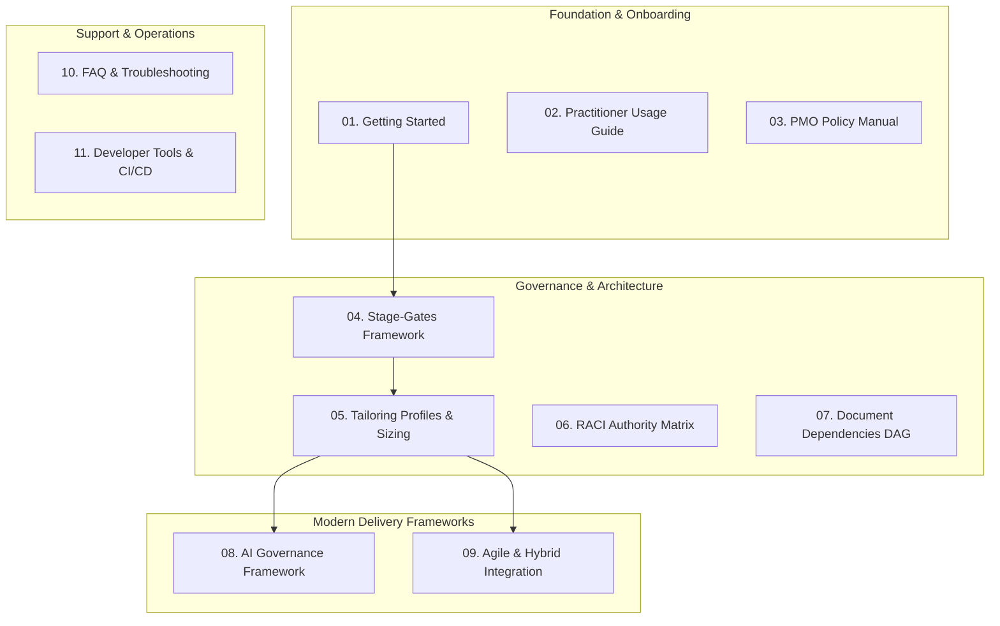

  

# 📚 Tasleemat Knowledge Base & Governance Documentation
**Version:** 2.0  
**Standard Alignment:** PMI PMBOK® 6th, 7th & 8th Editions • NIST AI RMF • SDAIA AI Ethics • ISO 21500  

---

## 🧭 Master Documentation Directory

Welcome to the central documentation portal of **Tasleemat (تسليمات)**. Below is the curated index of practical guides, governance manuals, and integration frameworks designed to empower project practitioners, PMO directors, agile teams, and enterprise auditors.

---

## 📑 Core Documentation Index

| Guide # | Document Title | Language | Description & Key Value |
| :---: | :--- | :---: | :--- |
| **01** | [**Getting Started**](en/01_getting_started.md) | 🇬🇧 EN | Quick-start lifecycle overview, onboarding steps from Day 1 to Day 30. |
| **02** | [**Practitioner Usage Guide**](en/02_usage_guide.md) | 🇬🇧 EN | Field syntax, Markdown conventions, JSON/CSV integration, and authoring guidelines. |
| **03** | [**PMO Policy Manual**](en/03_pmo_policy_manual.md) | 🇬🇧 EN | Enterprise governance mandates, change control thresholds, and audit rules. |
| **04** | [**Stage-Gates Framework**](en/04_stage_gates_and_governance.md) | 🇬🇧 EN | 6 Stage-Gates (Gate 0 to 5), entry/exit criteria, and executive review gates. |
| **05** | [**Tailoring Profiles**](en/05_tailoring_profiles.md) | 🇬🇧 EN | 4 project tiers (Enterprise, Medium, Agile, AI) and deliverable requirements. |
| **06** | [**RACI Authority Matrix**](en/06_raci_authority_matrix.md) | 🇬🇧 EN | Full 102-form governance matrix defining author and approval sign-off roles. |
| **07** | [**Document Dependencies**](en/07_document_dependencies.md) | 🇬🇧 EN | Directed acyclic graph (DAG) mapping upstream inputs to downstream outputs. |
| **08** | [**AI Governance Framework**](en/08_ai_governance_framework.md) | 🇬🇧 EN | AI Canvas, Model Cards, Ethics, NIST AI RMF, and MLOps monitoring. |
| **09** | [**Agile & Hybrid Integration**](en/09_agile_hybrid_integration.md) | 🇬🇧 EN | Mapping forms to Scrum/Kanban ceremonies, Flow metrics, and DoD/DoR. |
| **10** | [**FAQ & Troubleshooting**](en/10_faq_and_troubleshooting.md) | 🇬🇧 EN | 25+ practical answers to governance hurdles, sizing disputes, and EVM issues. |
| **11** | [**Tools & Automation Guide**](en/11_tools_and_automation.md) | 🇬🇧 EN | Python validation suite, CI/CD pipelines, JIRA/Azure DevOps integration. |
| **LEX** | [**Master Lexicon & Catalog**](LEXICON.md) | 🌐 Bi | Master bilingual terminology glossary and cross-reference table. |

---

## 👤 Persona-Based Reading Pathways

* **For Project Managers:** Start with [`01_getting_started.md`](en/01_getting_started.md) $
ightarrow$ [`05_tailoring_profiles.md`](en/05_tailoring_profiles.md) $
ightarrow$ [`02_usage_guide.md`](en/02_usage_guide.md).
* **For PMO Directors & Governance Leads:** Read [`03_pmo_policy_manual.md`](en/03_pmo_policy_manual.md) $
ightarrow$ [`04_stage_gates_and_governance.md`](en/04_stage_gates_and_governance.md) $
ightarrow$ [`06_raci_authority_matrix.md`](en/06_raci_authority_matrix.md).
* **For Scrum Masters & Product Owners:** Focus on [`09_agile_hybrid_integration.md`](en/09_agile_hybrid_integration.md) $
ightarrow$ [`05_tailoring_profiles.md`](en/05_tailoring_profiles.md).
* **For AI Engineers & Tech PMs:** Deep dive into [`08_ai_governance_framework.md`](en/08_ai_governance_framework.md).
* **For DevOps & Tool Admins:** Explore [`11_tools_and_automation.md`](en/11_tools_and_automation.md).
