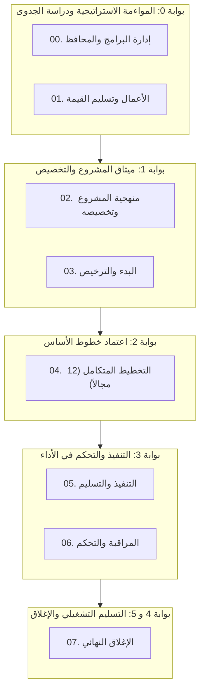

<!--
---
type: Guide
---
-->

  

     معتمد ومطابق لمعايير PMI PMBOK® 6/7/8 و ISO 21500 وهيئة الحكومة الرقمية (DGA)
  

  <h1 class="hero-title">دليل النماذج والتسليمات القياسية الموثقة (102 تسليمة بالعربية)</h1>
  

    منظومة حوكمة وتسليمات متكاملة تغطي دورة حياة المشروع من المحفظة إلى الإغلاق، مهيأة للاستخدام المباشر والأتمتة الذكية والذكاء الاصطناعي مع تناظر ثنائي كامل.
  

  

    <a href="catalog/ar/index.html" class="btn-emerald">🚀 تصفح كتالوج النماذج بالعربية (102 نموذج)</a>
    <a href="forms/ar/form-viewer.html" class="btn-primary">📝 معاينة وتخصيص ميثاق المشروع (FORM-03-01)</a>
    
      $ tasleemat init --lang ar
      📋 نسخ
    
    <a href="https://github.com/fakhruldeen/Tasleemat" class="btn-secondary" target="_blank" rel="noopener noreferrer">🐙 مستودع GitHub ↗</a>
    <a href="index.html" class="btn-lang">🇬🇧 English Portal</a>
  

  

    

      
102

      
نموذج عربي معتمد

    

    

      
204

      
حزمة رقمية متزامنة

    

    

      
8

      
مراحل مؤسسية

    

    

      
6

      
بوابات عبور حوكمية

    

    

      
4

      
مستويات مواءمة (Tiers)

    

    

      
100%

      
مطابقة لمعيار OKF

    

  

---

<h2>🌟 نماذج وتسليمات مميزة جاهزة للمعاينة المباشرة</h2>

  <!-- Card 1: Charter -->
  

    

      FORM-03-01
      🚀 البدء والترخيص
      المستوى 1-3
    

    <h3 class="dash-card-title">ميثاق المشروع المعتمد (Project Charter)</h3>
    

      الوثيقة التأسيسية التي تخول مدير المشروع رسمياً وتحدد نطاق العمل، الأهداف الاستراتيجية، الميزانية المبدئية، وأصحاب المصلحة الرئيسيين وفق متطلبات PMBOK.
    

    

      <a href="forms/ar/form-viewer.html" class="card-btn" style="background:#0d9488;color:#fff!important;">🎯 معاينة النموذج بالعربية</a>
      <a href="catalog/ar/index.html" class="card-btn">📋 تفاصيل النموذج</a>
    

  

  <!-- Card 2: WBS -->
  

    

      FORM-04-03
      📐 التخطيط
      المستوى 2-3
    

    <h3 class="dash-card-title">خطة إدارة النطاق وهيكل تجزئة العمل (WBS)</h3>
    

      تحليل شجري تفكيكي لمخرجات المشروع وحزم العمل، مع قاموس هيكل تجزئة العمل ومصفوفة تتبع المتطلبات لضمان عدم حدوث زحف في النطاق.
    

    

      <a href="catalog/ar/index.html" class="card-btn btn-primary-act">📋 استعراض القالب</a>
    

  

  <!-- Card 3: Risk -->
  

    

      FORM-04-18
      📐 التخطيط
      المستوى 1-4
    

    <h3 class="dash-card-title">سجل المخاطر النوعي والكمي ومصفوفة التأثير</h3>
    

      مصفوفة احتمالية وتأثير متدرجة (5×5) مع خطط الاستجابة للمخاطر (تجنب، تخفيف، نقل، قبول) وحساب الاحتياطي الإداري واحتياطي الطوارئ.
    

    

      <a href="catalog/ar/index.html" class="card-btn btn-primary-act">📋 استعراض القالب</a>
    

  

  <!-- Card 4: EVA -->
  

    

      FORM-06-03
      📊 المراقبة والتحكم
      المستوى 2-3
    

    <h3 class="dash-card-title">تقرير تحليل القيمة المكتسبة (Earned Value - EVA)</h3>
    

      حساب مؤشرات الأداء الأساسية: تباين التكلفة (CV)، تباين الجدول (SV)، مؤشر أداء التكلفة (CPI)، ومؤشر أداء الجدول (SPI) والتنبؤ عند الإنجاز (EAC).
    

    

      <a href="catalog/ar/index.html" class="card-btn btn-primary-act">📋 استعراض القالب</a>
    

  

  <!-- Card 5: AI Model Card -->
  

    

      FORM-02-04
      ⚖️ التخصيص والمواءمة
      المستوى 4 (AI)
    

    <h3 class="dash-card-title">بطاقة نموذج حوكمة الذكاء الاصطناعي (AI Model Card)</h3>
    

      توثيق مؤسسي لنماذج الذكاء الاصطناعي، بيانات التدريب، تقييمات التحيز، حدود الاستخدام، وإجراءات السلامة وفق إطار عمل NIST وسدايا.
    

    

      <a href="catalog/ar/index.html" class="card-btn btn-primary-act">📋 استعراض القالب</a>
    

  

  <!-- Card 6: Handover -->
  

    

      FORM-07-02
      🏁 الإغلاق
      المستوى 1-3
    

    <h3 class="dash-card-title">محضر التسليم والقبول التشغيلي (Operational Handover)</h3>
    

      بروتوكول تحويل مخرجات المشروع رسمياً إلى العمليات التشغيلية (BAU)، توثيق فترات الضمان، وتوقيعات اعتماد راعي المشروع والجهات المستفيدة.
    

    

      <a href="catalog/ar/index.html" class="card-btn btn-primary-act">📋 استعراض القالب</a>
    

  

---

<h2>🧭 مخطط دورة حياة المشروع وبوابات العبور الحوكمية</h2>

---

<h2>🏛️ المراحل الثمانية لدورة حياة المشروع</h2>

  

    

      المرحلة 00
      🏛️
    

    <h3 class="phase-hub-title">إدارة البرامج والمحافظ</h3>
    
المواءمة الاستراتيجية، توازن المحفظة، إدارة الاعتماديات بين المشاريع، وتقييم نضج مكتب PMO (6 مخرجات).

    

      <a class="card-action-link" href="forms/ar/00_إدارة_البرامج_والمحافظ/index.html">📋 القوالب</a>
      <a class="card-action-link" href="guides/ar/00_إدارة_البرامج_والمحافظ/index.html">📖 الأدلة</a>
      <a class="card-action-link" href="examples/ar/00_إدارة_البرامج_والمحافظ/index.html">💡 الأمثلة</a>
    

  

  

    

      المرحلة 01
      💎
    

    <h3 class="phase-hub-title">الأعمال وتسليم القيمة</h3>
    
دراسات الجدوى الاقتصادية، خطط إدارة المنافع، سجلات تحقيق القيمة، وتحليل الفجوات (4 مخرجات).

    

      <a class="card-action-link" href="forms/ar/01_الأعمال_وتسليم_القيمة/index.html">📋 القوالب</a>
      <a class="card-action-link" href="guides/ar/01_الأعمال_وتسليم_القيمة/index.html">📖 الأدلة</a>
      <a class="card-action-link" href="examples/ar/01_الأعمال_وتسليم_القيمة/index.html">💡 الأمثلة</a>
    

  

  

    

      المرحلة 02
      ⚖️
    

    <h3 class="phase-hub-title">منهجية المشروع وتخصيصه</h3>
    
استراتيجية التخصيص، مستويات الحوكمة، أخلاقيات الذكاء الاصطناعي، وبطاقات النماذج (6 مخرجات).

    

      <a class="card-action-link" href="forms/ar/02_منهجية_المشروع_وتخصيصه/index.html">📋 القوالب</a>
      <a class="card-action-link" href="guides/ar/02_منهجية_المشروع_وتخصيصه/index.html">📖 الأدلة</a>
      <a class="card-action-link" href="examples/ar/02_منهجية_المشروع_وتخصيصه/index.html">💡 الأمثلة</a>
    

  

  

    

      المرحلة 03
      🚀
    

    <h3 class="phase-hub-title">البدء والترخيص</h3>
    
الترخيص الرسمي للمشروع، رؤية المنتج، سجل الافتراضات الأولية، وتحديد المعنيين (5 مخرجات).

    

      <a class="card-action-link" href="forms/ar/form-viewer.html" style="background:#0d9488;color:#fff!important;">🎯 معاينة ميثاق المشروع</a>
      <a class="card-action-link" href="forms/ar/03_البدء/index.html">📋 القوالب</a>
      <a class="card-action-link" href="guides/ar/03_البدء/index.html">📖 الأدلة</a>
    

  

  

    

      المرحلة 04
      📐
    

    <h3 class="phase-hub-title">التخطيط المتكامل (12 مجالاً)</h3>
    
الخطوط المرجعية الشاملة للنطاق، الجدول الزمني، التكلفة، الجودة، الموارد، المخاطر، والمشتريات (47 مخرجاً).

    

      <a class="card-action-link" href="forms/ar/04_التخطيط/index.html">📋 القوالب</a>
      <a class="card-action-link" href="guides/ar/04_التخطيط/index.html">📖 الأدلة</a>
      <a class="card-action-link" href="examples/ar/04_التخطيط/index.html">💡 الأمثلة</a>
    

  

  

    

      المرحلة 05
      ⚡
    

    <h3 class="phase-hub-title">التنفيذ والتسليم</h3>
    
توجيه وإدارة أعمال المشروع، سجل القضايا، سجل القرارات، طلبات التغيير، وأداء الفريق (12 مخرجاً).

    

      <a class="card-action-link" href="forms/ar/05_التنفيذ/index.html">📋 القوالب</a>
      <a class="card-action-link" href="guides/ar/05_التنفيذ/index.html">📖 الأدلة</a>
      <a class="card-action-link" href="examples/ar/05_التنفيذ/index.html">💡 الأمثلة</a>
    

  

  

    

      المرحلة 06
      📊
    

    <h3 class="phase-hub-title">المراقبة والتحكم</h3>
    
تقارير الأداء، تحليل القيمة المكتسبة (EVA)، مراقبة التباين، وضمان الجودة واختبارات القبول (12 مخرجاً).

    

      <a class="card-action-link" href="forms/ar/06_المراقبة_والتحكم/index.html">📋 القوالب</a>
      <a class="card-action-link" href="guides/ar/06_المراقبة_والتحكم/index.html">📖 الأدلة</a>
      <a class="card-action-link" href="examples/ar/06_المراقبة_والتحكم/index.html">💡 الأمثلة</a>
    

  

  

    

      المرحلة 07
      🏁
    

    <h3 class="phase-hub-title">الإغلاق والتسليم التشغيلي</h3>
    
الانتقال الرسمي للعمليات التشغيلية، إغلاق العقود، خلاصة الدروس المستفادة، ومراجعة ما بعد التنفيذ (5 مخرجات).

    

      <a class="card-action-link" href="forms/ar/07_الإغلاق/index.html">📋 القوالب</a>
      <a class="card-action-link" href="guides/ar/07_الإغلاق/index.html">📖 الأدلة</a>
      <a class="card-action-link" href="examples/ar/07_الإغلاق/index.html">💡 الأمثلة</a>
    

  

---

<h2>📜 الاعتماد المؤسسي والتوثيق الأكاديمي</h2>

  

    

      معرف الوثيقة: 10.5281/zenodo.23193523
      PMI PMBOK® 6/7/8
      ISO 21500 / 21502
      هيئة الحكومة الرقمية (DGA)
    

    

      <button class="card-btn" onclick="navigator.clipboard.writeText('Fakhruldeen, M. (F.). (2026). Tasleemat: The Enterprise Bilingual (English & Arabic) Project Management Artifact & AI Governance Framework (v2.0.2). Zenodo. https://doi.org/10.5281/zenodo.23193523'); alert('تم نسخ التوثيق بصيغة APA بنجاح!');">📋 نسخ التوثيق (APA)</button>
    

  

  

    إذا تم استخدام تسليمات في عمليات مكتب إدارة المشاريع أو أدلة التدقيق أو الأبحاث الأكاديمية، يرجى الاستشهاد بالمصدر:
  

  <blockquote class="text-xs text-slate-700 bg-slate-50 p-3 rounded border-r-4 border-blue-500 m-0">
    Mohamed (Fouad) Fakhruldeen. (2026). fakhruldeen/Tasleemat: v2.0.2 [Computer software]. Zenodo. <a href="https://doi.org/10.5281/zenodo.23193523" target="_blank">https://doi.org/10.5281/zenodo.23193523</a>
  </blockquote>
  
مرخص بموجب ترخيص <a href="https://github.com/fakhruldeen/Tasleemat/blob/main/LICENSE" target="_blank" class="underline">MIT</a>. مطور بدقة فائقة لدعم قادة المشاريع حول العالم.

