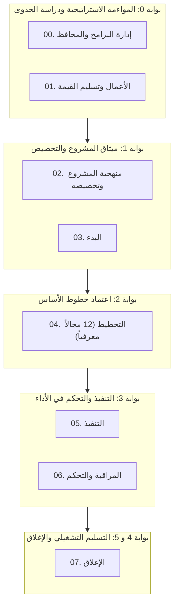

  

     نظام التشغيل الحوكمي لإدارة المشاريع 2.0 • PMI PMBOK® 6/7/8 وأخلاقيات الذكاء الاصطناعي (سدايا)
  

  <h1 class="hero-title">نظام تسليمات لإدارة المشاريع الحوكمية</h1>
  

    المرجع المؤسسي الشامل ثنائي اللغة (عربي/إنجليزي) لمكتب إدارة المشاريع (PMO)، وحزمة المخرجات الإدارية، وحوكمة مشاريع الذكاء الاصطناعي بتناظر رياضي 100% ودون أي قيود أو تبعية تقنية.
  

  

    <a href="catalog/ar/index.html" class="btn-primary">🚀 استكشاف الفهرس الشامل</a>
    <a href="forms/ar/index.html" class="btn-secondary">📋 تصفح القوالب القياسية</a>
    <a href="ar/01_getting_started.html" class="btn-secondary">📚 الأدلة والسياسات</a>
    <a href="https://github.com/fakhruldeen/Tasleemat" class="btn-secondary" target="_blank" rel="noopener noreferrer">🐙 مستودع GitHub ↗</a>
    <a href="index.html" class="btn-lang">🇬🇧 Switch to English Portal</a>
  

  

    

      
102

      
مخرجاً إدارياً ثنائياً

    

    

      
24

      
دليلاً حوكمياً معتمداً

    

    

      
8

      
مراحل لدورة الحياة

    

    

      
4

      
مستويات لتخصيص المشاريع

    

    

      
100%

      
مطابقة لمعيار OKF

    

  

## 🧭 مخطط دورة حياة المشروع وبوابات العبور الحوكمية

---

## 🏛️ تصفح النماذج والمخرجات حسب مراحل دورة الحياة

  

    

      المرحلة 00
      🏛️
    

    <h3 class="phase-hub-title">إدارة البرامج والمحافظ</h3>
    
المواءمة الاستراتيجية، توازن المحفظة، إدارة الاعتماديات بين المشاريع، وتقييم نضج PMO (6 مخرجات).

    

      <a class="card-action-link" href="forms/ar/00_إدارة_البرامج_والمحافظ/index.html">📋 القوالب</a>
      <a class="card-action-link" href="guides/ar/00_إدارة_البرامج_والمحافظ/index.html">📖 الأدلة</a>
      <a class="card-action-link" href="examples/ar/00_إدارة_البرامج_والمحافظ/index.html">💡 الأمثلة</a>
    

  

  

    

      المرحلة 01
      💎
    

    <h3 class="phase-hub-title">الأعمال وتسليم القيمة</h3>
    
دراسات الجدوى الاقتصادية، خطط إدارة المنافع، سجلات تحقيق القيمة، وتحليل الفجوات (4 مخرجات).

    

      <a class="card-action-link" href="forms/ar/01_الأعمال_وتسليم_القيمة/index.html">📋 القوالب</a>
      <a class="card-action-link" href="guides/ar/01_الأعمال_وتسليم_القيمة/index.html">📖 الأدلة</a>
      <a class="card-action-link" href="examples/ar/01_الأعمال_وتسليم_القيمة/index.html">💡 الأمثلة</a>
    

  

  

    

      المرحلة 02
      ⚖️
    

    <h3 class="phase-hub-title">منهجية المشروع وتخصيصه</h3>
    
استراتيجية التخصيص، مستويات الحوكمة، أخلاقيات الذكاء الاصطناعي، وبطاقات النماذج (6 مخرجات).

    

      <a class="card-action-link" href="forms/ar/02_منهجية_المشروع_وتخصيصه/index.html">📋 القوالب</a>
      <a class="card-action-link" href="guides/ar/02_منهجية_المشروع_وتخصيصه/index.html">📖 الأدلة</a>
      <a class="card-action-link" href="examples/ar/02_منهجية_المشروع_وتخصيصه/index.html">💡 الأمثلة</a>
    

  

  

    

      المرحلة 03
      🚀
    

    <h3 class="phase-hub-title">البدء</h3>
    
الترخيص الرسمي للمشروع، رؤية المنتج، سجل الافتراضات الأولية، وتحديد المعنيين (5 مخرجات).

    

      <a class="card-action-link" href="forms/ar/03_البدء/index.html">📋 القوالب</a>
      <a class="card-action-link" href="guides/ar/03_البدء/index.html">📖 الأدلة</a>
      <a class="card-action-link" href="examples/ar/03_البدء/index.html">💡 الأمثلة</a>
    

  

  

    

      المرحلة 04
      📐
    

    <h3 class="phase-hub-title">التخطيط (12 مجالاً معرفياً)</h3>
    
الخطوط المرجعية للنطاق، الجدول الزمني، التكلفة، الجودة، الموارد، المخاطر، والمشتريات (47 مخرجاً).

    

      <a class="card-action-link" href="forms/ar/04_التخطيط/index.html">📋 القوالب</a>
      <a class="card-action-link" href="guides/ar/04_التخطيط/index.html">📖 الأدلة</a>
      <a class="card-action-link" href="examples/ar/04_التخطيط/index.html">💡 الأمثلة</a>
    

  

  

    

      المرحلة 05
      ⚡
    

    <h3 class="phase-hub-title">التنفيذ</h3>
    
توجيه وإدارة أعمال المشروع، سجل القضايا، سجل القرارات، طلبات التغيير، وأداء الفريق (12 مخرجاً).

    

      <a class="card-action-link" href="forms/ar/05_التنفيذ/index.html">📋 القوالب</a>
      <a class="card-action-link" href="guides/ar/05_التنفيذ/index.html">📖 الأدلة</a>
      <a class="card-action-link" href="examples/ar/05_التنفيذ/index.html">💡 الأمثلة</a>
    

  

  

    

      المرحلة 06
      📊
    

    <h3 class="phase-hub-title">المراقبة والتحكم</h3>
    
تقارير الأداء، تحليل القيمة المكتسبة (EVA)، مراقبة التباين، وضمان الجودة واختبارات القبول (12 مخرجاً).

    

      <a class="card-action-link" href="forms/ar/06_المراقبة_والتحكم/index.html">📋 القوالب</a>
      <a class="card-action-link" href="guides/ar/06_المراقبة_والتحكم/index.html">📖 الأدلة</a>
      <a class="card-action-link" href="examples/ar/06_المراقبة_والتحكم/index.html">💡 الأمثلة</a>
    

  

  

    

      المرحلة 07
      🏁
    

    <h3 class="phase-hub-title">الإغلاق</h3>
    
الانتقال الرسمي للعمليات التشغيلية، إغلاق العقود، خلاصة الدروس المستفادة، ومراجعة ما بعد التنفيذ (5 مخرجات).

    

      <a class="card-action-link" href="forms/ar/07_الإغلاق/index.html">📋 القوالب</a>
      <a class="card-action-link" href="guides/ar/07_الإغلاق/index.html">📖 الأدلة</a>
      <a class="card-action-link" href="examples/ar/07_الإغلاق/index.html">💡 الأمثلة</a>
    

  

---

## 📑 جدول الأدلة والوثائق الإرشادية (12 دليلاً حوكمياً)

| رقم الدليل | عنوان الوثيقة | اللغة | الوصف والقيمة التشغيلية |
| :---: | :--- | :---: | :--- |
| **01** | [**دليل البدء السريع**](ar/01_getting_started.md) | 🇸🇦 AR | خطوات الانطلاق في المشروع وإجراءات العمل من اليوم 1 حتى اليوم 30. |
| **02** | [**دليل الممارس الشامل**](ar/02_usage_guide.md) | 🇸🇦 AR | قواعد تحرير النماذج، بناء حقول Markdown، والتكامل مع ملفات JSON و CSV. |
| **03** | [**دليل سياسات PMO**](ar/03_pmo_policy_manual.md) | 🇸🇦 AR | سياسات الحوكمة المؤسسية، إدارة خطوط الأساس، وضوابط التدقيق والامتثال. |
| **04** | [**بوابات العبور والمراجعات**](ar/04_stage_gates_and_governance.md) | 🇸🇦 AR | إطار بوابات العبور الست (بوابة 0 إلى 5)، معايير الدخول والخروج والاعتماد. |
| **05** | [**ملفات التخصيص وتصنيف المشاريع**](ar/05_tailoring_profiles.md) | 🇸🇦 AR | تصنيف المشاريع إلى 4 مستويات وتحديد المخرجات الإلزامية لكل مستوى. |
| **06** | [**مصفوفة الصلاحيات RACI**](ar/06_raci_authority_matrix.md) | 🇸🇦 AR | جدول الصلاحيات والمسؤوليات لكافة الـ 102 نموذج وتحديد سلطات التوقيع. |
| **07** | [**شبكة اعتماديات الوثائق**](ar/07_document_dependencies.md) | 🇸🇦 AR | خريطة تدفق البيانات والاعتماديات السابقة واللاحقة لكافة مخرجات المشروع. |
| **08** | [**إطار حوكمة الذكاء الاصطناعي**](ar/08_ai_governance_framework.md) | 🇸🇦 AR | لوحة الاستخدام، بطاقات النماذج، مواءمة سدايا و NIST ومراقبة MLOps. |
| **09** | [**المنهجيات الرشيقة والهجينة**](ar/09_agile_hybrid_integration.md) | 🇸🇦 AR | مواءمة النماذج مع سكرم وكانبان، مقاييس التدفق، وتعريف الجاهزية والانتهاء. |
| **10** | [**الأسئلة الشائعة وحل المشكلات**](ar/10_faq_and_troubleshooting.md) | 🇸🇦 AR | أكثر من 25 إجابة عملية لحل المشكلات الحوكمية، الخلافات التوثيقية وحسابات EVM. |
| **11** | [**دليل الأدوات والأتمتة**](ar/11_tools_and_automation.md) | 🇸🇦 AR | حزمة الفحص الآلي في بايثون، وخطوط أنابيب CI/CD والربط مع JIRA و DevOps. |
| **12** | [**معيار مؤسسة المعرفة المفتوحة (OKF)**](ar/12_open_knowledge_framework.md) | 🇸🇦 AR | حزم البيانات السلسة (Frictionless Data)، مبادئ FAIR، وملف datapackage.json. |
| **LEX** | [**المعجم الموحد للمصطلحات**](LEXICON.md) | 🌐 ثنائي | المعجم الرسمي المعتمد للمصطلحات الإنجليزية والعربية وفهرس النماذج. |

---

## 👤 مسارات القراءة الموصى بها بحسب الدور الوظيفي

* **لمديري المشاريع:** ابدأ بـ [`01_getting_started.md`](ar/01_getting_started.md) → [`05_tailoring_profiles.md`](ar/05_tailoring_profiles.md) → [`02_usage_guide.md`](ar/02_usage_guide.md) → [مكتبة القوالب](forms/ar/index.md).
* **لمدراء مكاتب إدارة المشاريع (PMO):** راجع [`03_pmo_policy_manual.md`](ar/03_pmo_policy_manual.md) → [`04_stage_gates_and_governance.md`](ar/04_stage_gates_and_governance.md) → [`06_raci_authority_matrix.md`](ar/06_raci_authority_matrix.md).
* **لقادة سكرم والتحول الرشيق:** ركز على [`09_agile_hybrid_integration.md`](ar/09_agile_hybrid_integration.md) → [`05_tailoring_profiles.md`](ar/05_tailoring_profiles.md) → [سجلات سكرم والمراجعات](forms/ar/05_التنفيذ/index.md).
* **لمدراء مشاريع الذكاء الاصطناعي:** تعمق في [`08_ai_governance_framework.md`](ar/08_ai_governance_framework.md) → [قوالب حوكمة الذكاء الاصطناعي](forms/ar/02_منهجية_المشروع_وتخصيصه/index.md).
* **لمسؤولي الأنظمة والأتمتة:** استكشف [`11_tools_and_automation.md`](ar/11_tools_and_automation.md) → [`12_open_knowledge_framework.md`](ar/12_open_knowledge_framework.md).
