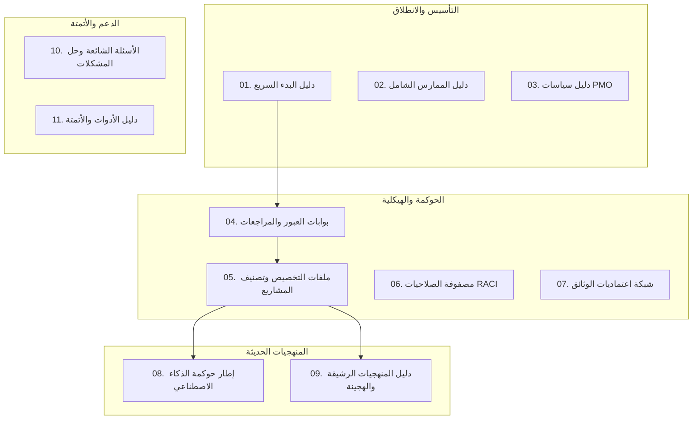

  

# 📚 البوابة التوثيقية وقاعدة المعرفة لنظام «تسليمات»
**الإصدار:** 2.0  
**التوافق مع المعايير:** معهد إدارة المشاريع PMI PMBOK® الإصدارات 6 و 7 و 8 • أخلاقيات الذكاء الاصطناعي (سدايا) • NIST AI RMF • ISO 21500  

---

## 🧭 الفهرس التوثيقي الشامل

أهلاً بك في البوابة التوثيقية الرسمية لنظام **«تسليمات»**. تجد أدناه دليلاً متكاملاً يضم السياسات الحوكمية، والأدلة الإرشادية للممارسين، وأطر العمل الحديثة لإدارة المشاريع الرشيقة ومشاريع الذكاء الاصطناعي.

---

## 📑 جدول الأدلة والوثائق الإرشادية

| رقم الدليل | عنوان الوثيقة | اللغة | الوصف والقيمة التشغيلية |
| :---: | :--- | :---: | :--- |
| **01** | [**دليل البدء السريع**](ar/01_getting_started.md) | 🇸🇦 AR | خطوات الانطلاق في المشروع وإجراءات العمل من اليوم 1 حتى اليوم 30. |
| **02** | [**دليل الممارس الشامل**](ar/02_usage_guide.md) | 🇸🇦 AR | قواعد تحرير النماذج، بناء حقول Markdown، والتكامل مع ملفات JSON و CSV. |
| **03** | [**دليل سياسات PMO**](ar/03_pmo_policy_manual.md) | 🇸🇦 AR | سياسات الحوكمة المؤسسية، إدارة خطوط الأساس، وضوابط التدقيق والامتثال. |
| **04** | [**بوابات العبور والمراجعات**](ar/04_stage_gates_and_governance.md) | 🇸🇦 AR | إطار بوابات العبور الست (بوابة 0 إلى 5)، معايير الدخول والخروج والاعتماد. |
| **05** | [**ملفات التخصيص وتصنيف المشاريع**](ar/05_tailoring_profiles.md) | 🇸🇦 AR | تصنيف المشاريع إلى 4 مستويات وتحديد المخرجات الإلزامية لكل مستوى. |
| **06** | [**مصفوفة الصلاحيات RACI**](ar/06_raci_authority_matrix.md) | 🇸🇦 AR | جدول الصلاحيات والمسؤوليات لكافة الـ 102 نموذج وتحديد سلطات التوقيع. |
| **07** | [**شبكة اعتماديات الوثائق**](ar/07_document_dependencies.md) | 🇸🇦 AR | خريطة تدفق البيانات والاعتماديات السابقة واللاحقة لكافة مخرجات المشروع. |
| **08** | [**إطار حوكمة الذكاء الاصطناعي**](ar/08_ai_governance_framework.md) | 🇸🇦 AR | لوحة الاستخدام، بطاقات النماذج، مواءمة سدايا و NIST ومراقبة MLOps. |
| **09** | [**المنهجيات الرشيقة والهجينة**](ar/09_agile_hybrid_integration.md) | 🇸🇦 AR | مواءمة النماذج مع سكرم وكانبان، مقاييس التدفق، وتعريف الجاهزية والانتهاء. |
| **10** | [**الأسئلة الشائعة وحل المشكلات**](ar/10_faq_and_troubleshooting.md) | 🇸🇦 AR | أكثر من 25 إجابة عملية لحل المشكلات الحوكمية، الخلافات التوثيقية وحسابات EVM. |
| **11** | [**دليل الأدوات والأتمتة**](ar/11_tools_and_automation.md) | 🇸🇦 AR | حزمة الفحص الآلي في بايثون، وخطوط أنابيب CI/CD والربط مع JIRA و DevOps. |
| **12** | [**معيار مؤسسة المعرفة المفتوحة (OKF)**](ar/12_open_knowledge_framework.md) | 🇸🇦 AR | حزم البيانات السلسة (Frictionless Data)، مبادئ FAIR، وملف datapackage.json. |
| **LEX** | [**المعجم الموحد للمصطلحات**](LEXICON.md) | 🌐 ثنائي | المعجم الرسمي المعتمد للمصطلحات الإنجليزية والعربية وفهرس النماذج. |

---

## 👤 مسارات القراءة الموصى بها بحسب الدور الوظيفي

* **لمديري المشاريع:** ابدأ بـ [`01_getting_started.md`](ar/01_getting_started.md) $
ightarrow$ [`05_tailoring_profiles.md`](ar/05_tailoring_profiles.md) $
ightarrow$ [`02_usage_guide.md`](ar/02_usage_guide.md).
* **لمدراء مكاتب إدارة المشاريع (PMO):** راجع [`03_pmo_policy_manual.md`](ar/03_pmo_policy_manual.md) $
ightarrow$ [`04_stage_gates_and_governance.md`](ar/04_stage_gates_and_governance.md) $
ightarrow$ [`06_raci_authority_matrix.md`](ar/06_raci_authority_matrix.md).
* **لقادة سكرم والتحول الرشيق:** ركز على [`09_agile_hybrid_integration.md`](ar/09_agile_hybrid_integration.md) $
ightarrow$ [`05_tailoring_profiles.md`](ar/05_tailoring_profiles.md).
* **لمدراء مشاريع الذكاء الاصطناعي:** تعمق في [`08_ai_governance_framework.md`](ar/08_ai_governance_framework.md).
* **لمسؤولي الأنظمة والأتمتة:** استكشف [`11_tools_and_automation.md`](ar/11_tools_and_automation.md).
