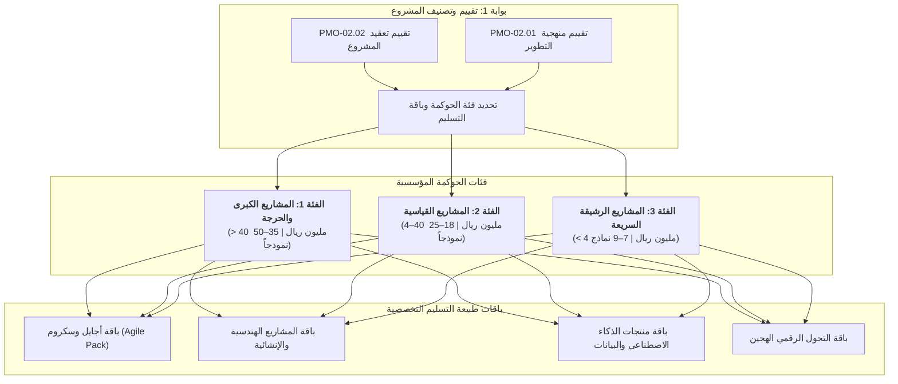

  🌐 <strong>اللغة:</strong> الدليل باللغة العربية
  

    <a class="lang-switch-btn github-btn" href="https://github.com/fakhruldeen/Tasleemat/blob/main/docs/ar/05_tailoring_profiles.md" target="_blank" rel="noopener noreferrer">🐙 عرض على GitHub ↗</a>
    <a class="lang-switch-btn" href="../en/05_tailoring_profiles.html">🇬🇧 Switch to English Version (النسخة الإنجليزية) ←</a>
  

  

# ⚖️ دليل تصنيف المشاريع ومسارات التخصيص الرشيق في تسليمات
**مرجع الوثيقة:** `TASLEEMAT-TAILORING-PROFILES-AR-v2.0`  
**المعيار:** متوافق بالكامل مع معايير معهد إدارة المشاريع العالمي PMI PMBOK® الإصدارات السادس والسابع والجاهزية للإصدار الثامن  

---

## 🎯 نظرة عامة تنفيذية

لتفادي البيروقراطية الإدارية الزائدة في المبادرات الصغيرة، وضمان أقصى درجات الانضباط والحوكمة في الاستثمارات والمشاريع الاستراتيجية الكبرى، يقدم **إطار تسليمات للتصنيف والتخصيص (Tailoring Framework)** معياراً لقياس حجم المشاريع عبر **3 فئات حوكمية (Governance Tiers)** و**4 باقات متخصصة حسب طبيعة التسليم (Methodology Archetype Packs)**.

يقوم مدير المشروع ومدير مكتب إدارة المشاريع (PMO) باستخدام **نموذج تقييم تعقيد المشروع (`PMO-02.02`)** و**تقييم منهجية التطوير ودورة الحياة (`PMO-02.01`)** عند البوابة 1 لاختيار الحد الأدنى الإلزامي من النماذج لكل مشروع.

---

## 🏛️ فئات الحوكمة الثلاث للمشاريع (Project Tiers)

### 🔴 الفئة الأولى (أ): المشاريع الاستراتيجية والكبرى (Tier 1: Mega / High-Complexity)
* **معايير التصنيف:**
  * **الميزانية:** $> 40\text{ مليون ريال سعودي}$ (أو $> \$10\text{M}$).
  * **المدة الزمنية:** $> 12\text{ شهراً}$.
  * **درجة التعقيد:** تأثير تنظيمي وتشريعي واسع، اعتماديات متبادلة مع جهات متعددة، تعاقدات مع مقاولين واستشاريين دوليين، وظهور إعلامي ومجتمعي عالٍ.
* **دورية الحوكمة:** لجنة توجيهية تنفيذية شهرية، بوابات عبور مرحلية نصف شهرية مع PMO، واجتماعات أسبوعية لفرق العمل.
* **نطاق النماذج:** **35–50 نموذجاً معتمداً**.
* **باقة النماذج الإلزامية:**
  * **مرحلة البدء:** `PMO-00.06`, `PMO-01.01`, `PMO-01.02`, `PMO-03.01`, `PMO-03.04`, `PMO-03.05`, `PMO-03.03`.
  * **مرحلة التخطيط:** خطة إدارة المشروع المتكاملة (`PMO-04.01.01`)، بيان النطاق وهيكل WBS (`PMO-04.02.05`/`06`)، خط الأساس للجدول الزمني والمسار الحرج (`PMO-04.03.07`)، خط الأساس للتكلفة والاحتياطيات (`PMO-04.04.04`)، خطة الجودة (`PMO-04.05.01`)، مصفوفة RACI (`PMO-04.06.04`)، خطة التواصل (`PMO-04.07.01`)، سجل ونمذجة المخاطر الكمية (`PMO-04.08.02`/`04`/`07`)، استراتيجية المشتريات وبيان العمل SOW (`PMO-04.09.02`/`04`)، خطة إشراك المعنيين (`PMO-04.10.01`)، خطة إدارة التغيير المؤسسي OCM (`PMO-04.11.01`)، خطة الاستدامة والمعايير البيئية والاجتماعية والحوكمة ESG (`PMO-04.12.01`).
  * **مرحلة التنفيذ والتحكم:** تقارير حالة المشروع التنفيذية (`PMO-06.01`)، تحليل القيمة المكتسبة EVM (`PMO-06.05`)، سجل المشكلات (`PMO-05.01`)، سجل القرارات (`PMO-05.02`)، سجل التحكم بالتغيير (`PMO-05.04`)، تدقيق الجودة والمشتريات (`PMO-05.05`/`PMO-06.07`)، بطاقات تقييم أداء الموردين (`PMO-06.09`).
  * **مرحلة الإغلاق:** القبول الرسمي للمخرجات (`PMO-06.08`)، اعتماد اختبارات UAT (`PMO-06.10`)، قائمة التحقق للتسليم التشغيلي (`PMO-07.04`)، إغلاق العقود (`PMO-07.02`)، وثيقة إغلاق المشروع (`PMO-07.03`)، ملخص الدروس المستفادة (`PMO-07.01`)، مراجعة ما بعد التنفيذ PIR (`PMO-07.05`)، وتحديث خطة المنافع (`PMO-01.03`).

---

### 🟡 الفئة الثانية (ب): المشاريع المتوسطة والقياسية (Tier 2: Standard Enterprise)
* **معايير التصنيف:**
  * **الميزانية:** $4 - 40\text{ مليون ريال سعودي}$ (أو $\$1\text{M} - \$10\text{M}$).
  * **المدة الزمنية:** $3 - 12\text{ شهراً}$.
  * **درجة التعقيد:** مشاريع تحول رقمي مؤسسي، تطوير أنظمة داخلية، وملف مخاطر متوسط.
* **دورية الحوكمة:** اجتماعات نصف شهرية مع راعي المشروع، ومراجعات صحة شهرية مع PMO.
* **نطاق النماذج:** **18–25 نموذجاً معتمداً**.
* **باقة النماذج الإلزامية:**
  * **مرحلة البدء:** `PMO-01.01`, `PMO-03.01`, `PMO-03.04`, `PMO-03.03`, `PMO-02.01`.
  * **مرحلة التخطيط:** خطة إدارة المشروع (`PMO-04.01.01`)، هيكل تجزئة العمل WBS (`PMO-04.02.06`)، خط الأساس للجدول الزمني (`PMO-04.03.07`)، خط الأساس للتكلفة (`PMO-04.04.04`)، مصفوفة RACI (`PMO-04.06.04`)، سجل المخاطر (`PMO-04.08.02`)، ومصفوفة التواصل (`PMO-04.07.01`).
  * **مرحلة التنفيذ والتحكم:** تقرير حالة المشروع (`PMO-06.01`)، سجل المشكلات (`PMO-05.01`)، سجل القرارات (`PMO-05.02`)، سجل وطلبات التغيير (`PMO-05.04`/`03`)، وتحليل التباين (`PMO-06.04`).
  * **مرحلة الإغلاق:** اعتماد اختبارات UAT (`PMO-06.10`)، قبول المخرجات (`PMO-06.08`)، قائمة التسليم للعمليات (`PMO-07.04`)، وثيقة الإغلاق (`PMO-07.03`)، والدروس المستفادة (`PMO-07.01`).

---

### 🟢 الفئة الثالثة (ج): المشاريع السريعة والخفيفة (Tier 3: Lean / Fast-Track)
* **معايير التصنيف:**
  * **الميزانية:** $< 4\text{ ملايين ريال سعودي}$ (أو $< \$1\text{M}$).
  * **المدة الزمنية:** $< 3\text{ أشهر}$.
  * **درجة التعقيد:** مخاطر فنية منخفضة، فريق عمل مدمج ومباشر ($< 8$ أفراد)، وتأثير تنظيمي محدود.
* **دورية الحوكمة:** وقفات عمل أسبوعية (Standups)، واعتماد مباشر للمعالم مع راعي المشروع.
* **نطاق النماذج:** **7–9 نماذج أساسية فقط (أقصى درجات الرشاقة)**.
* **باقة النماذج الإلزامية:**
  1. `PMO-03.01` **ميثاق المشروع الخفيف (Lean Charter):** ملخص الأهداف، الجدول الزمني، الميزانية، وبيان نطاق موجز في صفحة واحدة.
  2. `PMO-04.02.08` **قائمة تراكم المنتج / قائمة الأنشطة (`PMO-04.03.02`):** قائمة مرتبة حسب الأولوية للمهام والمخرجات.
  3. `PMO-04.08.02` **سجل المخاطر المبسط:** أبرز 5 مخاطر وخطط التخفيف الفورية.
  4. `PMO-05.01` **سجل المشكلات والقرارات المدمج (`PMO-05.02`):** متابعة تشغيلية مباشرة للعوائق والقرارات.
  5. `PMO-06.01` **تقرير حالة المشروع الموجز (One-Pager):** تقرير حالة نصف شهري موجز للراعي.
  6. `PMO-06.08` **نموذج قبول المخرجات:** التوقيع الرسمي على استلام المنتج النهائي.
  7. `PMO-07.04` **قائمة التحقق للتسليم والتحول للعمليات:** التأكد من الجاهزية التشغيلية.
  8. `PMO-07.03` **ملخص إغلاق المشروع والدروس المستفادة:** توثيق الإغلاق وأهم الملاحظات.

---

## 📦 باقات طبيعة التسليم التخصصية (Archetype Packs)

تُضاف هذه الباقات التخصصية إلى فئة الحوكمة المحددة بحسب طبيعة المنتج والمجال:

### 1. 🏃 باقة أجايل وسكروم (Agile & Scrum Pack)
* **المجالات:** البرمجيات، التطبيقات الذكية، إطلاق المنتجات الأولية MVP، الحلول الرقمية التكرارية.
* **النماذج التخصصية:**
  * `PMO-03.02` وثيقة رؤية المنتج
  * `PMO-04.02.08` قائمة تراكم المنتج (Product Backlog)
  * `PMO-04.02.09` مصفوفة خريطة قصص المستخدم (User Story Mapping)
  * `PMO-04.03.10` سجل تخطيط السبرنت (Sprint Planning Log)
  * `PMO-04.05.03` تعريف الجاهزية والإنجاز (DoR / DoD)
  * `PMO-04.06.05` ميثاق الفريق واتفاقيات العمل
  * `PMO-05.08` مراجعة السبرنت بأثر رجعي (Sprint Retrospective)
  * `PMO-05.10` سجل العوائق (Impediment Log)
  * `PMO-06.12` مقاييس التدفق الرشيق ومخطط التدفق التراكمي (CFD)

---

### 2. 🏗️ باقة المشاريع التنبؤية والهندسية (Predictive / EPC Pack)
* **المجالات:** الإنشاءات، الهندسة المدنية، البنية التحتية، المشتريات والتجهيزات الصناعية.
* **النماذج التخصصية:**
  * `PMO-04.02.05` بيان نطاق المشروع التفصيلي
  * `PMO-04.02.06` هيكل تجزئة العمل وقاموسه (WBS & Dictionary)
  * `PMO-04.03.05` مخطط شبكة الجدول الزمني وطريقة المسار الحرج (CPM)
  * `PMO-04.04.04` خط الأساس للتكلفة ومنحنى التدفقات النقدية (S-Curve)
  * `PMO-04.09.02` استراتيجية المشتريات وحزم كراسات الشروط (RFP)
  * `PMO-04.09.04` نطاق العمل التفصيلي (SOW)
  * `PMO-05.05` سجل تدقيق الجودة الميداني
  * `PMO-06.05` تحليل القيمة المكتسبة (EVM Report)
  * `PMO-07.02` تقرير المخالصة والإغلاق التعاقدي

---

### 3. 🤖 باقة منتجات الذكاء الاصطناعي والبيانات (AI & Data Product Pack)
* **المجالات:** نماذج تعلم الآلة، حلول الذكاء الاصطناعي التوليدي LLM، بحيرات ومنصات البيانات الضخمة.
* **النماذج التخصصية:**
  * `PMO-02.04` بطاقة حالة استخدام الذكاء الاصطناعي (AI Canvas)
  * `PMO-02.03` قائمة التحقق لأخلاقيات وحوكمة الذكاء الاصطناعي
  * `PMO-02.06` تقييم خصوصية البيانات وأخلاقياتها
  * `PMO-02.05` بطاقة نموذج الذكاء الاصطناعي (Model Card & Fact Sheet)
  * `PMO-05.09` سجل مكتبة الأوامر وهندسة التلقين (Prompt Library)
  * `PMO-06.10` اعتماد اختبارات قبول نماذج الذكاء الاصطناعي والتحقق من دقتها

---

### 4. 🌐 باقة التحول الرقمي الهجين (Hybrid Delivery Pack)
* **المجالات:** أنظمة تخطيط الموارد ERP، الأنظمة المصرفية، مبادرات التحول الرقمي الحكومي الكبرى.
* **النماذج التخصصية:** دمج بوابات العبور التنبؤية (0–2 و 4–5) مع دورات تنفيذ أجايل التكرارية في البوابة 3.

---

## 📊 جدول المقارنة وتخصيص الفئات

| معيار المشروع | الفئة 1 (الكبرى) | الفئة 2 (القياسية) | الفئة 3 (الخفيفة) |
| :--- | :---: | :---: | :---: |
| **الميزانية** | $> 40\text{ مليون ريال}$ | $4 - 40\text{ مليون ريال}$ | $< 4\text{ ملايين ريال}$ |
| **المدة** | $> 12\text{ شهراً}$ | $3 - 12\text{ شهراً}$ | $< 3\text{ أشهر}$ |
| **حجم حزمة النماذج** | 35–50 نموذجاً | 18–25 نموذجاً | 7–9 نماذج |
| **اللجنة التوجيهية** | إلزامية (شهرياً) | اختيارية / حسب الحاجة | غير مطلوبة (مباشر مع الراعي) |
| **تحليل القيمة المكتسبة (EVM)** | إلزامي (`PMO-06.05`) | موصى به | اختياري / تحليل التباين فقط |
| **إدارة المخاطر** | نمذجة كمية وسجل شامل | سجل مخاطر قياسي | قائمة بأبرز 5 مخاطر |
| **مجلس التحكم بالتغيير (CCB)** | مجلس رسمي معتمد | موافقة الراعي المباشرة | موافقة شفهية وتوثيق بالسجل |