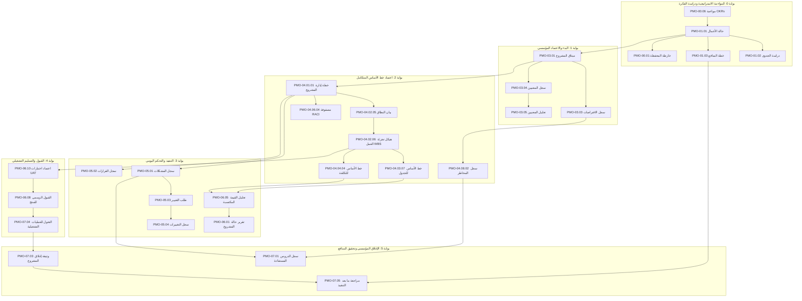

  🌐 <strong>اللغة:</strong> الدليل باللغة العربية
  <a class="lang-switch-btn" href="../en/07_document_dependencies.html">🇬🇧 Switch to English Version (النسخة الإنجليزية) ←</a>

  

# 🔗 شبكة اعتماديات الوثائق وهندسة دورة الحياة في تسليمات
**مرجع الوثيقة:** `TASLEEMAT-DOC-DEPENDENCIES-AR-v2.0`  
**المعيار:** متوافق مع معايير معهد إدارة المشاريع العالمي PMI PMBOK® الإصدارات 6 و 7 و 8  

---

## 🎯 نظرة عامة تنفيذية

في **نظام تشغيل مكاتب إدارة المشاريع «تسليمات»**، لا توجد وثيقة معزولة. تعمل كل استمارة كعقدة مترابطة في **شبكة اعتماديات موجهة (DAG)** تربط المدخلات الاستراتيجية، وخطوط الأساس المعتمدة، وسجلات المتابعة التشغيلية، وتقارير الرقابة والتحكم، حتى أصول الإغلاق المؤسسي.

---

## 📋 جدول مصفوفة الاعتماديات الشاملة

| رمز النموذج | اسم الوثيقة | المرحلة / بوابة العبور | المدخلات المباشرة (الوثائق السابقة) | المخرجات المباشرة (الوثائق اللاحقة) |
| :--- | :--- | :--- | :--- | :--- |
| **`PMO-00.01`** | خارطة طريق المحفظة | بوابة 0: المواءمة الاستراتيجية والمحفظة | `PMO-00.06 مواءمة الأهداف والنتائج الرئيسية`, `PMO-01.01 حالة الأعمال` | `PMO-00.02 ميثاق البرنامج`, `PMO-03.01 ميثاق المشروع`, `PMO-00.04 مصفوفة سعة الموارد` |
| **`PMO-00.02`** | ميثاق البرنامج | بوابة 0: المواءمة الاستراتيجية والمحفظة | `PMO-00.01 خارطة طريق المحفظة`, `PMO-01.01 حالة الأعمال` | `PMO-00.03 سجل الاعتماديات المتبادلة`, `PMO-03.01 ميثاق المشروع` |
| **`PMO-00.03`** | سجل الاعتماديات المتبادلة | حوكمة مستمرة عبر دورة حياة البرنامج | `PMO-00.02 ميثاق البرنامج`, `PMO-04.03.08 الجدول الزمني للمشروع` | `PMO-04.08.02 سجل المخاطر`, `PMO-06.01 تقرير حالة المشروع` |
| **`PMO-00.04`** | مصفوفة سعة الموارد | بوابة 0 وتخطيط المحفظة المستمر | `PMO-00.01 خارطة طريق المحفظة`, `PMO-04.06.02 متطلبات الموارد` | `PMO-04.06.01 خطة إدارة الموارد`, `PMO-04.03.08 الجدول الزمني للمشروع` |
| **`PMO-00.05`** | تقييم نضج مكتب إدارة المشاريع | المراجعة الاستراتيجية السنوية/نصف السنوية لـ PMO | `التكليف الاستراتيجي المؤسسي` | `PMO-02.01 إطار التخصيص`, `دليل سياسات وإجراءات PMO` |
| **`PMO-00.06`** | مصفوفة مواءمة الأهداف والنتائج الرئيسية (OKRs) | بوابة 0: المواءمة الاستراتيجية | `الأهداف الاستراتيجية المؤسسية / مستهدفات الرؤية` | `PMO-00.01 خارطة طريق المحفظة`, `PMO-01.01 حالة الأعمال` |
| **`PMO-01.01`** | حالة الأعمال ودراسة الجدوى الاقتصادية | بوابة 0: التبرير والتمويل | `PMO-00.06 مواءمة OKRs`, `PMO-01.04 نموذج القيمة المقترحة` | `PMO-01.02 دراسة الجدوى`, `PMO-01.03 خطة تحقيق المنافع`, `PMO-03.01 ميثاق المشروع` |
| **`PMO-01.02`** | دراسة الجدوى الشاملة | بوابة 0: التبرير والتمويل | `PMO-01.01 حالة الأعمال` | `PMO-03.01 ميثاق المشروع` |
| **`PMO-01.03`** | خطة تحقيق ومتابعة المنافع | بوابة 0 حتى بوابة 5 (طوال دورة الحياة) | `PMO-01.01 حالة الأعمال` | `PMO-07.05 مراجعة ما بعد التنفيذ` |
| **`PMO-01.04`** | نموذج القيمة المقترحة (Canvas) | بوابة 0: تعريف المنتج والخدمة | `أبحاث السوق / تحليل احتياجات المستخدمين` | `PMO-01.01 حالة الأعمال`, `PMO-03.02 رؤية المنتج` |
| **`PMO-02.01`** | تقييم منهجية التطوير ودورة الحياة | بوابة 1: البدء والاعتماد | `PMO-01.01 حالة الأعمال`, `PMO-02.02 نموذج تقييم التعقيد` | `PMO-03.01 ميثاق المشروع`, `PMO-04.01.01 خطة إدارة المشروع` |
| **`PMO-02.02`** | نموذج تقييم تعقيد المشروع | بوابة 1: البدء وتحديد فئة المشروع | `PMO-01.01 حالة الأعمال` | `PMO-02.01 منهجية التطوير`, `تحديد فئة حوكمة المشروع (Tier)` |
| **`PMO-02.03`** | قائمة التحقق لأخلاقيات وحوكمة الذكاء الاصطناعي | بوابة 1 والتحقق المستمر من الذكاء الاصطناعي | `PMO-02.04 بطاقة حالة استخدام الذكاء الاصطناعي` | `PMO-04.08.02 سجل المخاطر (مخاطر الذكاء الاصطناعي)` |
| **`PMO-02.04`** | بطاقة حالة استخدام الذكاء الاصطناعي (AI Canvas) | بوابة 0 / بوابة 1: تحديد نطاق الذكاء الاصطناعي | `PMO-01.01 حالة الأعمال` | `PMO-02.03 قائمة أخلاقيات الذكاء الاصطناعي`, `PMO-03.01 ميثاق المشروع` |
| **`PMO-02.05`** | مصفوفة الحوكمة والامتثال التنظيمي | بوابة 1 وبوابة 2: خط الأساس للتخطيط | `PMO-03.01 ميثاق المشروع` | `PMO-04.05.01 خطة الجودة`, `PMO-06.07 تدقيق الامتثال` |
| **`PMO-03.01`** | ميثاق المشروع المعتمد | بوابة 1: التفويض الرسمي للمشروع | `PMO-01.01 حالة الأعمال`, `PMO-02.01 منهجية التطوير` | `PMO-03.03 سجل الافتراضات`, `PMO-03.04 سجل المعنيين`, `PMO-04.01.01 خطة إدارة المشروع` |
| **`PMO-03.02`** | وثيقة رؤية المنتج | بوابة 1: بدء المنتجات والمنهجيات الرشيقة | `PMO-01.04 نموذج القيمة المقترحة` | `PMO-04.02.08 تراكم المنتج`, `PMO-04.02.09 خريطة قصص المستخدم` |
| **`PMO-03.03`** | سجل الافتراضات والقيود | بوابة 1 والتخطيط المستمر | `PMO-03.01 ميثاق المشروع`, `PMO-01.01 حالة الأعمال` | `PMO-04.08.02 سجل المخاطر`, `PMO-04.02.05 بيان نطاق المشروع` |
| **`PMO-03.04`** | سجل المعنيين بالمشروع | بوابة 1 وإدارة المعنيين المستمرة | `PMO-03.01 ميثاق المشروع` | `PMO-03.05 تحليل المعنيين`, `PMO-04.10.01 خطة إشراك المعنيين`, `PMO-04.07.01 خطة إدارة التواصل` |
| **`PMO-03.05`** | تحليل ومصفوفة المعنيين (القوة والاهتمام) | بوابة 1 وبوابة 2: التخطيط | `PMO-03.04 سجل المعنيين` | `PMO-04.10.01 خطة إشراك المعنيين` |
