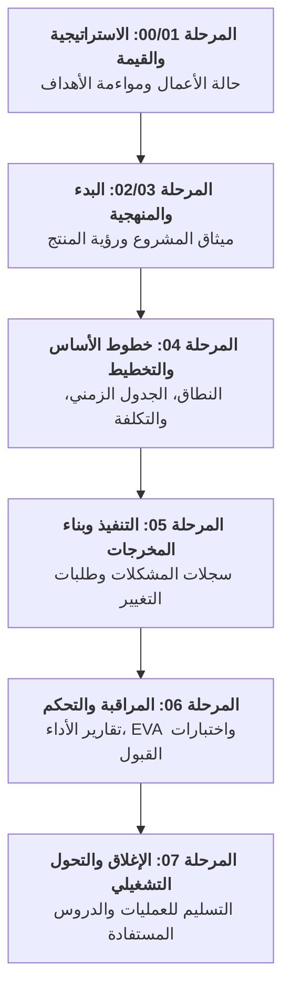

  🌐 <strong>اللغة:</strong> الدليل باللغة العربية
  

    <a class="lang-switch-btn github-btn" href="https://github.com/fakhruldeen/Tasleemat/blob/main/docs/ar/07_document_dependencies.md" target="_blank" rel="noopener noreferrer">🐙 عرض على GitHub ↗</a>
    <a class="lang-switch-btn" href="../en/07_document_dependencies.html">🇬🇧 Switch to English Version (النسخة الإنجليزية) ←</a>
  

  

# 🔗 شبكة اعتماديات الوثائق وهندسة دورة الحياة في تسليمات
**مرجع الوثيقة:** `TASLEEMAT-DOC-DEPENDENCIES-AR-v2.0`  
**المعايير:** متوافق مع معايير معهد إدارة المشاريع العالمي PMI PMBOK®

---

## 🎯 نظرة عامة تنفيذية

في **نظام تشغيل مكاتب إدارة المشاريع «تسليمات»**، لا توجد وثيقة معزولة. تعمل كل استمارة كعقدة مترابطة في **شبكة اعتماديات موجهة (DAG)** تربط المدخلات الاستراتيجية، وخطوط الأساس المعتمدة، وسجلات المتابعة التشغيلية، وتقارير الرقابة والتحكم، حتى أصول الإغلاق المؤسسي:

---

## 📋 جدول مصفوفة الاعتماديات الشاملة لكافة النماذج الـ 102

| الرمز | اسم المخرج الإداري | المرحلة / بوابة العبور | المدخلات المباشرة (Predecessors) | المخرجات المباشرة (Successors) |
| :---: | :--- | :--- | :--- | :--- |
| **`PMO-00.01`** | خارطة طريق المحفظة | بوابة الحوكمة العامة | `PMO-06.08 قبول المنتج`، `PMO-06.10 اعتماد اختبارات UAT` | `PMO-07.04 التحول للعمليات`، `PMO-07.05 مراجعة ما بعد التنفيذ` |
| **`PMO-00.02`** | ميثاق البرنامج | بوابة الحوكمة العامة | `PMO-06.08 قبول المنتج`، `PMO-06.10 اعتماد اختبارات UAT` | `PMO-07.04 التحول للعمليات`، `PMO-07.05 مراجعة ما بعد التنفيذ` |
| **`PMO-00.03`** | سجل الاعتماديات المتبادلة | بوابة الحوكمة العامة | `PMO-06.08 قبول المنتج`، `PMO-06.10 اعتماد اختبارات UAT` | `PMO-07.04 التحول للعمليات`، `PMO-07.05 مراجعة ما بعد التنفيذ` |
| **`PMO-00.04`** | مصفوفة سعة الموارد | بوابة الحوكمة العامة | `PMO-06.08 قبول المنتج`، `PMO-06.10 اعتماد اختبارات UAT` | `PMO-07.04 التحول للعمليات`، `PMO-07.05 مراجعة ما بعد التنفيذ` |
| **`PMO-00.05`** | تقييم نضج مكتب إدارة المشاريع | بوابة الحوكمة العامة | `PMO-06.08 قبول المنتج`، `PMO-06.10 اعتماد اختبارات UAT` | `PMO-07.04 التحول للعمليات`، `PMO-07.05 مراجعة ما بعد التنفيذ` |
| **`PMO-00.06`** | مصفوفة مواءمة الأهداف والنتائج الرئيسية | بوابة الحوكمة العامة | `PMO-06.08 قبول المنتج`، `PMO-06.10 اعتماد اختبارات UAT` | `PMO-07.04 التحول للعمليات`، `PMO-07.05 مراجعة ما بعد التنفيذ` |
| **`PMO-01.01`** | دراسة الجدوى (Business Case) | بوابة الحوكمة العامة | `PMO-06.08 قبول المنتج`، `PMO-06.10 اعتماد اختبارات UAT` | `PMO-07.04 التحول للعمليات`، `PMO-07.05 مراجعة ما بعد التنفيذ` |
| **`PMO-01.02`** | خطة إدارة الفوائد | بوابة الحوكمة العامة | `PMO-06.08 قبول المنتج`، `PMO-06.10 اعتماد اختبارات UAT` | `PMO-07.04 التحول للعمليات`، `PMO-07.05 مراجعة ما بعد التنفيذ` |
| **`PMO-01.03`** | سجل تحقيق القيمة | بوابة الحوكمة العامة | `PMO-06.08 قبول المنتج`، `PMO-06.10 اعتماد اختبارات UAT` | `PMO-07.04 التحول للعمليات`، `PMO-07.05 مراجعة ما بعد التنفيذ` |
| **`PMO-01.04`** | تقرير تحليل الفجوات | بوابة الحوكمة العامة | `PMO-06.08 قبول المنتج`، `PMO-06.10 اعتماد اختبارات UAT` | `PMO-07.04 التحول للعمليات`، `PMO-07.05 مراجعة ما بعد التنفيذ` |
| **`PMO-02.01`** | خطة التخصيص | بوابة الحوكمة العامة | `PMO-06.08 قبول المنتج`، `PMO-06.10 اعتماد اختبارات UAT` | `PMO-07.04 التحول للعمليات`، `PMO-07.05 مراجعة ما بعد التنفيذ` |
| **`PMO-02.02`** | خطة حوكمة الذكاء الاصطناعي | بوابة الحوكمة العامة | `PMO-06.08 قبول المنتج`، `PMO-06.10 اعتماد اختبارات UAT` | `PMO-07.04 التحول للعمليات`، `PMO-07.05 مراجعة ما بعد التنفيذ` |
| **`PMO-02.03`** | تقييم جاهزية الذكاء الاصطناعي | بوابة الحوكمة العامة | `PMO-06.08 قبول المنتج`، `PMO-06.10 اعتماد اختبارات UAT` | `PMO-07.04 التحول للعمليات`، `PMO-07.05 مراجعة ما بعد التنفيذ` |
| **`PMO-02.04`** | نموذج حالة استخدام الذكاء الاصطناعي | بوابة الحوكمة العامة | `PMO-06.08 قبول المنتج`، `PMO-06.10 اعتماد اختبارات UAT` | `PMO-07.04 التحول للعمليات`، `PMO-07.05 مراجعة ما بعد التنفيذ` |
| **`PMO-02.05`** | بطاقة نموذج الذكاء الاصطناعي | بوابة الحوكمة العامة | `PMO-06.08 قبول المنتج`، `PMO-06.10 اعتماد اختبارات UAT` | `PMO-07.04 التحول للعمليات`، `PMO-07.05 مراجعة ما بعد التنفيذ` |
| **`PMO-02.06`** | تقييم خصوصية البيانات وأخلاقياتها | بوابة الحوكمة العامة | `PMO-06.08 قبول المنتج`، `PMO-06.10 اعتماد اختبارات UAT` | `PMO-07.04 التحول للعمليات`، `PMO-07.05 مراجعة ما بعد التنفيذ` |
| **`PMO-03.01`** | ميثاق المشروع | بوابة الحوكمة العامة | `PMO-06.08 قبول المنتج`، `PMO-06.10 اعتماد اختبارات UAT` | `PMO-07.04 التحول للعمليات`، `PMO-07.05 مراجعة ما بعد التنفيذ` |
| **`PMO-03.02`** | رؤية المنتج | بوابة الحوكمة العامة | `PMO-06.08 قبول المنتج`، `PMO-06.10 اعتماد اختبارات UAT` | `PMO-07.04 التحول للعمليات`، `PMO-07.05 مراجعة ما بعد التنفيذ` |
| **`PMO-03.03`** | سجل الافتراضات | بوابة الحوكمة العامة | `PMO-06.08 قبول المنتج`، `PMO-06.10 اعتماد اختبارات UAT` | `PMO-07.04 التحول للعمليات`، `PMO-07.05 مراجعة ما بعد التنفيذ` |
| **`PMO-03.04`** | سجل المعنيين | بوابة الحوكمة العامة | `PMO-06.08 قبول المنتج`، `PMO-06.10 اعتماد اختبارات UAT` | `PMO-07.04 التحول للعمليات`، `PMO-07.05 مراجعة ما بعد التنفيذ` |
| **`PMO-03.05`** | تحليل المعنيين | بوابة الحوكمة العامة | `PMO-06.08 قبول المنتج`، `PMO-06.10 اعتماد اختبارات UAT` | `PMO-07.04 التحول للعمليات`، `PMO-07.05 مراجعة ما بعد التنفيذ` |
| **`PMO-04.01.01`** | خطة إدارة المشروع | بوابة الحوكمة العامة | `PMO-06.08 قبول المنتج`، `PMO-06.10 اعتماد اختبارات UAT` | `PMO-07.04 التحول للعمليات`، `PMO-07.05 مراجعة ما بعد التنفيذ` |
| **`PMO-04.01.02`** | خطة إدارة التغيير | بوابة الحوكمة العامة | `PMO-06.08 قبول المنتج`، `PMO-06.10 اعتماد اختبارات UAT` | `PMO-07.04 التحول للعمليات`، `PMO-07.05 مراجعة ما بعد التنفيذ` |
| **`PMO-04.01.03`** | خارطة طريق المشروع | بوابة الحوكمة العامة | `PMO-06.08 قبول المنتج`، `PMO-06.10 اعتماد اختبارات UAT` | `PMO-07.04 التحول للعمليات`، `PMO-07.05 مراجعة ما بعد التنفيذ` |
| **`PMO-04.02.01`** | خطة إدارة النطاق | بوابة الحوكمة العامة | `PMO-06.08 قبول المنتج`، `PMO-06.10 اعتماد اختبارات UAT` | `PMO-07.04 التحول للعمليات`، `PMO-07.05 مراجعة ما بعد التنفيذ` |
| **`PMO-04.02.02`** | خطة إدارة المتطلبات | بوابة الحوكمة العامة | `PMO-06.08 قبول المنتج`، `PMO-06.10 اعتماد اختبارات UAT` | `PMO-07.04 التحول للعمليات`، `PMO-07.05 مراجعة ما بعد التنفيذ` |
| **`PMO-04.02.03`** | وثائق المتطلبات | بوابة الحوكمة العامة | `PMO-06.08 قبول المنتج`، `PMO-06.10 اعتماد اختبارات UAT` | `PMO-07.04 التحول للعمليات`، `PMO-07.05 مراجعة ما بعد التنفيذ` |
| **`PMO-04.02.04`** | مصفوفة تتبع المتطلبات | بوابة الحوكمة العامة | `PMO-06.08 قبول المنتج`، `PMO-06.10 اعتماد اختبارات UAT` | `PMO-07.04 التحول للعمليات`، `PMO-07.05 مراجعة ما بعد التنفيذ` |
| **`PMO-04.02.05`** | بيان نطاق المشروع | بوابة الحوكمة العامة | `PMO-06.08 قبول المنتج`، `PMO-06.10 اعتماد اختبارات UAT` | `PMO-07.04 التحول للعمليات`، `PMO-07.05 مراجعة ما بعد التنفيذ` |
| **`PMO-04.02.06`** | هيكل تجزئة العمل | بوابة الحوكمة العامة | `PMO-06.08 قبول المنتج`، `PMO-06.10 اعتماد اختبارات UAT` | `PMO-07.04 التحول للعمليات`، `PMO-07.05 مراجعة ما بعد التنفيذ` |
| **`PMO-04.02.07`** | قاموس هيكل تجزئة العمل | بوابة الحوكمة العامة | `PMO-06.08 قبول المنتج`، `PMO-06.10 اعتماد اختبارات UAT` | `PMO-07.04 التحول للعمليات`، `PMO-07.05 مراجعة ما بعد التنفيذ` |
| **`PMO-04.02.08`** | قائمة تراكم المنتج (Product Backlog) | بوابة الحوكمة العامة | `PMO-06.08 قبول المنتج`، `PMO-06.10 اعتماد اختبارات UAT` | `PMO-07.04 التحول للعمليات`، `PMO-07.05 مراجعة ما بعد التنفيذ` |
| **`PMO-04.02.09`** | نموذج تخطيط قصص المستخدم | بوابة الحوكمة العامة | `PMO-06.08 قبول المنتج`، `PMO-06.10 اعتماد اختبارات UAT` | `PMO-07.04 التحول للعمليات`، `PMO-07.05 مراجعة ما بعد التنفيذ` |
| **`PMO-04.03.01`** | خطة إدارة الجدول الزمني | بوابة الحوكمة العامة | `PMO-06.08 قبول المنتج`، `PMO-06.10 اعتماد اختبارات UAT` | `PMO-07.04 التحول للعمليات`، `PMO-07.05 مراجعة ما بعد التنفيذ` |
| **`PMO-04.03.02`** | قائمة الأنشطة | بوابة الحوكمة العامة | `PMO-06.08 قبول المنتج`، `PMO-06.10 اعتماد اختبارات UAT` | `PMO-07.04 التحول للعمليات`، `PMO-07.05 مراجعة ما بعد التنفيذ` |
| **`PMO-04.03.03`** | سمات النشاط | بوابة الحوكمة العامة | `PMO-06.08 قبول المنتج`، `PMO-06.10 اعتماد اختبارات UAT` | `PMO-07.04 التحول للعمليات`، `PMO-07.05 مراجعة ما بعد التنفيذ` |
| **`PMO-04.03.04`** | قائمة المعالم (Milestones) | بوابة الحوكمة العامة | `PMO-06.08 قبول المنتج`، `PMO-06.10 اعتماد اختبارات UAT` | `PMO-07.04 التحول للعمليات`، `PMO-07.05 مراجعة ما بعد التنفيذ` |
| **`PMO-04.03.05`** | المخطط الشبكي | بوابة الحوكمة العامة | `PMO-06.08 قبول المنتج`، `PMO-06.10 اعتماد اختبارات UAT` | `PMO-07.04 التحول للعمليات`، `PMO-07.05 مراجعة ما بعد التنفيذ` |
| **`PMO-04.03.06`** | تقديرات المدة | بوابة الحوكمة العامة | `PMO-06.08 قبول المنتج`، `PMO-06.10 اعتماد اختبارات UAT` | `PMO-07.04 التحول للعمليات`، `PMO-07.05 مراجعة ما بعد التنفيذ` |
| **`PMO-04.03.07`** | ورقة عمل تقدير المدة | بوابة الحوكمة العامة | `PMO-06.08 قبول المنتج`، `PMO-06.10 اعتماد اختبارات UAT` | `PMO-07.04 التحول للعمليات`، `PMO-07.05 مراجعة ما بعد التنفيذ` |
| **`PMO-04.03.08`** | الجدول الزمني للمشروع | بوابة الحوكمة العامة | `PMO-06.08 قبول المنتج`، `PMO-06.10 اعتماد اختبارات UAT` | `PMO-07.04 التحول للعمليات`، `PMO-07.05 مراجعة ما بعد التنفيذ` |
| **`PMO-04.03.09`** | خطة الإصدار | بوابة الحوكمة العامة | `PMO-06.08 قبول المنتج`، `PMO-06.10 اعتماد اختبارات UAT` | `PMO-07.04 التحول للعمليات`، `PMO-07.05 مراجعة ما بعد التنفيذ` |
| **`PMO-04.03.10`** | سجل تخطيط أسبوع العمل | بوابة الحوكمة العامة | `PMO-06.08 قبول المنتج`، `PMO-06.10 اعتماد اختبارات UAT` | `PMO-07.04 التحول للعمليات`، `PMO-07.05 مراجعة ما بعد التنفيذ` |
| **`PMO-04.04.01`** | خطة إدارة التكلفة | بوابة الحوكمة العامة | `PMO-06.08 قبول المنتج`، `PMO-06.10 اعتماد اختبارات UAT` | `PMO-07.04 التحول للعمليات`، `PMO-07.05 مراجعة ما بعد التنفيذ` |
| **`PMO-04.04.02`** | تقديرات التكلفة | بوابة الحوكمة العامة | `PMO-06.08 قبول المنتج`، `PMO-06.10 اعتماد اختبارات UAT` | `PMO-07.04 التحول للعمليات`، `PMO-07.05 مراجعة ما بعد التنفيذ` |
| **`PMO-04.04.03`** | ورقة عمل تقدير التكلفة | بوابة الحوكمة العامة | `PMO-06.08 قبول المنتج`، `PMO-06.10 اعتماد اختبارات UAT` | `PMO-07.04 التحول للعمليات`، `PMO-07.05 مراجعة ما بعد التنفيذ` |
| **`PMO-04.04.04`** | الخط المرجعي للتكلفة | بوابة الحوكمة العامة | `PMO-06.08 قبول المنتج`، `PMO-06.10 اعتماد اختبارات UAT` | `PMO-07.04 التحول للعمليات`، `PMO-07.05 مراجعة ما بعد التنفيذ` |
| **`PMO-04.05.01`** | خطة إدارة الجودة | بوابة الحوكمة العامة | `PMO-06.08 قبول المنتج`، `PMO-06.10 اعتماد اختبارات UAT` | `PMO-07.04 التحول للعمليات`، `PMO-07.05 مراجعة ما بعد التنفيذ` |
| **`PMO-04.05.02`** | مقاييس الجودة | بوابة الحوكمة العامة | `PMO-06.08 قبول المنتج`، `PMO-06.10 اعتماد اختبارات UAT` | `PMO-07.04 التحول للعمليات`، `PMO-07.05 مراجعة ما بعد التنفيذ` |
| **`PMO-04.05.03`** | تعريف الجاهزية والاكتمال | بوابة الحوكمة العامة | `PMO-06.08 قبول المنتج`، `PMO-06.10 اعتماد اختبارات UAT` | `PMO-07.04 التحول للعمليات`، `PMO-07.05 مراجعة ما بعد التنفيذ` |
| **`PMO-04.06.01`** | خطة إدارة الموارد | بوابة الحوكمة العامة | `PMO-06.08 قبول المنتج`، `PMO-06.10 اعتماد اختبارات UAT` | `PMO-07.04 التحول للعمليات`، `PMO-07.05 مراجعة ما بعد التنفيذ` |
| **`PMO-04.06.02`** | متطلبات الموارد | بوابة الحوكمة العامة | `PMO-06.08 قبول المنتج`، `PMO-06.10 اعتماد اختبارات UAT` | `PMO-07.04 التحول للعمليات`، `PMO-07.05 مراجعة ما بعد التنفيذ` |
| **`PMO-04.06.03`** | هيكل تجزئة الموارد (RBS) | بوابة الحوكمة العامة | `PMO-06.08 قبول المنتج`، `PMO-06.10 اعتماد اختبارات UAT` | `PMO-07.04 التحول للعمليات`، `PMO-07.05 مراجعة ما بعد التنفيذ` |
| **`PMO-04.06.04`** | مصفوفة تعيين المسؤوليات (RAM) | بوابة الحوكمة العامة | `PMO-06.08 قبول المنتج`، `PMO-06.10 اعتماد اختبارات UAT` | `PMO-07.04 التحول للعمليات`، `PMO-07.05 مراجعة ما بعد التنفيذ` |
| **`PMO-04.06.05`** | ميثاق الفريق | بوابة الحوكمة العامة | `PMO-06.08 قبول المنتج`، `PMO-06.10 اعتماد اختبارات UAT` | `PMO-07.04 التحول للعمليات`، `PMO-07.05 مراجعة ما بعد التنفيذ` |
| **`PMO-04.06.06`** | مؤشر الأمان النفسي وصحة الفريق | بوابة الحوكمة العامة | `PMO-06.08 قبول المنتج`، `PMO-06.10 اعتماد اختبارات UAT` | `PMO-07.04 التحول للعمليات`، `PMO-07.05 مراجعة ما بعد التنفيذ` |
| **`PMO-04.07.01`** | خطة إدارة الاتصالات | بوابة الحوكمة العامة | `PMO-06.08 قبول المنتج`، `PMO-06.10 اعتماد اختبارات UAT` | `PMO-07.04 التحول للعمليات`، `PMO-07.05 مراجعة ما بعد التنفيذ` |
| **`PMO-04.08.01`** | خطة إدارة المخاطر | بوابة الحوكمة العامة | `PMO-06.08 قبول المنتج`، `PMO-06.10 اعتماد اختبارات UAT` | `PMO-07.04 التحول للعمليات`، `PMO-07.05 مراجعة ما بعد التنفيذ` |
| **`PMO-04.08.02`** | سجل المخاطر | بوابة الحوكمة العامة | `PMO-06.08 قبول المنتج`، `PMO-06.10 اعتماد اختبارات UAT` | `PMO-07.04 التحول للعمليات`، `PMO-07.05 مراجعة ما بعد التنفيذ` |
| **`PMO-04.08.03`** | تقييم الاحتمالية والأثر | بوابة الحوكمة العامة | `PMO-06.08 قبول المنتج`، `PMO-06.10 اعتماد اختبارات UAT` | `PMO-07.04 التحول للعمليات`، `PMO-07.05 مراجعة ما بعد التنفيذ` |
| **`PMO-04.08.04`** | مصفوفة الاحتمالية والأثر | بوابة الحوكمة العامة | `PMO-06.08 قبول المنتج`، `PMO-06.10 اعتماد اختبارات UAT` | `PMO-07.04 التحول للعمليات`، `PMO-07.05 مراجعة ما بعد التنفيذ` |
| **`PMO-04.08.05`** | ورقة بيانات المخاطر | بوابة الحوكمة العامة | `PMO-06.08 قبول المنتج`، `PMO-06.10 اعتماد اختبارات UAT` | `PMO-07.04 التحول للعمليات`، `PMO-07.05 مراجعة ما بعد التنفيذ` |
| **`PMO-04.08.06`** | تقرير المخاطر | بوابة الحوكمة العامة | `PMO-06.08 قبول المنتج`، `PMO-06.10 اعتماد اختبارات UAT` | `PMO-07.04 التحول للعمليات`، `PMO-07.05 مراجعة ما بعد التنفيذ` |
| **`PMO-04.08.07`** | خطة عمل التخفيف من المخاطر | بوابة الحوكمة العامة | `PMO-06.08 قبول المنتج`، `PMO-06.10 اعتماد اختبارات UAT` | `PMO-07.04 التحول للعمليات`، `PMO-07.05 مراجعة ما بعد التنفيذ` |
| **`PMO-04.09.01`** | خطة إدارة المشتريات | بوابة الحوكمة العامة | `PMO-06.08 قبول المنتج`، `PMO-06.10 اعتماد اختبارات UAT` | `PMO-07.04 التحول للعمليات`، `PMO-07.05 مراجعة ما بعد التنفيذ` |
| **`PMO-04.09.02`** | استراتيجية المشتريات | بوابة الحوكمة العامة | `PMO-06.08 قبول المنتج`، `PMO-06.10 اعتماد اختبارات UAT` | `PMO-07.04 التحول للعمليات`، `PMO-07.05 مراجعة ما بعد التنفيذ` |
| **`PMO-04.09.03`** | معايير اختيار المصدر | بوابة الحوكمة العامة | `PMO-06.08 قبول المنتج`، `PMO-06.10 اعتماد اختبارات UAT` | `PMO-07.04 التحول للعمليات`، `PMO-07.05 مراجعة ما بعد التنفيذ` |
| **`PMO-04.09.04`** | بيان العمل (SOW) | بوابة الحوكمة العامة | `PMO-06.08 قبول المنتج`، `PMO-06.10 اعتماد اختبارات UAT` | `PMO-07.04 التحول للعمليات`، `PMO-07.05 مراجعة ما بعد التنفيذ` |
| **`PMO-04.09.05`** | طلب تقديم عروض (RFP) | بوابة الحوكمة العامة | `PMO-06.08 قبول المنتج`، `PMO-06.10 اعتماد اختبارات UAT` | `PMO-07.04 التحول للعمليات`، `PMO-07.05 مراجعة ما بعد التنفيذ` |
| **`PMO-04.10.01`** | خطة إشراك المعنيين | بوابة الحوكمة العامة | `PMO-06.08 قبول المنتج`، `PMO-06.10 اعتماد اختبارات UAT` | `PMO-07.04 التحول للعمليات`، `PMO-07.05 مراجعة ما بعد التنفيذ` |
| **`PMO-04.11.01`** | استراتيجية وخطة إدارة التغيير المؤسسي | بوابة الحوكمة العامة | `PMO-06.08 قبول المنتج`، `PMO-06.10 اعتماد اختبارات UAT` | `PMO-07.04 التحول للعمليات`، `PMO-07.05 مراجعة ما بعد التنفيذ` |
| **`PMO-04.11.02`** | خطة وسجل التدريب | بوابة الحوكمة العامة | `PMO-06.08 قبول المنتج`، `PMO-06.10 اعتماد اختبارات UAT` | `PMO-07.04 التحول للعمليات`، `PMO-07.05 مراجعة ما بعد التنفيذ` |
| **`PMO-04.12.01`** | خطة إدارة الاستدامة والمعايير البيئية والاجتماعية والحوكمة | بوابة الحوكمة العامة | `PMO-06.08 قبول المنتج`، `PMO-06.10 اعتماد اختبارات UAT` | `PMO-07.04 التحول للعمليات`، `PMO-07.05 مراجعة ما بعد التنفيذ` |
| **`PMO-05.01`** | سجل المشكلات | بوابة الحوكمة العامة | `PMO-06.08 قبول المنتج`، `PMO-06.10 اعتماد اختبارات UAT` | `PMO-07.04 التحول للعمليات`، `PMO-07.05 مراجعة ما بعد التنفيذ` |
| **`PMO-05.02`** | سجل القرارات | بوابة الحوكمة العامة | `PMO-06.08 قبول المنتج`، `PMO-06.10 اعتماد اختبارات UAT` | `PMO-07.04 التحول للعمليات`، `PMO-07.05 مراجعة ما بعد التنفيذ` |
| **`PMO-05.03`** | طلب تغيير | بوابة الحوكمة العامة | `PMO-06.08 قبول المنتج`، `PMO-06.10 اعتماد اختبارات UAT` | `PMO-07.04 التحول للعمليات`، `PMO-07.05 مراجعة ما بعد التنفيذ` |
| **`PMO-05.04`** | سجل التغييرات | بوابة الحوكمة العامة | `PMO-06.08 قبول المنتج`، `PMO-06.10 اعتماد اختبارات UAT` | `PMO-07.04 التحول للعمليات`، `PMO-07.05 مراجعة ما بعد التنفيذ` |
| **`PMO-05.05`** | تدقيق الجودة | بوابة الحوكمة العامة | `PMO-06.08 قبول المنتج`، `PMO-06.10 اعتماد اختبارات UAT` | `PMO-07.04 التحول للعمليات`، `PMO-07.05 مراجعة ما بعد التنفيذ` |
| **`PMO-05.06`** | تقييم أداء الفريق | بوابة الحوكمة العامة | `PMO-06.08 قبول المنتج`، `PMO-06.10 اعتماد اختبارات UAT` | `PMO-07.04 التحول للعمليات`، `PMO-07.05 مراجعة ما بعد التنفيذ` |
| **`PMO-05.07`** | سجل الدروس المستفادة | بوابة الحوكمة العامة | `PMO-06.08 قبول المنتج`، `PMO-06.10 اعتماد اختبارات UAT` | `PMO-07.04 التحول للعمليات`، `PMO-07.05 مراجعة ما بعد التنفيذ` |
| **`PMO-05.08`** | مراجعة المرحلة (Retrospective) | بوابة الحوكمة العامة | `PMO-06.08 قبول المنتج`، `PMO-06.10 اعتماد اختبارات UAT` | `PMO-07.04 التحول للعمليات`، `PMO-07.05 مراجعة ما بعد التنفيذ` |
| **`PMO-05.09`** | سجل مكتبة الأوامر (Prompts) | بوابة الحوكمة العامة | `PMO-06.08 قبول المنتج`، `PMO-06.10 اعتماد اختبارات UAT` | `PMO-07.04 التحول للعمليات`، `PMO-07.05 مراجعة ما بعد التنفيذ` |
| **`PMO-05.10`** | سجل العوائق | بوابة الحوكمة العامة | `PMO-06.08 قبول المنتج`، `PMO-06.10 اعتماد اختبارات UAT` | `PMO-07.04 التحول للعمليات`، `PMO-07.05 مراجعة ما بعد التنفيذ` |
| **`PMO-05.11`** | محضر الاجتماع | بوابة الحوكمة العامة | `PMO-06.08 قبول المنتج`، `PMO-06.10 اعتماد اختبارات UAT` | `PMO-07.04 التحول للعمليات`، `PMO-07.05 مراجعة ما بعد التنفيذ` |
| **`PMO-05.12`** | قائمة التحقق لتهيئة فريق العمل | بوابة الحوكمة العامة | `PMO-06.08 قبول المنتج`، `PMO-06.10 اعتماد اختبارات UAT` | `PMO-07.04 التحول للعمليات`، `PMO-07.05 مراجعة ما بعد التنفيذ` |
| **`PMO-06.01`** | تقرير حالة المشروع | بوابة الحوكمة العامة | `PMO-06.08 قبول المنتج`، `PMO-06.10 اعتماد اختبارات UAT` | `PMO-07.04 التحول للعمليات`، `PMO-07.05 مراجعة ما بعد التنفيذ` |
| **`PMO-06.02`** | تقرير حالة عضو الفريق | بوابة الحوكمة العامة | `PMO-06.08 قبول المنتج`، `PMO-06.10 اعتماد اختبارات UAT` | `PMO-07.04 التحول للعمليات`، `PMO-07.05 مراجعة ما بعد التنفيذ` |
| **`PMO-06.03`** | تقرير حالة المقاول | بوابة الحوكمة العامة | `PMO-06.08 قبول المنتج`، `PMO-06.10 اعتماد اختبارات UAT` | `PMO-07.04 التحول للعمليات`، `PMO-07.05 مراجعة ما بعد التنفيذ` |
| **`PMO-06.04`** | تحليل التباين | بوابة الحوكمة العامة | `PMO-06.08 قبول المنتج`، `PMO-06.10 اعتماد اختبارات UAT` | `PMO-07.04 التحول للعمليات`، `PMO-07.05 مراجعة ما بعد التنفيذ` |
| **`PMO-06.05`** | تحليل القيمة المكتسبة (EVA) | بوابة الحوكمة العامة | `PMO-06.08 قبول المنتج`، `PMO-06.10 اعتماد اختبارات UAT` | `PMO-07.04 التحول للعمليات`، `PMO-07.05 مراجعة ما بعد التنفيذ` |
| **`PMO-06.06`** | تدقيق المخاطر | بوابة الحوكمة العامة | `PMO-06.08 قبول المنتج`، `PMO-06.10 اعتماد اختبارات UAT` | `PMO-07.04 التحول للعمليات`، `PMO-07.05 مراجعة ما بعد التنفيذ` |
| **`PMO-06.07`** | تدقيق المشتريات | بوابة الحوكمة العامة | `PMO-06.08 قبول المنتج`، `PMO-06.10 اعتماد اختبارات UAT` | `PMO-07.04 التحول للعمليات`، `PMO-07.05 مراجعة ما بعد التنفيذ` |
| **`PMO-06.08`** | نموذج قبول المنتج | بوابة الحوكمة العامة | `PMO-06.08 قبول المنتج`، `PMO-06.10 اعتماد اختبارات UAT` | `PMO-07.04 التحول للعمليات`، `PMO-07.05 مراجعة ما بعد التنفيذ` |
| **`PMO-06.09`** | بطاقة أداء المورد | بوابة الحوكمة العامة | `PMO-06.08 قبول المنتج`، `PMO-06.10 اعتماد اختبارات UAT` | `PMO-07.04 التحول للعمليات`، `PMO-07.05 مراجعة ما بعد التنفيذ` |
| **`PMO-06.10`** | نموذج اعتماد اختبار قبول المستخدم (UAT) | بوابة الحوكمة العامة | `PMO-06.08 قبول المنتج`، `PMO-06.10 اعتماد اختبارات UAT` | `PMO-07.04 التحول للعمليات`، `PMO-07.05 مراجعة ما بعد التنفيذ` |
| **`PMO-06.11`** | الفحص الصحي للمشروع | بوابة الحوكمة العامة | `PMO-06.08 قبول المنتج`، `PMO-06.10 اعتماد اختبارات UAT` | `PMO-07.04 التحول للعمليات`، `PMO-07.05 مراجعة ما بعد التنفيذ` |
| **`PMO-06.12`** | مقاييس التدفق وتدفق القيمة | بوابة الحوكمة العامة | `PMO-06.08 قبول المنتج`، `PMO-06.10 اعتماد اختبارات UAT` | `PMO-07.04 التحول للعمليات`، `PMO-07.05 مراجعة ما بعد التنفيذ` |
| **`PMO-07.01`** | ملخص الدروس المستفادة | بوابة الحوكمة العامة | `PMO-06.08 قبول المنتج`، `PMO-06.10 اعتماد اختبارات UAT` | `PMO-07.04 التحول للعمليات`، `PMO-07.05 مراجعة ما بعد التنفيذ` |
| **`PMO-07.02`** | تقرير إغلاق العقد | بوابة الحوكمة العامة | `PMO-06.08 قبول المنتج`، `PMO-06.10 اعتماد اختبارات UAT` | `PMO-07.04 التحول للعمليات`، `PMO-07.05 مراجعة ما بعد التنفيذ` |
| **`PMO-07.03`** | إغلاق المشروع أو المرحلة | بوابة الحوكمة العامة | `PMO-06.08 قبول المنتج`، `PMO-06.10 اعتماد اختبارات UAT` | `PMO-07.04 التحول للعمليات`، `PMO-07.05 مراجعة ما بعد التنفيذ` |
| **`PMO-07.04`** | قائمة التحقق للانتقال إلى العمليات | بوابة الحوكمة العامة | `PMO-06.08 قبول المنتج`، `PMO-06.10 اعتماد اختبارات UAT` | `PMO-07.04 التحول للعمليات`، `PMO-07.05 مراجعة ما بعد التنفيذ` |
| **`PMO-07.05`** | مراجعة ما بعد التنفيذ | بوابة الحوكمة العامة | `PMO-06.08 قبول المنتج`، `PMO-06.10 اعتماد اختبارات UAT` | `PMO-07.04 التحول للعمليات`، `PMO-07.05 مراجعة ما بعد التنفيذ` |