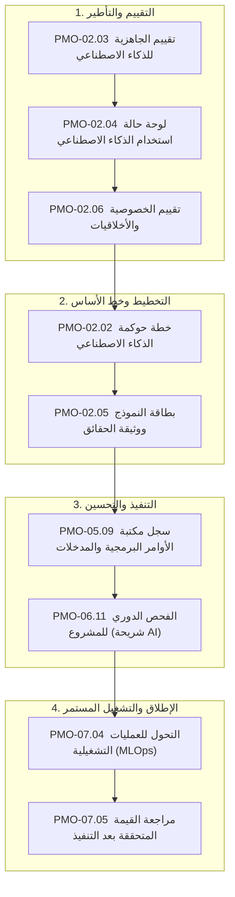

  🌐 <strong>اللغة:</strong> الدليل باللغة العربية
  <a class="lang-switch-btn" href="../en/08_ai_governance_framework.html">🇬🇧 Switch to English Version (النسخة الإنجليزية) ←</a>

  

---

# 🤖 إطار حوكمة وأخلاقيات مشاريع الذكاء الاصطناعي والتعلم الآلي
**مرجع الوثيقة:** `TASLEEMAT-GUIDE-08-AI-GOVERNANCE-AR`  
**الإصدار:** 2.0  
**المعايير المرجعية:** مبادئ أخلاقيات الذكاء الاصطناعي الصادرة عن الهيئة السعودية للبيانات والذكاء الاصطناعي (سدايا - SDAIA)، إطار إدارة مخاطر الذكاء الاصطناعي (NIST AI RMF 1.0)، وقانون الذكاء الاصطناعي الأوروبي (EU AI Act).  

---

## 🎯 نظرة عامة تنفيذية

مع تحول نماذج الذكاء الاصطناعي والتعلم الآلي والنماذج اللغوية الكبيرة (LLMs) من بيئات التجارب المعملية إلى صلب العمليات المؤسسية، باتت أدوات إدارة المشاريع التقليدية غير كافية بمفردها. تتميز مشاريع الذكاء الاصطناعي بمخاطر نوعية مثل: انحراف أداء النموذج (Model Drift)، والهلوسة التوليدية، والتحيز الخوارزمي، وتسريب خصوصية البيانات.

يوفر نظام **«تسليمات»** حزمة متكاملة لحوكمة الذكاء الاصطناعي مدمجة في دورة حياة المشروع، لتمكين المؤسسات من الابتكار بسرعة فائقة مع ضمان أعلى درجات الامتثال والأخلاقيات والجاهزية للتدقيق المؤسسي.

---

## 🏛️ وثائق حوكمة الذكاء الاصطناعي الست الأساسية

### 1. `PMO-02.03` تقييم الجاهزية للذكاء الاصطناعي (AI Readiness Assessment)
- **الهدف:** قياس مدى جاهزية البنية التحتية، وجودة البيانات، والكوادر البشرية، والأمن السيبراني قبل ضخ الميزانيات.
- **المعايير:** اكتمال البيانات، نضج مسارات MLOps، زمن الاستجابة، والتوافق الأمني.
- **بوابة العبور:** يشترط تحقيق نسبة نضج $\ge 70\%$ لاجتياز بوابة العبور 0.

### 2. `PMO-02.04` لوحة حالة استخدام الذكاء الاصطناعي (AI Use Case Canvas)
- **الهدف:** وثيقة استراتيجية من صفحة واحدة تربط المشكلة المستهدفة بالأثر التجاري والتقنية المستخدمة (RAG، تدريب مخصص، أو واجهات API).
- **المحتويات:** المستفيد المستهدف، مؤشرات الأداء، مصادر البيانات، آلية التدخل البشري والرجوع التلقائي، وعائد الاستثمار المتوقع.

### 3. `PMO-02.06` تقييم خصوصية البيانات والأخلاقيات (Data Privacy & Ethics)
- **الهدف:** الفحص الدقيق لحماية البيانات الشخصية، والامتثال لنظام حماية البيانات الشخصية (PDPL) ومعايير سدايا، وخلو النماذج من التحيز التمييزي.
- **الفحوصات الإلزامية:** تحليل السمات الحساسة، آليات إخفاء الهوية، وضمانات الخصوصية التفاضلية.

### 4. `PMO-02.02` خطة حوكمة الذكاء الاصطناعي (AI Governance Plan)
- **الهدف:** الميثاق المؤسسي الحاكم لدورة حياة النماذج، ومستويات المخاطر، وقواعد التدخل البشري (HITL)، ومؤشرات انحراف النماذج.
- **القواعد الصارمة:** حدود إعادة التدريب (مثل انخفاض مقياس F1 بأكثر من 5%) وصلاحيات إيقاف النماذج في بيئة الإنتاج.

### 5. `PMO-02.05` بطاقة النموذج ووثيقة الحقائق (AI Model Card & Fact Sheet)
- **الهدف:** جواز سفر فني ومعرفي يوثق سلسلة إمداد النموذج ومصادر بيانات التدريب ونتائج الاختبارات والقيود الفنية.
- **الجداول الحيوية:** مقاييس الدقة عبر الشرائح السكانية، الحالات غير المصرح باستخدام النموذج فيها، وإجراءات الحد من المخاطر.

### 6. `PMO-05.09` سجل مكتبة الأوامر البرمجية والمدخلات (Prompt Library Log)
- **الهدف:** إدارة النسخ والتعديلات لأوامر النماذج التوليدية (System Prompts) وضبط المعاملات (Temperature, Top-p) واختبارات الانحدار.
- **التحكم بالتغيير:** منع التدهور المفاجئ في جودة المخرجات وضمان ثبات السلوك عبر إصدارات التطبيق.

---

## 🛡️ تصنيف المخاطر وسياسات التدخل البشري (HITL)

| مستوى المخاطرة | التعريف والأمثلة | النماذج الإلزامية | سياسة التدخل البشري (Human-in-the-Loop) |
| :--- | :--- | :--- | :--- |
| **المستوى 1: عالي المخاطر** | تقييم الجدارة الائتمانية، التشخيص الطبي، الفرز الوظيفي الآلي، البنية التحتية الحرجة | كافة نماذج AI الستة + تدقيق قانوني خارجي | **موافقة بشرية إلزامية مسبقة** لكل معاملة أو قرار عالي التأثير. |
| **المستوى 2: متوسط المخاطر** | روبوتات خدمة العملاء التفاعلية، تلخيص الوثائق الداخلية، الصيانة التنبؤية | لوحة الاستخدام، بطاقة النموذج، سجل الأوامر | **تدخل بشري عند الاستثناء** (تحويل الحالات ذات الثقة المنخفضة للبشر). |
| **المستوى 3: منخفض المخاطر** | مسودات الإنتاجية الداخلية، تحليل المشاعر للمنشورات العامة | لوحة الاستخدام، بطاقة النموذج | **مراجعة دورية بالعينات** لضمان الجودة. |
