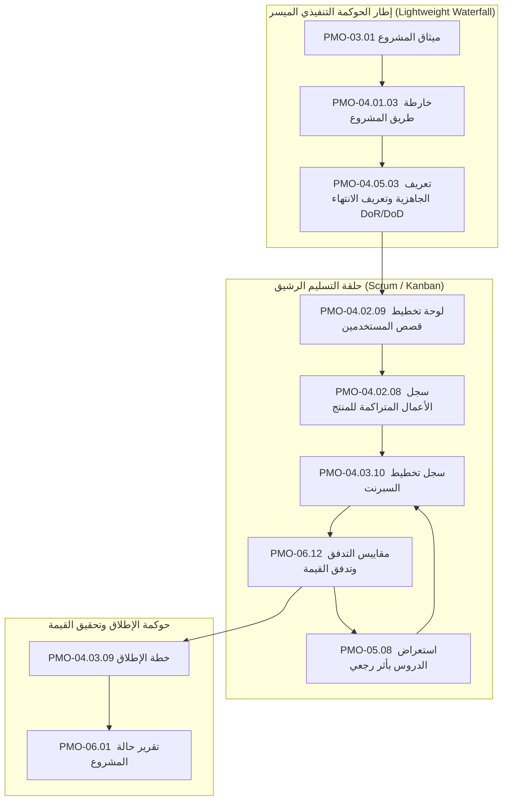

  🌐 <strong>اللغة:</strong> الدليل باللغة العربية
  

    <a class="lang-switch-btn github-btn" href="https://github.com/fakhruldeen/Tasleemat/blob/main/docs/ar/09_agile_hybrid_integration.md" target="_blank" rel="noopener noreferrer">🐙 عرض على GitHub ↗</a>
    <a class="lang-switch-btn" href="../en/09_agile_hybrid_integration.html">🇬🇧 Switch to English Version (النسخة الإنجليزية) ←</a>
  

  

---

# ⚡ دليل تطبيق المنهجيات الرشيقة والهجينة (Agile, Scrum, Kanban & Hybrid)
**مرجع الوثيقة:** `TASLEEMAT-GUIDE-09-AGILE-HYBRID-AR`  
**الإصدار:** 2.0  
**الفئات المستهدفة:** قادة سكرم (Scrum Masters)، مدربو التحول الرشيق (Agile Coaches)، ملاك المنتجات (Product Owners)، ومديرو المشاريع الهجينة  

---

## 🎯 النموذج الهجين العملي لإدارة المشاريع

نادراً ما تدار المشاريع المؤسسية في بيئات الأعمال الحديثة بأسلوب شلالي بحت (Waterfall) أو رشيق بحت (Pure Agile). يتطلب المواءمة الاستراتيجية، وإبرام العقود، وإدارة الميزانيات، والامتثال الرقابي قدراً من الحوكمة المسبقة؛ في حين تتطلب هندسة المنتجات وتطوير البرمجيات سرعة فائقة ودورات تسليم متكررة.

يقدم نظام **«تسليمات»** الجسر المؤسسي المثالي: **إطار حوكمة تنفيذي رشيق للقيادات** مدمج مع **حزمة أدوات رشيقة للمطورين وفرق المنتجات**.

---

## 🛠️ مواءمة نماذج تسليمات مع فعاليات سكرم والمنهجيات الرشيقة

| الفعالية الرشيقة | نموذج تسليمات المناظر | الدور المسؤول | التكرار والجدول الزمني |
| :--- | :--- | :--- | :--- |
| **استكشاف وتأسيس المنتج** | [`PMO-04.02.09 لوحة تخطيط قصص المستخدمين`](../forms/ar/04_التخطيط/02_النطاق/04_02_09_نموذج_تخطيط_قصص_المستخدم_قالب.md) | مالك المنتج (Product Owner) | بداية المشروع وكل إطلاق رئيسي |
| **اتفاقية معايير الجودة** | [`PMO-04.05.03 تعريف الجاهزية والانتهاء DoR/DoD`](../forms/ar/04_التخطيط/05_الجودة/04_05_03_تعريف_الجاهزية_والاكتمال_قالب.md) | الفريق وقائد سكرم | السبرنت 0 وبداية المبادرة |
| **تنقيح قائمة المهام** | [`PMO-04.02.08 سجل متطلبات المنتج Backlog`](../forms/ar/04_التخطيط/02_النطاق/04_02_08_قائمة_تراكم_المنتج_(Product_Backlog)_قالب.md) | مالك المنتج | أسبوعياً / بشكل مستمر |
| **تخطيط السبرنت** | [`PMO-04.03.10 سجل تخطيط السبرنت`](../forms/ar/04_التخطيط/03_الجدول_الزمني/04_03_10_سجل_تخطيط_أسبوع_العمل_قالب.md) | قائد سكرم وفريق التطوير | بداية كل سبرنت (كل أسبوعين) |
| **خطة إطلاق الإصدارات** | [`PMO-04.03.09 خطة الإطلاق`](../forms/ar/04_التخطيط/03_الجدول_الزمني/04_03_09_خطة_الإصدار_قالب.md) | مالك المنتج ومدير الإطلاق | ربع سنوياً أو مع كل إصدار |
| **مراقبة التدفق والـ WIP** | [`PMO-06.12 مقاييس التدفق وتدفق القيمة`](../forms/ar/06_المراقبة_والتحكم/06_12_مقاييس_التدفق_وتدفق_القيمة_قالب.md) | مدرب أجايل ومكتب PMO | مستمر / مراجعة السبرنت |
| **استعراض السبرنت بأثر رجعي** | [`PMO-05.08 استعراض بأثر رجعي (Retrospective)`](../forms/ar/05_التنفيذ/05_08_مراجعة_المرحلة_(Retrospective)_قالب.md) | الفريق وقائد سكرم | نهاية كل سبرنت |
| **مؤشر الأمان النفسي** | [`PMO-04.06.06 مؤشر الأمان النفسي للفريق`](../forms/ar/04_التخطيط/06_الموارد/04_06_06_مؤشر_الأمان_النفسي_وصحة_الفريق_قالب.md) | مدرب أجايل وشريك الموارد البشرية | شهرياً أو ربع سنوياً |

---

## 📊 مقاييس التدفق الرشيق ومؤشرات الأداء

بدلاً من تتبع ساعات العمل الفردية، تقيس الفرق عالية الأداء سرعة تدفق القيمة عبر [`PMO-06.12`](../forms/ar/06_المراقبة_والتحكم/06_12_مقاييس_التدفق_وتدفق_القيمة_قالب.md):

1. **زمن الدورة (Cycle Time):** الوقت الفعلي المنقضي منذ بدء العمل على قصة المستخدم حتى تسليمها جاهزة في بيئة الإنتاج.
2. **معدل الإنتاجية (Throughput):** عدد قصص المستخدمين أو نقاط القصة (Story Points) المنجزة بنجاح في كل سبرنت.
3. **العمل قيد التنفيذ (WIP):** عدد المهام المفتوحة بالتزامن. يساعد ضبط حدود WIP في القضاء على اختناقات تعدد المهام.
4. **كفاءة التدفق (Flow Efficiency):** نسبة زمن العمل النشط إلى إجمالي زمن الانتظار. المستهدف المؤسسي $\ge 40\%$.