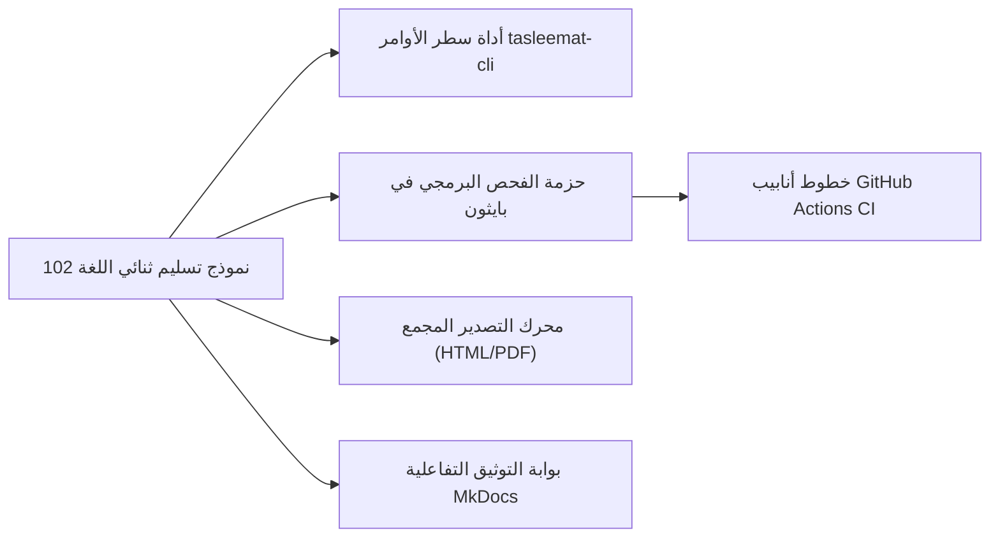

<div class="lang-switch-bar" dir="rtl">
  <span class="lang-switch-label">🌐 <strong>اللغة:</strong> الدليل باللغة العربية</span>
  <div class="lang-switch-actions">
    <a class="lang-switch-btn github-btn" href="https://github.com/fakhruldeen/Tasleemat/blob/main/docs/ar/11_tools_and_automation.md" target="_blank" rel="noopener noreferrer">🐙 عرض على GitHub ↗</a>
    <a class="lang-switch-btn" href="../en/11_tools_and_automation.html">🇬🇧 Switch to English Version (النسخة الإنجليزية) ←</a>
  </div>
</div>

</div>

</div>

<p align="center">
  
</p>

---

# 🛠️ دليل الأدوات البرمجية والأتمتة والتكامل السحابي (CI/CD)
**مرجع الوثيقة:** `TASLEEMAT-GUIDE-11-TOOLS-AUTOMATION-AR`  
**الإصدار:** 2.0  
**الفئات المستهدفة:** مهندسو DevOps، مسؤولو أنظمة PMO، المطورون ومدراء المشاريع  

---

## 🎯 قدرات الأتمتة والحوكمة البرمجية (Governance-as-Code)

صُمم نظام «تسليمات» بفلسفة **الوثائق كشيفرة برمجية (Docs-as-Code)** و**الحوكمة كشيفرة برمجية (Governance-as-Code)**؛ مما يتيح تتبع النسخ عبر Git، والتحقق التلقائي في خطوط أنابيب CI/CD، وتوليد مساحات العمل المخصصة للمشاريع في ثوانٍ معدودة.



---

## 🚀 1. أداة سطر الأوامر الرسمية (`tools/tasleemat_cli.py`)

يوفر المستودع أداة سطر أوامر مستقلة ومبنية بلغة بايثون دون الحاجة إلى أي مكتبات خارجية معقدة؛ لتسهيل تأسيس مساحات عمل المشاريع واستكشاف النماذج.

### أ. تأسيس مساحة عمل مخصصة لمشروع جديد (`init`)
توليد مجلد مشروع متكامل يضم فقط النماذج الإلزامية وفقاً لمستوى الحوكمة (Tier 1 أو 2 أو 3) وحزمة المنهجية المختارة:

```bash
# وضع المعالج التفاعلي (يسألك خطوة بخطوة في الطرفية)
python3 tools/tasleemat_cli.py init

# وضع المعاملات السريعة: المستوى 2 (المتوسط) مع حزمة أجايل باللغة العربية
python3 tools/tasleemat_cli.py init \
  --tier 2 \
  --pack agile \
  --lang ar \
  --name "منصة الخدمات الرقمية الموحدة" \
  --code "PRJ-2026-DIGITAL-01" \
  --pm "سارة الأحمد" \
  --sponsor "خالد المنصور" \
  --out ./my_new_project

# مشروع استراتيجي من المستوى 1 باللغتين العربية والإنجليزية
python3 tools/tasleemat_cli.py init \
  --tier 1 \
  --pack hybrid \
  --lang both \
  --name "برنامج التحول المؤسسي الشامل" \
  --code "PRJ-2026-CORE-01" \
  --pm "محمد السعيد" \
  --sponsor "فهد العتيبي" \
  --out ./enterprise_workspace
```

#### ما تقوم به الأداة تلقائياً:
1. تصفية الـ 102 نموذج لاختيار الباقة الإلزامية المناسبة لحجم المشروع وحزمة المنهجية (`agile`, `ai`, `predictive`, `hybrid`).
2. نسخ القوالب، والأدلة، ومخططات JSON، وقواميس CSV.
3. التعبئة التلقائية لبيانات الترويسة (اسم المشروع، رمزه، اسم المدير، الراعي، وتاريخ اليوم) في كافة الملفات المستنسخة.
4. إنشاء ملف `PROJECT_README.md` تفصيلي يحتوي على قائمة تدقيق لبوابات العبور وروابط مباشرة للنماذج.

---

### ب. البحث في فهرس النماذج (`search`)
البحث في كافة النماذج الـ 102 عبر الكلمات المفتاحية باللغتين العربية والإنجليزية:

```bash
# البحث باللغة العربية
python3 tools/tasleemat_cli.py search "مخاطر" --lang ar
python3 tools/tasleemat_cli.py search "ميثاق" --lang ar
python3 tools/tasleemat_cli.py search "ذكاء اصطناعي" --lang ar
python3 tools/tasleemat_cli.py search "سبرنت" --lang ar

# البحث باللغة الإنجليزية
python3 tools/tasleemat_cli.py search "Risk" --lang en
python3 tools/tasleemat_cli.py search "Charter" --lang en
python3 tools/tasleemat_cli.py search "Model Card" --lang en
```

---

### ج. استعراض الفهرس الشامل للنماذج (`list`)
عرض قائمة النماذج الكاملة مع رموزها ومجلداتها:

```bash
python3 tools/tasleemat_cli.py list --lang ar
python3 tools/tasleemat_cli.py list --lang en
```

### د. تشغيل حزمة الفحوصات والاختبارات الآلية (`test`)
تشغيل حزمة الفحص الشاملة المكونة من 28 فحصاً برمجياً:

```bash
# تشغيل حزمة الاختبارات مع الملخص
python3 tools/tasleemat_cli.py test

# تشغيل الاختبارات بالوضع المفصل
python3 tools/tasleemat_cli.py test -v

# أو التشغيل عبر أداة unittest القياسية في بايثون
python3 -m unittest discover -s tests -v
```

---

## 🖨️ 2. محرك التصدير المجمع للوثائق (`tools/export_deliverables.py`)

تحويل أي وثيقة أو مجلد مشروع كامل من صيغة Markdown إلى صفحات HTML منسقة وجاهزة للطباعة وتصدير PDF، مع دعم كامل للاتجاه العربي (RTL) وخطوط Cairo و Inter:

```bash
# تصدير وثيقة مفردة
python3 tools/export_deliverables.py forms/ar/03_البدء/01_ميثاق_المشروع/03_01_ميثاق_المشروع_قالب.md -o output.html

# تصدير نموذج عربي مع دعم RTL
python3 tools/export_deliverables.py forms/ar/03_البدء/01_ميثاق_المشروع/03_01_ميثاق_المشروع_قالب.md -o charter.html

# تصدير مجلد مشروع بالكامل
python3 tools/export_deliverables.py my_project_workspace/
```

---

## 🌐 3. بوابة التوثيق التفاعلية (MkDocs Material)

يحتوي المستودع على إعداد مسبق لملف `mkdocs.yml` لتشغيل بوابة توثيق تفاعلية باستخدام **Material for MkDocs** تدعم الوضعين الليلي والنهاري ومخططات Mermaid والبحث اللحظي:

```bash
# تثبيت التبعيات
pip install mkdocs-material

# تشغيل البوابة محلياً مع التحديث المباشر
mkdocs serve

# بناء الموقع الثابت للإنتاج
mkdocs build
```

---

## 🛡️ 4. حزمة التدقيق والفحص البرمجي في بايثون

يحتوي مجلد `tests/` و `tools/` على منظومة اختبارات وتدقيق آلية متكاملة:

### 1. حزمة الاختبارات الرئيسية (`tests/`)
- **طريقة التشغيل:** `python3 -m unittest discover -s tests -v`
- **الوحدات:** التماثل اللغوي (`test_parity.py`)، المخططات الهيكلية (`test_schemas.py`)، حزمة البيانات المفتوحة (`test_okf_datapackage.py`)، قوالب الحوكمة (`test_governance_templates.py`)، الامتثال للبيانات الافتراضية (`test_fictional_compliance.py`)، أدوات CLI (`test_cli_and_exporters.py`)، والأدلة التوثيقية (`test_documentation.py`).

### 2. مدقق جودة النماذج والمخططات (`tools/audit_forms.py`)
- **طريقة التشغيل:** `python3 tools/audit_forms.py`
- **الوظيفة:** يفحص جميع النماذج الـ 102 باللغتين العربية والإنجليزية (204 ملفات) للتأكد من وجود جدول الاعتماد وتسلسل العناوين وصحة الروابط.

### 3. مدقق حزمة البيانات المفتوحة Frictionless OKF (`tools/validate_okf.py`)
- **طريقة التشغيل:** `python3 tools/validate_okf.py`
- **الوظيفة:** يتحقق من مطابقة ملف `datapackage.json` والمخططات الـ 204 لمعايير حزم البيانات المفتوحة الدولية.

### 4. فاحص التماثل والتطابق اللغوي (`tools/parity.py`)
- **طريقة التشغيل:** `python3 tools/parity.py forms/en forms/ar`
- **الوظيفة:** يضمن التطابق التام 1:1 في البنية والملفات بين المجلدات العربية والإنجليزية.

---

## ⚙️ 5. خط أنابيب التكامل المستمر (`.github/workflows/ci.yml`)

يتم تشغيل فحص آلي عبر GitHub Actions مع كل عملية دفع أو سحب (Pull Request) إلى الفرع الرئيسي `main` يشمل:
1. التحقق من سلامة المخططات الهيكلية لكافة النماذج الـ 204 (`audit_forms.py`).
2. فحص العرض والتنسيق للجداول والمخططات (`check_rendering.py`).
3. التحقق من التماثل الثنائي التام عربي/إنجليزي 1:1 (`parity.py`).
4. فحص حزمة البيانات المفتوحة Frictionless (`validate_okf.py`).
5. تشغيل حزمة الاختبارات الآلية الشاملة المكونة من 28 فحصاً (`tests/`).
6. اختبار واجهة الأوامر والتصدير (`tasleemat_cli.py`).
