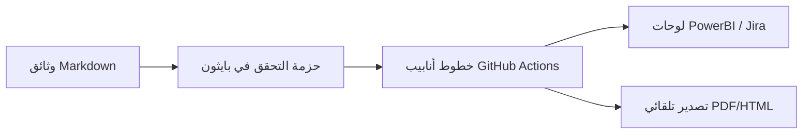

<p align="center">
  
</p>

---

# 🛠️ دليل الأدوات البرمجية والأتمتة والتكامل السحابي (CI/CD)
**مرجع الوثيقة:** `TASLEEMAT-GUIDE-11-TOOLS-AUTOMATION-AR`  
**الإصدار:** 2.0  
**الفئات المستهدفة:** مهندسو DevOps، مسؤولو أنظمة PMO، المطورون ومدراء البيانات  

---

## 🎯 قدرات الأتمتة والحوكمة البرمجية (Governance-as-Code)

صُمم نظام «تسليمات» بفلسفة **الوثائق كشيفرة برمجية (Docs-as-Code)** و**الحوكمة كشيفرة برمجية (Governance-as-Code)**؛ مما يتيح تتبع النسخ عبر Git، والتحقق التلقائي في خطوط أنابيب CI/CD، والتكامل السلس مع الأنظمة المؤسسية.



---

## 🧰 أدوات الفحص والتحقق البرمجية في بايثون

يحتوي مجلد `tools/` على أدوات فحص وتدقيق آلية:

### 1. مدقق جودة النماذج والمخططات (`tools/audit_forms.py`)
- **طريقة التشغيل:** `python3 tools/audit_forms.py`
- **الوظيفة:** يفحص جميع النماذج الـ 102 باللغتين العربية والإنجليزية (204 ملفات) للتأكد من:
  - وجود جدول المراجعة والاعتماد المؤسسي.
  - تسلسل العناوين الرأسية (`#`, `##`, `###`).
  - خلو الملفات من الروابط المعطلة.

### 2. فاحص التماثل والتطابق اللغوي (`tools/parity.py`)
- **طريقة التشغيل:** `python3 tools/parity.py forms/en forms/ar`
- **الوظيفة:** يضمن التطابق التام 1:1 في البنية والملفات بين المجلدات العربية والإنجليزية (القوالب، الأدلة، ملفات JSON، وملفات CSV).

### 3. مدقق العرض والتنسيق (`tools/check_rendering.py`)
- **طريقة التشغيل:** `python3 tools/check_rendering.py`
- **الوظيفة:** يفحص جداول Markdown، والمفاتيح العريضة، ومخططات Mermaid لضمان عدم وجود أخطاء تكسر العرض في واجهات GitHub و GitLab و Azure DevOps.

---

## 🔌 التكامل مع الأنظمة والمنصات المؤسسية

### 1. الربط مع JIRA و Azure DevOps
- استيراد `docs/LEXICON.json` ضمن الحقول المخصصة لتوحيد تتبع المخرجات عبر مبادرات وملاحم العمل (Epics & Features).
- ربط سجلات السبرنت (`PMO-04.03.10`) مباشرة مع لوحات العمل الرشيقة.

### 2. لوحات ذكاء الأعمال (PowerBI / Tableau)
- ربط موصل بيانات PowerBI بملفات `*.csv` داخل مجلدات `forms/` لإنشاء لوحات تحكم تنفيذية لحظية لمتابعة نضج المحفظة.

### 3. التصدير المجمع إلى PDF عبر Pandoc
تحويل أي وثيقة من صيغة Markdown إلى تقرير PDF رسمي:
```bash
pandoc forms/ar/03_البدء/01_ميثاق_المشروع/03_01_ميثاق_المشروع_قالب.md \
  -o Project_Charter_AR.pdf \
  --pdf-engine=xelatex \
  --variable mainfont="Amiri" \
  --variable geometry:margin=1in
```
