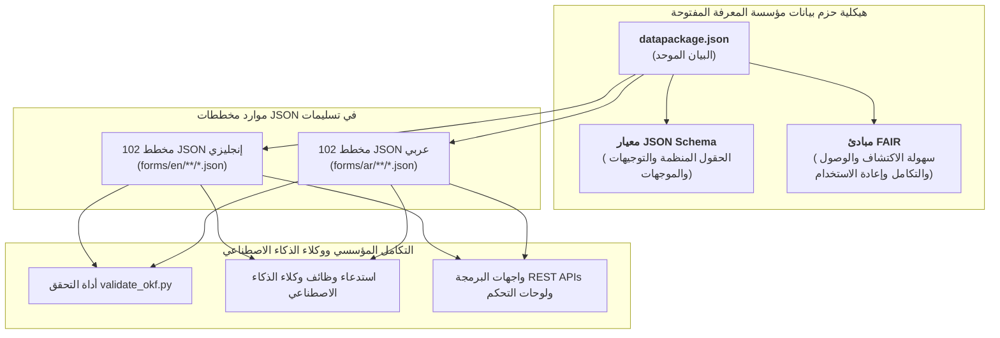

<div class="lang-switch-bar" dir="rtl">
  <span class="lang-switch-label">🌐 <strong>اللغة:</strong> الدليل باللغة العربية</span>
  <div class="lang-switch-actions">
    <a class="lang-switch-btn github-btn" href="https://github.com/fakhruldeen/Tasleemat/blob/main/docs/ar/12_open_knowledge_framework.md" target="_blank" rel="noopener noreferrer">🐙 عرض على GitHub ↗</a>
    <a class="lang-switch-btn" href="../en/12_open_knowledge_framework.html">🇬🇧 Switch to English Version (النسخة الإنجليزية) ←</a>
  </div>
</div>

</div>

</div>

</div>

<p align="center">
  
</p>

---

# 🌐 معيار مؤسسة المعرفة المفتوحة (OKF) وهيكلية مخططات JSON الرقمية
**مرجع الوثيقة:** `TASLEEMAT-GUIDE-12-OPEN-KNOWLEDGE-AR`  
**الإصدار:** 2.0  
**المعايير المرجعية:** معيار حزم البيانات الصادر عن مؤسسة المعرفة المفتوحة (Open Knowledge Foundation - OKF)، ومعيار JSON Schema (Draft 2020-12)، ومبادئ FAIR للبيانات المفتوحة.  

---

## 🎯 نظرة عامة تنفيذية

تلتزم حزمة **«تسليمات»** بمواصفات حزم البيانات الصادرة عن **مؤسسة المعرفة المفتوحة (OKF)** بالاعتماد على **مخططات JSON الرقمية القياسية**؛ مما يجعلها إطار عمل مكاتب إدارة المشاريع (PMO) الأكثر ملاءمة للأتمتة ووكلاء الذكاء الاصطناعي عالمياً.

من خلال توفير ملف البيان الموحد [`datapackage.json`](../../datapackage.json) في جذر المستودع، تمكّن تسليمات المطورين ووكلاء الذكاء الاصطناعي (AI Agents) ومهندسي النظم من قراءة وتدقيق واستدعاء كافة مخططات النماذج الـ 204 مباشرة عبر واجهات البرمجة (APIs) دون الحاجة إلى أي وسائط تحويل وسيطة.



---

## 📦 مواصفة ملف `datapackage.json`

يقوم ملف [`datapackage.json`](../../datapackage.json) بفهرسة كافة المخططات الـ 204 كموارد JSON رقمية:

```json
{
  "profile": "data-package",
  "name": "tasleemat-pmo-framework",
  "title": "Tasleemat: Enterprise Bilingual (English & Arabic) Project Management Framework",
  "version": "2.0.0",
  "licenses": [{"name": "MIT", "path": "https://opensource.org/licenses/MIT"}],
  "resources": [
    {
      "name": "ar-03-01-project-charter",
      "title": "ميثاق المشروع",
      "reference": "PMO-03.01",
      "path": "forms/ar/03_البدء/01_ميثاق_المشروع/03_01_ميثاق_المشروع.json",
      "format": "json",
      "mediatype": "application/json",
      "encoding": "utf-8",
      "language": "ar-SA",
      "direction": "rtl",
      "schema": {
        "$schema": "https://json-schema.org/draft/2020-12/schema",
        "type": "object",
        "required": ["form_name", "document_reference", "fields"]
      }
    }
  ]
}
```

---

## 🛠️ التحقق من الامتثال لمعايير OKF

يتضمن المستودع أداة فحص آلية مدمجة:

```bash
# تشغيل أداة التحقق لمخططات JSON
python3 tools/validate_okf.py
```

---

## 💡 مزايا اعتماد مخططات JSON في معايير OKF

1. **الاستدعاء المباشر لوكلاء الذكاء الاصطناعي (Function Calling):** تستخدم نماذج الذكاء الاصطناعي الحديثة مخططات JSON بشكل طبيعي لتوليد المخرجات المنسقة دون أخطاء هيكلية.
2. **شجرة بيانات هرمية ومتكاملة:** يحمل كل حقل خصائص `section` (القسم) و `label` (المسمى) و `guidance` (الإرشادات التفصيلية) و `value` (القيمة المستهدفة).
3. **التماثل الثنائي الكامل (en / ar-SA):** دعم كامل لاتجاه النص العربي (`rtl`) والترميز الموحد `utf-8` عبر كافة المخططات الـ 204.
