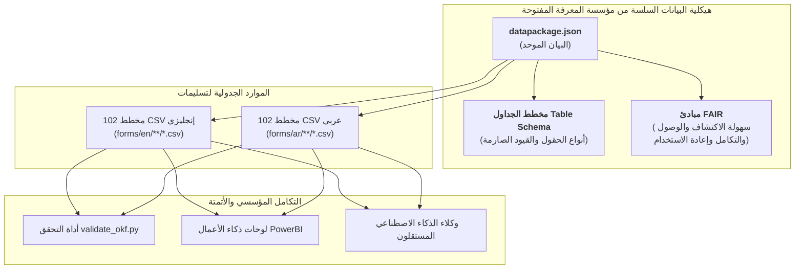

<p align="center">
  
</p>

---

# 🌐 معيار مؤسسة المعرفة المفتوحة (OKF) وهيكلية البيانات السلسة (Frictionless Data)
**مرجع الوثيقة:** `TASLEEMAT-GUIDE-12-OPEN-KNOWLEDGE-AR`  
**الإصدار:** 2.0  
**المعايير المرجعية:** معيار حزم البيانات السلسة (Frictionless Data Package) الصادر عن مؤسسة المعرفة المفتوحة (Open Knowledge Foundation - OKF)، ومبادئ البيانات القابلة للاكتشاف والوصول والتكامل وإعادة الاستخدام (FAIR Principles).  

---

## 🎯 نظرة عامة تنفيذية

تلتزم حزمة **«تسليمات»** بمواصفات حزم البيانات السلسة الصادرة عن **مؤسسة المعرفة المفتوحة (OKF)**؛ مما يجعلها من أولى أطر عمل مكاتب إدارة المشاريع (PMO) المفتوحة والمقروءة آلياً بالكامل باللغتين العربية والإنجليزية.

من خلال توفير ملف البيان الموحد [`datapackage.json`](../../datapackage.json) في جذر المستودع، تمكّن تسليمات علماء البيانات، ومهندسي الذكاء الاصطناعي، ومطوري الأنظمة المؤسسية من استعلام وتدقيق ودمج كافة المخططات الجدولية الـ 204 مباشرة في خطوط أنابيب البيانات، ولوحات ذكاء الأعمال، ووكلاء الذكاء الاصطناعي المستقلين دون الحاجة إلى تحويل يدوي للبيانات.



---

## 📦 مواصفة ملف `datapackage.json`

يقوم ملف [`datapackage.json`](../../datapackage.json) في جذر المستودع بفهرسة كافة المخططات الـ 204 كموارد بيانات سلسة:

```json
{
  "profile": "tabular-data-package",
  "name": "tasleemat-pmo-framework",
  "title": "Tasleemat: Enterprise Bilingual (English & Arabic) Project Management Framework",
  "version": "2.0.0",
  "licenses": [{"name": "MIT", "path": "https://opensource.org/licenses/MIT"}],
  "resources": [
    {
      "name": "ar-03-01-project-charter",
      "title": "03 01 ميثاق المشروع",
      "path": "forms/ar/03_البدء/01_ميثاق_المشروع/03_01_ميثاق_المشروع.csv",
      "format": "csv",
      "mediatype": "text/csv",
      "encoding": "utf-8",
      "language": "ar-SA",
      "direction": "rtl",
      "schema": {
        "fields": [
          {"name": "Section", "type": "string", "constraints": {"required": true}},
          {"name": "Field", "type": "string", "constraints": {"required": true}},
          {"name": "Guidance", "type": "string", "constraints": {"required": true}},
          {"name": "LLM_Generated_Value", "type": "string", "constraints": {"required": false}}
        ]
      }
    }
  ]
}
```

---

## 🛠️ التحقق من الامتثال لمعايير OKF

يتضمن المستودع أداة فحص آلية مدمجة:

```bash
# تشغيل أداة التحقق المدمجة لمعايير OKF
python3 tools/validate_okf.py
```

---

## 💡 فوائد معيار OKF لمكاتب إدارة المشاريع المؤسسية

1. **حوكمة مقروءة آلياً (Machine-Readable):** تحديد أنواع الحقول والقيود بدقة؛ مما يتيح الفحص التلقائي لوثائق المشاريع المكتملة.
2. **التكامل السلس مع الأنظمة:** استيراد مخططات النماذج مباشرة في بايثون (Pandas)، وقواعد البيانات، ولوحات PowerBI بأمر برمجي واحد.
3. **التماثل اللغوي الكامل (en / ar-SA):** الحفاظ على خصائص اتجاه النص العربي (`rtl`) والترميز الموحد `utf-8` لضمان صحة المعالجة في خطوط الأنابيب البرمجية.
