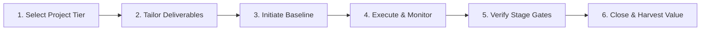

<div class="lang-switch-bar">
  <span class="lang-switch-label">🌐 <strong>Language:</strong> English Manual</span>
  <div class="lang-switch-actions">
    <a class="lang-switch-btn github-btn" href="https://github.com/fakhruldeen/Tasleemat/blob/main/docs/en/01_getting_started.md" target="_blank" rel="noopener noreferrer">🐙 View on GitHub ↗</a>
    <a class="lang-switch-btn" href="../ar/01_getting_started.html">🇸🇦 الانتقال للنسخة العربية (Arabic Manual) →</a>
  </div>
</div>

---
type: Guide
token_pointer: /_tokens/docs/en/01_getting_started.npy
token_count: 2115
tokenizer_model_id: tiktoken/o200k_base
created_at: '2026-10-06T16:05:28.501242+00:00'
---

<p align="center">
  
</p>

---

# 🚀 Getting Started with Tasleemat PMO Operating System
**Document ID:** `TASLEEMAT-GUIDE-01-GETTING-STARTED`  
**Version:** 2.0  
**Target Audience:** Project Managers, PMO Directors, Agile Coaches, Project Sponsors, AI Leads  

---

## 🎯 Welcome to Tasleemat

**Tasleemat (تسليمات)** is a high-performance, enterprise-grade Project Management Office (PMO) Operating System. It delivers **102 standardized, bilingual (English & Arabic)** deliverable forms engineered in clean Markdown, accompanied by structural schemas (`*.json`, `*.csv`) and real-world reference implementations.

Whether you are running a multi-million-dollar infrastructure transformation, a lean agile sprint, or an innovative GenAI deployment, Tasleemat provides the exact governance baseline you need without bureaucratic bloat.



---

## 🧭 Step-by-Step Onboarding Workflow

### Phase 1: Day 1 to Day 7 — Project Discovery & Sizing
1. **Determine Project Tier & Category:**
   - Consult [`05_tailoring_profiles.md`](05_tailoring_profiles.md).
   - Classify your initiative into **Tier 1 (Enterprise / Strategic)**, **Tier 2 (Medium / Core)**, **Tier 3 (Small / Fast-Track Agile)**, or **Tier 4 (AI / Emerging Tech)**.
2. **Review Stage-Gate Requirements:**
   - Read [`04_stage_gates_and_governance.md`](04_stage_gates_and_governance.md) to understand the 6 governance milestones (Gate 0 to Gate 5).
3. **Draft the Strategic Foundation:**
   - If starting at portfolio level: Complete [`00_01 Portfolio Roadmap`](../forms/en/00_Program_and_Portfolio_Management/00_01_Portfolio_Roadmap_Template.md) and [`00_06 OKR Alignment`](../forms/en/00_Program_and_Portfolio_Management/00_06_OKR_Alignment_Matrix_Template.md).
   - Complete [`01_01 Business Case`](../forms/en/01_Business_and_Value_Delivery/01_01_Business_Case_Template.md) and [`03_01 Project Charter`](../forms/en/03_Initiating/03_01_Project_Charter_Template.md).

---

### Phase 2: Day 8 to Day 21 — Planning & Baseline Authorization
1. **Establish the Triple Constraint Baseline:**
   - **Scope:** Complete [`04_02_05 Scope Statement`](../forms/en/04_Planning/02_Scope/04_02_05_Project_Scope_Statement_Template.md) and [`04_02_06 WBS`](../forms/en/04_Planning/02_Scope/04_02_06_Work_Breakdown_Structure_Template.md).
   - **Schedule:** Complete [`04_03_08 Project Schedule`](../forms/en/04_Planning/03_Schedule/04_03_08_Project_Schedule_Template.md).
   - **Cost:** Complete [`04_04_04 Cost Baseline`](../forms/en/04_Planning/04_Cost/04_04_04_Cost_Baseline_Template.md).
2. **Assign Governance Roles & RACI:**
   - Consult [`06_raci_authority_matrix.md`](06_raci_authority_matrix.md) and fill [`04_06_04 RACI Matrix`](../forms/en/04_Planning/06_Resource/04_06_04_Responsibility_Assignment_Matrix_Template.md).
3. **Pass Gate 2 (Integrated Baseline Review):**
   - Present the integrated baseline to the PMO and Sponsor for formal sign-off.

---

### Phase 3: Day 22 Onward — Execution, Control, & Stage Gates
1. **Maintain Live Operational Logs:**
   - Track issues in [`05_01 Issue Log`](../forms/en/05_Executing/05_01_Issue_Log_Template.md).
   - Log decisions in [`05_02 Decision Log`](../forms/en/05_Executing/05_02_Decision_Log_Template.md).
   - Process change requests through [`05_03 Change Request`](../forms/en/05_Executing/05_03_Change_Request_Template.md) and [`05_04 Change Log`](../forms/en/05_Executing/05_04_Change_Log_Template.md).
2. **Measure Value & Variances:**
   - Run weekly or bi-weekly [`06_01 Project Status Report`](../forms/en/06_Monitoring_and_Controlling/06_01_Project_Status_Report_Template.md).
   - Calculate EVM metrics via [`06_05 Earned Value Analysis`](../forms/en/06_Monitoring_and_Controlling/06_05_Earned_Value_Analysis_Template.md).
3. **Pass Gate 4 & Gate 5 (Acceptance & Closure):**
   - Secure customer signoff using [`06_08 Product Acceptance Form`](../forms/en/06_Monitoring_and_Controlling/06_08_Product_Acceptance_Form_Template.md).
   - Handover to ops via [`07_04 Transition Checklist`](../forms/en/07_Closing/07_04_Transition_to_Operations_Checklist_Template.md).
   - Archive organizational assets using [`07_03 Closeout Report`](../forms/en/07_Closing/07_03_Project_or_Phase_Closeout_Template.md) and [`07_01 Lessons Learned`](../forms/en/07_Closing/07_01_Lessons_Learned_Summary_Template.md).

---

## 🗂️ How to Use Forms, Guides, and Examples

Every form in Tasleemat follows a strict three-part triad:

```
forms/en/03_Initiating/01_Project_Charter/
├── 03_01_Project_Charter_Template.md   # The pure fillable template
├── 03_01_Project_Charter_Guide.md      # Detailed instructions & alignment
├── 03_01_Project_Charter.json          # Machine-readable schema definition
└── 03_01_Project_Charter.csv           # Structured table column headers

examples/en/03_Initiating/01_Project_Charter/
└── 03_01_Project_Charter_Example.md    # Fully filled enterprise example
```

1. **For the Author (PM / Lead):**
   - Open `*_Guide.md` first to understand mandatory inputs, RACI, and dependencies.
   - Copy `*_Template.md` to your working folder or project repo.
   - Fill in each bracketed placeholder `[ Specify ... ]`.
   - Refer to `*_Example.md` in `examples/` for benchmark inspiration.
2. **For the Approver (Sponsor / PMO Director):**
   - Check the **Document Control & Sign-off Table** at the bottom of each deliverable.
   - Verify alignment with upstream dependencies in [`07_document_dependencies.md`](07_document_dependencies.md).

---

## 📚 Core Documentation Library

| Doc # | Guide Name | Target Audience | Key Topic |
| :--- | :--- | :--- | :--- |
| **02** | [`02_usage_guide.md`](02_usage_guide.md) | All Practitioners | Template fields, markdown rules, JSON/CSV tools |
| **03** | [`03_pmo_policy_manual.md`](03_pmo_policy_manual.md) | PMO & Executives | Corporate governance, change control, compliance |
| **04** | [`04_stage_gates_and_governance.md`](04_stage_gates_and_governance.md) | PMs & Gate Reviewers | 6 Stage-Gates, entry/exit criteria, signoff |
| **05** | [`05_tailoring_profiles.md`](05_tailoring_profiles.md) | PMs & PMO Leads | Project sizing matrix, 4-tier mandatory deliverables |
| **06** | [`06_raci_authority_matrix.md`](06_raci_authority_matrix.md) | Governance Officers | 102-form RACI approval rights |
| **07** | [`07_document_dependencies.md`](07_document_dependencies.md) | Architects & PMs | Upstream/downstream deliverable data flows |
| **08** | [`08_ai_governance_framework.md`](08_ai_governance_framework.md) | AI PMs & Tech Leads | AI Canvas, Model Cards, Ethics, SDAIA/NIST |
| **09** | [`09_agile_hybrid_integration.md`](09_agile_hybrid_integration.md) | Scrum Masters & PMs | Agile ceremonies, flow metrics, DoD, Sprints |
| **10** | [`10_faq_and_troubleshooting.md`](10_faq_and_troubleshooting.md) | All Users | 25+ practical answers to common obstacles |
| **11** | [`11_tools_and_automation.md`](11_tools_and_automation.md) | Developers & DevOps | Scripts, CI/CD, JIRA/Azure DevOps integration |