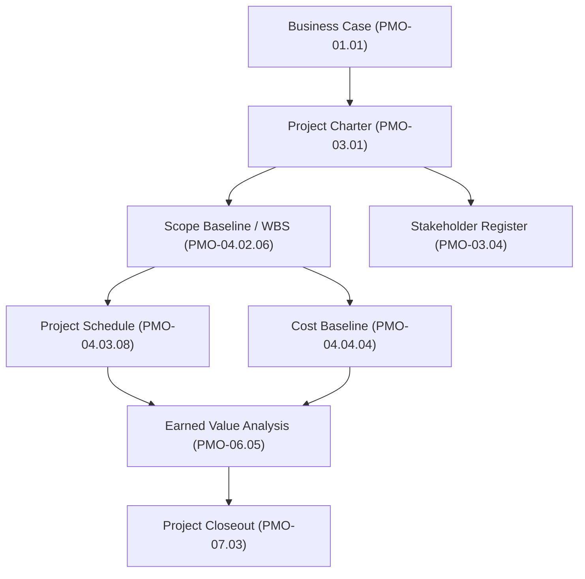

<div class="lang-switch-bar">
  <span class="lang-switch-label">🌐 <strong>Language:</strong> English Manual</span>
  <a class="lang-switch-btn" href="../ar/02_usage_guide.html">🇸🇦 الانتقال للنسخة العربية (Arabic Manual) →</a>
</div>

<p align="center">
  
</p>

# 📘 Tasleemat PMO Toolkit — Comprehensive Practitioner & Automation Guide
**Document Reference:** `TASLEEMAT-GUIDE-02-USAGE-GUIDE`  
**Standard:** PMI PMBOK® Guide 6th, 7th & 8th Edition Standard  
**Target Audience:** Project Managers, PMO Directors, AI Engineers, Scrum Masters  

Welcome to the definitive practitioner and automation guide for the **Tasleemat PMO Toolkit**. Whether you are a project manager looking to standardize physical deliverables, a PMO director establishing enterprise governance, or an AI engineer building autonomous project management agents, this guide covers every workflow end-to-end.

---

## 📑 Table of Contents
1. [The 5-File Architecture](#1-the-5-file-architecture)
2. [Global Parameters Configuration](#2-global-parameters-configuration)
3. [AI-Powered Document Generation Workflows](#3-ai-powered-document-generation-workflows)
   - [Workflow A: Interactive Chat Prompting (Claude / ChatGPT / Gemini)](#workflow-a-interactive-chat-prompting-claude--chatgpt--gemini)
   - [Workflow B: Structured JSON & API Automation](#workflow-b-structured-json--api-automation)
   - [Workflow C: Local LLM Execution (Ollama / vLLM)](#workflow-c-local-llm-execution-ollama--vllm)
4. [Managing Lifecycle Dependencies](#4-managing-lifecycle-dependencies)
5. [Enterprise Publishing & PDF Export](#5-enterprise-publishing--pdf-export)
6. [Data Analytics & Dashboard Automation](#6-data-analytics--dashboard-automation)
7. [Governance & Sign-off Matrix](#7-governance--sign-off-matrix)

---

## 1. The 5-File Architecture

Every one of the **102 form directories** across [`../../forms/en/`](../../forms/en/) and [`../../forms/ar/`](../../forms/ar/) contains exactly five synchronized files engineered for specific stages of the document lifecycle:

```text
01_Project_Charter/
├── 03_01_Project_Charter_Guide.md     # 1. Human Practitioner Guide & Dependency Rules
├── 03_01_Project_Charter_Template.md  # 2. Production Markdown Template with Sign-offs
├── 03_01_Project_Charter.md           # 3. LLM System Prompt & Field Constraints
├── 03_01_Project_Charter.json         # 4. Machine-Readable Schema (API & JSON Mode)
└── 03_01_Project_Charter.csv          # 5. 4-Column Data Dictionary for BI & Analytics
```

### 1.1 The Practitioner Guide (`*_Guide.md` / `*_دليل.md`)
- **When to use:** Read before drafting or reviewing the artifact.
- **Key Sections:**
  - **Purpose & Core Value:** What problem this document solves and what risks arise if it is omitted.
  - **Writing Guidelines:** Quality standards, anti-patterns, and precision rules.
  - **Column & Field Definitions:** Guidance on each table column and metadata field.
  - **Alignment & Dependencies:** Explicit **Mandatory** and **Optional** upstream prerequisites and downstream dependents with official document IDs (e.g. `PMO-03.01`).

### 1.2 The Production Template (`*_Template.md` / `*_قالب.md`)
- **When to use:** The final deliverable document for stakeholder review, wiki storage, and formal sign-offs.
- **Key Features:**
  - Standardized metadata header (`Date Prepared`, `Project Manager`, `Prepared By`).
  - Document reference code and organizational branding placeholders (`{{Company_Name}}`, `{{Project_Name}}`).
  - Role-based governance approval table assigning sign-off responsibility to appropriate governance roles (e.g., Project Sponsor, Finance Controller, CCB Chair, QA Lead).

### 1.3 The LLM Generation Prompt (`*.md`)
- **When to use:** Copy and paste into an LLM interface along with project context to generate a draft.
- **Key Features:**
  - Structured prompt block quoting alignment rules and dependencies.
  - Detailed system instructions specifying exactly what each section must contain.

### 1.4 The Data Schema (`*.json`)
- **When to use:** Programmatic document generation pipelines, LLM JSON mode, and schema validation.
- **Key Structure:**
  ```json
  {
    "_llm_instructions": "Fill in the project_title and value properties...",
    "form_name": "Project Charter",
    "document_reference": "PMO-03.01",
    "project_title": "",
    "date_prepared": "",
    "fields": {
      "f01_Project_Purpose": {
        "section": "1. Project Purpose and Business Case",
        "label": "Project Purpose",
        "guidance": "Clear business rationale...",
        "value": ""
      }
    }
  }
  ```

### 1.5 The Tabular Data Dictionary (`*.csv`)
- **When to use:** Importing into Excel, Google Sheets, PowerBI, or enterprise database tables.
- **Structure:** Exactly 4 columns: `Section`, `Field`, `Guidance`, `LLM_Generated_Value`.

---

## 2. Global Parameters Configuration

Before generating documents with AI, define your project's global baseline variables in [`../../forms/en/parameters.md`](../../forms/en/parameters.md) (or [`../../forms/ar/parameters.md`](../../forms/ar/parameters.md) for Arabic):

```markdown
# Project Global Parameters (معاملات المشروع العامة)

* **Company_Name:** Enterprise Solutions Corp
* **Project_Name:** Customer Portal 2.0 Modernization
* **Project_ID:** PRJ-2026-088
* **Project_Manager_Name:** John Doe, PMP
* **Project_Sponsor:** Jane Smith (VP of Digital Transformation)
* **Prepared_By:** PMO Lead Analyst
* **Target_Start_Date:** 2026-11-01
* **Target_Finish_Date:** 2027-05-31
* **Total_Budget_BAC:** $1,250,000 USD
* **Currency:** USD
```

---

## 3. AI-Powered Document Generation Workflows

### Workflow A: Interactive Chat Prompting (Claude / ChatGPT / Gemini)

1. Open your LLM chat interface.
2. Provide the system instructions and global parameters:
   ```text
   System: You are an expert Enterprise PMO Lead and Senior Project Manager.
   I will provide you with:
   1. Global project parameters
   2. Rough stakeholder meeting notes
   3. The exact PMO prompt specification for the target artifact

   Your task is to generate a comprehensive, professional, audit-ready Markdown document 
   matching the exact structure and tables of the target template. Do not summarize or omit sections.
   ```
3. Paste the contents of `../../forms/en/parameters.md`.
4. Paste the specific prompt file (e.g., [`../../forms/en/04_Planning/08_Risk/02_Risk_Register/04_08_02_Risk_Register.md`](../../forms/en/04_Planning/08_Risk/02_Risk_Register/04_08_02_Risk_Register.md)).
5. Paste your raw project notes (e.g., transcripts, bullet points, or email summaries).
6. The AI will return the complete, filled-out Markdown document ready to paste into `_Template.md`.

---

### Workflow B: Structured JSON & API Automation

For automated backend pipelines (e.g. Python, LangChain, LlamaIndex, or OpenAI Function Calling):

```python
import json
import openai

# 1. Load schema
with open("../../forms/en/03_Initiating/01_Project_Charter/03_01_Project_Charter.json") as f:
    schema = json.load(f)

# 2. Call OpenAI with JSON Mode
response = openai.chat.completions.create(
    model="gpt-4o",
    response_format={"type": "json_object"},
    messages=[
        {
            "role": "system",
            "content": f"You are a PMO document generator. Populate the 'value' properties of this schema based on context: {json.dumps(schema)}"
        },
        {
            "role": "user",
            "content": "Project: Enterprise ERP Upgrade. Budget: $2M. Sponsor: CFO. Notes: Phase 1 replaces legacy billing."
        }
    ]
)

# 3. Save populated JSON
populated_data = json.loads(response.choices[0].message.content)
with open("ERP_Project_Charter.json", "w") as out:
    json.dump(populated_data, out, indent=2)
```

---

### Workflow C: Local LLM Execution (Ollama / vLLM)

Run complete document generation locally and securely without external data transmission:

```bash
# Run local generation with Llama 3 or Mistral via Ollama
ollama run llama3:70b "$(cat ../../forms/en/parameters.md) $(cat ../../forms/en/05_Executing/01_Issue_Log/05_01_Issue_Log.md) Meeting notes: [insert notes]" > Issue_Log_Draft.md
```

---

## 4. Managing Lifecycle Dependencies

Tasleemat forms are interconnected through upstream prerequisites and downstream consumers. Refer to [`../LEXICON.md`](../LEXICON.md) or section `### Alignment & Dependencies` in any `*_Guide.md` before approving baselines:



- **Mandatory Prerequisite:** You must have an approved **Project Charter (PMO-03.01)** before establishing the **Project Management Plan (PMO-04.01.01)**.
- **Downstream Consumer:** Updates to the **Risk Register (PMO-04.08.02)** directly feed into **Risk Reports (PMO-04.08.06)** and **Change Requests (PMO-05.03)**.

---

## 5. Enterprise Publishing & PDF Export

The templates in Tasleemat are engineered to render cleanly across modern Markdown viewers and export into executive PDF reports:

### 5.1 Recommended Export Methods
1. **VS Code (Markdown PDF Extension):**
   - Open any `_Template.md` or populated Markdown file.
   - Press `Ctrl+Shift+P` (or `Cmd+Shift+P` on Mac) $\rightarrow$ `Markdown PDF: Export (pdf)`.
2. **Obsidian / Logseq:**
   - Open the note $\rightarrow$ Click `Export to PDF` (select standard A4 format with 1-inch margins).
3. **Enterprise Wikis (Confluence / Notion):**
   - Copy and paste the Markdown directly. HTML tables and headers will convert natively into rich tables.

---

## 6. Data Analytics & Dashboard Automation

Because every form maintains an identical 4-column CSV data structure, you can aggregate and analyze project health across multiple teams in minutes:

```python
import pathlib
import pandas as pd

# Load all Arabic and English project fields into a unified DataFrame
records = []
for csv_file in pathlib.Path("forms").rglob("*.csv"):
    df = pd.read_csv(csv_file)
    df["form_name"] = csv_file.stem
    df["language"] = "ar" if "ar" in csv_file.parts else "en"
    records.append(df)

master_df = pd.concat(records, ignore_index=True)
print(f"Total PMO data fields cataloged: {len(master_df)}")
print(master_df.head())
```

---

## 7. Governance & Sign-off Matrix

Every template concludes with an **Approval and Sign-off Table** tailored to the governance authority required for that document:

| Document Category | Primary Approver | Mandatory Signatories |
| :--- | :--- | :--- |
| **Charters & Strategic Baselines** | Project Sponsor | Project Sponsor, PMO Director, Project Manager |
| **Scope, WBS & Technical Baselines** | Lead Systems Engineer | Lead Systems Engineer, Technical Architect, PM |
| **Cost & Procurement Baselines** | Finance Controller | Finance Controller / CFO, Procurement Lead, PM |
| **Quality & Acceptance Records** | QA Lead / Business Client | Quality Lead, Key Stakeholder, PM |
| **AI Governance & Model Cards** | AI Ethics Lead | AI Ethics Officer, Data Protection Officer (DPO), ML Lead |
| **Change Control & Exceptions** | CCB Chair | Change Control Board (CCB) Members, Project Sponsor |

---

<div align="center">
  <sub>For terminology translations and full index, consult <a href="../LEXICON.md"><b>../LEXICON.md</b></a>.</sub>
</div>
