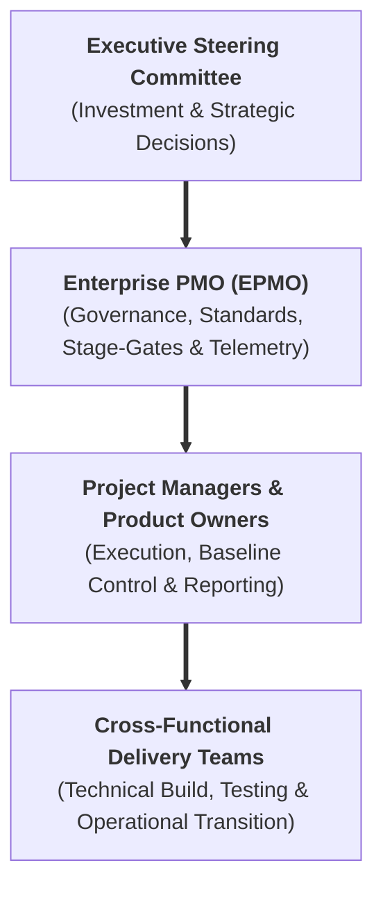
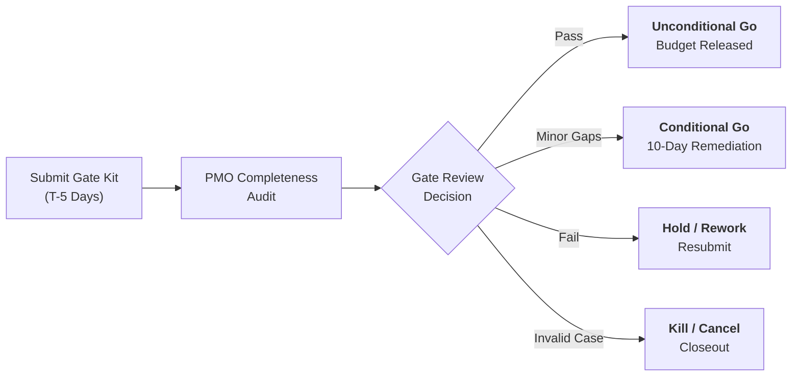
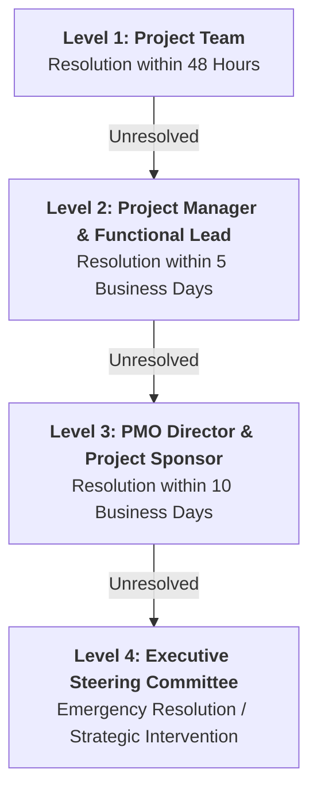

  🌐 <strong>Language:</strong> English Manual
  

    <a class="lang-switch-btn github-btn" href="https://github.com/fakhruldeen/Tasleemat/blob/main/docs/en/03_pmo_policy_manual.md" target="_blank" rel="noopener noreferrer">🐙 View on GitHub ↗</a>
    <a class="lang-switch-btn" href="../ar/03_pmo_policy_manual.html">🇸🇦 الانتقال للنسخة العربية (Arabic Manual) →</a>
  

  

# 🏛️ Tasleemat Enterprise PMO Policy Manual & Standard Operating Procedures
**Document Reference:** `PMO-POL-MANUAL-v2.0`  
**Standard:** PMI PMBOK® Guide 6th, 7th & 8th Edition Standard  
**Target Audience:** C-Suite, PMO Directors, Project Managers, Steering Committees, Delivery Teams  

---

## 1. 📜 Purpose, Scope & Governance Mandate

### 1.1 Purpose
This Policy Manual establishes the governing standard operating procedures (SOPs), authority limits, escalation pathways, and quality gates for all programs, projects, and strategic initiatives across the organization. It integrates the **102 Tasleemat PMO Artifacts** into an enforceable operational governance framework.

### 1.2 Governance Scope & PMO Authority Model
The PMO operates under a **Controlling & Directive Governance Mandate** responsible for:
1. **Portfolio Optimization:** Aligning capital allocations with corporate OKRs and strategic priorities (`PMO-00.06`).
2. **Standardization & Assurance:** Enforcing standard methodologies, baselines, and quality gates across all delivery units.
3. **Enterprise Visibility:** Providing verified, single-source-of-truth telemetry on budget, schedule, risk, and value delivery to executive leadership.
4. **Stage-Gate Authority:** Facilitating formal phase-gate reviews and certifying compliance before budget release.

---

## 2. 🚪 Stage-Gate Governance & Budget Release Policy

### 2.1 Stage-Gate Review Process
* **Submission Deadline:** All mandatory gate artifacts must be submitted to the PMO **5 business days** prior to the scheduled gate review.
* **Completeness Verification:** The PMO conducts a pre-review audit. Incomplete submissions are returned for remediation without convening the review committee.
* **Gate Outcomes:**
  1. **Unconditional Approval (Go):** 100% gate criteria met; budget and resources released for the next phase.
  2. **Conditional Approval (Go with Conditions):** Minor non-critical gaps identified; phase execution authorized with a time-boxed remediation plan ($\le 10$ business days).
  3. **Rework Required (Hold):** Key criteria unsatisfied; project remains in current phase until remediated and resubmitted.
  4. **Termination (Kill):** Business case invalid, cost of inaction exceeded, or strategic misalignment; formal closeout initiated (`PMO-07.03`).

---

## 3. 🔄 Change Management & Delegation of Authority (DoA)

### 3.1 Variance Management & Approval Thresholds
Changes to project scope, schedule baseline (`PMO-04.03.07`), or cost baseline (`PMO-04.04.04`) must strictly follow the **Delegation of Authority (DoA) Matrix**:

| Variance Level | Schedule Variance (SV) | Cost Variance (CV) | Scope Impact | Required Approver | Required Artifacts |
| :--- | :---: | :---: | :--- | :--- | :--- |
| **Level 1 (Minor)** | $< \pm 5\%$ (or $\le 5$ days) | $< \pm 5\%$ (or $\le \$25\text{k}$) | No change to contractual deliverables | **Project Manager** | Update `PMO-05.04` Change Log |
| **Level 2 (Moderate)** | $\pm 5\% - 10\%$ (or $\le 15$ days) | $\pm 5\% - 10\%$ (or $\le \$100\text{k}$) | Minor shift within work package | **Project Sponsor & PMO Director** | `PMO-05.03` Change Request + Baseline Update |
| **Level 3 (Major)** | $> \pm 10\%$ (or $> 15$ days) | $> \pm 10\%$ (or $> \$100\text{k}$) | Material addition/deletion of deliverables | **Change Control Board (CCB) / Steering Comm.** | Full CCB Review + Revised Business Case (`PMO-01.01`) |

### 3.2 Change Control Board (CCB) Operating Rules
* The CCB convenes bi-weekly or ad-hoc for emergency Level 3 change requests.
* **Quorum:** PMO Director (Chair), Project Sponsor, Finance Controller, Technical Lead, and Legal/Procurement Lead (for contract changes).
* No work on proposed scope changes may commence prior to formal CCB signature.

---

## 4. 🚨 Risk Governance & Issue Escalation SOP

### 4.1 Risk Management Standards
* All projects must maintain an active **Risk Register (`PMO-04.08.02`)** updated at least bi-weekly.
* Risks with a composite score (Probability $\times$ Impact) $\ge 15$ are classified as **Critical Enterprise Risks** and must be reported immediately in the executive status report (`PMO-06.01`).

### 4.2 Time-Boxed Issue Escalation Matrix
When an impediment or risk crystallizes into an operational issue (`PMO-05.01`), resolution follows strict time-boxed escalation:

---

## 5. ✅ Deliverable Acceptance & Quality Policy

### 5.1 Quality Verification Standards
* No deliverable may be submitted for client/business sign-off without passing verified quality checks (`PMO-05.05`) and meeting the **Definition of Done (`PMO-04.05.03`)**.

### 5.2 User Acceptance Testing (UAT) Policy
* **UAT Entry Criteria:** 100% unit and integration test scripts executed; zero Severity 1 (Critical/Blocker) and zero Severity 2 (Major) defects.
* **UAT Sign-off:** Requires formal execution of `PMO-06.10` with signatures from the Lead UAT Coordinator and Business Owner.
* **Final Deliverable Acceptance:** Formal contractual acceptance is documented using `PMO-06.08` signed by the Authorized Client/Business Representative.

---

## 6. 🤝 Procurement & Vendor Governance Policy

### 6.1 Vendor Management Protocols
* All external procurement must have an approved **Procurement Strategy (`PMO-04.09.02`)** and detailed **Statement of Work (`PMO-04.09.04`)** vetted by the PMO and Legal.
* **Vendor Scorecards (`PMO-06.09`):** Mandatory quarterly performance evaluation for all external contractors and service providers.
* **Payment Milestones:** No invoice may be certified for payment without a signed **Deliverable Acceptance Form (`PMO-06.08`)** attached.

---

## 7. 🗄️ Document Retention, Archival & Knowledge Management

### 7.1 Mandatory Project Closeout Protocols
A project is not formally closed until the following assets are approved and archived in the enterprise repository:
1. Signed **Project Closure Report (`PMO-07.03`)**.
2. Completed **Lessons Learned Summary (`PMO-07.01`)** cataloged in the PMO Knowledge Base.
3. Signed **Transition to Operations Checklist (`PMO-07.04`)** and support SLA handover.
4. **Contract Closeout Reports (`PMO-07.02`)** confirming zero outstanding vendor claims or liabilities.

### 7.2 Document Retention Periods

| Artifact Category | Retention Period | Storage & Archival Standard |
| :--- | :---: | :--- |
| **Contracts, SOWs & Invoices** | 10 Years | Encrypted Enterprise Archival (Legal & Audit Compliance) |
| **Project Charters, Baselines & Closeout Reports** | 7 Years | PMO Master Repository |
| **Operational Logs (Issues, Risks, Decisions, Changes)** | 5 Years | PMO Historical Project Archive |
| **Status Reports & Meeting Minutes** | 3 Years | Project Workspace Archive |

---

## 8. 🛡️ Compliance & Governance Audits

* The PMO reserves the right to conduct unannounced **Project Health Checks (`PMO-06.11`)** and **Quality Audits (`PMO-05.05`)** on any active initiative.
* Non-compliance with baseline governance or failure to submit mandatory reports may result in temporary freezing of project expense authority.