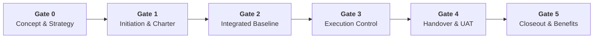

  🌐 <strong>Language:</strong> English Manual
  <a class="lang-switch-btn" href="../ar/04_stage_gates_and_governance.md">🇸🇦 الانتقال للنسخة العربية (Arabic Manual) →</a>

  

# 🚪 Tasleemat Stage-Gate Governance Kits Guide
**Document Reference:** `TASLEEMAT-STAGE-GATES-v2.0`  
**Standard:** PMI PMBOK® Guide 6th, 7th & 8th Edition Standard  

---

## 🎯 Executive Overview

The **Stage-Gate Governance Framework** structures the 102 Tasleemat PMO forms into 6 formal, sequential decision checkpoints (Gates 0 through 5). Instead of burdening project teams with all artifacts at once, this framework establishes clear **Entry Criteria**, **Mandatory Artifact Bundles**, **Review Checklists**, and **Exit Criteria** required to authorize resources and release funding for each subsequent phase.

---

## 🏛️ The Six Governance Stage-Gates

### 🚪 Gate 0: Concept & Strategic Justification (دراسة الفكرة والجدوى)
* **Objective:** Validate strategic alignment, business justification, and preliminary feasibility before committing capital and project resources.
* **Governing Body:** Executive Strategy Committee / Investment Review Board / CFO.
* **Entry Criteria:** Business opportunity or strategic need identified; initial sponsorship established.
* **Mandatory Artifact Kit:**
  1. `PMO-00.06` **OKR Alignment Matrix:** Maps initiative to enterprise strategic objectives and Key Results.
  2. `PMO-01.01` **Business Case:** Need statement, options analysis, cost of inaction, and financial metrics (NPV/ROI).
  3. `PMO-01.02` **Feasibility Study:** Technical, operational, legal, and economic feasibility.
  4. `PMO-01.04` **Value Proposition Canvas:** Customer segments, pains, gains, and value drivers.
  5. `PMO-02.04` **AI Canvas & Use Case Card:** (For AI initiatives) Data availability, model viability, and value hypothesis.
* **Gate Review Checklist:**
  - [ ] Does the initiative directly support a corporate strategic objective or mandate?
  - [ ] Is the cost of inaction clearly quantified against the required investment envelope?
  - [ ] Are strategic risks and high-level constraints within organizational tolerance?
* **Exit Criteria:** Formal approval of the Business Case and inclusion in the Portfolio Roadmap (`PMO-00.01`).

---

### 🚪 Gate 1: Initiation & Authorization (الاعتماد المؤسسي والبدء)
* **Objective:** Formally authorize the project, appoint the Project Manager, define initial scope boundaries, and identify key stakeholders.
* **Governing Body:** Project Sponsor & PMO Director.
* **Entry Criteria:** Approved Gate 0 Business Case and resource allocation approval.
* **Mandatory Artifact Kit:**
  1. `PMO-03.01` **Project Charter:** Authorizes project manager and defines high-level scope, budget, and milestones.
  2. `PMO-03.04` **Stakeholder Register:** Catalogs internal and external stakeholders, expectations, and influence.
  3. `PMO-03.03` **Assumption Log:** Documents initial assumptions, constraints, and validation owners.
  4. `PMO-02.01` **Development Approach Assessment:** Selects delivery methodology (Predictive, Agile, or Hybrid).
  5. `PMO-02.02` **Complexity Assessment Model:** Determines governance tier (Tier 1 Mega, Tier 2 Standard, Tier 3 Lean).
  6. `PMO-03.02` **Product Vision:** (For Agile/Product initiatives) Product vision statement and target outcomes.
* **Gate Review Checklist:**
  - [ ] Is the Project Charter signed by the executive sponsor and PMO lead?
  - [ ] Is the project management methodology and governance tier assigned?
  - [ ] Are initial project assumptions and high-risk dependencies cataloged?
* **Exit Criteria:** Signed Project Charter and authorization to proceed to integrated baseline planning.

---

### 🚪 Gate 2: Integrated Baseline Sign-off (اعتماد خط الأساس للتخطيط)
* **Objective:** Establish and freeze the performance measurement baselines (Scope, Schedule, Cost) and approve subsidiary management plans.
* **Governing Body:** Project Sponsor, PMO Director & Departmental Stakeholders.
* **Entry Criteria:** Authorized Project Charter and mobilized project planning team.
* **Mandatory Artifact Kit:**
  1. `PMO-04.01.01` **Project Management Plan:** Integrated master plan governing project execution.
  2. `PMO-04.02.05` & `PMO-04.02.06` **Scope Statement & WBS Dictionary:** 100% scope decomposition and deliverables.
  3. `PMO-04.03.07` **Project Schedule Baseline:** Critical path network diagram, duration estimates, and milestone dates.
  4. `PMO-04.04.04` **Cost Baseline & Budget Allocation:** Work package cost estimates, contingency reserves, and cash flow curve.
  5. `PMO-04.08.02` **Risk Register & Mitigation Plan:** Identified risks, probability/impact scores, and response strategies.
  6. `PMO-04.06.04` **RACI Matrix:** Responsibility Assignment Matrix for all deliverables and activities.
  7. `PMO-04.05.01` **Quality Management Plan:** Quality standards, metrics, and Definition of Done (DoD).
  8. `PMO-04.07.01` **Communications Plan:** Stakeholder communication frequency, channels, and reporting formats.
* **Gate Review Checklist:**
  - [ ] Are Scope, Schedule, and Cost baselines fully reconciled and realistic?
  - [ ] Are resource requirements committed by functional managers?
  - [ ] Is the contingency reserve justified by quantitative risk modeling?
* **Exit Criteria:** Formal sign-off on the Integrated Project Baseline; authorization to expend capital and commence execution.

---

### 🚪 Gate 3: Operational Execution & Governance Reviews (المراجعات التشغيلية والتحكم)
* **Objective:** Ensure delivery stays aligned with baseline targets, manage changes through formal CCB, and resolve operational issues.
* **Governing Body:** Steering Committee, Project Manager & PMO Lead.
* **Cadence:** Weekly team reviews, bi-weekly PMO checkpoints, and monthly Steering Committee reviews.
* **Mandatory Artifact Kit:**
  1. `PMO-06.01` **Project Status Report:** Executive summary, milestone health, RAG indicators, and key risks.
  2. `PMO-06.05` **Earned Value Analysis (EVM):** CPI, SPI, CV, SV, EAC, and TCPI quantitative metrics.
  3. `PMO-06.12` **Flow Metrics & Value Stream:** (For Agile/Hybrid) Lead Time, Cycle Time, WIP limits, and throughput.
  4. `PMO-05.01` **Issue Log:** Active operational issues, priority, impact, owners, and resolution target dates.
  5. `PMO-05.02` **Decision Log:** Context, options considered, rationale, and authority sign-offs for decisions.
  6. `PMO-05.04` **Change Log & Requests (`PMO-05.03`):** Approved, rejected, and pending change requests with budget/time impact.
* **Gate Review Checklist:**
  - [ ] Are cost and schedule variances (CPI/SPI) within approved governance tolerances ($0.90 \le \text{CPI/SPI} \le 1.10$)?
  - [ ] Are all scope changes approved by the Change Control Board (CCB) before work begins?
  - [ ] Are critical impediments escalated within the defined SLA timeframes?
* **Exit Criteria:** Continuous green/amber governance health; all stage deliverables completed and verified by QA.

---

### 🚪 Gate 4: Acceptance & Operational Handover (القبول والجاهزية التشغيلية)
* **Objective:** Validate that all deliverables meet technical and quality specifications, conduct user acceptance testing, and transition outputs to operations.
* **Governing Body:** Business Owner, Quality Director, Operations Lead & Client Representative.
* **Entry Criteria:** 100% development/construction completed; all unit and integration testing passed.
* **Mandatory Artifact Kit:**
  1. `PMO-06.10` **User Acceptance Testing (UAT) Sign-off:** Test scenarios, pass/fail results, and defect clearance.
  2. `PMO-06.08` **Deliverable Acceptance Form:** Formal sign-off on contractual acceptance criteria.
  3. `PMO-07.04` **Transition to Operations Checklist:** Knowledge transfer, training completion, operational documentation, and support SLAs.
  4. `PMO-04.11.02` **Training Plan & Log:** End-user training completion metrics and operational readiness sign-off.
* **Gate Review Checklist:**
  - [ ] Have all Severity 1 & 2 defects been resolved and retested?
  - [ ] Is operational documentation (runbooks, manuals, SLAs) handed over to support teams?
  - [ ] Has end-user training been delivered with passing competency scores?
* **Exit Criteria:** Signed Deliverable Acceptance and Operations Transition confirmation; system live in production.

---

### 🚪 Gate 5: Formal Closeout & Benefits Realization (الإغلاق المؤسسي وتحقيق المنافع)
* **Objective:** Administratively close the project, release resources, archive assets, capture lessons learned, and establish benefits monitoring.
* **Governing Body:** Project Sponsor, PMO Director & Benefits Owner.
* **Entry Criteria:** Successful operational cutover (Gate 4 passed); transition period concluded.
* **Mandatory Artifact Kit:**
  1. `PMO-07.03` **Project Closure Report:** Summary of planned vs. actual performance, financial closeout, and sign-offs.
  2. `PMO-07.01` **Lessons Learned Summary:** Root-cause analysis of successes, challenges, and recommendations for organizational knowledge base.
  3. `PMO-07.02` **Contract Closeout Report:** Verification of vendor deliverables, final invoicing, and release of retentions.
  4. `PMO-07.05` **Post-Implementation Review (PIR):** 3-to-6-month post-launch assessment of operational stability.
  5. `PMO-01.03` **Benefits Realization Plan Update:** Baseline vs. actual benefits realized, KPIs, and long-term ownership transfer.
* **Gate Review Checklist:**
  - [ ] Are all vendor contracts administratively and financially closed?
  - [ ] Have project team resources been formally reassigned or released?
  - [ ] Are lessons learned cataloged in the enterprise PMO knowledge repository?
  - [ ] Is benefits realization assigned to an operational business owner?
* **Exit Criteria:** Formal project closure certificate signed by Sponsor and PMO Director; project archived in PMO records.

---

## 📊 Summary Matrix: Forms by Stage-Gate

| Stage-Gate | Key Focus | Primary Authority | Mandatory Form Count | Core Reference Codes |
| :--- | :--- | :--- | :---: | :--- |
| **Gate 0** | Strategic Alignment & Business Justification | Investment Board / CFO | 5 | `PMO-00.06`, `PMO-01.01`, `PMO-01.02`, `PMO-01.04`, `PMO-02.04` |
| **Gate 1** | Initiation & Authorization | Sponsor & PMO Director | 6 | `PMO-03.01`, `PMO-03.03`, `PMO-03.04`, `PMO-02.01`, `PMO-02.02`, `PMO-03.02` |
| **Gate 2** | Integrated Baseline Sign-off | Sponsor & PMO Director | 8–15 | `PMO-04.01.01`, `PMO-04.02.06`, `PMO-04.03.07`, `PMO-04.04.04`, `PMO-04.08.02` |
| **Gate 3** | Operational Execution & Control | Steering Committee & PM | 6–10 | `PMO-06.01`, `PMO-06.05`, `PMO-06.12`, `PMO-05.01`, `PMO-05.02`, `PMO-05.04` |
| **Gate 4** | Acceptance & Handover | Business Owner & QA | 4 | `PMO-06.08`, `PMO-06.10`, `PMO-07.04`, `PMO-04.11.02` |
| **Gate 5** | Closeout & Benefits | Sponsor & Benefits Owner | 5 | `PMO-07.03`, `PMO-07.01`, `PMO-07.02`, `PMO-07.05`, `PMO-01.03` |
