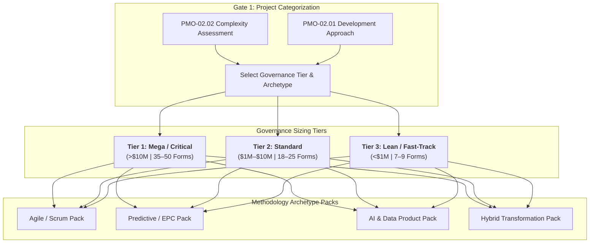

  🌐 <strong>Language:</strong> English Manual
  

    <a class="lang-switch-btn github-btn" href="https://github.com/fakhruldeen/Tasleemat/blob/main/docs/en/05_tailoring_profiles.md" target="_blank" rel="noopener noreferrer">🐙 View on GitHub ↗</a>
    <a class="lang-switch-btn" href="../ar/05_tailoring_profiles.html">🇸🇦 الانتقال للنسخة العربية (Arabic Manual) →</a>
  

  

# ⚖️ Tasleemat Project Sizing & Tailoring Profiles Guide
**Document Reference:** `TASLEEMAT-TAILORING-PROFILES-v2.0`  
**Standard:** PMI PMBOK® Guide 6th, 7th & 8th Edition Standard  

---

## 🎯 Executive Overview

To prevent administrative bureaucracy on simple initiatives and ensure rigorous governance on critical investments, the **Tasleemat Sizing and Tailoring Framework** categorizes projects into **3 Governance Tiers** and provides **4 Methodology Archetype Packs**. 

Project Managers and PMO Directors use the **Complexity Assessment Model (`PMO-02.02`)** and **Development Approach Assessment (`PMO-02.01`)** at Gate 1 to select the minimum mandatory artifact set required for their specific project.

---

## 🏛️ The Three Project Governance Tiers

### 🔴 Tier 1: Mega & High-Complexity Projects (Strategic Tier)
* **Profile Criteria:**
  * **Budget:** $> \$10\text{M}$ (or $> 40\text{M}$ SAR).
  * **Duration:** $> 12\text{ months}$.
  * **Complexity:** High regulatory impact, cross-entity dependencies, multi-vendor contracting, high public exposure, or critical infrastructure impact.
* **Governance Cadence:** Monthly Executive Steering Committee, bi-weekly PMO tollgates, weekly project core reviews.
* **Artifact Count:** **35–50 Standardized Forms**.
* **Mandatory Artifact Set:**
  * **Initiation:** `PMO-00.06`, `PMO-01.01`, `PMO-01.02`, `PMO-03.01`, `PMO-03.04`, `PMO-03.05`, `PMO-03.03`.
  * **Planning:** Complete Project Management Plan (`PMO-04.01.01`), Scope Statement & WBS (`PMO-04.02.05`/`06`), Master Schedule Baseline (`PMO-04.03.07`), Cost Baseline & Reserves (`PMO-04.04.04`), Quality Plan (`PMO-04.05.01`), RACI Matrix (`PMO-04.06.04`), Communications Plan (`PMO-04.07.01`), Risk Register & Quantitative Modeling (`PMO-04.08.02`/`04`/`07`), Procurement Strategy & SOW (`PMO-04.09.02`/`04`), Stakeholder Engagement Plan (`PMO-04.10.01`), OCM Plan (`PMO-04.11.01`), ESG Plan (`PMO-04.12.01`).
  * **Execution & Control:** Status Reports (`PMO-06.01`), Earned Value Analysis (`PMO-06.05`), Issue Log (`PMO-05.01`), Decision Log (`PMO-05.02`), Change Control Log (`PMO-05.04`), Quality & Procurement Audits (`PMO-05.05`/`PMO-06.07`), Vendor Scorecards (`PMO-06.09`).
  * **Closing:** Deliverable Acceptance (`PMO-06.08`), UAT Sign-off (`PMO-06.10`), Handover Checklist (`PMO-07.04`), Contract Closeouts (`PMO-07.02`), Project Closure Report (`PMO-07.03`), Lessons Learned Summary (`PMO-07.01`), Post-Implementation Review (`PMO-07.05`), Benefits Plan (`PMO-01.03`).

---

### 🟡 Tier 2: Standard Enterprise Projects (Standard Tier)
* **Profile Criteria:**
  * **Budget:** $\$1\text{M} - \$10\text{M}$ (or $4\text{M} - 40\text{M}$ SAR).
  * **Duration:** $3 - 12\text{ months}$.
  * **Complexity:** Standard organizational changes, internal systems development, moderate risk profile.
* **Governance Cadence:** Bi-weekly Sponsor checkpoints, monthly PMO health checks.
* **Artifact Count:** **18–25 Standardized Forms**.
* **Mandatory Artifact Set:**
  * **Initiation:** `PMO-01.01`, `PMO-03.01`, `PMO-03.04`, `PMO-03.03`, `PMO-02.01`.
  * **Planning:** Project Management Plan (`PMO-04.01.01`), Scope Baseline / WBS (`PMO-04.02.06`), Schedule Baseline (`PMO-04.03.07`), Cost Baseline (`PMO-04.04.04`), RACI Matrix (`PMO-04.06.04`), Risk Register (`PMO-04.08.02`), Communications Matrix (`PMO-04.07.01`).
  * **Execution & Control:** Project Status Report (`PMO-06.01`), Issue Log (`PMO-05.01`), Decision Log (`PMO-05.02`), Change Log & Requests (`PMO-05.04`/`03`), Variance Analysis (`PMO-06.04`).
  * **Closing:** UAT Sign-off (`PMO-06.10`), Deliverable Acceptance (`PMO-06.08`), Handover Checklist (`PMO-07.04`), Project Closure Report (`PMO-07.03`), Lessons Learned (`PMO-07.01`).

---

### 🟢 Tier 3: Lean & Fast-Track Projects (Lightweight Tier)
* **Profile Criteria:**
  * **Budget:** $< \$1\text{M}$ (or $< 4\text{M}$ SAR).
  * **Duration:** $< 3\text{ months}$.
  * **Complexity:** Low technical risk, small collocated team ($< 8$ members), minimal cross-departmental impact.
* **Governance Cadence:** Weekly standup, milestone sign-off with Sponsor.
* **Artifact Count:** **7–9 Standardized Forms (Maximum Lean)**.
* **Mandatory Artifact Set:**
  1. `PMO-03.01` **Project Charter (Lean):** High-level objectives, timeline, budget, and single-page scope statement.
  2. `PMO-04.02.08` **Product Backlog / Activity List (`PMO-04.03.02`):** Prioritized list of deliverable tasks and deliverables.
  3. `PMO-04.08.02` **Risk Register (Simplified):** Top 5 risks and immediate mitigations.
  4. `PMO-05.01` **Issue & Decision Log (`PMO-05.02`):** Operational tracking of blockers and decisions.
  5. `PMO-06.01` **Project Status Report (One-Pager):** Bi-weekly status flash for sponsor.
  6. `PMO-06.08` **Deliverable Acceptance Form:** Formal sign-off on delivered product.
  7. `PMO-07.04` **Transition & Handover Checklist:** Verification of handoff to operations.
  8. `PMO-07.03` **Project Closure Summary:** Final acceptance and lessons learned.

---

## 📦 Delivery Methodology Archetype Packs

Regardless of project size, teams augment their governance tier with specific **Methodology Archetype Packs**:

### 1. 🏃 Agile & Scrum Delivery Pack
* **Best for:** Web applications, mobile apps, MVP releases, iterative digital solutions.
* **Specialized Forms:**
  * `PMO-03.02` Product Vision
  * `PMO-04.02.08` Product Backlog
  * `PMO-04.02.09` User Story Mapping Canvas
  * `PMO-04.03.10` Sprint Planning Log
  * `PMO-04.05.03` Definition of Ready (DoR) & Definition of Done (DoD)
  * `PMO-04.06.05` Team Charter & Working Agreements
  * `PMO-05.08` Sprint Retrospective
  * `PMO-05.10` Impediment Log
  * `PMO-06.12` Agile Flow Metrics & Cumulative Flow Diagram

---

### 2. 🏗️ Predictive & EPC Engineering Pack
* **Best for:** Civil engineering, construction, physical infrastructure, industrial procurement.
* **Specialized Forms:**
  * `PMO-04.02.05` Detailed Project Scope Statement
  * `PMO-04.02.06` Work Breakdown Structure (WBS) & Dictionary
  * `PMO-04.03.05` Schedule Network Diagram (Critical Path Method)
  * `PMO-04.04.04` Cost Baseline & S-Curve Cash Flow
  * `PMO-04.09.02` Procurement Strategy & RFP Packaging
  * `PMO-04.09.04` Statement of Work (SOW)
  * `PMO-05.05` Quality Audit Log
  * `PMO-06.05` Earned Value Analysis (EVM Report)
  * `PMO-07.02` Contract Closeout Report

---

### 3. 🤖 AI & Data Product Governance Pack
* **Best for:** Machine Learning models, LLM agents, Enterprise Data Warehouses, GenAI implementations.
* **Specialized Forms:**
  * `PMO-02.04` AI Canvas and Use Case Card
  * `PMO-02.03` AI Ethics and Governance Checklist
  * `PMO-02.06` Data Privacy and Ethics Assessment
  * `PMO-02.05` AI Model Card and Fact Sheet
  * `PMO-05.09` Prompt Library & Prompt Engineering Log
  * `PMO-06.10` UAT Sign-off & Model Performance Validation

---

### 4. 🌐 Hybrid Value Delivery Pack
* **Best for:** Enterprise ERP implementations, Core Banking replacements, Government Digital Transformation.
* **Specialized Forms:** Combines Predictive Stage-Gates (0–2, 4–5) with Agile iterative execution during Stage 3 (Sprint Backlogs, Flow Metrics, Retrospectives).

---

## 📊 Summary Tailoring Matrix

| Project Attribute | Tier 1 (Mega) | Tier 2 (Standard) | Tier 3 (Lean) |
| :--- | :---: | :---: | :---: |
| **Budget** | $> \$10\text{M}$ | $\$1\text{M} - \$10\text{M}$ | $< \$1\text{M}$ |
| **Duration** | $> 12\text{ months}$ | $3 - 12\text{ months}$ | $< 3\text{ months}$ |
| **Form Set Size** | 35–50 Forms | 18–25 Forms | 7–9 Forms |
| **Steering Committee** | Mandatory (Monthly) | Optional / Ad-hoc | None (Sponsor Direct) |
| **Earned Value (EVM)** | Mandatory (`PMO-06.05`) | Recommended | Optional / Variance only |
| **Risk Management** | Quantitative Modeling | Standard Register | Top 5 Log |
| **Change Control** | Formal CCB Board | Sponsor Approval | PM / Sponsor Verbal+Log |