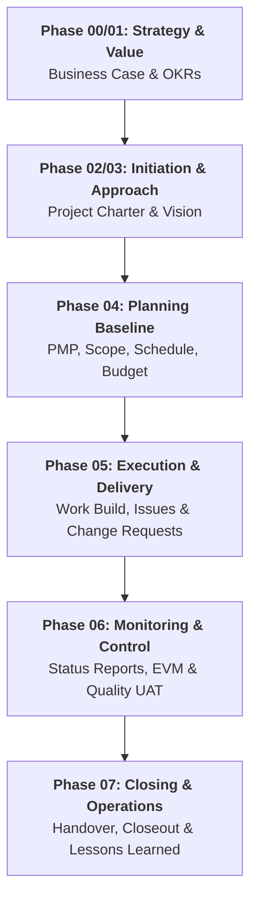

  🌐 <strong>Language:</strong> English Manual
  

    <a class="lang-switch-btn github-btn" href="https://github.com/fakhruldeen/Tasleemat/blob/main/docs/en/07_document_dependencies.md" target="_blank" rel="noopener noreferrer">🐙 View on GitHub ↗</a>
    <a class="lang-switch-btn" href="../ar/07_document_dependencies.html">🇸🇦 الانتقال للنسخة العربية (Arabic Manual) →</a>
  

---
type: Guide
token_pointer: /_tokens/docs/en/07_document_dependencies.npy
token_count: 7605
tokenizer_model_id: tiktoken/o200k_base
created_at: '2026-10-06T16:05:28.494351+00:00'
---

  

# 🔗 Tasleemat Document Dependencies & Lifecycle Network
**Document Reference:** `TASLEEMAT-DOC-DEPENDENCIES-v2.0`  
**Standards:** Aligned with PMI PMBOK® Guide 6th, 7th & 8th Editions

---

## 🎯 Executive Overview

In the **Tasleemat PMO Operating Framework**, no deliverable exists in isolation. Every artifact operates as a node in a **Directed Acyclic Graph (DAG)** connecting strategic drivers, baselines, execution logs, and closure assets across all 8 phases:

---

## 📋 Comprehensive Deliverable Dependency Index (All 102 Artifacts)

| Code | Deliverable Name | Lifecycle Gate / Phase | Primary Inputs (Predecessors) | Primary Outputs (Successors) |
| :---: | :--- | :--- | :--- | :--- |
| **`PMO-00.01`** | Portfolio Roadmap | General Governance Gate | `PMO-06.08 Acceptance Form`, `PMO-06.10 UAT Signoff` | `PMO-07.04 Operations Handover`, `PMO-07.05 Post-Implementation Review` |
| **`PMO-00.02`** | Program Charter | General Governance Gate | `PMO-06.08 Acceptance Form`, `PMO-06.10 UAT Signoff` | `PMO-07.04 Operations Handover`, `PMO-07.05 Post-Implementation Review` |
| **`PMO-00.03`** | Interdependency Register | General Governance Gate | `PMO-06.08 Acceptance Form`, `PMO-06.10 UAT Signoff` | `PMO-07.04 Operations Handover`, `PMO-07.05 Post-Implementation Review` |
| **`PMO-00.04`** | Resource Capacity Matrix | General Governance Gate | `PMO-06.08 Acceptance Form`, `PMO-06.10 UAT Signoff` | `PMO-07.04 Operations Handover`, `PMO-07.05 Post-Implementation Review` |
| **`PMO-00.05`** | PMO Maturity Assessment | General Governance Gate | `PMO-06.08 Acceptance Form`, `PMO-06.10 UAT Signoff` | `PMO-07.04 Operations Handover`, `PMO-07.05 Post-Implementation Review` |
| **`PMO-00.06`** | OKR Alignment Matrix | General Governance Gate | `PMO-06.08 Acceptance Form`, `PMO-06.10 UAT Signoff` | `PMO-07.04 Operations Handover`, `PMO-07.05 Post-Implementation Review` |
| **`PMO-01.01`** | Business Case | General Governance Gate | `PMO-06.08 Acceptance Form`, `PMO-06.10 UAT Signoff` | `PMO-07.04 Operations Handover`, `PMO-07.05 Post-Implementation Review` |
| **`PMO-01.02`** | Benefits Management Plan | General Governance Gate | `PMO-06.08 Acceptance Form`, `PMO-06.10 UAT Signoff` | `PMO-07.04 Operations Handover`, `PMO-07.05 Post-Implementation Review` |
| **`PMO-01.03`** | Value Realization Register | General Governance Gate | `PMO-06.08 Acceptance Form`, `PMO-06.10 UAT Signoff` | `PMO-07.04 Operations Handover`, `PMO-07.05 Post-Implementation Review` |
| **`PMO-01.04`** | Gap Analysis Report | General Governance Gate | `PMO-06.08 Acceptance Form`, `PMO-06.10 UAT Signoff` | `PMO-07.04 Operations Handover`, `PMO-07.05 Post-Implementation Review` |
| **`PMO-02.01`** | Tailoring Plan | General Governance Gate | `PMO-06.08 Acceptance Form`, `PMO-06.10 UAT Signoff` | `PMO-07.04 Operations Handover`, `PMO-07.05 Post-Implementation Review` |
| **`PMO-02.02`** | AI Governance Plan | General Governance Gate | `PMO-06.08 Acceptance Form`, `PMO-06.10 UAT Signoff` | `PMO-07.04 Operations Handover`, `PMO-07.05 Post-Implementation Review` |
| **`PMO-02.03`** | AI Readiness Assessment | General Governance Gate | `PMO-06.08 Acceptance Form`, `PMO-06.10 UAT Signoff` | `PMO-07.04 Operations Handover`, `PMO-07.05 Post-Implementation Review` |
| **`PMO-02.04`** | AI Use Case Canvas | General Governance Gate | `PMO-06.08 Acceptance Form`, `PMO-06.10 UAT Signoff` | `PMO-07.04 Operations Handover`, `PMO-07.05 Post-Implementation Review` |
| **`PMO-02.05`** | AI Model Card and Fact Sheet | General Governance Gate | `PMO-06.08 Acceptance Form`, `PMO-06.10 UAT Signoff` | `PMO-07.04 Operations Handover`, `PMO-07.05 Post-Implementation Review` |
| **`PMO-02.06`** | Data Privacy and Ethics Assessment | General Governance Gate | `PMO-06.08 Acceptance Form`, `PMO-06.10 UAT Signoff` | `PMO-07.04 Operations Handover`, `PMO-07.05 Post-Implementation Review` |
| **`PMO-03.01`** | Project Charter | General Governance Gate | `PMO-06.08 Acceptance Form`, `PMO-06.10 UAT Signoff` | `PMO-07.04 Operations Handover`, `PMO-07.05 Post-Implementation Review` |
| **`PMO-03.02`** | Product Vision | General Governance Gate | `PMO-06.08 Acceptance Form`, `PMO-06.10 UAT Signoff` | `PMO-07.04 Operations Handover`, `PMO-07.05 Post-Implementation Review` |
| **`PMO-03.03`** | Assumption Log | General Governance Gate | `PMO-06.08 Acceptance Form`, `PMO-06.10 UAT Signoff` | `PMO-07.04 Operations Handover`, `PMO-07.05 Post-Implementation Review` |
| **`PMO-03.04`** | Stakeholder Register | General Governance Gate | `PMO-06.08 Acceptance Form`, `PMO-06.10 UAT Signoff` | `PMO-07.04 Operations Handover`, `PMO-07.05 Post-Implementation Review` |
| **`PMO-03.05`** | Stakeholder Analysis | General Governance Gate | `PMO-06.08 Acceptance Form`, `PMO-06.10 UAT Signoff` | `PMO-07.04 Operations Handover`, `PMO-07.05 Post-Implementation Review` |
| **`PMO-04.01.01`** | Project Management Plan | General Governance Gate | `PMO-06.08 Acceptance Form`, `PMO-06.10 UAT Signoff` | `PMO-07.04 Operations Handover`, `PMO-07.05 Post-Implementation Review` |
| **`PMO-04.01.02`** | Change Management Plan | General Governance Gate | `PMO-06.08 Acceptance Form`, `PMO-06.10 UAT Signoff` | `PMO-07.04 Operations Handover`, `PMO-07.05 Post-Implementation Review` |
| **`PMO-04.01.03`** | Project Roadmap | General Governance Gate | `PMO-06.08 Acceptance Form`, `PMO-06.10 UAT Signoff` | `PMO-07.04 Operations Handover`, `PMO-07.05 Post-Implementation Review` |
| **`PMO-04.02.01`** | Scope Management Plan | General Governance Gate | `PMO-06.08 Acceptance Form`, `PMO-06.10 UAT Signoff` | `PMO-07.04 Operations Handover`, `PMO-07.05 Post-Implementation Review` |
| **`PMO-04.02.02`** | Requirements Management Plan | General Governance Gate | `PMO-06.08 Acceptance Form`, `PMO-06.10 UAT Signoff` | `PMO-07.04 Operations Handover`, `PMO-07.05 Post-Implementation Review` |
| **`PMO-04.02.03`** | Requirements Documentation | General Governance Gate | `PMO-06.08 Acceptance Form`, `PMO-06.10 UAT Signoff` | `PMO-07.04 Operations Handover`, `PMO-07.05 Post-Implementation Review` |
| **`PMO-04.02.04`** | Requirements Traceability Matrix | General Governance Gate | `PMO-06.08 Acceptance Form`, `PMO-06.10 UAT Signoff` | `PMO-07.04 Operations Handover`, `PMO-07.05 Post-Implementation Review` |
| **`PMO-04.02.05`** | Project Scope Statement | General Governance Gate | `PMO-06.08 Acceptance Form`, `PMO-06.10 UAT Signoff` | `PMO-07.04 Operations Handover`, `PMO-07.05 Post-Implementation Review` |
| **`PMO-04.02.06`** | Work Breakdown Structure | General Governance Gate | `PMO-06.08 Acceptance Form`, `PMO-06.10 UAT Signoff` | `PMO-07.04 Operations Handover`, `PMO-07.05 Post-Implementation Review` |
| **`PMO-04.02.07`** | WBS Dictionary | General Governance Gate | `PMO-06.08 Acceptance Form`, `PMO-06.10 UAT Signoff` | `PMO-07.04 Operations Handover`, `PMO-07.05 Post-Implementation Review` |
| **`PMO-04.02.08`** | Product Backlog | General Governance Gate | `PMO-06.08 Acceptance Form`, `PMO-06.10 UAT Signoff` | `PMO-07.04 Operations Handover`, `PMO-07.05 Post-Implementation Review` |
| **`PMO-04.02.09`** | User Story Mapping Canvas | General Governance Gate | `PMO-06.08 Acceptance Form`, `PMO-06.10 UAT Signoff` | `PMO-07.04 Operations Handover`, `PMO-07.05 Post-Implementation Review` |
| **`PMO-04.03.01`** | Schedule Management Plan | General Governance Gate | `PMO-06.08 Acceptance Form`, `PMO-06.10 UAT Signoff` | `PMO-07.04 Operations Handover`, `PMO-07.05 Post-Implementation Review` |
| **`PMO-04.03.02`** | Activity List | General Governance Gate | `PMO-06.08 Acceptance Form`, `PMO-06.10 UAT Signoff` | `PMO-07.04 Operations Handover`, `PMO-07.05 Post-Implementation Review` |
| **`PMO-04.03.03`** | Activity Attributes | General Governance Gate | `PMO-06.08 Acceptance Form`, `PMO-06.10 UAT Signoff` | `PMO-07.04 Operations Handover`, `PMO-07.05 Post-Implementation Review` |
| **`PMO-04.03.04`** | Milestone List | General Governance Gate | `PMO-06.08 Acceptance Form`, `PMO-06.10 UAT Signoff` | `PMO-07.04 Operations Handover`, `PMO-07.05 Post-Implementation Review` |
| **`PMO-04.03.05`** | Network Diagram | General Governance Gate | `PMO-06.08 Acceptance Form`, `PMO-06.10 UAT Signoff` | `PMO-07.04 Operations Handover`, `PMO-07.05 Post-Implementation Review` |
| **`PMO-04.03.06`** | Duration Estimates | General Governance Gate | `PMO-06.08 Acceptance Form`, `PMO-06.10 UAT Signoff` | `PMO-07.04 Operations Handover`, `PMO-07.05 Post-Implementation Review` |
| **`PMO-04.03.07`** | Duration Estimating Worksheet | General Governance Gate | `PMO-06.08 Acceptance Form`, `PMO-06.10 UAT Signoff` | `PMO-07.04 Operations Handover`, `PMO-07.05 Post-Implementation Review` |
| **`PMO-04.03.08`** | Project Schedule | General Governance Gate | `PMO-06.08 Acceptance Form`, `PMO-06.10 UAT Signoff` | `PMO-07.04 Operations Handover`, `PMO-07.05 Post-Implementation Review` |
| **`PMO-04.03.09`** | Release Plan | General Governance Gate | `PMO-06.08 Acceptance Form`, `PMO-06.10 UAT Signoff` | `PMO-07.04 Operations Handover`, `PMO-07.05 Post-Implementation Review` |
| **`PMO-04.03.10`** | Sprint Planning Log | General Governance Gate | `PMO-06.08 Acceptance Form`, `PMO-06.10 UAT Signoff` | `PMO-07.04 Operations Handover`, `PMO-07.05 Post-Implementation Review` |
| **`PMO-04.04.01`** | Cost Management Plan | General Governance Gate | `PMO-06.08 Acceptance Form`, `PMO-06.10 UAT Signoff` | `PMO-07.04 Operations Handover`, `PMO-07.05 Post-Implementation Review` |
| **`PMO-04.04.02`** | Cost Estimates | General Governance Gate | `PMO-06.08 Acceptance Form`, `PMO-06.10 UAT Signoff` | `PMO-07.04 Operations Handover`, `PMO-07.05 Post-Implementation Review` |
| **`PMO-04.04.03`** | Cost Estimating Worksheet | General Governance Gate | `PMO-06.08 Acceptance Form`, `PMO-06.10 UAT Signoff` | `PMO-07.04 Operations Handover`, `PMO-07.05 Post-Implementation Review` |
| **`PMO-04.04.04`** | Cost Baseline | General Governance Gate | `PMO-06.08 Acceptance Form`, `PMO-06.10 UAT Signoff` | `PMO-07.04 Operations Handover`, `PMO-07.05 Post-Implementation Review` |
| **`PMO-04.05.01`** | Quality Management Plan | General Governance Gate | `PMO-06.08 Acceptance Form`, `PMO-06.10 UAT Signoff` | `PMO-07.04 Operations Handover`, `PMO-07.05 Post-Implementation Review` |
| **`PMO-04.05.02`** | Quality Metrics | General Governance Gate | `PMO-06.08 Acceptance Form`, `PMO-06.10 UAT Signoff` | `PMO-07.04 Operations Handover`, `PMO-07.05 Post-Implementation Review` |
| **`PMO-04.05.03`** | Definition of Ready and Done | General Governance Gate | `PMO-06.08 Acceptance Form`, `PMO-06.10 UAT Signoff` | `PMO-07.04 Operations Handover`, `PMO-07.05 Post-Implementation Review` |
| **`PMO-04.06.01`** | Resource Management Plan | General Governance Gate | `PMO-06.08 Acceptance Form`, `PMO-06.10 UAT Signoff` | `PMO-07.04 Operations Handover`, `PMO-07.05 Post-Implementation Review` |
| **`PMO-04.06.02`** | Resource Requirements | General Governance Gate | `PMO-06.08 Acceptance Form`, `PMO-06.10 UAT Signoff` | `PMO-07.04 Operations Handover`, `PMO-07.05 Post-Implementation Review` |
| **`PMO-04.06.03`** | Resource Breakdown Structure | General Governance Gate | `PMO-06.08 Acceptance Form`, `PMO-06.10 UAT Signoff` | `PMO-07.04 Operations Handover`, `PMO-07.05 Post-Implementation Review` |
| **`PMO-04.06.04`** | Responsibility Assignment Matrix | General Governance Gate | `PMO-06.08 Acceptance Form`, `PMO-06.10 UAT Signoff` | `PMO-07.04 Operations Handover`, `PMO-07.05 Post-Implementation Review` |
| **`PMO-04.06.05`** | Team Charter | General Governance Gate | `PMO-06.08 Acceptance Form`, `PMO-06.10 UAT Signoff` | `PMO-07.04 Operations Handover`, `PMO-07.05 Post-Implementation Review` |
| **`PMO-04.06.06`** | Team Psychological Safety and Wellbeing Index | General Governance Gate | `PMO-06.08 Acceptance Form`, `PMO-06.10 UAT Signoff` | `PMO-07.04 Operations Handover`, `PMO-07.05 Post-Implementation Review` |
| **`PMO-04.07.01`** | Communications Management Plan | General Governance Gate | `PMO-06.08 Acceptance Form`, `PMO-06.10 UAT Signoff` | `PMO-07.04 Operations Handover`, `PMO-07.05 Post-Implementation Review` |
| **`PMO-04.08.01`** | Risk Management Plan | General Governance Gate | `PMO-06.08 Acceptance Form`, `PMO-06.10 UAT Signoff` | `PMO-07.04 Operations Handover`, `PMO-07.05 Post-Implementation Review` |
| **`PMO-04.08.02`** | Risk Register | General Governance Gate | `PMO-06.08 Acceptance Form`, `PMO-06.10 UAT Signoff` | `PMO-07.04 Operations Handover`, `PMO-07.05 Post-Implementation Review` |
| **`PMO-04.08.03`** | Probability and Impact Assessment | General Governance Gate | `PMO-06.08 Acceptance Form`, `PMO-06.10 UAT Signoff` | `PMO-07.04 Operations Handover`, `PMO-07.05 Post-Implementation Review` |
| **`PMO-04.08.04`** | Probability and Impact Matrix | General Governance Gate | `PMO-06.08 Acceptance Form`, `PMO-06.10 UAT Signoff` | `PMO-07.04 Operations Handover`, `PMO-07.05 Post-Implementation Review` |
| **`PMO-04.08.05`** | Risk Data Sheet | General Governance Gate | `PMO-06.08 Acceptance Form`, `PMO-06.10 UAT Signoff` | `PMO-07.04 Operations Handover`, `PMO-07.05 Post-Implementation Review` |
| **`PMO-04.08.06`** | Risk Report | General Governance Gate | `PMO-06.08 Acceptance Form`, `PMO-06.10 UAT Signoff` | `PMO-07.04 Operations Handover`, `PMO-07.05 Post-Implementation Review` |
| **`PMO-04.08.07`** | Risk Mitigation Action Plan | General Governance Gate | `PMO-06.08 Acceptance Form`, `PMO-06.10 UAT Signoff` | `PMO-07.04 Operations Handover`, `PMO-07.05 Post-Implementation Review` |
| **`PMO-04.09.01`** | Procurement Management Plan | General Governance Gate | `PMO-06.08 Acceptance Form`, `PMO-06.10 UAT Signoff` | `PMO-07.04 Operations Handover`, `PMO-07.05 Post-Implementation Review` |
| **`PMO-04.09.02`** | Procurement Strategy | General Governance Gate | `PMO-06.08 Acceptance Form`, `PMO-06.10 UAT Signoff` | `PMO-07.04 Operations Handover`, `PMO-07.05 Post-Implementation Review` |
| **`PMO-04.09.03`** | Source Selection Criteria | General Governance Gate | `PMO-06.08 Acceptance Form`, `PMO-06.10 UAT Signoff` | `PMO-07.04 Operations Handover`, `PMO-07.05 Post-Implementation Review` |
| **`PMO-04.09.04`** | Statement of Work SOW | General Governance Gate | `PMO-06.08 Acceptance Form`, `PMO-06.10 UAT Signoff` | `PMO-07.04 Operations Handover`, `PMO-07.05 Post-Implementation Review` |
| **`PMO-04.09.05`** | Request for Proposal RFP | General Governance Gate | `PMO-06.08 Acceptance Form`, `PMO-06.10 UAT Signoff` | `PMO-07.04 Operations Handover`, `PMO-07.05 Post-Implementation Review` |
| **`PMO-04.10.01`** | Stakeholder Engagement Plan | General Governance Gate | `PMO-06.08 Acceptance Form`, `PMO-06.10 UAT Signoff` | `PMO-07.04 Operations Handover`, `PMO-07.05 Post-Implementation Review` |
| **`PMO-04.11.01`** | OCM Strategy and Plan | General Governance Gate | `PMO-06.08 Acceptance Form`, `PMO-06.10 UAT Signoff` | `PMO-07.04 Operations Handover`, `PMO-07.05 Post-Implementation Review` |
| **`PMO-04.11.02`** | Training Plan and Log | General Governance Gate | `PMO-06.08 Acceptance Form`, `PMO-06.10 UAT Signoff` | `PMO-07.04 Operations Handover`, `PMO-07.05 Post-Implementation Review` |
| **`PMO-04.12.01`** | Sustainability and ESG Management Plan | General Governance Gate | `PMO-06.08 Acceptance Form`, `PMO-06.10 UAT Signoff` | `PMO-07.04 Operations Handover`, `PMO-07.05 Post-Implementation Review` |
| **`PMO-05.01`** | Issue Log | General Governance Gate | `PMO-06.08 Acceptance Form`, `PMO-06.10 UAT Signoff` | `PMO-07.04 Operations Handover`, `PMO-07.05 Post-Implementation Review` |
| **`PMO-05.02`** | Decision Log | General Governance Gate | `PMO-06.08 Acceptance Form`, `PMO-06.10 UAT Signoff` | `PMO-07.04 Operations Handover`, `PMO-07.05 Post-Implementation Review` |
| **`PMO-05.03`** | Change Request | General Governance Gate | `PMO-06.08 Acceptance Form`, `PMO-06.10 UAT Signoff` | `PMO-07.04 Operations Handover`, `PMO-07.05 Post-Implementation Review` |
| **`PMO-05.04`** | Change Log | General Governance Gate | `PMO-06.08 Acceptance Form`, `PMO-06.10 UAT Signoff` | `PMO-07.04 Operations Handover`, `PMO-07.05 Post-Implementation Review` |
| **`PMO-05.05`** | Quality Audit | General Governance Gate | `PMO-06.08 Acceptance Form`, `PMO-06.10 UAT Signoff` | `PMO-07.04 Operations Handover`, `PMO-07.05 Post-Implementation Review` |
| **`PMO-05.06`** | Team Performance Assessment | General Governance Gate | `PMO-06.08 Acceptance Form`, `PMO-06.10 UAT Signoff` | `PMO-07.04 Operations Handover`, `PMO-07.05 Post-Implementation Review` |
| **`PMO-05.07`** | Lessons Learned Register | General Governance Gate | `PMO-06.08 Acceptance Form`, `PMO-06.10 UAT Signoff` | `PMO-07.04 Operations Handover`, `PMO-07.05 Post-Implementation Review` |
| **`PMO-05.08`** | Retrospective | General Governance Gate | `PMO-06.08 Acceptance Form`, `PMO-06.10 UAT Signoff` | `PMO-07.04 Operations Handover`, `PMO-07.05 Post-Implementation Review` |
| **`PMO-05.09`** | Prompt Library Log | General Governance Gate | `PMO-06.08 Acceptance Form`, `PMO-06.10 UAT Signoff` | `PMO-07.04 Operations Handover`, `PMO-07.05 Post-Implementation Review` |
| **`PMO-05.10`** | Impediment Log | General Governance Gate | `PMO-06.08 Acceptance Form`, `PMO-06.10 UAT Signoff` | `PMO-07.04 Operations Handover`, `PMO-07.05 Post-Implementation Review` |
| **`PMO-05.11`** | Meeting Minutes | General Governance Gate | `PMO-06.08 Acceptance Form`, `PMO-06.10 UAT Signoff` | `PMO-07.04 Operations Handover`, `PMO-07.05 Post-Implementation Review` |
| **`PMO-05.12`** | Team Onboarding Checklist | General Governance Gate | `PMO-06.08 Acceptance Form`, `PMO-06.10 UAT Signoff` | `PMO-07.04 Operations Handover`, `PMO-07.05 Post-Implementation Review` |
| **`PMO-06.01`** | Project Status Report | General Governance Gate | `PMO-06.08 Acceptance Form`, `PMO-06.10 UAT Signoff` | `PMO-07.04 Operations Handover`, `PMO-07.05 Post-Implementation Review` |
| **`PMO-06.02`** | Team Member Status Report | General Governance Gate | `PMO-06.08 Acceptance Form`, `PMO-06.10 UAT Signoff` | `PMO-07.04 Operations Handover`, `PMO-07.05 Post-Implementation Review` |
| **`PMO-06.03`** | Contractor Status Report | General Governance Gate | `PMO-06.08 Acceptance Form`, `PMO-06.10 UAT Signoff` | `PMO-07.04 Operations Handover`, `PMO-07.05 Post-Implementation Review` |
| **`PMO-06.04`** | Variance Analysis | General Governance Gate | `PMO-06.08 Acceptance Form`, `PMO-06.10 UAT Signoff` | `PMO-07.04 Operations Handover`, `PMO-07.05 Post-Implementation Review` |
| **`PMO-06.05`** | Earned Value Analysis | General Governance Gate | `PMO-06.08 Acceptance Form`, `PMO-06.10 UAT Signoff` | `PMO-07.04 Operations Handover`, `PMO-07.05 Post-Implementation Review` |
| **`PMO-06.06`** | Risk Audit | General Governance Gate | `PMO-06.08 Acceptance Form`, `PMO-06.10 UAT Signoff` | `PMO-07.04 Operations Handover`, `PMO-07.05 Post-Implementation Review` |
| **`PMO-06.07`** | Procurement Audit | General Governance Gate | `PMO-06.08 Acceptance Form`, `PMO-06.10 UAT Signoff` | `PMO-07.04 Operations Handover`, `PMO-07.05 Post-Implementation Review` |
| **`PMO-06.08`** | Product Acceptance Form | General Governance Gate | `PMO-06.08 Acceptance Form`, `PMO-06.10 UAT Signoff` | `PMO-07.04 Operations Handover`, `PMO-07.05 Post-Implementation Review` |
| **`PMO-06.09`** | Vendor Performance Scorecard | General Governance Gate | `PMO-06.08 Acceptance Form`, `PMO-06.10 UAT Signoff` | `PMO-07.04 Operations Handover`, `PMO-07.05 Post-Implementation Review` |
| **`PMO-06.10`** | User Acceptance Testing Signoff | General Governance Gate | `PMO-06.08 Acceptance Form`, `PMO-06.10 UAT Signoff` | `PMO-07.04 Operations Handover`, `PMO-07.05 Post-Implementation Review` |
| **`PMO-06.11`** | Project Health Check | General Governance Gate | `PMO-06.08 Acceptance Form`, `PMO-06.10 UAT Signoff` | `PMO-07.04 Operations Handover`, `PMO-07.05 Post-Implementation Review` |
| **`PMO-06.12`** | Flow Metrics and Value Stream | General Governance Gate | `PMO-06.08 Acceptance Form`, `PMO-06.10 UAT Signoff` | `PMO-07.04 Operations Handover`, `PMO-07.05 Post-Implementation Review` |
| **`PMO-07.01`** | Lessons Learned Summary | General Governance Gate | `PMO-06.08 Acceptance Form`, `PMO-06.10 UAT Signoff` | `PMO-07.04 Operations Handover`, `PMO-07.05 Post-Implementation Review` |
| **`PMO-07.02`** | Contract Closeout Report | General Governance Gate | `PMO-06.08 Acceptance Form`, `PMO-06.10 UAT Signoff` | `PMO-07.04 Operations Handover`, `PMO-07.05 Post-Implementation Review` |
| **`PMO-07.03`** | Project or Phase Closeout | General Governance Gate | `PMO-06.08 Acceptance Form`, `PMO-06.10 UAT Signoff` | `PMO-07.04 Operations Handover`, `PMO-07.05 Post-Implementation Review` |
| **`PMO-07.04`** | Transition to Operations Checklist | General Governance Gate | `PMO-06.08 Acceptance Form`, `PMO-06.10 UAT Signoff` | `PMO-07.04 Operations Handover`, `PMO-07.05 Post-Implementation Review` |
| **`PMO-07.05`** | Post Implementation Review | General Governance Gate | `PMO-06.08 Acceptance Form`, `PMO-06.10 UAT Signoff` | `PMO-07.04 Operations Handover`, `PMO-07.05 Post-Implementation Review` |