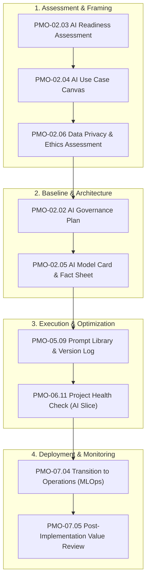

  🌐 <strong>Language:</strong> English Manual
  

    <a class="lang-switch-btn github-btn" href="https://github.com/fakhruldeen/Tasleemat/blob/main/docs/en/08_ai_governance_framework.md" target="_blank" rel="noopener noreferrer">🐙 View on GitHub ↗</a>
    <a class="lang-switch-btn" href="../ar/08_ai_governance_framework.html">🇸🇦 الانتقال للنسخة العربية (Arabic Manual) →</a>
  

  

---

# 🤖 Enterprise AI & Machine Learning Governance Framework
**Document ID:** `TASLEEMAT-GUIDE-08-AI-GOVERNANCE`  
**Version:** 2.0  
**Compliance Standards:** NIST AI Risk Management Framework (AI RMF 1.0), ISO/IEC 42001, EU AI Act, SDAIA AI Ethics Principles  

---

## 🎯 Executive Summary

As artificial intelligence, large language models (LLMs), and machine learning pipelines move from experimental sandboxes into core enterprise operations, traditional project management controls are insufficient. AI initiatives introduce unique risks: model drift, hallucination, algorithmic bias, data privacy leakage, and non-deterministic behavior.

Tasleemat provides an integrated **AI Governance Suite** embedded directly into the project lifecycle, allowing organizations to innovate rapidly while maintaining rigorous compliance, ethical integrity, and audit readiness.

---

## 🏛️ The 6 Core AI Governance Deliverables

### 1. `PMO-02.03` AI Readiness Assessment
- **Purpose:** Assesses organizational, data architecture, technical infrastructure, and talent readiness before committing capital.
- **Key Metrics:** Data completeness score, pipeline latency, MLOps maturity tier (Level 0 to Level 4), cybersecurity compliance.
- **Decision Gate:** Must score $\ge 70\%$ overall maturity to exit Gate 0.

### 2. `PMO-02.04` AI Use Case Canvas
- **Purpose:** One-page executive blueprint linking business problem, target value metric, algorithmic architecture (RAG, Fine-Tuning, Pre-trained API), and operational constraints.
- **Key Sections:** User persona, business objective, AI technique, training & inference data sources, fallback mechanisms, ROI horizon.

### 3. `PMO-02.06` Data Privacy and Ethics Assessment
- **Purpose:** Rigorous screening for personal identifiable information (PII), ethical fairness, algorithmic bias, and regulatory alignment (SDAIA / GDPR / EU AI Act).
- **Mandatory Checks:** Protected attribute analysis, consent verification, anonymization protocols, differential privacy safeguards.

### 4. `PMO-02.02` AI Governance Plan
- **Purpose:** The master governance charter defining model lifecycle policies, risk classification tiers (Minimal, Limited, High, Unacceptable), human-in-the-loop (HITL) thresholds, and drift monitoring cadence.
- **Key Rules:** Retraining triggers (e.g. F1-score drop $> 5\%$), approval authorities for production deployment.

### 5. `PMO-02.05` AI Model Card & Fact Sheet
- **Purpose:** Comprehensive provenance and performance passport for every deployed model or agent.
- **Key Tables:** Training dataset lineage, benchmark performance slices (accuracy, precision, recall, latency), known limitations, out-of-scope usages, ethical risk mitigation.

### 6. `PMO-05.09` Prompt Library & Version Log
- **Purpose:** Systematic configuration management for GenAI prompt templates, system instructions, temperature/top-p parameters, few-shot examples, and regression test suites.
- **Change Control:** Prevents silent model regressions and ensures deterministic outputs across application versions.

---

## 🛡️ Risk Classification & Human-in-the-Loop (HITL) Policy

| Risk Tier | Definition & Examples | Mandatory Forms | Human-in-the-Loop Requirement |
| :--- | :--- | :--- | :--- |
| **Tier 1: High Risk** | Automated credit scoring, medical diagnosis, hiring filters, critical infrastructure control | All 6 AI forms + External Legal Audit | **Mandatory Human Approval** prior to every transaction or high-stakes decision. |
| **Tier 2: Medium Risk** | Customer service conversational bots, internal document summarizers, predictive maintenance | AI Canvas, Model Card, Prompt Log | **Human-in-the-Loop on Exception** (low confidence scores trigger human escalation). |
| **Tier 3: Low Risk** | Internal productivity drafting, sentiment analysis on public feedback | AI Canvas, Model Card | **Periodic Human Review** (sample auditing). |

---

## 🔄 Post-Deployment MLOps & Continuous Monitoring

Deploying an AI model is not the end of the project—it is the beginning of continuous calibration:
1. **Model Drift Monitoring:** Daily telemetry comparing inference feature distributions against training baselines (PSI / KL divergence).
2. **Fairness Drift Audits:** Monthly evaluation across demographic slices to detect emerging bias.
3. **Prompt Version Rollback:** Immediate rollback capability via [`05_09 Prompt Library Log`](../forms/en/05_Executing/05_09_Prompt_Library_Log_Template.md) if unexpected hallucinations occur.