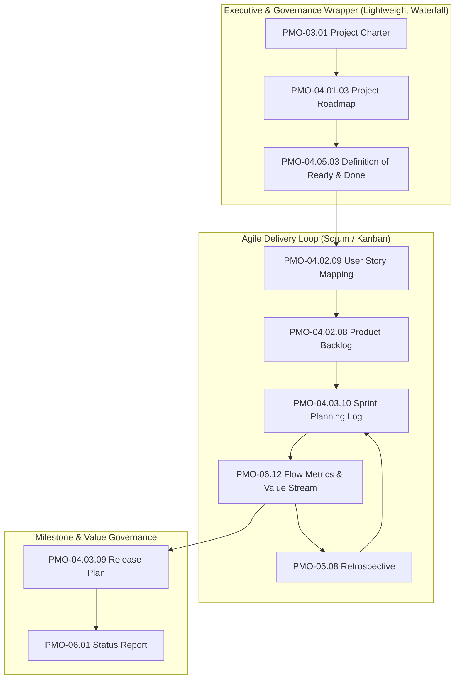

  🌐 <strong>Language:</strong> English Manual
  

    <a class="lang-switch-btn github-btn" href="https://github.com/fakhruldeen/Tasleemat/blob/main/docs/en/09_agile_hybrid_integration.md" target="_blank" rel="noopener noreferrer">🐙 View on GitHub ↗</a>
    <a class="lang-switch-btn" href="../ar/09_agile_hybrid_integration.html">🇸🇦 الانتقال للنسخة العربية (Arabic Manual) →</a>
  

  

---

# ⚡ Agile, Scrum, Kanban & Hybrid Integration Guide
**Document ID:** `TASLEEMAT-GUIDE-09-AGILE-HYBRID`  
**Version:** 2.0  
**Target Audience:** Scrum Masters, Agile Coaches, Product Owners, Hybrid Project Managers  

---

## 🎯 The Pragmatic Hybrid Model

Modern enterprises rarely operate in 100% pure waterfall or 100% pure agile. Strategic alignment, procurement, budgeting, and regulatory signoffs require predictable governance, while feature discovery, development, and user testing demand agile speed.

**Tasleemat provides the ultimate bridge:** a lightweight governance wrapper for executive oversight paired with high-velocity agile toolkits for product delivery teams.

---

## 🛠️ Mapping Tasleemat Deliverables to Agile Ceremonies

| Agile Ceremony / Activity | Tasleemat Deliverable | Role Responsible | Frequency |
| :--- | :--- | :--- | :--- |
| **Discovery & Inception** | [`PMO-04.02.09 User Story Mapping Canvas`](../forms/en/04_Planning/02_Scope/04_02_09_User_Story_Mapping_Canvas_Template.md) | Product Owner | Project Start / Major Releases |
| **Quality Criteria Agreement** | [`PMO-04.05.03 Definition of Ready & Done`](../forms/en/04_Planning/05_Quality/04_05_03_Definition_of_Ready_and_Done_Template.md) | Team & Scrum Master | Inception & Sprint 0 |
| **Backlog Refinement** | [`PMO-04.02.08 Product Backlog`](../forms/en/04_Planning/02_Scope/04_02_08_Product_Backlog_Template.md) | Product Owner | Weekly / Continuous |
| **Sprint Planning** | [`PMO-04.03.10 Sprint Planning Log`](../forms/en/04_Planning/03_Schedule/04_03_10_Sprint_Planning_Log_Template.md) | Scrum Master & Dev Team | Start of Sprint (Bi-weekly) |
| **Release Coordination** | [`PMO-04.03.09 Release Plan`](../forms/en/04_Planning/03_Schedule/04_03_09_Release_Plan_Template.md) | Product Owner / Release Mgr | Quarterly / Per Release |
| **Flow & WIP Monitoring** | [`PMO-06.12 Flow Metrics & Value Stream`](../forms/en/06_Monitoring_and_Controlling/06_12_Flow_Metrics_and_Value_Stream_Template.md) | Agile Coach / PMO | Continuous / Sprint Review |
| **Sprint Retrospective** | [`PMO-05.08 Retrospective`](../forms/en/05_Executing/05_08_Retrospective_Template.md) | Team & Scrum Master | End of Sprint |
| **Team Psychological Safety** | [`PMO-04.06.06 Psychological Safety Index`](../forms/en/04_Planning/06_Resource/04_06_06_Team_Psychological_Safety_and_Wellbeing_Index_Template.md) | Agile Coach / HR Partner | Monthly / Quarterly |

---

## 📊 Agile Flow Metrics & Governance KPIs

Rather than tracking task hours, high-performing agile teams measure value throughput using [`PMO-06.12`](../forms/en/06_Monitoring_and_Controlling/06_12_Flow_Metrics_and_Value_Stream_Template.md):

1. **Cycle Time:** The elapsed calendar time from when work starts on a user story to when it is delivered to production.
2. **Throughput:** The number of completed user stories or story points delivered per sprint.
3. **Work In Progress (WIP):** The total active items in the system. Enforcing strict WIP limits prevents multi-tasking bottlenecks.
4. **Flow Efficiency:** $	ext{Flow Efficiency} = 
rac{	ext{Active Working Time}}{	ext{Total Lead Time}} 	imes 100\%$. Target $\ge 40\%$.