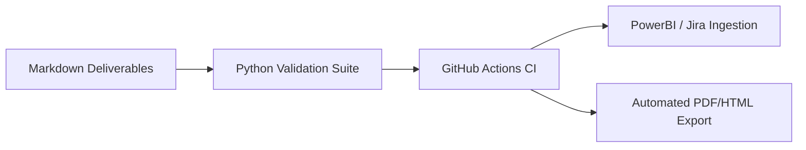

<p align="center">
  
</p>

---

# 🛠️ Developer Tools, Automation, & CI/CD Integration Guide
**Document ID:** `TASLEEMAT-GUIDE-11-TOOLS-AUTOMATION`  
**Version:** 2.0  
**Target Audience:** DevOps Engineers, PMO Tool Administrators, Software Developers  

---

## 🎯 Automation Capabilities

Tasleemat is built with a **Docs-as-Code** and **Governance-as-Code** philosophy. Everything is version-controllable, programmatically verifiable, and pipeline-friendly.



---

## 🧰 Python Audit & Validation Utilities

The repository includes powerful built-in validation scripts in `tools/`:

### 1. Form Quality & Schema Auditor (`tools/audit_forms.py`)
- **Execution:** `python3 tools/audit_forms.py`
- **Function:** Scans all 102 forms across both languages (204 files total) to verify:
  - Presence of Document Control & Sign-off tables.
  - Proper heading hierarchies (`#`, `##`, `###`).
  - Strict absence of broken markdown links.

### 2. Bilingual Parity Checker (`tools/parity.py`)
- **Execution:** `python3 tools/parity.py forms/en forms/ar`
- **Function:** Ensures exact 1:1 structural symmetry between English and Arabic deliverable catalogs (folders, templates, guides, JSON schemas, CSV files).

### 3. Rendering & Formatting Verifier (`tools/check_rendering.py`)
- **Execution:** `python3 tools/check_rendering.py`
- **Function:** Audits markdown tables, bold keys, and mermaid diagrams to ensure zero layout-breaking syntax errors on GitHub, GitLab, and Azure DevOps web renderers.

---

## 🔌 Integrating Tasleemat with Enterprise Platforms

### 1. JIRA & Azure DevOps
- Import `docs/LEXICON.json` into custom fields to automatically standardize project deliverable tracking across JIRA Epic / Feature workflows.
- Map Sprint logs (`PMO-04.03.10`) directly to sprint boards.

### 2. Business Intelligence (PowerBI / Tableau)
- Point your PowerBI data connector to the `*.csv` files in `forms/` or `examples/` to construct real-time executive PMO status dashboards.

### 3. Batch PDF / Word Export via Pandoc
Convert any Markdown deliverable into a formal PDF report using Pandoc:
```bash
pandoc forms/en/03_Initiating/01_Project_Charter/03_01_Project_Charter_Template.md \
  -o Project_Charter.pdf \
  --pdf-engine=xelatex \
  --variable geometry:margin=1in
```
