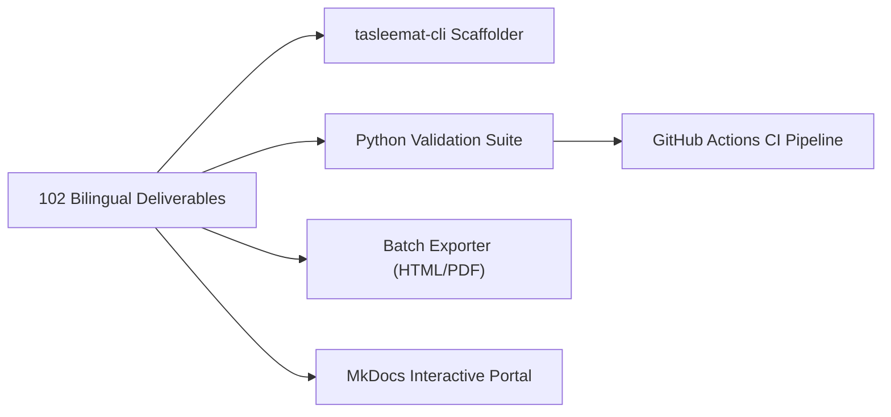

<p align="center">
  
</p>

---

# 🛠️ Developer Tools, Automation, & CI/CD Integration Guide
**Document ID:** `TASLEEMAT-GUIDE-11-TOOLS-AUTOMATION`  
**Version:** 2.0  
**Target Audience:** DevOps Engineers, PMO Tool Administrators, Software Developers, Project Managers  

---

## 🎯 Automation Capabilities

Tasleemat is built with a **Docs-as-Code** and **Governance-as-Code** philosophy. Everything is version-controllable, programmatically verifiable, and pipeline-friendly.



---

## 🚀 1. Official Tasleemat CLI Tool (`tools/tasleemat_cli.py`)

The repository includes a standalone, zero-dependency Python CLI tool designed to streamline project initialization and form exploration.

### A. Scaffolding a New Tailored Project (`init`)
Generate a complete, ready-to-use project workspace tailored to your exact governance tier and methodology pack:

```bash
# Interactive Wizard Mode (prompts you step-by-step)
python3 tools/tasleemat_cli.py init

# Fast-Track Flag Mode: Tier 2 (Standard) with Agile Pack in Arabic
python3 tools/tasleemat_cli.py init \
  --tier 2 \
  --pack agile \
  --lang ar \
  --name "منصة الخدمات الرقمية الموحدة" \
  --code "PRJ-2026-DIGITAL-01" \
  --pm "سارة الأحمد" \
  --sponsor "خالد المنصور" \
  --out ./my_new_project

# Enterprise Tier 1 Project in both English and Arabic
python3 tools/tasleemat_cli.py init \
  --tier 1 \
  --pack hybrid \
  --lang both \
  --name "Enterprise Core Transformation" \
  --code "PRJ-2026-CORE-01" \
  --pm "John Doe" \
  --sponsor "Jane Smith" \
  --out ./enterprise_workspace
```

#### What `init` Does Automatically:
1. Filters the 102 forms down to the exact mandatory subset for your selected tier (1, 2, or 3) and pack (`agile`, `ai`, `predictive`, `hybrid`).
2. Copies all templates, guides, JSON schemas, and CSV field dictionaries.
3. Automatically pre-populates document headers (Project Name, Code, PM Name, Sponsor, Date) across all generated files.
4. Creates a custom `PROJECT_README.md` with an actionable Stage-Gate checklist and direct deliverable links.

---

### B. Searching the Forms Catalog (`search`)
Search across all 102 forms by keyword in Arabic or English:

```bash
# Search in English
python3 tools/tasleemat_cli.py search "Risk" --lang en
python3 tools/tasleemat_cli.py search "Sprint" --lang en
python3 tools/tasleemat_cli.py search "Model Card" --lang en

# Search in Arabic
python3 tools/tasleemat_cli.py search "مخاطر" --lang ar
python3 tools/tasleemat_cli.py search "ميثاق" --lang ar
python3 tools/tasleemat_cli.py search "ذكاء اصطناعي" --lang ar
```

---

### C. Listing All Available Forms (`list`)
Inspect the complete 102-form catalog with IDs and folder mappings:

```bash
python3 tools/tasleemat_cli.py list --lang en
python3 tools/tasleemat_cli.py list --lang ar
```

---

## 🖨️ 2. Batch Deliverable Exporter (`tools/export_deliverables.py`)

Convert single Markdown forms or entire project directories into executive, print-ready HTML documents with embedded CSS and full Arabic RTL typography support:

```bash
# Export a single document to HTML
python3 tools/export_deliverables.py docs/en/01_getting_started.md -o output.html

# Export an Arabic deliverable with native RTL styling
python3 tools/export_deliverables.py forms/ar/03_البدء/01_ميثاق_المشروع/03_01_ميثاق_المشروع_قالب.md -o charter.html

# Batch export an entire directory
python3 tools/export_deliverables.py my_project_workspace/
```

---

## 🌐 3. Live Web Documentation Portal (MkDocs Material)

Tasleemat includes a pre-configured `mkdocs.yml` setup leveraging **Material for MkDocs** with dark/light themes, search index, and Mermaid diagram rendering.

```bash
# Install dependencies
pip install mkdocs-material

# Serve locally with live-reload
mkdocs serve

# Build static production site
mkdocs build
```

---

## 🛡️ 4. Python Quality & Parity Audit Suite

The repository includes built-in verification scripts executed automatically by our CI/CD pipeline:

### 1. Form Quality & Schema Auditor (`tools/audit_forms.py`)
- **Execution:** `python3 tools/audit_forms.py`
- **Function:** Scans all 204 form files to verify:
  - Presence of Document Control & Sign-off tables.
  - Proper heading hierarchies (`#`, `##`, `###`).
  - Strict absence of broken markdown links.

### 2. Bilingual Parity Checker (`tools/parity.py`)
- **Execution:** `python3 tools/parity.py forms/en forms/ar`
- **Function:** Ensures exact 1:1 structural symmetry between English and Arabic deliverable catalogs (folders, templates, guides, JSON schemas, CSV files).

### 3. Rendering & Formatting Verifier (`tools/check_rendering.py`)
- **Execution:** `python3 tools/check_rendering.py`
- **Function:** Audits markdown tables, bold keys, and mermaid diagrams to ensure zero layout-breaking syntax errors on GitHub, GitLab, and Azure DevOps web renderers.

---

## ⚙️ 5. GitHub Actions CI/CD Pipeline (`.github/workflows/ci.yml`)

Every push and pull request to the `main` branch triggers an automated GitHub Actions workflow that:
1. Validates schema integrity across all 204 form bundles (`audit_forms.py`).
2. Checks web rendering syntax (`check_rendering.py`).
3. Enforces 1:1 English-Arabic structural parity (`parity.py`).
4. Runs end-to-end integration tests on `tasleemat_cli.py`.
