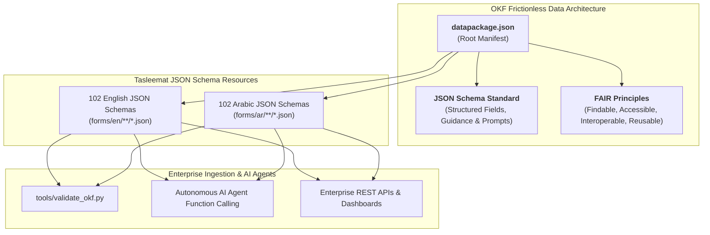

<div class="lang-switch-bar">
  <span class="lang-switch-label">🌐 <strong>Language:</strong> English Manual</span>
  <div class="lang-switch-actions">
    <a class="lang-switch-btn github-btn" href="https://github.com/fakhruldeen/Tasleemat/blob/main/docs/en/12_open_knowledge_framework.md" target="_blank" rel="noopener noreferrer">🐙 View on GitHub ↗</a>
    <a class="lang-switch-btn" href="../ar/12_open_knowledge_framework.html">🇸🇦 الانتقال للنسخة العربية (Arabic Manual) →</a>
  </div>
</div>

</div>

</div>

</div>

<p align="center">
  
</p>

---

# 🌐 Open Knowledge Foundation (OKF) & JSON Schema Architecture
**Document ID:** `TASLEEMAT-GUIDE-12-OPEN-KNOWLEDGE`  
**Version:** 2.0  
**Compliance Standards:** Open Knowledge Foundation (OKF) Frictionless Data Package Standard, JSON Schema (Draft 2020-12), FAIR Data Principles  

---

## 🎯 Executive Overview

**Tasleemat (تسليمات)** conforms to the **Open Knowledge Foundation (OKF)** Frictionless Data Package specification using **native JSON Schemas**, making it one of the world's first fully open, machine-readable, bilingual Project Management Office (PMO) operating frameworks.

By providing a root [`datapackage.json`](../../datapackage.json), Tasleemat enables data scientists, AI engineers, and enterprise architects to query, validate, and integrate all 204 deliverable JSON schemas directly into REST APIs, autonomous AI agent toolchains, and project analytics pipelines.



---

## 📦 The `datapackage.json` Specification

Located at the repository root, [`datapackage.json`](../../datapackage.json) indexes all 204 deliverable schemas as Frictionless JSON Resources:

```json
{
  "profile": "data-package",
  "name": "tasleemat-pmo-framework",
  "title": "Tasleemat: Enterprise Bilingual (English & Arabic) Project Management Framework",
  "version": "2.0.0",
  "licenses": [{"name": "MIT", "path": "https://opensource.org/licenses/MIT"}],
  "resources": [
    {
      "name": "en-03-01-project-charter",
      "title": "PROJECT CHARTER",
      "reference": "PMO-03.01",
      "path": "forms/en/03_Initiating/01_Project_Charter/03_01_Project_Charter.json",
      "format": "json",
      "mediatype": "application/json",
      "encoding": "utf-8",
      "language": "en",
      "direction": "ltr",
      "schema": {
        "$schema": "https://json-schema.org/draft/2020-12/schema",
        "type": "object",
        "required": ["form_name", "document_reference", "fields"]
      }
    }
  ]
}
```

---

## 🛠️ Validating OKF JSON Compliance

The repository includes a dedicated validator script:

```bash
# Run the built-in OKF JSON Schema validator
python3 tools/validate_okf.py
```

---

## 💡 Why JSON Schemas in OKF?

1. **AI Agent Tool Calling:** Modern LLMs (Gemini, Claude, GPT-4) consume JSON schemas natively for function calling and structured document generation.
2. **Hierarchical Field Metadata:** Each field carries explicit `section`, `label`, `guidance`, and target `value` properties.
3. **Bilingual Symmetry (en / ar-SA):** Preserves bidirectional text orientation flags (`ltr` and `rtl`) and UTF-8 encoding across all 204 schemas.
