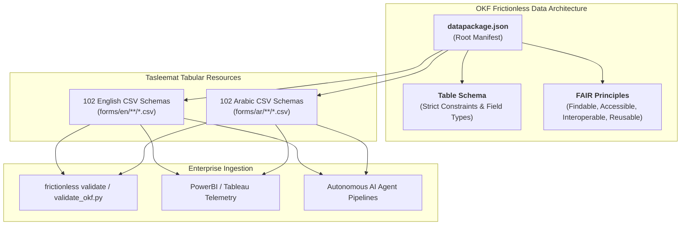

<p align="center">
  
</p>

---

# 🌐 Open Knowledge Foundation (OKF) & Frictionless Data Architecture
**Document ID:** `TASLEEMAT-GUIDE-12-OPEN-KNOWLEDGE`  
**Version:** 2.0  
**Compliance Standards:** Open Knowledge Foundation (OKF) Frictionless Data Package Standard, FAIR Data Principles, Open Definition (Open Knowledge)  

---

## 🎯 Executive Overview

**Tasleemat (تسليمات)** conforms to the **Open Knowledge Foundation (OKF)** Frictionless Data specification, making it one of the world's first fully open, machine-readable, bilingual Project Management Office (PMO) operating frameworks.

By providing a root [`datapackage.json`](../../datapackage.json), Tasleemat enables data scientists, AI engineers, and enterprise architects to query, validate, and integrate all 204 tabular deliverable specifications into data pipelines, business intelligence tools, and automated agent loops without manual schema transformation.



---

## 📦 The `datapackage.json` Specification

Located at the repository root, [`datapackage.json`](../../datapackage.json) indexes all 204 tabular schemas as Frictionless Resources:

```json
{
  "profile": "tabular-data-package",
  "name": "tasleemat-pmo-framework",
  "title": "Tasleemat: Enterprise Bilingual (English & Arabic) Project Management Framework",
  "version": "2.0.0",
  "licenses": [{"name": "MIT", "path": "https://opensource.org/licenses/MIT"}],
  "resources": [
    {
      "name": "en-03-01-project-charter",
      "title": "03 01 Project Charter",
      "path": "forms/en/03_Initiating/01_Project_Charter/03_01_Project_Charter.csv",
      "format": "csv",
      "mediatype": "text/csv",
      "encoding": "utf-8",
      "language": "en",
      "direction": "ltr",
      "schema": {
        "fields": [
          {"name": "Section", "type": "string", "constraints": {"required": true}},
          {"name": "Field", "type": "string", "constraints": {"required": true}},
          {"name": "Guidance", "type": "string", "constraints": {"required": true}},
          {"name": "LLM_Generated_Value", "type": "string", "constraints": {"required": false}}
        ]
      }
    }
  ]
}
```

---

## 🛠️ Validating OKF Compliance

The repository includes a dedicated validator script:

```bash
# Run the built-in OKF Frictionless validator
python3 tools/validate_okf.py

# Or use the official Frictionless Python CLI
frictionless validate datapackage.json
```

---

## 💡 Benefits of OKF Architecture for Enterprise PMOs

1. **Machine-Readable Governance:** Every deliverable field is strictly typed and described, allowing automated validation of completed project artifacts.
2. **Seamless Tool Integration:** Ingest project schemas into Pandas, DuckDB, PowerBI, or SQL databases with one command.
3. **Bilingual Symmetry (en / ar-SA):** Preserves bidirectional metadata tags (`ltr` and `rtl`) to ensure native Arabic text rendering in automated data pipelines.
