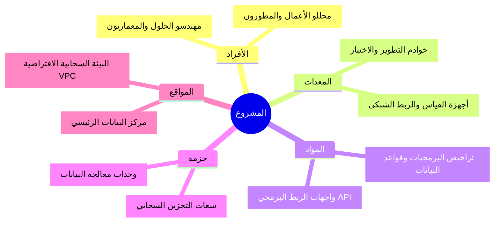

  🌐 <strong>اللغة:</strong> التوثيق باللغة العربية
  <a class="lang-switch-btn" href="../../../en/04_Planning/06_Resource/04_06_03_Resource_Breakdown_Structure_Example.html">🇬🇧 Switch to English Example (النسخة الإنجليزية) ←</a>

  

    PMO-04.06.03
    04. التخطيط
    دراسة حالة واقعية مكتملة
  

  

    <a class="nav-pill" href="../../../../forms/ar/04_التخطيط/06_الموارد/04_06_03_هيكل_تجزئة_الموارد_(RBS)_قالب.html">📋 القالب الفارغ</a>
    <a class="nav-pill" href="../../../../guides/ar/04_التخطيط/06_الموارد/04_06_03_هيكل_تجزئة_الموارد_(RBS)_دليل.html">📖 دليل الاستخدام والتحرير</a>
    <a class="nav-pill active" href="#">💡 مثال واقعي مكتمل</a>
    <a class="nav-pill lang-pill" href="../../../en/04_Planning/06_Resource/04_06_03_Resource_Breakdown_Structure_Example.html">🇬🇧 English Version</a>
  

---

# هيكل تجزئة الموارد (RBS) (نموذج تطبيقي معبأ)
> 🏆 **نموذج استرشادي مكتمل (Gold Standard):** يوضح هذا المستند التطبيق العملي المتكامل لهذا النموذج وفق معايير تسليمات (`PMO-04.06`). كافة الأسماء والبيانات الواردة هي لأغراض العرض التوضيحي والمحاكاة المؤسسية الفرضية.

---

<h3 dir="rtl" align="right">شركة القمة للحلول المؤسسية المتقدمة</h3>
<h2 dir="rtl" align="right">مشروع المنظومة السحابية الموحدة لتخطيط الموارد وسلاسل الإمداد - PRJ-2026-ERP-01</h2>
<h1 dir="rtl" align="center">هيكل تجزئة الموارد</h1>

| **تاريخ الإعداد:** 2026-03-15 | **مدير المشروع:** م. فيصل الحربي، PMP | **إعداد:** م. فيصل الحربي، PMP (مدير المشروع) |
| ---: | ---: | ---: |

---

## 1. المخطط

| رمز التجزئة | عقدة المورد |
| ---: | ---: |
| 1 | منظومة القمة لتخطيط الموارد (Nexus ERP) |
| 1.1 | الأفراد |
| 1.1.1 | مهندسو الحلول والمعماريون السحابيون |
| 1.1.2 | محللو الأعمال ومختبرو النظم |
| 1.2 | المعدات |
| 1.2.1 | خوادم الاختبار والتكامل السحابي |
| 1.3 | المواد |
| 1.3.1 | تراخيص برمجيات المنظومة وقواعد البيانات |
| 1.4 | حزمة |
| 1.4.1 | اشتراكات التخزين السحابي وعروض النطاق |
| 1.5 | المواقع |
| 1.5.1 | مركز البيانات الرئيسي والشبكة الافتراضية VPC |

## 2. الهيكل الهرمي

**النوع:** هيكل شجري وظيفي ومكاني

**التسمية:** تصنيف خماسي المستويات يشمل الكوادر، المعدات، البرمجيات، والبيئات السحابية.

### الاعتماد والموافقات

| الدور | الاسم | التوقيع | التاريخ |
| ---: | ---: | ---: | ---: |
| **مدير المشروع** | م. فيصل الحربي، PMP | [معتمد إلكترونياً] | 2026-03-18 |
| **مدير الموارد** | أ. سامي الغامدي (مدير الموارد البشرية) | [معتمد إلكترونياً] | 2026-03-18 |
| **مسؤول مكتب إدارة المشاريع** | د. طارق المنصور، PfMP | [معتمد إلكترونياً] | 2026-03-18 |
---

 <strong>النموذج:</strong> هيكل تجزئة الموارد | <strong>المرجع:</strong> PMO-04.06.03  
 <i>تاريخ الإنشاء: 2026-03-15 10:00 بتوقيت مكة المكرمة, بواسطة <a href="https://github.com/fakhruldeen/Tasleemat/" style="color: #7f8c8d;">تسليمات</a></i>

