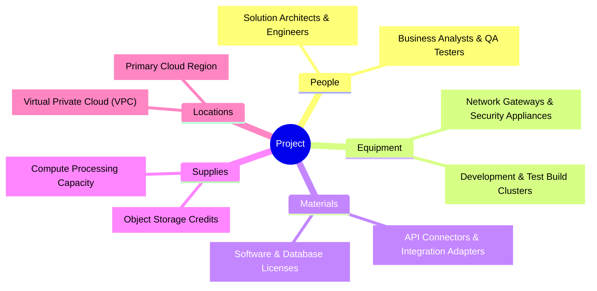

  🌐 <strong>Language:</strong> English Documentation
  

    <a class="lang-switch-btn github-btn" href="https://github.com/fakhruldeen/Tasleemat/blob/main/examples/en/04_Planning/06_Resource/03_Resource_Breakdown_Structure/04_06_03_Resource_Breakdown_Structure_Example.md" target="_blank" rel="noopener noreferrer">🐙 View on GitHub ↗</a>
    <a class="lang-switch-btn" href="../../../ar/04_التخطيط/06_الموارد/04_06_03_هيكل_تجزئة_الموارد_(RBS)_مثال.html">🇸🇦 الانتقال للمثال بالعربية (Arabic Example) →</a>
  

  

    PMO-04.06.03
    04. Planning
    Realistic Case Study Benchmark
  

  

    <a class="nav-pill" href="../../../../forms/en/04_Planning/06_Resource/04_06_03_Resource_Breakdown_Structure_Template.html">📋 Blank Template</a>
    <a class="nav-pill" href="../../../../guides/en/04_Planning/06_Resource/04_06_03_Resource_Breakdown_Structure_Guide.html">📖 Authoring Guide</a>
    <a class="nav-pill active" href="#">💡 Completed Example</a>
    <a class="nav-pill github-pill" href="https://github.com/fakhruldeen/Tasleemat/blob/main/examples/en/04_Planning/06_Resource/03_Resource_Breakdown_Structure/04_06_03_Resource_Breakdown_Structure_Example.md" target="_blank" rel="noopener noreferrer">🐙 GitHub Source ↗</a>
    <a class="nav-pill lang-pill" href="../../../ar/04_التخطيط/06_الموارد/04_06_03_هيكل_تجزئة_الموارد_(RBS)_مثال.html">🇸🇦 النسخة العربية</a>
  

---

# Resource Breakdown Structure (Reference Example)
> 🏆 **Gold Standard Reference Example:** This document illustrates a fully completed, production-grade artifact adhering to the Tasleemat PMO Framework (`PMO-04.06`). All company names, project references, and figures are realistic fictional simulations.

---

<h3 align="right">Apex Global Solutions</h3>
<h2 align="right">Apex Unified Cloud ERP & Supply Chain Modernization - PRJ-2026-ERP-01</h2>
<h1 align="center">RESOURCE BREAKDOWN STRUCTURE</h1>

| **Date Prepared:** 2026-03-15 | **Project Manager:** Faisal Al-Harbi, PMP | **Prepared By:** Faisal Al-Harbi, PMP (Senior Project Manager) |
| :--- | :--- | :--- |

---

## 1. Resource Breakdown Structure (Outline)

| RBS Code | Resource Node |
| :--- | :--- |
| 1 | Apex Enterprise Nexus ERP |
| 1.1 | People |
| 1.1.1 | Solution Architects & Cloud Engineers |
| 1.1.2 | Functional Analysts & QA Engineers |
| 1.2 | Equipment |
| 1.2.1 | Cloud Integration & Build Clusters |
| 1.3 | Materials |
| 1.3.1 | SaaS Enterprise Licenses & Database Engine |
| 1.4 | Supplies |
| 1.4.1 | Cloud Storage & Compute Credits |
| 1.5 | Locations |
| 1.5.1 | Primary Data Center & Virtual Staging VPC |

## 2. Resource Breakdown Structure (Hierarchical Chart)

**Chart Form:** Functional & Infrastructure Tree View

**Node Labels:** 5-tier classification covering Personnel, Compute, Licensing, Storage, and Environments.

### Sign-off and Approvals

| Role | Name | Signature | Date |
| :--- | :--- | :--- | :--- |
| **Project Manager** | Faisal Al-Harbi, PMP | [Electronically Signed] | 2026-03-18 |
| **Resource Manager** | Sami Al-Ghamdi (Resource Management Lead) | [Electronically Signed] | 2026-03-18 |
| **PMO Lead** | Tariq Al-Mansoor, PfMP | [Electronically Signed] | 2026-03-18 |
---

  <strong>Template:</strong> RESOURCE BREAKDOWN STRUCTURE | <strong>Ref:</strong> PMO-04.06.03  
  <i>Generated on: 2026-03-15 10:00 UTC, by <a href="https://github.com/fakhruldeen/Tasleemat/" style="color: #7f8c8d;">Tasleemat</a></i>

