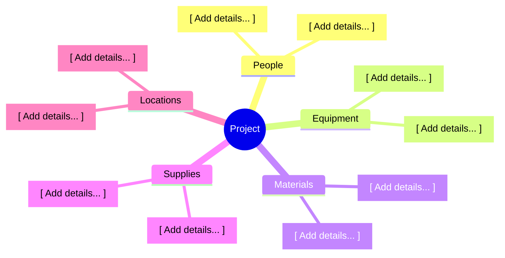

  🌐 <strong>Language:</strong> English Documentation
  

    <a class="lang-switch-btn github-btn" href="https://github.com/fakhruldeen/Tasleemat/blob/main/forms/en/04_Planning/06_Resource/03_Resource_Breakdown_Structure/04_06_03_Resource_Breakdown_Structure_Template.md" target="_blank" rel="noopener noreferrer">🐙 View on GitHub ↗</a>
    <a class="lang-switch-btn" href="../../../ar/04_التخطيط/06_الموارد/04_06_03_هيكل_تجزئة_الموارد_(RBS)_قالب.html">🇸🇦 الانتقال للنسخة العربية (Arabic Template) →</a>
  

  

    PMO-04.06.03
    04. Planning
    PMI PMBOK® 6/7/8 • ISO 21500
  

  

    <a class="nav-pill active" href="#">📋 Blank Template</a>
    <a class="nav-pill" href="../../../../guides/en/04_Planning/06_Resource/04_06_03_Resource_Breakdown_Structure_Guide.html">📖 Authoring Guide</a>
    <a class="nav-pill" href="../../../../examples/en/04_Planning/06_Resource/04_06_03_Resource_Breakdown_Structure_Example.html">💡 Completed Example</a>
    <a class="nav-pill github-pill" href="https://github.com/fakhruldeen/Tasleemat/blob/main/forms/en/04_Planning/06_Resource/03_Resource_Breakdown_Structure/04_06_03_Resource_Breakdown_Structure_Template.md" target="_blank" rel="noopener noreferrer">🐙 GitHub Source ↗</a>
    <a class="nav-pill lang-pill" href="../../../ar/04_التخطيط/06_الموارد/04_06_03_هيكل_تجزئة_الموارد_(RBS)_قالب.html">🇸🇦 النسخة العربية</a>
  

---

<!-- LLM INSTRUCTIONS: Fill in the Resource Breakdown Structure based on the
project context.

Context and Definition:
The resource breakdown structure is a hierarchical structure used to organize
the resources by type and category. It can be shown as a hierarchical chart or as
an outline. It is an output of Estimate Activity Resources, and its resources are
based on the project scope: a stable scope gives a stable resource tree, and an
evolving scope gives one that must be re-examined each time scope moves.

It can receive information from:
*   Assumption log
*   Resource management plan
*   Scope baseline
*   Activity attributes

It provides information to:
*   Duration estimates worksheet

Tailoring Tips:
*   Decompose the team branch further when the project mixes skill levels,
    required certifications or locations, since a branch holding all three
    cannot be estimated against anything.
*   Organise by geography instead of by type when the work is spread across
    sites and the constraint is where people are.
*   Keep the numbering contiguous. A gap in the codes reads as a missing node
    rather than a deliberate skip.

Alignment:
The resource breakdown structure should be aligned and consistent with:
*   Resource management plan
*   Resource requirements

Section Instructions:
*   1. Resource Breakdown Structure (Outline): Give the hierarchy as rows of code
    and node. The code is the position in the tree, written as 1, 1.1, 1.1.1 so a
    reader can rebuild the tree from the text alone.
*   2. Resource Breakdown Structure (Hierarchical Chart): State which view the
    diagram takes, then give the node labels in the same order as the outline.
    The chart and the outline must agree.
-->

<h3 align="right">{{Company_Name}}</h3>
<h2 align="right">{{Project_Name}} - {{Project_ID}}</h2>
<h1 align="center">RESOURCE BREAKDOWN STRUCTURE</h1>

| **Date Prepared:** {{Current_Date}} | **Project Manager:** {{Project_Manager_Name}} | **Prepared By:** {{Prepared_By}} |
| :--- | :--- | :--- |

---

## 1. Resource Breakdown Structure (Outline)

| RBS Code | Resource Node |
| :--- | :--- |
| 1 | [ Project Name ] |
| 1.1 | People |
| 1.1.1 | [ Add details... ] |
| 1.1.2 | [ Add details... ] |
| 1.2 | Equipment |
| 1.2.1 | [ Add details... ] |
| 1.3 | Materials |
| 1.3.1 | [ Add details... ] |
| 1.4 | Supplies |
| 1.4.1 | [ Add details... ] |
| 1.5 | Locations |
| 1.5.1 | [ Add details... ] |

## 2. Resource Breakdown Structure (Hierarchical Chart)

**Chart Form:** [ Add details... ]

**Node Labels:**
[ Add details... ]

### Sign-off and Approvals

| Role | Name | Signature | Date |
| :--- | :--- | :--- | :--- |
| **Project Manager** | {{Project_Manager_Name}} | _______________________ | [ .... - .... - .... ] |
| **Resource Manager** | {{Resource_Manager_Name}} | _______________________ | [ .... - .... - .... ] |
| **PMO Lead** | {{PMO_Lead_Name}} | _______________________ | [ .... - .... - .... ] |
---

  <strong>Template:</strong> RESOURCE BREAKDOWN STRUCTURE | <strong>Ref:</strong> PMO-04.06.03  
  <i>Generated on: {{Current_Timestamp}}, by <a href="https://github.com/fakhruldeen/Tasleemat/" style="color: #7f8c8d;">Tasleemat</a></i>

