<!--
---
type: Guide
---
-->

# Stage-Gate Governance & Tailoring Architecture

> **منظومة بوابات العبور الحوكمية ومستويات تخصيص المشاريع**  
> *PMI PMBOK® 6/7/8 & ISO 21500 / ISO 21502:2021 Compliant*

Structured gatekeeper decision checkpoints (Gate 0 Idea to Gate 5 Closeout) paired with 4 scalable project sizing tiers to ensure auditability, rigorous fiscal control, and zero governance bloat.

---

## 🏛️ 1. Executive Governance Framework

Every project passing through Tasleemat undergoes rigorous stage-gate governance. Each gate represents a formal review where a designated governing authority evaluates deliverables and decides between **Three Gate Outcomes**:

1. 🟢 **Proceed (Go):** Deliverables satisfy exit criteria. Authorized to release subsequent tranche and advance to the next lifecycle phase.
2. 🟡 **Conditional Approval (Go with Actions):** Minor non-critical deficiencies noted. Conditional approval granted subject to remedial actions completed within 14 calendar days.
3. 🔴 **Reject / Terminate (No-Go):** Critical variance or strategic misalignment. Project is halted, redirected for baseline replanning, or formally closed.

```mermaid
flowchart LR
    G0["<b>Gate 0</b><br/>Concept Review"] -->|Approved| G1["<b>Gate 1</b><br/>Charter & Auth"]
    G1 -->|Approved| G2["<b>Gate 2</b><br/>Baseline Approval"]
    G2 -->|Approved| G3["<b>Gate 3</b><br/>Execution Health"]
    G3 -->|Approved| G4["<b>Gate 4</b><br/>Operational UAT"]
    G4 -->|Approved| G5["<b>Gate 5</b><br/>Final Closeout"]
    
    style G0 fill:#f0fdf4,stroke:#10b981,stroke-width:2px
    style G1 fill:#eff6ff,stroke:#2563eb,stroke-width:2px
    style G2 fill:#eff6ff,stroke:#2563eb,stroke-width:2px
    style G3 fill:#fef3c7,stroke:#f59e0b,stroke-width:2px
    style G4 fill:#f0fdf4,stroke:#10b981,stroke-width:2px
    style G5 fill:#f8fafc,stroke:#0b132b,stroke-width:2px
```



---

## 🚪 2. Six Stage-Gates Specification

### Gate 0: Strategic Concept & Portfolio Alignment
*بوابة 0: دراسة الفكرة والمواءمة الاستراتيجية*

- **Lifecycle Phases:** Phase 00 (Discovery) & Phase 01 (Ideation)
- **Governing Authority:** Investment Review Board / CFO / Portfolio Steering Committee
- **Purpose:** Validates strategic alignment, OKR linkage, high-level feasibility, and preliminary ROI before allocating capital or assigning project teams.
- **Auditable Gate Checklist:**
  - [x] Initiative directly aligns with corporate OKRs or Vision 2030 strategic objectives.
  - [x] Business Case contains quantified cost of inaction and preliminary NPV/IRR analysis.
  - [ ] Initial feasibility study verifies technical and legal compliance.
- **Key Artifacts:**
  - `FORM-00-06`: OKR Alignment
  - `FORM-01-01`: Business Case
  - `FORM-01-02`: Feasibility Study

---

### Gate 1: Project Charter & Authorization
*بوابة 1: ميثاق المشروع والترخيص الرسمي*

- **Lifecycle Phases:** Phase 02 (Preparation) & Phase 03 (Initiation)
- **Governing Authority:** Executive Sponsor & PMO Director
- **Purpose:** Formally authorizes project existence, assigns the Project Manager, establishes high-level scope boundaries, and defines the initial budget envelope.
- **Auditable Gate Checklist:**
  - [x] Signed Project Charter by Executive Sponsor and PMO Director.
  - [x] Governance tier selected (Tier 1-4) with tailored deliverable bundle.
  - [x] Initial stakeholder register and assumption log established.
- **Key Artifacts:**
  - `FORM-03-01`: Project Charter ([معاينة تفاعلية](forms/ar/form-viewer.html))
  - `FORM-03-04`: Stakeholder Register
  - `FORM-02-01`: Tailoring Plan

---

### Gate 2: Integrated Baselines Approval
*بوابة 2: اعتماد خطوط الأساس المتكاملة*

- **Lifecycle Phases:** Phase 04 (Planning)
- **Governing Authority:** PMO Steering Committee
- **Purpose:** Rigorous lock-in of Scope Baseline (WBS), Critical Path Schedule, Cost Baseline, and Risk Response Plans before major expenditure.
- **Auditable Gate Checklist:**
  - [x] 100% WBS Work Package coverage matching agreed scope dictionary.
  - [x] Cost baseline includes validated contingency and management reserves.
  - [ ] Risk Register contains proactive response plans for all High/Critical risks.
- **Key Artifacts:**
  - `FORM-04-03`: Scope & WBS
  - `FORM-04-12`: Schedule Baseline
  - `FORM-04-15`: Cost Baseline
  - `FORM-04-18`: Risk Register

---

### Gate 3: Execution Mid-Stage Health Check
*بوابة 3: مراقبة الأداء وتحليل القيمة المكتسبة*

- **Lifecycle Phases:** Phase 05 (Execution) & Phase 06 (Monitoring & Controlling)
- **Governing Authority:** PMO Performance Board
- **Purpose:** Continuous monitoring using Earned Value Analysis (EVA): verifies Cost Performance Index (CPI ≥ 0.95) and Schedule Performance Index (SPI ≥ 0.95).
- **Auditable Gate Checklist:**
  - [x] SPI and CPI within acceptable control thresholds (≥ 0.95).
  - [x] All major issues have assigned owners and active remediation dates.
  - [ ] Change requests vetted through formal Change Control Board (CCB).
- **Key Artifacts:**
  - `FORM-06-03`: Earned Value Report
  - `FORM-05-03`: Issue Log
  - `FORM-05-04`: Change Request

---

### Gate 4: Operational Handover & UAT
*بوابة 4: القبول والتسليم التشغيلي*

- **Lifecycle Phases:** Phase 06 (Controlling) & Phase 07 (Closing)
- **Governing Authority:** Operations Director & End-User Sponsor
- **Purpose:** Formal transition of project deliverables into business-as-usual (BAU) operations, warranty signoffs, and training sign-off.
- **Auditable Gate Checklist:**
  - [x] 100% user acceptance testing (UAT) test cases verified and signed off.
  - [ ] Operational handover protocols and SLA agreements executed.
  - [ ] Operations team fully trained with operational manuals delivered.
- **Key Artifacts:**
  - `FORM-06-05`: Quality Acceptance
  - `FORM-07-02`: Operational Handover

---

### Gate 5: Contract Closeout & Value Realization
*بوابة 5: الإغلاق النهائي وتقييم الفوائد*

- **Lifecycle Phases:** Phase 07 (Closing)
- **Governing Authority:** Executive Sponsor & Audit Committee
- **Purpose:** Final contract reconciliation, vendor evaluations, lessons learned archive, and post-implementation review (PIR) schedule.
- **Auditable Gate Checklist:**
  - [x] All procurement contracts closed with final settlements executed.
  - [x] Comprehensive Lessons Learned Register archived in organizational repository.
  - [ ] Post-Implementation Review (PIR) calendar established with Value Lead.
- **Key Artifacts:**
  - `FORM-07-01`: Lessons Learned
  - `FORM-07-03`: Contract Closeout
  - `FORM-07-05`: Post-Implementation Review

---

## ⚖️ 3. Tailoring Profiles Matrix (4 Project Sizing Tiers)

| Tier | Project Profile | Artifact Bundle | Governance Cadence | Required Approvals |
| :--- | :--- | :---: | :--- | :--- |
| **Tier 1: Micro / Small** | Budget < $100K, Duration < 3 mo, Low Risk | **5 Core Artifacts** | Bi-weekly flash report | Project Sponsor only |
| **Tier 2: Standard Core** | Budget $100K–$1M, 3–12 mo, Medium Risk | **18 Artifacts** | Monthly PMO review | Sponsor & PMO Lead |
| **Tier 3: Enterprise Transformation** | Budget > $1M, Multi-vendor, High Impact | **45+ Artifacts** | Formal Steering Committee | Sponsor, PMO, CFO, SteerCo |
| **Tier 4: Agile / AI Iterative** | Machine learning, SaaS, Fast sprints | **25 Artifacts** | Sprint review & Model audit | Product Owner & AI Ethics Lead |

---

## 🧮 4. Project Tailoring Decision Matrix & CLI Automation

Use the project parameter table below to determine the recommended governance pack:

| Parameter | Options | Recommended Action / Pack |
| :--- | :--- | :--- |
| **Budget Envelope** | Small (< $100K) / Medium ($100K–$1M) / Enterprise (> $1M) | Low budgets qualify for Tier 1; Enterprise requires Tier 3 |
| **Duration** | < 3 months / 3–12 months / Multi-Year | Short durations qualify for Tier 1; Multi-year requires Tier 3 |
| **Methodology** | Traditional Waterfall / Agile Scrum / AI & Data Science | Agile & AI use Tier 4 specialized bundles |
| **Compliance** | Standard Enterprise / High Regulatory (Gov, DGA, SAMA) | High regulatory triggers mandatory Tier 3 oversight |

### Automated Project Initialization via CLI

Initialize tailored project structures directly with the CLI:

```bash
# Tier 1: Micro / Small Fast-Track (5 Core Artifacts)
tasleemat init --tier 1 --pack lean --lang both

# Tier 2: Standard Core Pack (18 Artifacts)
tasleemat init --tier 2 --pack standard --lang both

# Tier 3: Enterprise Transformation Pack (45+ Artifacts)
tasleemat init --tier 3 --pack enterprise --lang both

# Tier 4: Agile / Lean Iterative Pack (25 Artifacts)
tasleemat init --tier 4 --pack agile --lang both

# Tier 4: AI & Machine Learning Governance (25 Artifacts)
tasleemat init --tier 4 --pack ai --lang both
```
