<!--
---
type: Guide
---
-->

  

     Stage-Gate Governance & Tailoring Architecture • PMI PMBOK® 6/7/8 & ISO 21500
  

  <h1 class="hero-title">Tasleemat Stage-Gate Governance & Tailoring Profiles</h1>
  
منظومة بوابات العبور الحوكمية ومستويات تخصيص المشاريع

  

    Structured gatekeeper decision checkpoints (Gate 0 Idea to Gate 5 Closeout) paired with 4 scalable project sizing tiers to ensure auditability, rigorous fiscal control, and zero governance bloat.
  

  

    <a href="#six-gates" class="btn-primary">🚪 Inspect 6 Stage-Gates</a>
    <a href="#tailoring-matrix" class="btn-secondary">⚖️ Tailoring Tiers Matrix</a>
    <a href="#calculator" class="btn-emerald">🧮 Launch Sizing Calculator</a>
  

---

<h2 id="executive-framework">🏛️ 1. Executive Governance Framework</h2>

Every project passing through Tasleemat undergoes rigorous stage-gate governance. Each gate represents a formal review where a designated governing authority evaluates deliverables and decides between **Three Gate Outcomes**:

1. 🟢 **Proceed (Go):** Deliverables satisfy exit criteria. Authorized to release subsequent tranche and advance to the next lifecycle phase.
2. 🟡 **Conditional Approval (Go with Actions):** Minor non-critical deficiencies noted. Conditional approval granted subject to remedial actions completed within 14 calendar days.
3. 🔴 **Reject / Terminate (No-Go):** Critical variance or strategic misalignment. Project is halted, redirected for baseline replanning, or formally closed.

```mermaid
flowchart LR
    G0["<b>Gate 0</b><br/>Concept Review"] -->|Approved| G1["<b>Gate 1</b><br/>Charter & Auth"]
    G1 -->|Approved| G2["<b>Gate 2</b><br/>Baseline Approval"]
    G2 -->|Approved| G3["<b>Gate 3</b><br/>Execution Health"]
    G3 -->|Approved| G4["<b>Gate 4</b><br/>Operational UAT"]
    G4 -->|Approved| G5["<b>Gate 5</b><br/>Final Closeout"]
    
    style G0 fill:#f0fdf4,stroke:#10b981,stroke-width:2px
    style G1 fill:#eff6ff,stroke:#2563eb,stroke-width:2px
    style G2 fill:#eff6ff,stroke:#2563eb,stroke-width:2px
    style G3 fill:#fef3c7,stroke:#f59e0b,stroke-width:2px
    style G4 fill:#f0fdf4,stroke:#10b981,stroke-width:2px
    style G5 fill:#f8fafc,stroke:#0b132b,stroke-width:2px
```

---

<h2 id="six-gates">🚪 2. Interactive 6 Stage-Gates Visual Inspector</h2>

  <!-- Gate 0 Card -->
  

    

      Gate 0: Strategic Concept & Portfolio Alignment
      Phase 00 & 01
      Authority: Investment Review Board / CFO
    

    <h3 class="dash-card-title">بوابة 0: دراسة الفكرة والمواءمة الاستراتيجية</h3>
    

      Validates strategic alignment, OKR linkage, high-level feasibility, and preliminary ROI before allocating capital or assigning project teams.
    

    

      
📋 Auditable Gate Checklist:

      <label class="flex items-center gap-2 cursor-pointer"><input type="checkbox" checked class="rounded text-teal-600"> Initiative directly aligns with corporate OKRs or Vision 2030 strategic objectives.</label>
      <label class="flex items-center gap-2 cursor-pointer"><input type="checkbox" checked class="rounded text-teal-600"> Business Case contains quantified cost of inaction and preliminary NPV/IRR analysis.</label>
      <label class="flex items-center gap-2 cursor-pointer"><input type="checkbox" class="rounded text-teal-600"> Initial feasibility study verifies technical and legal compliance.</label>
    

    

      FORM-00-06: OKR Alignment
      FORM-01-01: Business Case
      FORM-01-02: Feasibility Study
    

  

  <!-- Gate 1 Card -->
  

    

      Gate 1: Project Charter & Authorization
      Phase 02 & 03
      Authority: Executive Sponsor & PMO Director
    

    <h3 class="dash-card-title">بوابة 1: ميثاق المشروع والترخيص الرسمي</h3>
    

      Formally authorizes project existence, assigns the Project Manager, establishes high-level scope boundaries, and defines the initial budget envelope.
    

    

      
📋 Auditable Gate Checklist:

      <label class="flex items-center gap-2 cursor-pointer"><input type="checkbox" checked class="rounded text-teal-600"> Signed Project Charter by Executive Sponsor and PMO Director.</label>
      <label class="flex items-center gap-2 cursor-pointer"><input type="checkbox" checked class="rounded text-teal-600"> Governance tier selected (Tier 1-4) with tailored deliverable bundle.</label>
      <label class="flex items-center gap-2 cursor-pointer"><input type="checkbox" checked class="rounded text-teal-600"> Initial stakeholder register and assumption log established.</label>
    

    

      <a href="forms/ar/form-viewer.html" class="card-btn" style="background:#0d9488;color:#fff!important;">🎯 معاينة تفاعلية (FORM-03-01)</a>
      FORM-03-01: Project Charter
      FORM-03-04: Stakeholder Register
      FORM-02-01: Tailoring Plan
    

  

  <!-- Gate 2 Card -->
  

    

      Gate 2: Integrated Baselines Approval
      Phase 04
      Authority: PMO Steering Committee
    

    <h3 class="dash-card-title">بوابة 2: اعتماد خطوط الأساس المتكاملة</h3>
    

      Rigorous lock-in of Scope Baseline (WBS), Critical Path Schedule, Cost Baseline, and Risk Response Plans before major expenditure.
    

    

      
📋 Auditable Gate Checklist:

      <label class="flex items-center gap-2 cursor-pointer"><input type="checkbox" checked class="rounded text-teal-600"> 100% WBS Work Package coverage matching agreed scope dictionary.</label>
      <label class="flex items-center gap-2 cursor-pointer"><input type="checkbox" checked class="rounded text-teal-600"> Cost baseline includes validated contingency and management reserves.</label>
      <label class="flex items-center gap-2 cursor-pointer"><input type="checkbox" class="rounded text-teal-600"> Risk Register contains proactive response plans for all High/Critical risks.</label>
    

    

      FORM-04-03: Scope & WBS
      FORM-04-12: Schedule Baseline
      FORM-04-15: Cost Baseline
      FORM-04-18: Risk Register
    

  

  <!-- Gate 3 Card -->
  

    

      Gate 3: Execution Mid-Stage Health Check
      Phase 05 & 06
      Authority: PMO Performance Board
    

    <h3 class="dash-card-title">بوابة 3: مراقبة الأداء وتحليل القيمة المكتسبة</h3>
    

      Continuous monitoring using Earned Value Analysis (EVA): verifies Cost Performance Index (CPI >= 0.95) and Schedule Performance Index (SPI >= 0.95).
    

    

      
📋 Auditable Gate Checklist:

      <label class="flex items-center gap-2 cursor-pointer"><input type="checkbox" checked class="rounded text-teal-600"> SPI and CPI within acceptable control thresholds (>= 0.95).</label>
      <label class="flex items-center gap-2 cursor-pointer"><input type="checkbox" checked class="rounded text-teal-600"> All major issues have assigned owners and active remediation dates.</label>
      <label class="flex items-center gap-2 cursor-pointer"><input type="checkbox" class="rounded text-teal-600"> Change requests vetted through formal Change Control Board (CCB).</label>
    

    

      FORM-06-03: Earned Value Report
      FORM-05-03: Issue Log
      FORM-05-04: Change Request
    

  

  <!-- Gate 4 Card -->
  

    

      Gate 4: Operational Handover & UAT
      Phase 06 & 07
      Authority: Operations Director & End-User Sponsor
    

    <h3 class="dash-card-title">بوابة 4: القبول والتسليم التشغيلي</h3>
    

      Formal transition of project deliverables into business-as-usual (BAU) operations, warranty signoffs, and training sign-off.
    

    

      
📋 Auditable Gate Checklist:

      <label class="flex items-center gap-2 cursor-pointer"><input type="checkbox" checked class="rounded text-teal-600"> 100% user acceptance testing (UAT) test cases verified and signed off.</label>
      <label class="flex items-center gap-2 cursor-pointer"><input type="checkbox" class="rounded text-teal-600"> Operational handover protocols and SLA agreements executed.</label>
      <label class="flex items-center gap-2 cursor-pointer"><input type="checkbox" class="rounded text-teal-600"> Operations team fully trained with operational manuals delivered.</label>
    

    

      FORM-06-05: Quality Acceptance
      FORM-07-02: Operational Handover
    

  

  <!-- Gate 5 Card -->
  

    

      Gate 5: Contract Closeout & Value Realization
      Phase 07
      Authority: Executive Sponsor & Audit Committee
    

    <h3 class="dash-card-title">بوابة 5: الإغلاق النهائي وتقييم الفوائد</h3>
    

      Final contract reconciliation, vendor evaluations, lessons learned archive, and post-implementation review (PIR) schedule.
    

    

      
📋 Auditable Gate Checklist:

      <label class="flex items-center gap-2 cursor-pointer"><input type="checkbox" checked class="rounded text-teal-600"> All procurement contracts closed with final settlements executed.</label>
      <label class="flex items-center gap-2 cursor-pointer"><input type="checkbox" checked class="rounded text-teal-600"> Comprehensive Lessons Learned Register archived in organizational repository.</label>
      <label class="flex items-center gap-2 cursor-pointer"><input type="checkbox" class="rounded text-teal-600"> Post-Implementation Review (PIR) calendar established with Value Lead.</label>
    

    

      FORM-07-01: Lessons Learned
      FORM-07-03: Contract Closeout
      FORM-07-05: Post-Implementation Review
    

  

---

<h2 id="tailoring-matrix">⚖️ 3. Tailoring Profiles Matrix (4 Project Sizing Tiers)</h2>

| Tier | Project Profile | Artifact Bundle | Governance Cadence | Required Approvals |
| :--- | :--- | :---: | :--- | :--- |
| **Tier 1: Micro / Small** | Budget < $100K, Duration < 3 mo, Low Risk | **5 Core Artifacts** | Bi-weekly flash report | Project Sponsor only |
| **Tier 2: Standard Core** | Budget $100K–$1M, 3–12 mo, Medium Risk | **18 Artifacts** | Monthly PMO review | Sponsor & PMO Lead |
| **Tier 3: Enterprise Transformation** | Budget > $1M, Multi-vendor, High Impact | **45+ Artifacts** | Formal Steering Committee | Sponsor, PMO, CFO, SteerCo |
| **Tier 4: Agile / AI Iterative** | Machine learning, SaaS, Fast sprints | **25 Artifacts** | Sprint review & Model audit | Product Owner & AI Ethics Lead |

---

<h2 id="calculator">🧮 4. Interactive Project Tailoring Calculator</h2>

  

    

      <label>Project Budget Envelope:</label>
      <select id="calc-budget" class="calc-select" onchange="runTailoringCalc()">
        <option value="1">Small (Under $100K / 400K SAR)</option>
        <option value="2" selected>Medium ($100K – $1M / 400K - 4M SAR)</option>
        <option value="3">Enterprise (Over $1M / 4M+ SAR)</option>
      </select>
    

    

      <label>Estimated Project Duration:</label>
      <select id="calc-duration" class="calc-select" onchange="runTailoringCalc()">
        <option value="1">Under 3 Months</option>
        <option value="2" selected>3 to 12 Months</option>
        <option value="3">Over 1 Year (Multi-Year)</option>
      </select>
    

    

      <label>Delivery Methodology:</label>
      <select id="calc-method" class="calc-select" onchange="runTailoringCalc()">
        <option value="predictive" selected>Traditional / Predictive (Waterfall)</option>
        <option value="agile">Agile / Scrum / Kanban</option>
        <option value="ai">AI / Machine Learning / Data Science</option>
      </select>
    

    

      <label>Regulatory & Compliance Level:</label>
      <select id="calc-reg" class="calc-select" onchange="runTailoringCalc()">
        <option value="standard" selected>Standard Enterprise Compliance</option>
        <option value="high">High Regulatory (Gov / Financial / DGA)</option>
      </select>
    

  

  

    

      
Recommended Governance Profile:

      
Tier 2: Standard Core Pack (18 Artifacts)

      
Full Baselines (Scope, Schedule, Cost, Risk, Communications) with formal stage-gate approval at Gates 1, 2, and 4.

    

    

      
        $ tasleemat init --tier 2 --pack standard --lang both
        📋 Copy
      
    

  

