```mermaid
flowchart LR
    P0["00. Portfolio<br/>(6 Forms)"] --> P1["01. Business<br/>(4 Forms)"]
    P1 --> P2["02. Approach<br/>(6 Forms)"]
    P2 --> P3["03. Initiating<br/>(5 Forms)"]
    P3 --> P4["04. Planning<br/>(47 Forms)"]
    P4 --> P5["05. Executing<br/>(12 Forms)"]
    P5 --> P6["06. Controlling<br/>(12 Forms)"]
    P6 --> P7["07. Closing<br/>(5 Forms)"]

    style P0 fill:#f8fafc,stroke:#0b132b,stroke-width:2px
    style P1 fill:#f8fafc,stroke:#0b132b,stroke-width:2px
    style P2 fill:#f8fafc,stroke:#0b132b,stroke-width:2px
    style P3 fill:#eff6ff,stroke:#2563eb,stroke-width:2px
    style P4 fill:#eff6ff,stroke:#2563eb,stroke-width:2px
    style P5 fill:#f0fdf4,stroke:#10b981,stroke-width:2px
    style P6 fill:#fef3c7,stroke:#f59e0b,stroke-width:2px
    style P7 fill:#f8fafc,stroke:#0b132b,stroke-width:2px
```

<!--
---
type: Guide
---
-->

  

     🚀 PMBOK® 6th, 7th & 8th Edition Ready • ISO 21500 Compliant • v2.3.0
  

  <h1 class="hero-title">Systemic Governance for End-to-End Enterprise Deliverables</h1>
  
الحوكمة المؤسسية لتسليمات المشاريع والمراحل الانتقالية

  

    102 standardized, bilingual (English & Arabic) project management deliverables across 8 lifecycle phases. Transform raw project effort into verifiable, auditable enterprise assets with mathematical symmetry and zero vendor lock-in.
  

  

    <a href="catalog/en/index.html" class="btn-emerald">🚀 Explore 114 Templates (تصفح النماذج)</a>
    
      $ pip install tasleemat
      📋 Copy
    
    <a href="https://github.com/fakhruldeen/Tasleemat" class="btn-secondary" target="_blank" rel="noopener noreferrer">🐙 GitHub Repo (★ 2) ↗</a>
    <a href="forms/ar/form-viewer.html" class="btn-secondary">📝 Live Form Viewer (معاينة تفاعلية)</a>
    <a href="README_AR.html" class="btn-lang">🇸🇦 الانتقال للبوابة العربية</a>
  

  

    

      
114

      
Bilingual Deliverables

    

    

      
228

      
Synchronized Bundles

    

    

      
8

      
Lifecycle Phases

    

    

      
6

      
Stage-Gate Audits

    

    

      
4

      
Tailoring Tiers

    

    

      
100%

      
OKF Validated

    

  

---

<h2 id="lifecycle-pipeline">🧭 1. Interactive 8-Phase Lifecycle Pipeline</h2>

  

    

      Phase 00
      🏛️
    

    <h3 class="phase-hub-title">00. Program & Portfolio Strategy</h3>
    
Strategic alignment, portfolio balancing, multi-project dependencies, and PMO maturity (6 Artifacts).

    

      <a class="card-action-link" href="forms/en/00_Program_and_Portfolio_Management/index.html">📋 Templates</a>
      <a class="card-action-link" href="guides/en/00_Program_and_Portfolio_Management/index.html">📖 Guides</a>
      <a class="card-action-link" href="examples/en/00_Program_and_Portfolio_Management/index.html">💡 Examples</a>
    

  

  

    

      Phase 01
      💎
    

    <h3 class="phase-hub-title">01. Business & Value Delivery</h3>
    
Business justification, benefit realization planning, value tracking, and gap analysis (4 Artifacts).

    

      <a class="card-action-link" href="forms/en/01_Business_and_Value_Delivery/index.html">📋 Templates</a>
      <a class="card-action-link" href="guides/en/01_Business_and_Value_Delivery/index.html">📖 Guides</a>
      <a class="card-action-link" href="examples/en/01_Business_and_Value_Delivery/index.html">💡 Examples</a>
    

  

  

    

      Phase 02
      ⚖️
    

    <h3 class="phase-hub-title">02. Project Approach & Tailoring</h3>
    
Tailoring strategy, governance tiers, AI ethics, model cards, and agile/hybrid adoption (6 Artifacts).

    

      <a class="card-action-link" href="forms/en/02_Project_Approach_and_Tailoring/index.html">📋 Templates</a>
      <a class="card-action-link" href="guides/en/02_Project_Approach_and_Tailoring/index.html">📖 Guides</a>
      <a class="card-action-link" href="examples/en/02_Project_Approach_and_Tailoring/index.html">💡 Examples</a>
    

  

  

    

      Phase 03
      🚀
    

    <h3 class="phase-hub-title">03. Initiating</h3>
    
Formal authorization, product vision, initial assumptions, and stakeholder identification (5 Artifacts).

    

      <a class="card-action-link" href="forms/ar/form-viewer.html" style="background:#0d9488;color:#fff!important;">🎯 Live Viewer</a>
      <a class="card-action-link" href="forms/en/03_Initiating/index.html">📋 Templates</a>
      <a class="card-action-link" href="guides/en/03_Initiating/index.html">📖 Guides</a>
    

  

  

    

      Phase 04
      📐
    

    <h3 class="phase-hub-title">04. Planning (12 Domains)</h3>
    
Comprehensive baselines across Scope, Schedule, Cost, Quality, Resources, Risk, and Procurement (47 Artifacts).

    

      <a class="card-action-link" href="forms/en/04_Planning/index.html">📋 Templates</a>
      <a class="card-action-link" href="guides/en/04_Planning/index.html">📖 Guides</a>
      <a class="card-action-link" href="examples/en/04_Planning/index.html">💡 Examples</a>
    

  

  

    

      Phase 05
      ⚡
    

    <h3 class="phase-hub-title">05. Executing</h3>
    
Directing work, managing issues, decision logs, change control, and team performance (12 Artifacts).

    

      <a class="card-action-link" href="forms/en/05_Executing/index.html">📋 Templates</a>
      <a class="card-action-link" href="guides/en/05_Executing/index.html">📖 Guides</a>
      <a class="card-action-link" href="examples/en/05_Executing/index.html">💡 Examples</a>
    

  

  

    

      Phase 06
      📊
    

    <h3 class="phase-hub-title">06. Monitoring & Controlling</h3>
    
Status reporting, Earned Value Analysis (EVA), variance tracking, and quality acceptance (12 Artifacts).

    

      <a class="card-action-link" href="forms/en/06_Monitoring_and_Controlling/index.html">📋 Templates</a>
      <a class="card-action-link" href="guides/en/06_Monitoring_and_Controlling/index.html">📖 Guides</a>
      <a class="card-action-link" href="examples/en/06_Monitoring_and_Controlling/index.html">💡 Examples</a>
    

  

  

    

      Phase 07
      🏁
    

    <h3 class="phase-hub-title">07. Closing</h3>
    
Formal transition to operations, contract closure, final lessons learned, and PIR (5 Artifacts).

    

      <a class="card-action-link" href="forms/en/07_Closing/index.html">📋 Templates</a>
      <a class="card-action-link" href="guides/en/07_Closing/index.html">📖 Guides</a>
      <a class="card-action-link" href="examples/en/07_Closing/index.html">💡 Examples</a>
    

  

---

<h2 id="dual-audiences">👥 2. Dual Audience Pathways (Choose Your Journey)</h2>

  <!-- Card 1 -->
  

    

      👔
      <h3 class="text-lg font-bold text-slate-900 m-0">For Project Managers & PMO Leaders</h3>
    

    
Empowering PMOs with standardized stage-gate rigor, audit checklists, and bilingual alignment:

    <ul class="text-xs space-y-2 text-slate-700 mb-5">
      <li>• <strong><a href="catalog/en/index.html" class="text-blue-700 font-semibold">Browse 114 Templates</a>:</strong> Filter by phase, tier, and format.</li>
      <li>• <strong><a href="governance.html" class="text-blue-700 font-semibold">6 Stage-Gate Governance Audits</a>:</strong> Gate checklists from Gate 0 to 5.</li>
      <li>• <strong><a href="en/05_tailoring_profiles.html" class="text-blue-700 font-semibold">Project Sizing Tiers</a>:</strong> From Small (5 Core) to Enterprise (45+).</li>
      <li>• <strong><a href="LEXICON.html" class="text-blue-700 font-semibold">Master Terminology Lexicon</a>:</strong> Official Arabic-English project terms.</li>
    </ul>
    <a href="catalog/en/index.html" class="btn-primary text-xs w-full justify-center">Explore PMO Catalog →</a>
  

  <!-- Card 2 -->
  

    

      💻
      <h3 class="text-lg font-bold text-slate-900 m-0">For Developers & AI Engineers</h3>
    

    
Machine-readable data contracts, Python automation SDK, and CI/CD stage-gate verification:

    <ul class="text-xs space-y-2 text-slate-700 mb-5">
      <li>• <strong><a href="TECHNICAL.html" class="text-teal-700 font-semibold">Python SDK (`tasleemat.ai`)</a>:</strong> LLM document drafting.</li>
      <li>• <strong><a href="TECHNICAL.html" class="text-teal-700 font-semibold">Global CLI Scaffolder</a>:</strong> <code>pip install tasleemat</code></li>
      <li>• <strong><a href="TECHNICAL.html" class="text-teal-700 font-semibold">JSON Schemas & OKF Data Packages</a>:</strong> Frictionless metadata.</li>
      <li>• <strong><a href="TECHNICAL.html" class="text-teal-700 font-semibold">CI/CD Stage-Gate Action</a>:</strong> Automated PR gate validation.</li>
    </ul>
    <a href="TECHNICAL.html" class="btn-emerald text-xs w-full justify-center">Read Developer SDK Manual →</a>
  

---

<h2 id="cli-quickstart">⚡ 3. Interactive CLI Quickstart Terminal</h2>

  

    

      
      
      
    

    bash — tasleemat cli quickstart
    <button class="card-btn" style="padding: 2px 8px; font-size: 11px;" onclick="navigator.clipboard.writeText('pip install tasleemat && tasleemat init --tier 2 --pack agile --lang ar --name \"منصة_التحول_الرقمي\"'); alert('Copied CLI command sequence!');">📋 Copy</button>
  

  

    

      $
      pip install tasleemat
    

    

      $
      tasleemat init --tier 2 --pack agile --lang ar --name "منصة_التحول_الرقمي"
    

    

      [INFO] Scaffolding 18 synchronized bilingual PMO artifacts for Tier 2 Agile... 
      [OK] Project workspace created at ./منصة_التحول_الرقمي! Ready for delivery.
    

  

---

<h2 id="tailoring-preview">🎯 4. Tailoring Matrix Preview (4 Project Sizing Tiers)</h2>

| Tier | Project Sizing | Recommended Template Count | Focus Area | Quick Link |
| :--- | :--- | :---: | :--- | :---: |
| **Tier 1: Micro / Small** | Short duration, low risk | **5 Core Artifacts** | Charter, Basic Schedule, Action Log, Status Report, Closeout | [Inspect Tier 1](governance.md#tailoring-matrix) |
| **Tier 2: Standard Core** | Medium complexity & budget | **18 Artifacts** | Full Baselines (Scope, Schedule, Cost, Risk, Communications) | [Inspect Tier 2](governance.md#tailoring-matrix) |
| **Tier 3: Enterprise** | High budget, multi-vendor | **45+ Artifacts** | Formal Governance, Stage-Gate Signoffs, Procurement, Audit | [Inspect Tier 3](governance.md#tailoring-matrix) |
| **Tier 4: Agile / AI** | Iterative software & AI projects | **25 Artifacts** | Sprint Backlog, Flow Metrics, Model Cards, Retrospectives | [Inspect Tier 4](governance.md#tailoring-matrix) |

---

<h2 id="citation-standards">📜 5. Standards Compliance & Academic Citation</h2>

  

    

      DOI: 10.5281/zenodo.23193523
      PMI PMBOK® 6/7/8 Ready
      ISO 21500 / 21502 Compliant
      NIST AI RMF Aligned
    

    

      <button class="card-btn" onclick="navigator.clipboard.writeText('@software{fakhruldeen_tasleemat_2026,\n  author = {Fakhruldeen, Mohamed (Fouad)},\n  title = {Tasleemat: The Enterprise Bilingual (English & Arabic) Project Management Artifact & AI Governance Framework},\n  year = {2026},\n  version = {v2.3.0},\n  doi = {10.5281/zenodo.23193523}\n}'); alert('BibTeX citation copied!');">📋 Copy BibTeX</button>
      <button class="card-btn" onclick="navigator.clipboard.writeText('Fakhruldeen, M. (F.). (2026). Tasleemat: The Enterprise Bilingual (English & Arabic) Project Management Artifact & AI Governance Framework (v2.3.0). Zenodo. https://doi.org/10.5281/zenodo.23193523'); alert('APA citation copied!');">📋 Copy APA</button>
    

  

  

    If you use Tasleemat in your PMO operations, research, or audit manuals, please cite:
  

  <blockquote class="text-xs text-slate-700 bg-slate-50 p-3 rounded border-l-4 border-blue-500 m-0">
    Mohamed (Fouad) Fakhruldeen. (2026). fakhruldeen/Tasleemat: v2.3.0 [Computer software]. Zenodo. <a href="https://doi.org/10.5281/zenodo.23193523" target="_blank">https://doi.org/10.5281/zenodo.23193523</a>
  </blockquote>
  
Licensed under the <a href="https://github.com/fakhruldeen/Tasleemat/blob/main/LICENSE" target="_blank" class="underline">MIT License</a>. Built with precision by Fakhruldeen.

