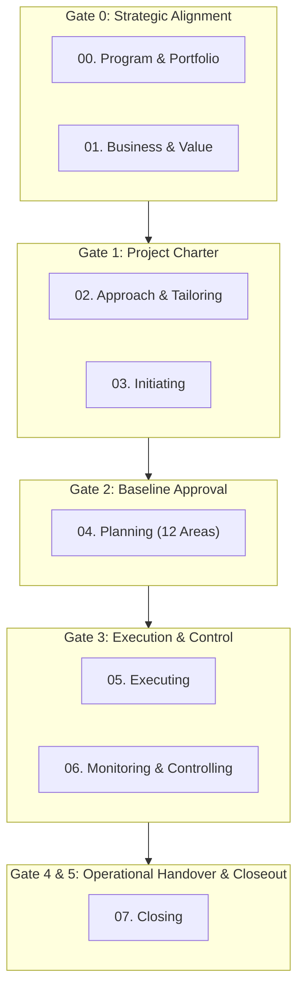

  

     Enterprise PMO Operating System 2.0 • PMI PMBOK® 6/7/8 & NIST AI RMF
  

  <h1 class="hero-title">Tasleemat PMO Operating System</h1>
  

    The premier bilingual (English & Arabic) enterprise project management framework, delivery artifacts library, and AI governance suite with 100% mathematical symmetry, zero vendor lock-in, and automated validation.
  

  

    <a href="catalog/en/index.html" class="btn-primary">🚀 Explore Master Catalog</a>
    <a href="forms/en/index.html" class="btn-secondary">📋 Browse Templates</a>
    <a href="en/01_getting_started.html" class="btn-secondary">📚 Governance Manuals</a>
    <a href="README_AR.html" class="btn-lang">🇸🇦 الانتقال للبوابة العربية</a>
  

  

    

      
102

      
Bilingual Deliverables

    

    

      
24

      
Governance Manuals

    

    

      
8

      
Lifecycle Phases

    

    

      
4

      
Project Sizing Tiers

    

    

      
100%

      
OKF Validated

    

  

## 🧭 Project Lifecycle & Stage-Gates Architecture

---

## 🏛️ Browse by Lifecycle Phase

  

    

      Phase 00
      🏛️
    

    <h3 class="phase-hub-title">Program & Portfolio Management</h3>
    
Strategic alignment, portfolio balancing, multi-project dependencies, and PMO maturity (6 Artifacts).

    

      <a class="card-action-link" href="forms/en/00_Program_and_Portfolio_Management/index.html">📋 Templates</a>
      <a class="card-action-link" href="guides/en/00_Program_and_Portfolio_Management/index.html">📖 Guides</a>
      <a class="card-action-link" href="examples/en/00_Program_and_Portfolio_Management/index.html">💡 Examples</a>
    

  

  

    

      Phase 01
      💎
    

    <h3 class="phase-hub-title">Business & Value Delivery</h3>
    
Business justification, benefit realization planning, value tracking, and gap analysis (4 Artifacts).

    

      <a class="card-action-link" href="forms/en/01_Business_and_Value_Delivery/index.html">📋 Templates</a>
      <a class="card-action-link" href="guides/en/01_Business_and_Value_Delivery/index.html">📖 Guides</a>
      <a class="card-action-link" href="examples/en/01_Business_and_Value_Delivery/index.html">💡 Examples</a>
    

  

  

    

      Phase 02
      ⚖️
    

    <h3 class="phase-hub-title">Project Approach & Tailoring</h3>
    
Tailoring strategy, governance tiers, AI ethics, model cards, and agile/hybrid adoption (6 Artifacts).

    

      <a class="card-action-link" href="forms/en/02_Project_Approach_and_Tailoring/index.html">📋 Templates</a>
      <a class="card-action-link" href="guides/en/02_Project_Approach_and_Tailoring/index.html">📖 Guides</a>
      <a class="card-action-link" href="examples/en/02_Project_Approach_and_Tailoring/index.html">💡 Examples</a>
    

  

  

    

      Phase 03
      🚀
    

    <h3 class="phase-hub-title">Initiating</h3>
    
Formal authorization, product vision, initial assumptions, and stakeholder identification (5 Artifacts).

    

      <a class="card-action-link" href="forms/en/03_Initiating/index.html">📋 Templates</a>
      <a class="card-action-link" href="guides/en/03_Initiating/index.html">📖 Guides</a>
      <a class="card-action-link" href="examples/en/03_Initiating/index.html">💡 Examples</a>
    

  

  

    

      Phase 04
      📐
    

    <h3 class="phase-hub-title">Planning (12 Domains)</h3>
    
Comprehensive baselines across Scope, Schedule, Cost, Quality, Resources, Risk, and Procurement (47 Artifacts).

    

      <a class="card-action-link" href="forms/en/04_Planning/index.html">📋 Templates</a>
      <a class="card-action-link" href="guides/en/04_Planning/index.html">📖 Guides</a>
      <a class="card-action-link" href="examples/en/04_Planning/index.html">💡 Examples</a>
    

  

  

    

      Phase 05
      ⚡
    

    <h3 class="phase-hub-title">Executing</h3>
    
Directing work, managing issues, decision logs, change control, and team performance (12 Artifacts).

    

      <a class="card-action-link" href="forms/en/05_Executing/index.html">📋 Templates</a>
      <a class="card-action-link" href="guides/en/05_Executing/index.html">📖 Guides</a>
      <a class="card-action-link" href="examples/en/05_Executing/index.html">💡 Examples</a>
    

  

  

    

      Phase 06
      📊
    

    <h3 class="phase-hub-title">Monitoring & Controlling</h3>
    
Status reporting, Earned Value Analysis (EVA), variance tracking, and quality acceptance (12 Artifacts).

    

      <a class="card-action-link" href="forms/en/06_Monitoring_and_Controlling/index.html">📋 Templates</a>
      <a class="card-action-link" href="guides/en/06_Monitoring_and_Controlling/index.html">📖 Guides</a>
      <a class="card-action-link" href="examples/en/06_Monitoring_and_Controlling/index.html">💡 Examples</a>
    

  

  

    

      Phase 07
      🏁
    

    <h3 class="phase-hub-title">Closing</h3>
    
Formal transition to operations, contract closure, final lessons learned, and PIR (5 Artifacts).

    

      <a class="card-action-link" href="forms/en/07_Closing/index.html">📋 Templates</a>
      <a class="card-action-link" href="guides/en/07_Closing/index.html">📖 Guides</a>
      <a class="card-action-link" href="examples/en/07_Closing/index.html">💡 Examples</a>
    

  

---

## 📑 Master Governance Manuals (12 Systems Guides)

| Guide # | Document Title | Language | Description & Key Value |
| :---: | :--- | :---: | :--- |
| **01** | [**Getting Started**](en/01_getting_started.md) | 🇬🇧 EN | Quick-start lifecycle overview, onboarding steps from Day 1 to Day 30. |
| **02** | [**Practitioner Usage Guide**](en/02_usage_guide.md) | 🇬🇧 EN | Field syntax, Markdown conventions, JSON/CSV integration, and authoring guidelines. |
| **03** | [**PMO Policy Manual**](en/03_pmo_policy_manual.md) | 🇬🇧 EN | Enterprise governance mandates, change control thresholds, and audit rules. |
| **04** | [**Stage-Gates Framework**](en/04_stage_gates_and_governance.md) | 🇬🇧 EN | 6 Stage-Gates (Gate 0 to 5), entry/exit criteria, and executive review gates. |
| **05** | [**Tailoring Profiles**](en/05_tailoring_profiles.md) | 🇬🇧 EN | 4 project tiers (Enterprise, Medium, Agile, AI) and deliverable requirements. |
| **06** | [**RACI Authority Matrix**](en/06_raci_authority_matrix.md) | 🇬🇧 EN | Full 102-form governance matrix defining author and approval sign-off roles. |
| **07** | [**Document Dependencies**](en/07_document_dependencies.md) | 🇬🇧 EN | Directed acyclic graph (DAG) mapping upstream inputs to downstream outputs. |
| **08** | [**AI Governance Framework**](en/08_ai_governance_framework.md) | 🇬🇧 EN | AI Canvas, Model Cards, Ethics, NIST AI RMF, and MLOps monitoring. |
| **09** | [**Agile & Hybrid Integration**](en/09_agile_hybrid_integration.md) | 🇬🇧 EN | Mapping forms to Scrum/Kanban ceremonies, Flow metrics, and DoD/DoR. |
| **10** | [**FAQ & Troubleshooting**](en/10_faq_and_troubleshooting.md) | 🇬🇧 EN | 25+ practical answers to governance hurdles, sizing disputes, and EVM issues. |
| **11** | [**Tools & Automation Guide**](en/11_tools_and_automation.md) | 🇬🇧 EN | Python validation suite, CI/CD pipelines, JIRA/Azure DevOps integration. |
| **12** | [**Open Knowledge Framework (OKF)**](en/12_open_knowledge_framework.md) | 🇬🇧 EN | Frictionless Data Package standard, FAIR data principles, datapackage.json. |
| **LEX** | [**Master Lexicon & Catalog**](LEXICON.md) | 🌐 Bi | Master bilingual terminology glossary and cross-reference table. |

---

## 👤 Persona-Based Reading Pathways

* **For Project Managers:** Start with [`01_getting_started.md`](en/01_getting_started.md) → [`05_tailoring_profiles.md`](en/05_tailoring_profiles.md) → [`02_usage_guide.md`](en/02_usage_guide.md) → [Templates Library](forms/en/index.md).
* **For PMO Directors & Governance Leads:** Read [`03_pmo_policy_manual.md`](en/03_pmo_policy_manual.md) → [`04_stage_gates_and_governance.md`](en/04_stage_gates_and_governance.md) → [`06_raci_authority_matrix.md`](en/06_raci_authority_matrix.md).
* **For Scrum Masters & Product Owners:** Focus on [`09_agile_hybrid_integration.md`](en/09_agile_hybrid_integration.md) → [`05_tailoring_profiles.md`](en/05_tailoring_profiles.md) → [Agile Backlog & Retrospective](forms/en/05_Executing/index.md).
* **For AI Engineers & Tech PMs:** Deep dive into [`08_ai_governance_framework.md`](en/08_ai_governance_framework.md) → [AI Governance Templates](forms/en/02_Project_Approach_and_Tailoring/index.md).
* **For DevOps & Tool Admins:** Explore [`11_tools_and_automation.md`](en/11_tools_and_automation.md) → [`12_open_knowledge_framework.md`](en/12_open_knowledge_framework.md).
