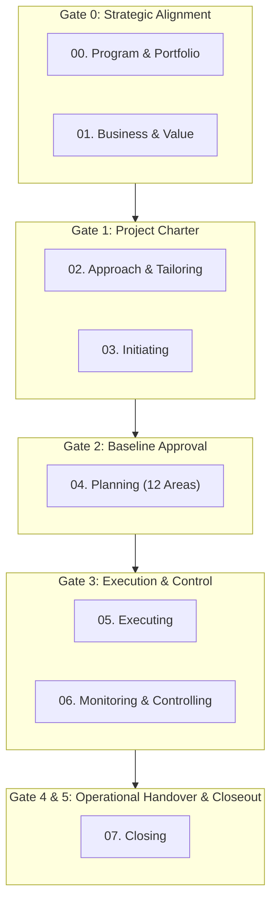

  

# 📚 Tasleemat PMO Operating System & Documentation Portal
**Version:** 2.0  
**Standard Alignment:** PMI PMBOK® 6th, 7th & 8th Editions • NIST AI RMF • SDAIA AI Ethics • ISO 21500  
**Total Artifacts:** 102 Bilingual Deliverables • 204 Form Bundles • 204 Reference Examples • 24 Master Governance Manuals

---

## ⚡ Quick Navigation Hub

  <a class="portal-card" href="catalog/en/index.md">
    <h4>📑 Master Deliverables Catalog</h4>
    
Searchable matrix of all 102 project deliverables with direct links to Templates, Guides, and Examples.

  </a>

  <a class="portal-card" href="templates/en/index.md">
    <h4>📋 Standard Templates Library</h4>
    
102 copy-ready, structured Markdown templates with Document Control tables and clear field schemas.

  </a>

  <a class="portal-card" href="guides/en/index.md">
    <h4>📖 Deliverable Authoring Guides</h4>
    
102 step-by-step authoring manuals with RACI roles, inputs/outputs dependencies, and quality gates.

  </a>

  <a class="portal-card" href="examples/en/index.md">
    <h4>💡 Real-World Examples Showcase</h4>
    
102 fully populated, realistic enterprise case study examples across all 8 lifecycle phases.

  </a>

  <a class="portal-card" href="en/01_getting_started.md">
    <h4>📚 Governance Manuals (12 Guides)</h4>
    
Comprehensive PMO policy manuals, stage-gates, RACI matrix, AI governance, and agile integration.

  </a>

  <a class="portal-card" href="LEXICON.md">
    <h4>📖 Master Lexicon & Glossary</h4>
    
Authoritative bilingual (English & Arabic) project management terminology and artifact dictionary.

  </a>

---

## 🧭 Project Lifecycle & Stage-Gates Architecture

---

## 🏛️ Browse by Lifecycle Phase

| Phase # | Lifecycle Phase Name | Deliverables Count | Direct Links |
| :---: | :--- | :---: | :---: |
| **00** | [**Program & Portfolio Management**](templates/en/00_Program_and_Portfolio_Management/index.md) | 6 Artifacts | [📋 Templates](templates/en/00_Program_and_Portfolio_Management/index.md) • [📖 Guides](guides/en/index.md) • [💡 Examples](examples/en/index.md) |
| **01** | [**Business & Value Delivery**](templates/en/01_Business_and_Value_Delivery/index.md) | 4 Artifacts | [📋 Templates](templates/en/01_Business_and_Value_Delivery/index.md) • [📖 Guides](guides/en/index.md) • [💡 Examples](examples/en/index.md) |
| **02** | [**Project Approach & Tailoring**](templates/en/02_Project_Approach_and_Tailoring/index.md) | 6 Artifacts | [📋 Templates](templates/en/02_Project_Approach_and_Tailoring/index.md) • [📖 Guides](guides/en/index.md) • [💡 Examples](examples/en/index.md) |
| **03** | [**Initiating**](templates/en/03_Initiating/index.md) | 5 Artifacts | [📋 Templates](templates/en/03_Initiating/index.md) • [📖 Guides](guides/en/index.md) • [💡 Examples](examples/en/index.md) |
| **04** | [**Planning**](templates/en/04_Planning/index.md) | 47 Artifacts | [📋 Templates](templates/en/04_Planning/index.md) • [📖 Guides](guides/en/index.md) • [💡 Examples](examples/en/index.md) |
| **05** | [**Executing**](templates/en/05_Executing/index.md) | 12 Artifacts | [📋 Templates](templates/en/05_Executing/index.md) • [📖 Guides](guides/en/index.md) • [💡 Examples](examples/en/index.md) |
| **06** | [**Monitoring & Controlling**](templates/en/06_Monitoring_and_Controlling/index.md) | 12 Artifacts | [📋 Templates](templates/en/06_Monitoring_and_Controlling/index.md) • [📖 Guides](guides/en/index.md) • [💡 Examples](examples/en/index.md) |
| **07** | [**Closing**](templates/en/07_Closing/index.md) | 5 Artifacts | [📋 Templates](templates/en/07_Closing/index.md) • [📖 Guides](guides/en/index.md) • [💡 Examples](examples/en/index.md) |

---

## 📑 Master Governance Manuals (12 Systems Guides)

| Guide # | Document Title | Language | Description & Key Value |
| :---: | :--- | :---: | :--- |
| **01** | [**Getting Started**](en/01_getting_started.md) | 🇬🇧 EN | Quick-start lifecycle overview, onboarding steps from Day 1 to Day 30. |
| **02** | [**Practitioner Usage Guide**](en/02_usage_guide.md) | 🇬🇧 EN | Field syntax, Markdown conventions, JSON/CSV integration, and authoring guidelines. |
| **03** | [**PMO Policy Manual**](en/03_pmo_policy_manual.md) | 🇬🇧 EN | Enterprise governance mandates, change control thresholds, and audit rules. |
| **04** | [**Stage-Gates Framework**](en/04_stage_gates_and_governance.md) | 🇬🇧 EN | 6 Stage-Gates (Gate 0 to 5), entry/exit criteria, and executive review gates. |
| **05** | [**Tailoring Profiles**](en/05_tailoring_profiles.md) | 🇬🇧 EN | 4 project tiers (Enterprise, Medium, Agile, AI) and deliverable requirements. |
| **06** | [**RACI Authority Matrix**](en/06_raci_authority_matrix.md) | 🇬🇧 EN | Full 102-form governance matrix defining author and approval sign-off roles. |
| **07** | [**Document Dependencies**](en/07_document_dependencies.md) | 🇬🇧 EN | Directed acyclic graph (DAG) mapping upstream inputs to downstream outputs. |
| **08** | [**AI Governance Framework**](en/08_ai_governance_framework.md) | 🇬🇧 EN | AI Canvas, Model Cards, Ethics, NIST AI RMF, and MLOps monitoring. |
| **09** | [**Agile & Hybrid Integration**](en/09_agile_hybrid_integration.md) | 🇬🇧 EN | Mapping forms to Scrum/Kanban ceremonies, Flow metrics, and DoD/DoR. |
| **10** | [**FAQ & Troubleshooting**](en/10_faq_and_troubleshooting.md) | 🇬🇧 EN | 25+ practical answers to governance hurdles, sizing disputes, and EVM issues. |
| **11** | [**Tools & Automation Guide**](en/11_tools_and_automation.md) | 🇬🇧 EN | Python validation suite, CI/CD pipelines, JIRA/Azure DevOps integration. |
| **12** | [**Open Knowledge Framework (OKF)**](en/12_open_knowledge_framework.md) | 🇬🇧 EN | Frictionless Data Package standard, FAIR data principles, datapackage.json. |
| **LEX** | [**Master Lexicon & Catalog**](LEXICON.md) | 🌐 Bi | Master bilingual terminology glossary and cross-reference table. |

---

## 👤 Persona-Based Reading Pathways

* **For Project Managers:** Start with [`01_getting_started.md`](en/01_getting_started.md) → [`05_tailoring_profiles.md`](en/05_tailoring_profiles.md) → [`02_usage_guide.md`](en/02_usage_guide.md) → [Templates Library](templates/en/index.md).
* **For PMO Directors & Governance Leads:** Read [`03_pmo_policy_manual.md`](en/03_pmo_policy_manual.md) → [`04_stage_gates_and_governance.md`](en/04_stage_gates_and_governance.md) → [`06_raci_authority_matrix.md`](en/06_raci_authority_matrix.md).
* **For Scrum Masters & Product Owners:** Focus on [`09_agile_hybrid_integration.md`](en/09_agile_hybrid_integration.md) → [`05_tailoring_profiles.md`](en/05_tailoring_profiles.md) → [Agile Backlog & Retrospective](templates/en/05_Executing/index.md).
* **For AI Engineers & Tech PMs:** Deep dive into [`08_ai_governance_framework.md`](en/08_ai_governance_framework.md) → [AI Governance Templates](templates/en/02_Project_Approach_and_Tailoring/index.md).
* **For DevOps & Tool Admins:** Explore [`11_tools_and_automation.md`](en/11_tools_and_automation.md) → [`12_open_knowledge_framework.md`](en/12_open_knowledge_framework.md).
