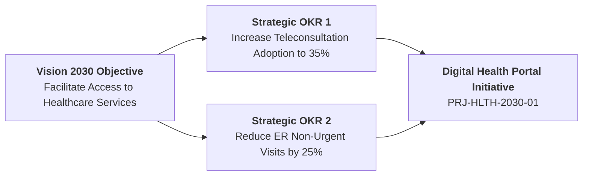

# OKR ALIGNMENT MATRIX
**Document Reference:** `PMO-00.06`  
**Program Name:** Unified National Digital Health Portal & Telemedicine Exchange  
**Classification:** Tier 1 Strategic Initiative (Vision 2030 Health Sector Transformation)  

---

<h3 dir="ltr" align="right">Ministry of Health Transformation Program</h3>
<h2 dir="ltr" align="right">NAT-HLTH-2030 - OKR Strategic Alignment Matrix</h2>
<h1 dir="ltr" align="center">OKR ALIGNMENT MATRIX</h1>

| **Date Prepared:** 2026-01-05 | **Strategy Lead:** Dr. Nora Al-Sudairi | **Prepared By:** Senior Strategy Advisor |
| :--- | :--- | :--- |

---

## 1. Strategic Mapping to Vision 2030 Goals

---

## 2. Objective & Key Results Alignment Grid

| Level | Objective Statement | Key Result (Metric) | Baseline (2025) | Target (2027) | Weight |
| :--- | :--- | :--- | :---: | :---: | :---: |
| **Corporate** | Enable seamless digital healthcare access nationwide | Unified digital health record penetration | 22% | 85% | 40% |
| **Operational** | Reduce average patient specialist appointment lead time | Average wait time in days | 18.5 Days | $\le 4.0	ext{ Days}$ | 30% |
| **Experience** | Elevate patient digital satisfaction and accessibility | Digital CSAT Index score | 68% | $\ge 90\%$ | 30% |

---

## 3. Strategic Sign-off

| Role | Name | Signature | Date |
| :--- | :--- | :--- | :---: |
| **Chief Strategy Officer** | Dr. Bandar Al-Hakami | *[Signed]* | 2026-01-08 |
| **EPMO Director** | Eng. Mishaal Al-Dossary | *[Signed]* | 2026-01-08 |
