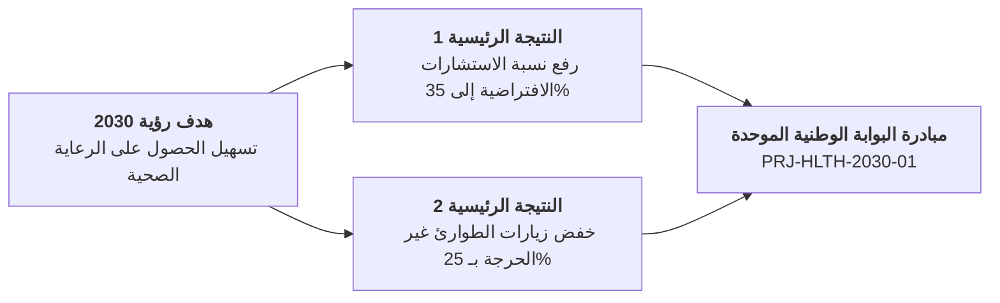

<h3 dir="rtl" align="left">برنامج تحول القطاع الصحي - رؤية 2030</h3>
<h2 dir="rtl" align="left">NAT-HLTH-2030 - مصفوفة مواءمة الأهداف والنتائج الرئيسية</h2>
<h1 dir="rtl" align="center">مصفوفة مواءمة الأهداف والنتائج الرئيسية (OKRs)</h1>

| **تاريخ الإعداد:** 2026-01-05 | **مسؤول الاستراتيجية:** د. نورة السديري | **إعداد:** مستشار أول التخطيط الاستراتيجي |
| :--- | :--- | :--- |

---

## 1. المواءمة الاستراتيجية مع مستهدفات رؤية 2030

---

## 2. جدول مصفوفة الأهداف والنتائج الرئيسية ومؤشرات القياس

| المستوى | بيان الهدف الاستراتيجي | النتيجة الرئيسية (المقياس الكمي) | خط الأساس (2025) | المستهدف (2027) | الوزن النسبي |
| :--- | :--- | :--- | :---: | :---: | :---: |
| **مؤسسي** | تمكين الوصول الرقمي الموحد للخدمات الصحية | نسبة انتشار السجل الصحي الرقمي الموحد | 22% | 85% | 40% |
| **تشغيلي** | تقليص زمن انتظار مواعيد الاستشاريين | متوسط زمن انتظار الموعد التخصصي | 18.5 يوماً | $\le 4.0	ext{ أيام}$ | 30% |
| **تجربة المستفيد** | رفع رضا المستفيدين وسهولة الوصول للخدمة | مؤشر رضا المستفيد الرقمي (CSAT) | 68% | $\ge 90\%$ | 30% |

---

## 3. الاعتماد الاستراتيجي

| الدور | الاسم | التوقيع | التاريخ |
| :--- | :--- | :--- | :---: |
| **كبير مسؤولي الاستراتيجية** | د. بندر الحكمي | *[موقّع]* | 2026-01-08 |
| **مدير مكتب إدارة المشاريع المؤسسي EPMO** | م. مشعل الدوسري | *[موقّع]* | 2026-01-08 |

