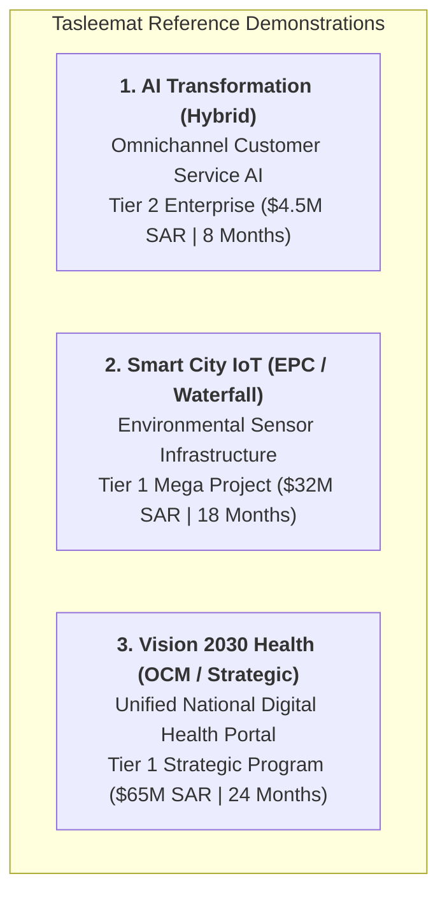

# 🏆 Tasleemat Gold Standard Reference Demonstrations
**Directory Reference:** `examples/`  
**Purpose:** End-to-End Completed Reference Projects & Operational Benchmarks  

---

## 🎯 Overview

This directory contains **three fully populated, production-grade reference projects** illustrating how top-tier PMOs, government entities, and enterprise delivery teams deploy the Tasleemat PMO Operating System. 

Each demonstration project is populated with realistic corporate data, baseline calculations, risk registers, EVM formulas, sign-off blocks, and lessons learned.

---

## 📁 Demonstration Projects Index

| Demo Directory | Project Title | Methodology | Governance Tier | Core Highlights |
| :--- | :--- | :---: | :---: | :--- |
| [`01_ai_customer_service_transformation/`](01_ai_customer_service_transformation/) | Omnichannel AI Customer Service Platform | **Hybrid** | Tier 2 (\$4.5M SAR) | AI Canvas (`PMO-02.04`), AI Ethics Checklist (`PMO-02.03`), WBS, EVM (CPI 1.04), UAT Sign-off (99.2% accuracy), PIR. |
| [`02_smart_city_iot_infrastructure/`](02_smart_city_iot_infrastructure/) | Smart City Environmental Sensor Network | **Predictive / EPC** | Tier 1 (\$32M SAR) | SOW (`PMO-04.09.04`), Critical Path Schedule (`PMO-04.03.07`), Cost Baseline, CCB Change Log, Tower Acceptance. |
| [`03_vision2030_digital_health_portal/`](03_vision2030_digital_health_portal/) | Unified National Digital Health Portal | **Strategic / OCM** | Tier 1 (\$65M SAR) | OKR Alignment (`PMO-00.06`), Benefits Plan (`PMO-01.03`), OCM Strategy (`PMO-04.11.01`), ESG Plan (`PMO-04.12.01`). |

---

## 💡 How to Use These Reference Examples

1. **Practitioner Onboarding & Training:** Use these completed templates during PM onboarding to establish the expected level of quality, precision, and falsifiable writing standards.
2. **AI Few-Shot Prompting:** Feed these completed markdown files as few-shot reference examples to LLMs (Claude, GPT, Gemini) when auto-generating artifacts for your own projects.
3. **Audit & Compliance Benchmarking:** Compare active project documents against these gold standards during PMO Health Checks (`PMO-06.11`).
