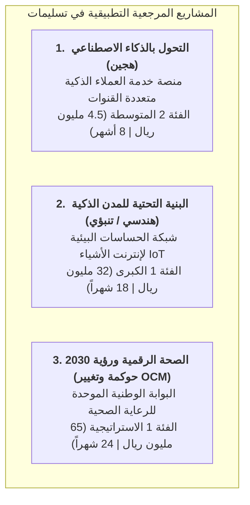

# 🏆 مشاريع مرجعية تطبيقية متكاملة (Tasleemat Gold Standard Demos)
**مرجع المجلد:** `examples/`  
**الغرض:** مشاريع نموذجية مكتملة بنسبة 100% لتكون معياراً ذهبياً للممارسين وفرق العمل  

---

## 🎯 نظرة عامة

يحتوي هذا المجلد على **ثلاثة مشاريع مرجعية واقعية معبأة بالكامل** توضح كيفية تطبيق نظام تشغيل مكاتب إدارة المشاريع «تسليمات» في الهيئات الحكومية، والشركات الكبرى، ومشاريع التحول الرقمي.

كافة الوثائق في هذه المشاريع معبأة ببيانات واقعية، وحسابات دقيقة لخطوط الأساس، وسجلات مخاطر كمية، ومؤشرات القيمة المكتسبة (EVM)، وجداول توقيعات معتمدة، ودروس مستفادة.

---

## 📁 فهرس المشاريع المرجعية

| مجلد المشروع | عنوان المشروع | المنهجية | فئة الحوكمة | أبرز المخرجات المكتملة |
| :--- | :--- | :---: | :---: | :--- |
| [`01_ai_customer_service_transformation/`](01_ai_customer_service_transformation/) | منصة خدمة العملاء الذكية متعددة القنوات | **هجينة (Hybrid)** | الفئة 2 (4.5 مليون ريال) | نموذج AI Canvas (`PMO-02.04`)، قائمة أخلاقيات الذكاء الاصطناعي (`PMO-02.03`)، هيكل WBS، تقرير EVM (مؤشر CPI 1.04)، اعتماد UAT (دقة 99.2%)، ومراجعة ما بعد التنفيذ. |
| [`02_smart_city_iot_infrastructure/`](02_smart_city_iot_infrastructure/) | شبكة الحساسات البيئية للمدن الذكية | **تنبؤية / هندسية** | الفئة 1 (32 مليون ريال) | نطاق العمل SOW (`PMO-04.09.04`)، الجدول الزمني للمسار الحرج (`PMO-04.03.07`)، خط الأساس للتكلفة، سجل تغييرات CCB، ومحاضر استلام الأبراج. |
| [`03_vision2030_digital_health_portal/`](03_vision2030_digital_health_portal/) | البوابة الوطنية الموحدة للصحة الرقمية | **استراتيجية / OCM** | الفئة 1 (65 مليون ريال) | مصفوفة مواءمة OKRs (`PMO-00.06`)، خطة المنافع (`PMO-01.03`)، استراتيجية إدارة التغيير OCM (`PMO-04.11.01`)، خطة الاستدامة ESG (`PMO-04.12.01`). |

---

## 💡 كيف تستفيد من هذه النماذج المرجعية؟

1. **تدريب وتأهيل مدراء المشاريع الجدد:** استخدم هذه النماذج المكتملة كمعيار للجودة والدقة وصياغة النصوص القابلة للقياس والتحقق.
2. **أمثلة التلقين لنماذج الذكاء الاصطناعي (Few-Shot Prompting):** زوّد نماذج الذكاء الاصطناعي (Claude / ChatGPT / Gemini) بهذه الأمثلة المكتملة لإنشاء نماذج مشاريعك الخاصة بنفس الجودة الاحترافية.
3. **التدقيق والمقارنة المعيارية:** قارن وثائق مشاريعك الحالية بهذه المعايير الذهبية أثناء مراجعات صحة المشاريع (`PMO-06.11`).
