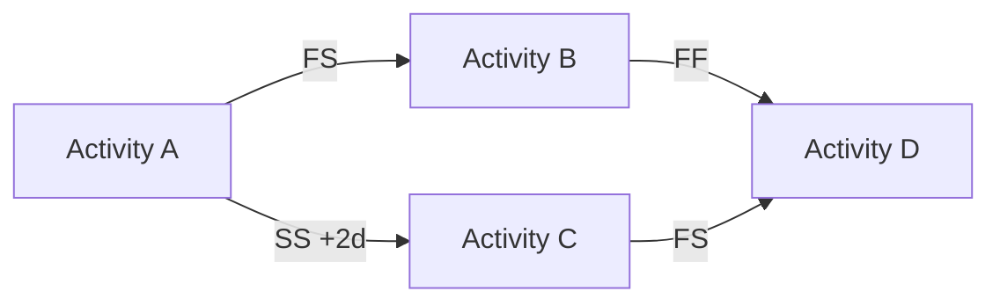

<!-- LLM INSTRUCTIONS: Generate the Mermaid diagram below based on the project schedule.

Column Definitions:
*   **Predecessor:** The activity that must occur first.
*   **Relationship & Lead/Lag:** The relationship type (FS, SS, FF, SF) and any acceleration/delay (e.g., FS+3d).
*   **Successor:** The activity that follows.
-->

<h3 align="right">{{Company_Name}}</h3>
<h2 align="right">{{Project_Name}} - {{Project_ID}}</h2>
<h1 align="center">NETWORK DIAGRAM</h1>

| **Date Prepared:** {{Current_Date}} | **Project Manager:** {{Project_Manager_Name}} | **Prepared By:** {{Prepared_By}} |
| :--- | :--- | :--- |  

---

### Network Diagram Visualization
<!-- Mermaid Graph LR visualization representing schedule dependencies -->

---

### Network Diagram Dependencies
| Predecessor | Relationship & Lead/Lag | Successor |
| :--- | :--- | :--- |
| [ Add details... ] | [ Add details... ] | [ Add details... ] |
| [ Add details... ] | [ Add details... ] | [ Add details... ] |
| [ Add details... ] | [ Add details... ] | [ Add details... ] |

### Signatures

| Prepared By: | Reviewed By: | Approved By: |
| :--- | :--- | :--- |
| **Name:** {{Prepared_By}} | **Name:** {{Reviewed_By}} | **Name:** {{Approved_By}} |
| **Signature:** _____________________ | **Signature:** _____________________ | **Signature:** _____________________ |
| **Date:** _________________ | **Date:** _________________ | **Date:** _________________ |

---

  <strong>Template:</strong> NETWORK DIAGRAM | <strong>Ref:</strong> PMO-04.03.05  
  <i>Generated on: {{Current_Timestamp}}, by <a href="https://github.com/fakhruldeen/Tasleemat/" style="color: #7f8c8d;">Tasleemat</a></i>

