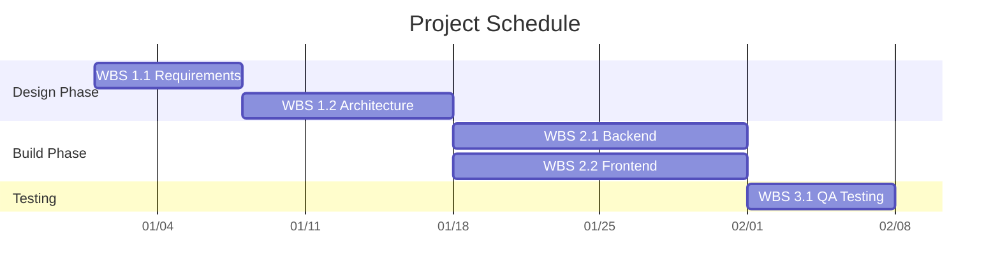

<!-- LLM INSTRUCTIONS: Modify the Mermaid Gantt chart to visually represent the project schedule. Ensure valid Mermaid syntax. -->

<h3 align="right">{{Company_Name}}</h3>
<h2 align="right">{{Project_Name}} - {{Project_ID}}</h2>
<h1 align="center">PROJECT SCHEDULE</h1>

| **Date Prepared:** {{Current_Date}} | **Project Manager:** {{Project_Manager_Name}} | **Prepared By:** {{Prepared_By}} |
| :--- | :--- | :--- |  

---

---

### Signatures

| Prepared By: | Reviewed By: | Approved By: |
| :--- | :--- | :--- |
| **Name:** {{Prepared_By}} | **Name:** {{Reviewed_By}} | **Name:** {{Approved_By}} |
| **Signature:** _____________________ | **Signature:** _____________________ | **Signature:** _____________________ |
| **Date:** _________________ | **Date:** _________________ | **Date:** _________________ |

---

  <strong>Template:</strong> PROJECT SCHEDULE | <strong>Ref:</strong> PMO-04.03.08  
  <i>Generated on: {{Current_Timestamp}}, by <a href="https://github.com/fakhruldeen/Tasleemat/" style="color: #7f8c8d;">Tasleemat</a></i>

