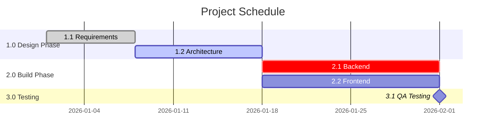

<!-- LLM INSTRUCTIONS: Modify the Mermaid Gantt chart to visually represent the project schedule. Ensure valid Mermaid syntax.

Column Definitions:
*   **WBS Identifier:** The unique WBS code linking the activity to the work package.
*   **Activity Name:** A brief description of the work.
*   **Start Date:** The planned start date (YYYY-MM-DD).
*   **Finish Date:** The planned finish date (YYYY-MM-DD).
*   **Resource Name:** The person or role assigned to the activity.
-->

<h3 align="right">{{Company_Name}}</h3>
<h2 align="right">{{Project_Name}} - {{Project_ID}}</h2>
<h1 align="center">PROJECT SCHEDULE</h1>

| **Date Prepared:** {{Current_Date}} | **Project Manager:** {{Project_Manager_Name}} | **Prepared By:** {{Prepared_By}} |
| :--- | :--- | :--- |  

---

---

### Schedule Data Table
| WBS Identifier | Activity Name | Start Date | Finish Date | Resource Name |
| :--- | :--- | :--- | :--- | :--- |
| [ Add... ] | [ Add... ] | [ Add... ] | [ Add... ] | [ Add... ] |
| [ Add... ] | [ Add... ] | [ Add... ] | [ Add... ] | [ Add... ] |
| [ Add... ] | [ Add... ] | [ Add... ] | [ Add... ] | [ Add... ] |

---

### Signatures

| Prepared By: | Reviewed By: | Approved By: |
| :--- | :--- | :--- |
| **Name:** {{Prepared_By}} | **Name:** {{Reviewed_By}} | **Name:** {{Approved_By}} |
| **Signature:** _____________________ | **Signature:** _____________________ | **Signature:** _____________________ |
| **Date:** &nbsp;&nbsp;&nbsp;&nbsp;/&nbsp;&nbsp;&nbsp;&nbsp;/&nbsp;&nbsp;&nbsp;&nbsp;&nbsp;&nbsp;&nbsp;&nbsp; | **Date:** &nbsp;&nbsp;&nbsp;&nbsp;/&nbsp;&nbsp;&nbsp;&nbsp;/&nbsp;&nbsp;&nbsp;&nbsp;&nbsp;&nbsp;&nbsp;&nbsp; | **Date:** &nbsp;&nbsp;&nbsp;&nbsp;/&nbsp;&nbsp;&nbsp;&nbsp;/&nbsp;&nbsp;&nbsp;&nbsp;&nbsp;&nbsp;&nbsp;&nbsp; |

---

  <strong>Template:</strong> PROJECT SCHEDULE | <strong>Ref:</strong> PMO-04.03.08  
  <i>Generated on: {{Current_Timestamp}}, by <a href="https://github.com/fakhruldeen/Tasleemat/" style="color: #7f8c8d;">Tasleemat</a></i>

