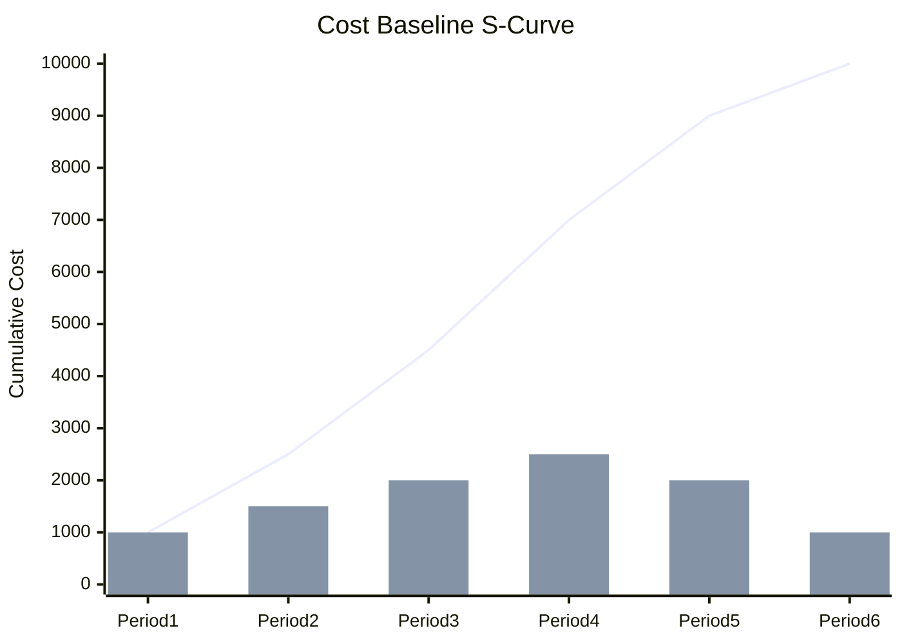

<!-- LLM INSTRUCTIONS: Fill in the budget summary and the time-phased budget table below. Generate a mermaid xychart-beta representing the Cost Baseline S-Curve.

Section Instructions:
*   **Budget Summary Component:** The structural element of the budget (Activity Cost Estimates, Contingency Reserve, Cost Baseline, Management Reserve, Total Project Budget).
*   **Budget Summary Amount:** The total allocated funds for that component.
*   **Period:** The specific time period (e.g. Month 1, Month 2, Q1).
*   **Planned Period Cost:** The cost planned to be spent during this specific period.
*   **Cumulative Cost:** The running total of planned costs up to and including this period (this represents the S-Curve).
*   **Remarks / Key Activities:** The major work packages or deliverables driving the cost in this period.
-->

<h3 align="right">{{Company_Name}}</h3>
<h2 align="right">{{Project_Name}} - {{Project_ID}}</h2>
<h1 align="center">COST BASELINE</h1>

| **Date Prepared:** {{Current_Date}} | **Project Manager:** {{Project_Manager_Name}} | **Prepared By:** {{Prepared_By}} |
| :--- | :--- | :--- |  

---

### Project Budget Summary
<!-- The Cost Baseline includes Contingency Reserves. Management Reserves are added to the Cost Baseline to determine the Total Project Budget. -->
| Component | Amount |
| :--- | :--- |
| **Activity Cost Estimates** | [ Add details... ] |
| **Contingency Reserve** | [ Add details... ] |
| **Cost Baseline (Total)** | [ Add details... ] |
| **Management Reserve** | [ Add details... ] |
| **Total Project Budget** | [ Add details... ] |

---

### Cost Baseline S-Curve
<!-- Replace the sample data below with the actual time-phased cumulative costs to render the S-Curve. -->

---

### Time-Phased Budget
| Period | Planned Period Cost | Cumulative Cost | Remarks / Key Activities |
| :--- | :--- | :--- | :--- |
| [ Add details... ] | [ Add details... ] | [ Add details... ] | [ Add details... ] |
| [ Add details... ] | [ Add details... ] | [ Add details... ] | [ Add details... ] |
| [ Add details... ] | [ Add details... ] | [ Add details... ] | [ Add details... ] |

---

### Signatures

| Prepared By: | Reviewed By: | Approved By: |
| :--- | :--- | :--- |
| **Name:** {{Prepared_By}} | **Name:** {{Reviewed_By}} | **Name:** {{Approved_By}} |
| **Signature:** _____________________ | **Signature:** _____________________ | **Signature:** _____________________ |
| **Date:** _________________ | **Date:** _________________ | **Date:** _________________ |

---

  <strong>Template:</strong> Cost Baseline | <strong>Ref:</strong> PMO-04.04.04  
  <i>Generated on: {{Current_Timestamp}}, by <a href="https://github.com/fakhruldeen/Tasleemat/" style="color: #7f8c8d;">Tasleemat</a></i>

