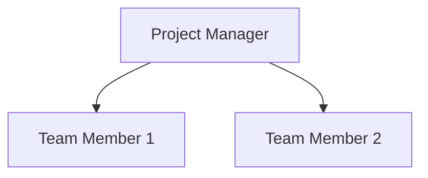

<!-- LLM INSTRUCTIONS: Fill in the Resource Management Plan based on the project context.

Section Instructions:
*   **Team member identification:** Methods used to identify the skill sets needed and the level of skill needed. Includes techniques to estimate number of resources (past projects, parametric estimates, industry standards).
*   **Team member acquisition:** Document how staff will be brought on to the project. Describe differences between internal and contract team members regarding on-boarding.
*   **Team member management:** Document how team members will be managed and eventually released. Include knowledge transfer methods.
*   **Project organizational chart:** Create a hierarchy chart (Mermaid flowchart TD) to show the project reporting and organizational structure.
*   **Roles and responsibilities:** Provide information on Role, Authority, Responsibility, Qualifications, and Competencies.
*   **Training requirements:** Describe required training on equipment, technology, or company processes.
*   **Rewards and recognition:** Describe any reward and recognition processes and limitations.
*   **Team development:** Describe methods for developing individual team members and the team as a whole.
*   **Physical resource identification:** Methods used to identify materials, equipment, supplies.
*   **Physical resource acquisition:** Document how equipment/materials will be acquired (buy, lease, rent).
*   **Physical resource management:** Document how materials/equipment will be managed (inventory, supply chain, logistics).
-->

<h3 align="right">{{Company_Name}}</h3>
<h2 align="right">{{Project_Name}} - {{Project_ID}}</h2>
<h1 align="center">RESOURCE MANAGEMENT PLAN</h1>

| **Date Prepared:** {{Current_Date}} | **Project Manager:** {{Project_Manager_Name}} | **Prepared By:** {{Prepared_By}} |
| :--- | :--- | :--- |  

---

## 1. Team Resource Management

### 1.1 Team member identification
> [ Add details... ]

### 1.2 Team member acquisition
> [ Add details... ]

### 1.3 Team member management
> [ Add details... ]

---

## 2. Project Organizational Chart

---

## 3. Roles and Responsibilities
| Role | Authority | Responsibility | Qualifications | Competencies |
| :--- | :--- | :--- | :--- | :--- |
| [ Add details... ] | [ Add details... ] | [ Add details... ] | [ Add details... ] | [ Add details... ] |
| [ Add details... ] | [ Add details... ] | [ Add details... ] | [ Add details... ] | [ Add details... ] |

---

## 4. Team Development and Support

### 4.1 Training requirements
> [ Add details... ]

### 4.2 Rewards and recognition
> [ Add details... ]

### 4.3 Team development
> [ Add details... ]

---

## 5. Physical Resource Management

### 5.1 Physical resource identification
> [ Add details... ]

### 5.2 Physical resource acquisition
> [ Add details... ]

### 5.3 Physical resource management
> [ Add details... ]

---

### Signatures

| Prepared By: | Reviewed By: | Approved By: |
| :--- | :--- | :--- |
| **Name:** {{Prepared_By}} | **Name:** {{Reviewed_By}} | **Name:** {{Approved_By}} |
| **Signature:** _____________________ | **Signature:** _____________________ | **Signature:** _____________________ |
| **Date:** _________________ | **Date:** _________________ | **Date:** _________________ |

---

  <strong>Template:</strong> RESOURCE MANAGEMENT PLAN | <strong>Ref:</strong> PMO-04.06.01  
  <i>Generated on: {{Current_Timestamp}}, by <a href="https://github.com/fakhruldeen/Tasleemat/" style="color: #7f8c8d;">Tasleemat</a></i>

